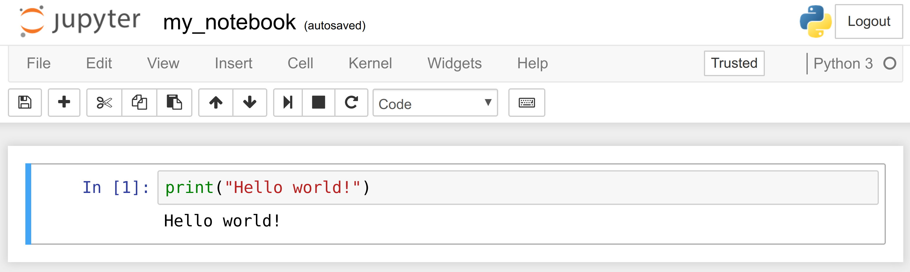
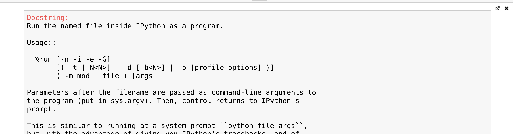
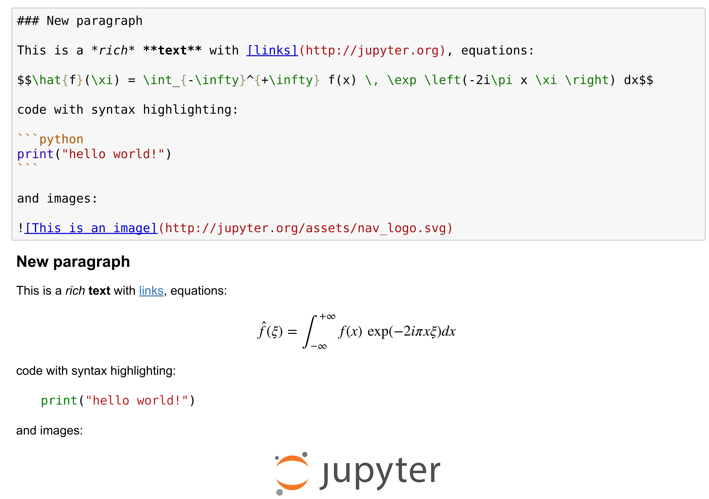
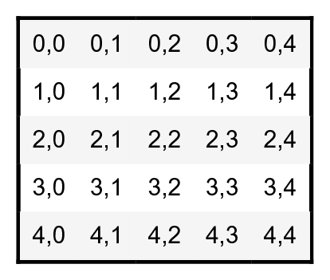

<a href="https://github.com/ipython-books/cookbook-2nd"></a> *This is one of the 100+ free recipes of the [IPython Cookbook, Second Edition](https://github.com/ipython-books/cookbook-2nd), by [Cyrille Rossant](http://cyrille.rossant.net), a guide to numerical computing and data science in the Jupyter Notebook. The ebook and printed book are available for purchase at [Packt Publishing](https://www.packtpub.com/big-data-and-business-intelligence/ipython-interactive-computing-and-visualization-cookbook-second-e).*

▶ *[Text on GitHub](https://github.com/ipython-books/cookbook-2nd) with a [CC-BY-NC-ND license](https://creativecommons.org/licenses/by-nc-nd/3.0/us/legalcode)*  
▶ *[Code on GitHub](https://github.com/ipython-books/cookbook-2nd-code) with a [MIT license](https://opensource.org/licenses/MIT)*

[*Chapter 1 : A Tour of Interactive Computing with Jupyter and IPython*](./)

# 1.1. Introducing IPython and the Jupyter Notebook

The **Jupyter Notebook** is a web-based interactive environment that combines code, rich text, images, videos, animations, mathematical equations, plots, maps, interactive figures and widgets, and graphical user interfaces, into a single document. This tool is an ideal gateway to high-performance numerical computing and data science in Python, R, Julia, or other languages. In this book, we will mostly use the Python language, although there are recipes introducing R and Julia.

In this recipe, we give an introduction to IPython and the Jupyter Notebook.

## Getting ready

This chapter's introduction gives the instructions to install the Anaconda distribution, which comes with Jupyter and almost all Python libraries we will be using in this book.

Once Anaconda is installed, download the code from the book's website and open a terminal in that folder. In the terminal, type `jupyter notebook`. Your default web browser should open automatically and load the address `http://localhost:8888` (a server that runs on your computer). You're ready to get started!

## How to do it...

1. Let's create a new Jupyter notebook using an IPython kernel. We type the following command in a cell, and press `Shift + Enter` to evaluate it:

```python
print("Hello world!")
```

```{output:stdout}
Hello world!
```



A notebook contains a linear succession of **cells** and **output areas**. A cell contains Python code, in one or multiple lines. The output of the code is shown in the corresponding output area.

> In this book, the prompt `>>>` means that you need to type everything that starts after it. The `>>>` characters themselves should not be typed.

2. Now, we do a simple arithmetic operation:

```python
2 + 2
```

```{output:result}
4
```

The result of the operation is shown in the output area. More precisely, the output area not only displays text that is printed by any command in the cell, but it also displays a text representation of the last returned object. Here, the last returned object is the result of `2+2`, that is, `4`.

3. In the next cell, we can recover the value of the last returned object with the `_` (underscore) special variable. In practice, it might be more convenient to assign objects to named variables such as in `myresult = 2 + 2`.

```python
_ * 3
```

```{output:result}
12
```

4. IPython not only accepts Python code, but also shell commands. These commands are provided by the operating system. We first type `!` in a cell before typing the shell command. Here, assuming a Linux or macOS system, we get the list of all the notebooks in the current directory:

```python
!ls
```

```{output:stdout}
my_notebook.ipynb
```

On Windows, one may replace `ls` by `dir`.

5. IPython comes with a library of **magic commands**. These commands are convenient shortcuts to common actions. They all start with `%` (the percent character). We can get the list of all magic commands with `%lsmagic`:

```python
%lsmagic
```

```{output:result}
Available line magics:
%alias  %alias_magic  %autocall  %automagic  %autosave  %bookmark  %cat  %cd  %clear  %colors  %config  %connect_info  %cp  %debug  %dhist  %dirs  %doctest_mode  %ed  %edit  %env  %gui  %hist  %history  %killbgscripts  %ldir  %less  %lf  %lk  %ll  %load  %load_ext  %loadpy  %logoff  %logon  %logstart  %logstate  %logstop  %ls  %lsmagic  %lx  %macro  %magic  %man  %matplotlib  %mkdir  %more  %mv  %notebook  %page  %pastebin  %pdb  %pdef  %pdoc  %pfile  %pinfo  %pinfo2  %popd  %pprint  %precision  %profile  %prun  %psearch  %psource  %pushd  %pwd  %pycat  %pylab  %qtconsole  %quickref  %recall  %rehashx  %reload_ext  %rep  %rerun  %reset  %reset_selective  %rm  %rmdir  %run  %save  %sc  %set_env  %store  %sx  %system  %tb  %time  %timeit  %unalias  %unload_ext  %who  %who_ls  %whos  %xdel  %xmode

Available cell magics:
%%!  %%HTML  %%SVG  %%bash  %%capture  %%debug  %%file  %%html  %%javascript  %%js  %%latex  %%markdown  %%perl  %%prun  %%pypy  %%python  %%python2  %%python3  %%ruby  %%script  %%sh  %%svg  %%sx  %%system  %%time  %%timeit  %%writefile

Automagic is ON, % prefix IS NOT needed for line magics.
```

Cell magics have a `%%` prefix; they target entire code cells.

6. For example, the `%%writefile` cell magic lets us create a text file. This magic command accepts a filename as an argument. All the remaining lines in the cell are directly written to this text file. Here, we create a file `test.txt` and write `Hello world!` into it:

```python
%%writefile test.txt
Hello world!
```

```{output:stdout}
Writing test.txt
```

```python
# Let's check what this file contains.
with open('test.txt', 'r') as f:
    print(f.read())
```

```{output:stdout}
Hello world!
```

7. As we can see in the output of `%lsmagic`, there are many magic commands in IPython. We can find more information about any command by adding `?` after it. For example, to get some help about the `%run` magic command, we type `%run?`as shown here:

```python
%run?
```



The pager (a text area at the bottom of the screen) opens and shows the help of the `%run` magic command.

8. We covered the basics of IPython and the Notebook. Let's now turn to the rich display and interactive features of the Notebook. Until now, we have only created **code cells** (containing code). Jupyter supports other types of cells. In the Notebook toolbar, there is a drop-down menu to select the cell's type. The most common cell type after the code cell is the **Markdown cell**.

Markdown cells contain rich text formatted with **Markdown**, a popular plain text- formatting syntax. This format supports normal text, headers, bold, italics, hypertext links, images, mathematical equations in **LaTeX** (a typesetting system adapted to mathematics), code, HTML elements, and other features, as shown here:



Running a Markdown cell (by pressing `Shift + Enter`, for example) displays the output, as shown in the bottom panel of the screenshot above.

By combining code cells and Markdown cells, we create a standalone interactive document that combines computations (code), text and graphics.

9. The Jupyter Notebook also comes with a sophisticated display system that lets us insert rich web elements in the Notebook. Here, we show how to add HTML, **SVG (Scalable Vector Graphics)**, and even YouTube videos in a notebook. First, we need to import some classes:

```python
from IPython.display import HTML, SVG, YouTubeVideo
```

10. We create an HTML table dynamically with Python, and we display it in the (HTML-based) notebook.

```python
HTML('''
<table style="border: 2px solid black;">
''' +
     ''.join(['<tr>' +
              ''.join([f'<td>{row},{col}</td>'
                       for col in range(5)]) +
              '</tr>' for row in range(5)]) +
     '''
</table>
''')
```



11. Similarly, we create an SVG graphics dynamically:

```python
SVG('''<svg width="600" height="80">''' +
    ''.join([f'''<circle
              cx="{(30 + 3*i) * (10 - i)}"
              cy="30"
              r="{3. * float(i)}"
              fill="red"
              stroke-width="2"
              stroke="black">
        </circle>''' for i in range(10)]) +
    '''</svg>''')
```


12. We display a Youtube video by giving its identifier to `YoutubeVideo`:

```python
YouTubeVideo('VQBZ2MqWBZI')
```


## There's more...

Notebooks are saved as structured text files (JSON format), which makes them easily shareable. Here are the contents of a simple notebook:

```json
{
 "cells": [
  {
   "cell_type": "code",
   "execution_count": 1,
   "metadata": {},
   "outputs": [
    {
     "name": "stdout",
     "output_type": "stream",
     "text": [
      "Hello world!\n"
     ]
    }
   ],
   "source": [
    "print(\"Hello world!\")"
   ]
  }
 ],
 "metadata": {},
 "nbformat": 4,
 "nbformat_minor": 2
}
```

Jupyter comes with a special tool, **nbconvert**, which converts notebooks to other formats such as HTML and PDF (https://nbconvert.readthedocs.io/en/stable/).

Another online tool, **nbviewer** (http://nbviewer.jupyter.org), allows us to render a publicly-available notebook directly in the browser.

We will cover many of these possibilities in the subsequent chapters, notably in *Chapter 3, Mastering the Notebook*.

There are other implementations of Jupyter Notebook frontends that offer different ways of interacting with the same notebook documents. **Jupyterlab**, an IDE for interactive computing and data science, is the future of the Jupyter Notebook. It is introduced in Chapter 3. **nteract** is a desktop application that lets the user open a notebook file by double-clicking on it, without using the terminal and using a web browser. **Hydrogen** is a plugin of the Atom text editor that provides rich interactive capabilities when opening notebook files. **Juno** is a Jupyter Notebook client for iPad.

Here are a few references about the Notebook:

* Installing Jupyter, available at http://jupyter.org/install.html
* Documentation of the Notebook available at http://jupyter.readthedocs.io/en/latest/index.html
* Security in Jupyter notebooks, at https://jupyter-notebook.readthedocs.io/en/stable/security.html#Security-in-notebook-documents
* User-curated gallery of interesting notebooks available at https://github.com/jupyter/jupyter/wiki/A-gallery-of-interesting-Jupyter-Notebooks
* JupyterLab at https://github.com/jupyterlab/jupyterlab
* nteract at https://nteract.io
* Hydrogen at https://nteract.io/atom
* Juno at https://juno.sh/

## See also

* Getting started with data exploratory analysis in the Jupyter Notebook
* Introducing Jupyterlab
