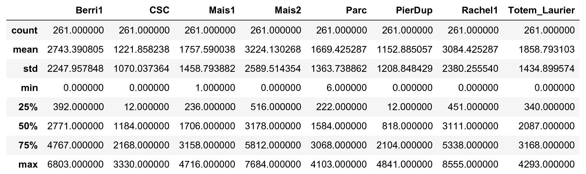
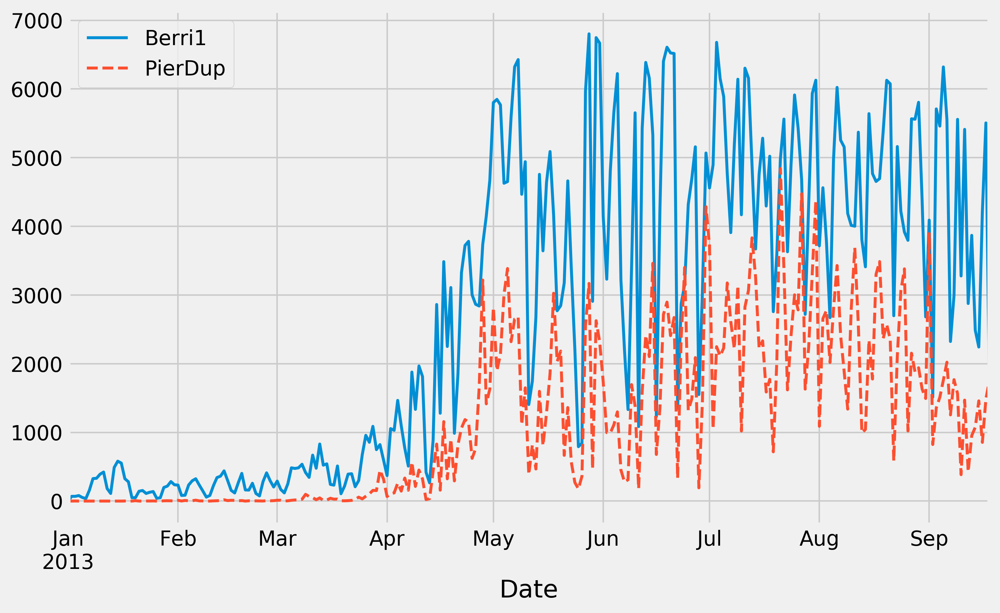
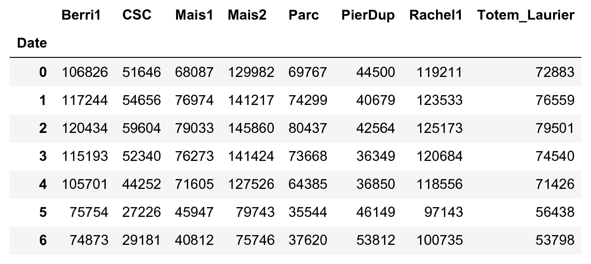
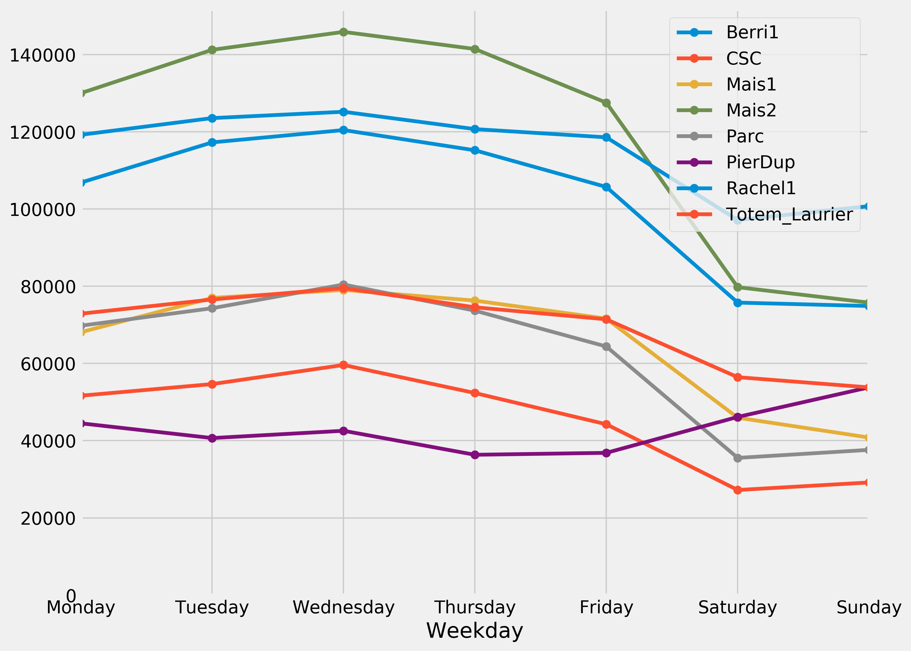
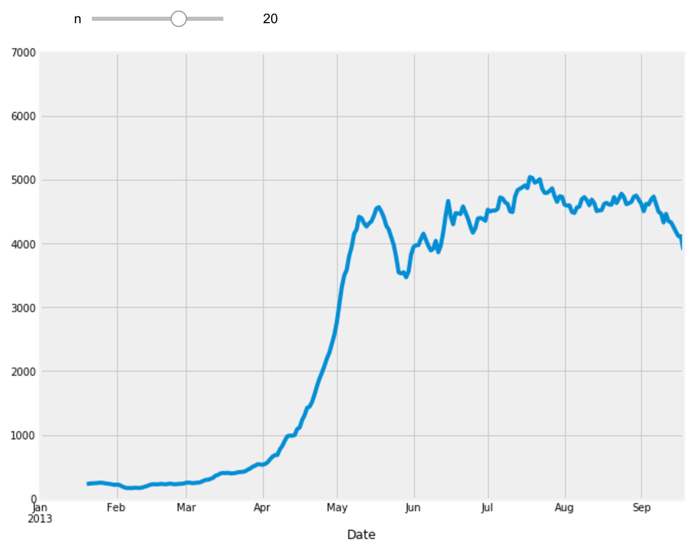

<a href="https://github.com/ipython-books/cookbook-2nd"></a> *This is one of the 100+ free recipes of the [IPython Cookbook, Second Edition](https://github.com/ipython-books/cookbook-2nd), by [Cyrille Rossant](http://cyrille.rossant.net), a guide to numerical computing and data science in the Jupyter Notebook. The ebook and printed book are available for purchase at [Packt Publishing](https://www.packtpub.com/big-data-and-business-intelligence/ipython-interactive-computing-and-visualization-cookbook-second-e).*

▶ *[Text on GitHub](https://github.com/ipython-books/cookbook-2nd) with a [CC-BY-NC-ND license](https://creativecommons.org/licenses/by-nc-nd/3.0/us/legalcode)*  
▶ *[Code on GitHub](https://github.com/ipython-books/cookbook-2nd-code) with a [MIT license](https://opensource.org/licenses/MIT)*

[*Chapter 1 : A Tour of Interactive Computing with Jupyter and IPython*](./)

# 1.2. Getting started with exploratory data analysis in the Jupyter Notebook

In this recipe, we will give an introduction to IPython and Jupyter for data analysis. Most of the subject has been covered in the the prequel of this book, *Learning IPython for Interactive Computing and Data Visualization, Second Edition*, but we will review the basics here.

We will download and analyze a dataset about attendance on Montreal's bicycle tracks. This example is largely inspired by a presentation from Julia Evans (available at https://github.com/jvns/talks/blob/master/2013-04-mtlpy/pistes-cyclables.ipynb). Specifically, we will introduce the following:

* Data manipulation with pandas
* Data visualization with matplotlib
* Interactive widgets

## How to do it...

1. The very first step is to import the scientific packages we will be using in this recipe, namely NumPy, pandas, and matplotlib. We also instruct matplotlib to render the figures as inline images in the Notebook:

```python
import numpy as np
import pandas as pd
import matplotlib.pyplot as plt
%matplotlib inline
```

> We can enable high-resolution matplotlib figures on Retina display systems with the following commands:
>
> ```python
> from IPython.display import set_matplotlib_formats
> set_matplotlib_formats('retina')
> ```

2. Now, we create a new Python variable called `url` that contains the address to a **CSV (Comma-separated values)** data file. This standard text-based file format is used to store tabular data:

```python
url = ("https://raw.githubusercontent.com/"
       "ipython-books/cookbook-2nd-data/"
       "master/bikes.csv")
```

3. pandas defines a `read_csv()` function that can read any CSV file. Here, we pass the URL to the file. pandas will automatically download the file, parse it, and return a `DataFrame` object. We need to specify a few options to make sure that the dates are parsed correctly:

```python
df = pd.read_csv(url, index_col='Date',
                 parse_dates=True, dayfirst=True)
```

4. The `df` variable contains a **DataFrame** object, a specific pandas data structure that contains 2D tabular data. The `head(n)` method displays the first `n` rows of this table. In the Notebook, pandas displays a `DataFrame` object in an HTML table, as shown in the following screenshot:

```python
df.head(2)
```


Here, every row contains the number of bicycles on every track of the city, for every day of the year.

5. We can get some summary statistics of the table with the `describe()` method:

```python
df.describe()
```



6. Let's display some figures. We will plot the daily attendance of two tracks. First, we select the two columns, `Berri1` and `PierDup`. Then, we call the `plot()` method:

```python
df[['Berri1', 'PierDup']].plot(figsize=(10, 6),
                               style=['-', '--'],
                               lw=2)
```



7. Now, we move to a slightly more advanced analysis. We will look at the attendance of all tracks as a function of the weekday. We can get the weekday easily with pandas: the `index` attribute of the `DataFrame` object contains the dates of all rows in the table. This index has a few date-related attributes, including `weekday_name`:

```python
df.index.weekday_name
```

```{output:result}
Index(['Tuesday', 'Wednesday', 'Thursday', 'Friday',
       'Saturday', 'Sunday', 'Monday', 'Tuesday',
       ...
       'Friday', 'Saturday', 'Sunday', 'Monday',
       'Tuesday', 'Wednesday'],
      dtype='object', name='Date', length=261)
```

8. To get the attendance as a function of the weekday, we need to group the table elements by the weekday. The `groupby()` method lets us do just that. We use `weekday` instead of `weekday_name` to keep the weekday order (Monday is 0, Tuesday is 1, and so on). Once grouped, we can sum all rows in every group:

```python
df_week = df.groupby(df.index.weekday).sum()
```

```python
df_week
```



9. We can now display this information in a figure. We create a matplotlib figure, and we use the `plot()` method of a `DataFrame` to create our plot:

```python
fig, ax = plt.subplots(1, 1, figsize=(10, 8))
df_week.plot(style='-o', lw=3, ax=ax)
ax.set_xlabel('Weekday')
# We replace the labels 0, 1, 2... by the weekday
# names.
ax.set_xticklabels(
    ('Monday,Tuesday,Wednesday,Thursday,'
     'Friday,Saturday,Sunday').split(','))
ax.set_ylim(0)  # Set the bottom axis to 0.
```



10. Finally, let's illustrate the interactive capabilities of the Notebook. We will plot a *smoothed* version of the track attendance as a function of time (**rolling mean**). The idea is to compute the mean value in the neighborhood of any day. The larger the neighborhood, the smoother the curve. We will create an interactive slider in the Notebook to vary this parameter in real time in the plot. All we have to do is add the `@interact` decorator above our plotting function:

```python
from ipywidgets import interact

@interact
def plot(n=(1, 30)):
    fig, ax = plt.subplots(1, 1, figsize=(10, 8))
    df['Berri1'].rolling(window=n).mean().plot(ax=ax)
    ax.set_ylim(0, 7000)
    plt.show()
```



## How it works...

To create matplotlib figures, it is good practice to create a Figure (`fig`) and one or several Axes (subplots, `ax` object) with the `plt.subplots()` command. The `figsize` keyword argument lets us specify the size of the figure, in inches. Then, we call plotting methods directly on the Axes instances. Here, for example, we set the y limits of the axis with the `set_ylim()` method. If there are existing plotting commands, like the `plot()` method provided by pandas on DataFrame instances, we can pass the relevant Axis instance with the `ax` keyword argument.

## There's more...

pandas is the main data wrangling library in Python. Other tools and methods are generally required for more advanced analyses (signal processing, statistics, and mathematical modeling). We will cover these steps in the second part of this book, starting with *Chapter 7, Statistical Data Analysis*.

Here are some more references about data manipulation with pandas:

* *Learning IPython for Interactive Computing and Data Visualization Second Edition, Packt Publishing*, the prequel of this book
* *Python for Data Analysis*, O'Reilly Media, by Wes McKinney, the creator of pandas, at http://shop.oreilly.com/product/0636920023784.do
* *Python Data Science Handbook*, O'Reilly Media, by Jake VanderPlas, at http://shop.oreilly.com/product/0636920034919.do
* The documentation of pandas available at http://pandas.pydata.org/pandas-docs/stable/
* Usage guide of matplotlib, at https://matplotlib.org/tutorials/introductory/usage.html

## See also

* Introducing the multidimensional array in NumPy for fast array computations
