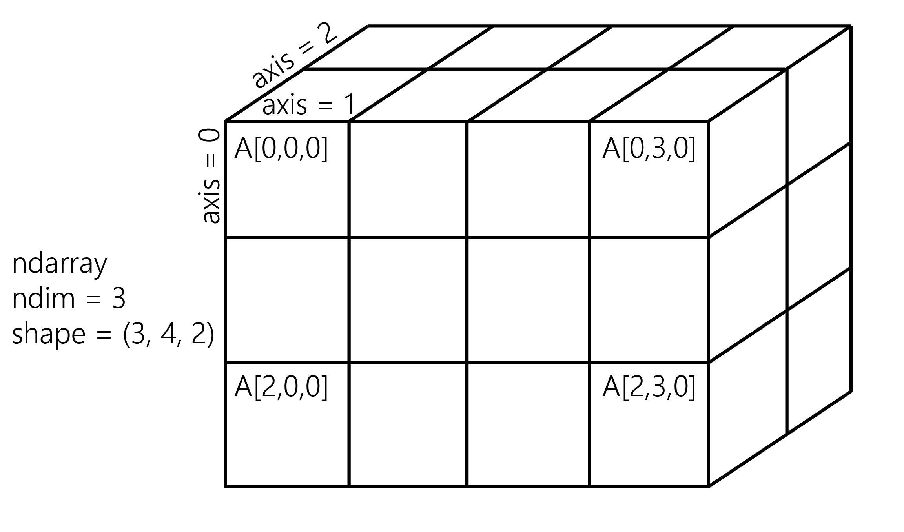

<a href="https://github.com/ipython-books/cookbook-2nd"></a> *This is one of the 100+ free recipes of the [IPython Cookbook, Second Edition](https://github.com/ipython-books/cookbook-2nd), by [Cyrille Rossant](http://cyrille.rossant.net), a guide to numerical computing and data science in the Jupyter Notebook. The ebook and printed book are available for purchase at [Packt Publishing](https://www.packtpub.com/big-data-and-business-intelligence/ipython-interactive-computing-and-visualization-cookbook-second-e).*

▶ *[Text on GitHub](https://github.com/ipython-books/cookbook-2nd) with a [CC-BY-NC-ND license](https://creativecommons.org/licenses/by-nc-nd/3.0/us/legalcode)*  
▶ *[Code on GitHub](https://github.com/ipython-books/cookbook-2nd-code) with a [MIT license](https://opensource.org/licenses/MIT)*

[*Chapter 1 : A Tour of Interactive Computing with Jupyter and IPython*](./)

# 1.3. Introducing the multidimensional array in NumPy for fast array computations

NumPy is the main foundation of the scientific Python ecosystem. This library offers a specific data structure for high-performance numerical computing: the **multidimensional array**. The rationale behind NumPy is the following: Python being a high-level dynamic language, it is easier to use but slower than a low-level language such as C. NumPy implements the multidimensional array structure in C and provides a convenient Python interface, thus bringing together high performance and ease of use. NumPy is used by many Python libraries. For example, pandas is built on top of NumPy.

In this recipe, we will illustrate the basic concepts of the multidimensional array. A more comprehensive coverage of the topic can be found in the *Learning IPython for Interactive Computing and Data Visualization Second Edition* book.

## How to do it...

1. Let's import the built-in `random` Python module and NumPy:

```python
import random
import numpy as np
```

2. We generate two Python lists, `x` and `y`, each one containing 1 million random numbers between 0 and 1:

```python
n = 1000000
x = [random.random() for _ in range(n)]
y = [random.random() for _ in range(n)]
```

```python
x[:3], y[:3]
```

```{output:result}
([0.926, 0.722, 0.962], [0.291, 0.339, 0.819])
```

3. Let's compute the element-wise sum of all of these numbers: the first element of `x` plus the first element of `y`, and so on. We use a `for` loop in a list comprehension:

```python
z = [x[i] + y[i] for i in range(n)]
z[:3]
```

```{output:result}
[1.217, 1.061, 1.781]
```

4. How long does this computation take? IPython defines a handy `%timeit` magic command to quickly evaluate the time taken by a single statement:

```python
%timeit [x[i] + y[i] for i in range(n)]
```

```{output:stdout}
101 ms ± 5.12 ms per loop (mean ± std. dev. of 7 runs,
    10 loops each)
```

5. Now, we will perform the same operation with NumPy. NumPy works on multidimensional arrays, so we need to convert our lists to arrays. The `np.array()` function does just that:

```python
xa = np.array(x)
ya = np.array(y)
```

```python
xa[:3]
```

```{output:result}
array([ 0.926,  0.722,  0.962])
```

The `xa` and `ya` arrays contain the exact same numbers that our original lists, `x` and `y`, contained. Those lists were instances of the `list` built-in class, while our arrays are instances of the `ndarray` NumPy class. These types are implemented very differently in Python and NumPy. In this example, we will see that using arrays instead of lists leads to drastic performance improvements.

6. To compute the element-wise sum of these arrays, we don't need to do a `for` loop anymore. In NumPy, adding two arrays means adding the elements of the arrays component-by-component. This is the standard mathematical notation in linear algebra (operations on vectors and matrices):

```python
za = xa + ya
za[:3]
```

```{output:result}
array([ 1.217,  1.061,  1.781])
```

We see that the `z` list and the `za` array contain the same elements (the sum of the numbers in `x` and `y`).

> Be careful not to use the `+` operator between vectors when they are represented as Python lists! This operator is valid between lists, so it would not raise an error and it could lead to subtle and silent bugs. In fact, `list1 + list2` is the *concatenation* of two lists, not the element-wise addition.

7. Let's compare the performance of this NumPy operation with the native Python loop:

```python
%timeit xa + ya
```

```{output:stdout}
1.09 ms ± 37.3 µs per loop (mean ± std. dev. of 7 runs,
    1000 loops each)
```

With NumPy, we went from 100 ms down to 1 ms to compute one million additions!

8. Now, we will compute something else: the sum of all elements in `x` or `xa`. Although this is not an element-wise operation, NumPy is still highly efficient here. The pure Python version uses the built-in `sum()` function on an iterable. The NumPy version uses the `np.sum()` function on a NumPy array:

```python
%timeit sum(x)  # pure Python
```

```{output:stdout}
3.94 ms ± 4.44 µs per loop (mean ± std. dev. of 7 runs
    100 loops each)
```

```python
%timeit np.sum(xa)  # NumPy
```

```{output:stdout}
298 µs ± 4.62 µs per loop (mean ± std. dev. of 7 runs,
    1000 loops each)
```

We also observe a significant speedup here.

9. Finally, let's perform one last operation: computing the arithmetic distance between any pair of numbers in our two lists (we only consider the first 1000 elements to keep computing times reasonable). First, we implement this in pure Python with two nested `for` loops:

```python
d = [abs(x[i] - y[j])
     for i in range(1000)
     for j in range(1000)]
```

```python
d[:3]
```

```{output:result}
[0.635, 0.587, 0.106]
```

10. Now, we use a NumPy implementation, bringing out two slightly more advanced notions. First, we consider a **two-dimensional array** (or matrix). This is how we deal with the two indices, `i` and `j`. Second, we use **broadcasting** to perform an operation between a 2D array and 1D array. We will give more details in the *How it works...* section.

```python
da = np.abs(xa[:1000, np.newaxis] - ya[:1000])
```

```python
da
```

```{output:result}
array([[ 0.635,  0.587,  ...,  0.849,  0.046],
       [ 0.431,  0.383,  ...,  0.646,  0.158],
       ...,
       [ 0.024,  0.024,  ...,  0.238,  0.566],
       [ 0.081,  0.033,  ...,  0.295,  0.509]])
```

```python
%timeit [abs(x[i] - y[j]) \
         for i in range(1000) \
         for j in range(1000)]
```

```{output:stdout}
134 ms ± 1.79 ms per loop (mean ± std. dev. of 7 runs,
    1000 loops each)
```

```python
%timeit np.abs(xa[:1000, np.newaxis] - ya[:1000])
```

```{output:stdout}
1.54 ms ± 48.9 µs per loop (mean ± std. dev. of 7 runs
    1000 loops each)
```

Here again, we observe a significant speedup.

## How it works...

A NumPy array is a homogeneous block of data organized in a multidimensional finite grid. All elements of the array share the same **data type**, also called **dtype** (integer, floating-point number, and so on). The **shape** of the array is an n-tuple that gives the size of each axis.

A 1D array is a **vector**; its shape is just the number of components.

A 2D array is a **matrix**; its shape is `(number of rows, number of columns)`.

The following figure illustrates the structure of a 3D `(3, 4, 2)` array that contains 24 elements:



The slicing syntax in Python translates nicely to array indexing in NumPy. Also, we can add an extra dimension to an existing array, using `np.newaxis` in the index.

Element-wise arithmetic operations can be performed on NumPy arrays that have the *same shape*. However, broadcasting relaxes this condition by allowing operations on arrays with different shapes in certain conditions. Notably, when one array has fewer dimensions than the other, it can be virtually stretched to match the other array's dimension. This is how we computed the pairwise distance between any pair of elements in `xa` and `ya`.

How can array operations be so much faster than Python loops? There are several reasons, and we will review them in detail in *Chapter 4, Profiling and Optimization*. We can already say here that:

* In NumPy, array operations are implemented internally with C loops rather than Python loops. Python is typically slower than C because of its interpreted and dynamically-typed nature.
* The data in a NumPy array is stored in a **contiguous** block of memory in RAM. This property leads to more efficient use of CPU cycles and cache.

## There's more...

There's obviously much more to say about this subject. The prequel of this book, *Learning IPython for Interactive Computing and Data Visualization Second Edition*, contains more details about basic array operations. We will use the array data structure routinely throughout this book. Notably, *Chapter 4, Profiling and Optimization*, covers advanced techniques of using NumPy arrays.

Here are some more references:

* Introduction to the ndarray on NumPy's documentation available at http://docs.scipy.org/doc/numpy/reference/arrays.ndarray.html
* Tutorial on the NumPy array available at https://docs.scipy.org/doc/numpy-dev/user/quickstart.html
* The NumPy array in the SciPy lectures notes, at http://scipy-lectures.github.io/intro/numpy/array_object.html
* NumPy for MATLAB users, at https://docs.scipy.org/doc/numpy-dev/user/numpy-for-matlab-users.html

## See also

* Getting started with data exploratory analysis in the Jupyter Notebook
* Understanding the internals of NumPy to avoid unnecessary array copying
