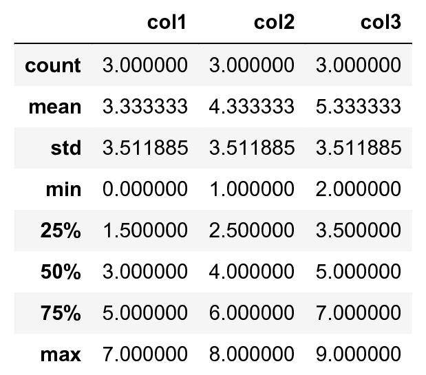

<a href="https://github.com/ipython-books/cookbook-2nd"></a> *This is one of the 100+ free recipes of the [IPython Cookbook, Second Edition](https://github.com/ipython-books/cookbook-2nd), by [Cyrille Rossant](http://cyrille.rossant.net), a guide to numerical computing and data science in the Jupyter Notebook. The ebook and printed book are available for purchase at [Packt Publishing](https://www.packtpub.com/big-data-and-business-intelligence/ipython-interactive-computing-and-visualization-cookbook-second-e).*

▶ *[Text on GitHub](https://github.com/ipython-books/cookbook-2nd) with a [CC-BY-NC-ND license](https://creativecommons.org/licenses/by-nc-nd/3.0/us/legalcode)*  
▶ *[Code on GitHub](https://github.com/ipython-books/cookbook-2nd-code) with a [MIT license](https://opensource.org/licenses/MIT)*

[*Chapter 1 : A Tour of Interactive Computing with Jupyter and IPython*](./)

# 1.4. Creating an IPython extension with custom magic commands

Although IPython comes with a wide variety of magic commands, there are cases where we need to implement custom functionality in new magic commands. In this recipe, we will show how to create line and magic cells, and how to integrate them in an IPython extension.

## How to do it...

1. Let's import a few functions from the IPython magic system:

```python
from IPython.core.magic import (register_line_magic,
                                register_cell_magic)
```

2. Defining a new line magic is particularly simple. First, we create a function that accepts the contents of the line (except the initial `%`-prefixed name). The name of this function is the name of the magic. Then, we decorate this function with `@register_line_magic`:

```python
@register_line_magic
def hello(line):
    if line == 'french':
        print("Salut tout le monde!")
    else:
        print("Hello world!")
```

```python
%hello
```

```{output:stdout}
Hello world!
```

```python
%hello french
```

```{output:stdout}
Salut tout le monde!
```

3. Let's create a slightly more useful `%%csv` cell magic that parses a CSV string and returns a pandas `DataFrame` object. This time, the arguments of the function are the command's options and the contents of the cell.

```python
import pandas as pd
from io import StringIO

@register_cell_magic
def csv(line, cell):
    # We create a string buffer containing the
    # contents of the cell.
    sio = StringIO(cell)
    # We use Pandas' read_csv function to parse
    # the CSV string.
    return pd.read_csv(sio)
```

```python
%%csv
col1,col2,col3
0,1,2
3,4,5
7,8,9
```


We can access the returned object with `_`.

```python
df = _
df.describe()
```



4. The method we described is useful in an interactive session. If we want to use the same magic in multiple notebooks or if we want to distribute it, then we need to create an **IPython extension** that implements our custom magic command. The first step is to create a Python script (`csvmagic.py` here) that implements the magic. We also need to define a special function `load_ipython_extension(ipython)`:

```python
%%writefile csvmagic.py
import pandas as pd
from io import StringIO

def csv(line, cell):
    sio = StringIO(cell)
    return pd.read_csv(sio)

def load_ipython_extension(ipython):
    """This function is called when the extension is
    loaded. It accepts an IPython InteractiveShell
    instance. We can register the magic with the
    `register_magic_function` method of the shell
    instance."""
    ipython.register_magic_function(csv, 'cell')
```

```{output:stdout}
Writing csvmagic.py
```

5. Once the extension module is created, we need to import it into the IPython session. We can do this with the `%load_ext` magic command. Here, loading our extension immediately registers our `%%csv` magic function in the interactive shell:

```python
%load_ext csvmagic
```

```python
%%csv
col1,col2,col3
0,1,2
3,4,5
7,8,9
```


## How it works...

An IPython extension is a Python module that implements the top-level `load_ipython_extension(ipython)` function. When the `%load_ext` magic command is called, the module is loaded and the `load_ipython_extension(ipython)` function is called. This function is passed the current `InteractiveShell` instance as an argument. This object implements several methods we can use to interact with the current IPython session.

### The InteractiveShell class

An interactive IPython session is represented by a (singleton) instance of the `InteractiveShell` class. This object handles the history, interactive namespace, and most features available in the session.

Within an interactive shell, we can get the current `InteractiveShell` instance with the `get_ipython()` function.

The list of all methods of `InteractiveShell` can be found in the reference API (see the reference at the end of this recipe). The following are the most important attributes and methods:

* `user_ns`: The user namespace (a dictionary).
* `push()`: Push (or inject) Python variables in the interactive namespace.
* `ev()`: Evaluate a Python expression in the user namespace.
* `ex()`: Execute a Python statement in the user namespace.
* `run_cell()`: Run a cell (given as a string), possibly containing IPython magic commands.
* `safe_execfile()`: Safely execute a Python script.
* `system()`: Execute a system command.
* `write()`: Write a string to the default output.
* `write_err()`: Write a string to the default error output.
* `register_magic_function()`: Register a standalone function as an IPython magic function. We used this method in this recipe.

### Loading an extension

The Python extension module needs to be importable when using `%load_ext`. Here, our module is in the current directory. In other situations, it has to be in the Python path. It can also be stored in `~/.ipython/extensions`, which is automatically put in the Python path.

To ensure that our magic is automatically defined in our IPython profile, we can instruct IPython to load our extension automatically when a new interactive shell is launched. To do this, we have to open the `~/.ipython/profile_default/ipython_config.py` file and put `'csvmagic'` in the `c.InteractiveShellApp.extensions` list. The `csvmagic` module needs to be importable. It is common to create a Python package that implements an IPython extension, which itself defines custom magic commands.

## There's more...

Many third-party extensions and magic commands exist, for example the `%%cython` magic that allows one to write Cython code directly in a notebook.

Here are a few references:

* Documentation of IPython's extension system available at http://ipython.readthedocs.io/en/stable/config/extensions/index.html
* Defining new magic commands explained at http://ipython.readthedocs.io/en/stable/config/custommagics.html
* Index of IPython extensions at https://github.com/ipython/ipython/wiki/Extensions-Index
* API reference of InteractiveShell available at http://ipython.readthedocs.io/en/stable/api/generated/IPython.core.interactiveshell.html

## See also

* Mastering IPython's configuration system
