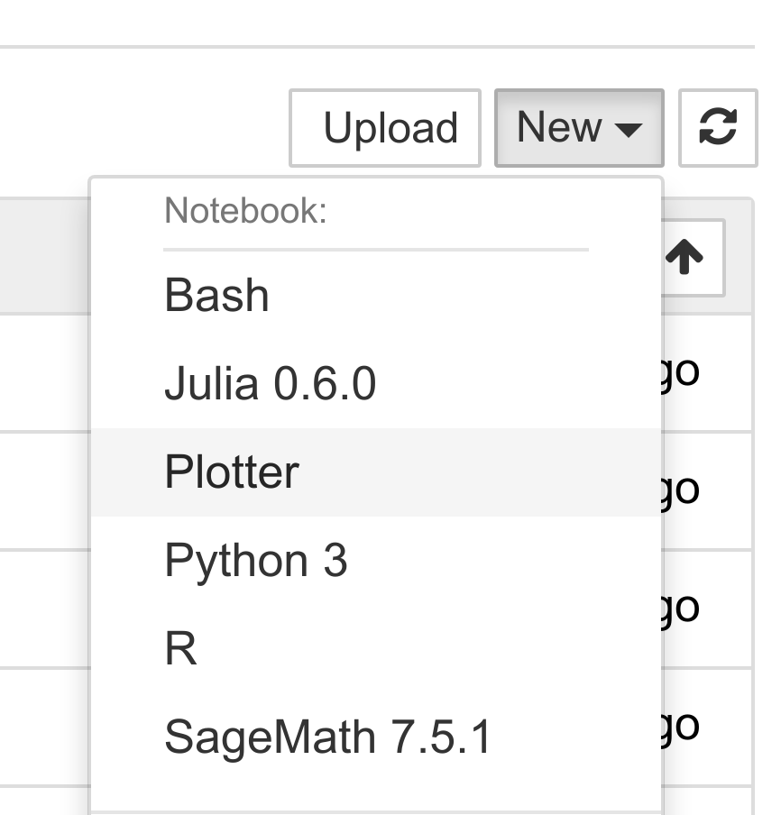
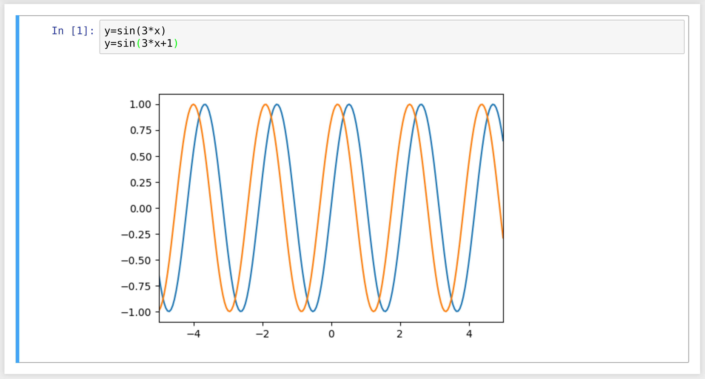

<a href="https://github.com/ipython-books/cookbook-2nd"></a> *This is one of the 100+ free recipes of the [IPython Cookbook, Second Edition](https://github.com/ipython-books/cookbook-2nd), by [Cyrille Rossant](http://cyrille.rossant.net), a guide to numerical computing and data science in the Jupyter Notebook. The ebook and printed book are available for purchase at [Packt Publishing](https://www.packtpub.com/big-data-and-business-intelligence/ipython-interactive-computing-and-visualization-cookbook-second-e).*

▶ *[Text on GitHub](https://github.com/ipython-books/cookbook-2nd) with a [CC-BY-NC-ND license](https://creativecommons.org/licenses/by-nc-nd/3.0/us/legalcode)*  
▶ *[Code on GitHub](https://github.com/ipython-books/cookbook-2nd-code) with a [MIT license](https://opensource.org/licenses/MIT)*

[*Chapter 1 : A Tour of Interactive Computing with Jupyter and IPython*](./)

# 1.6. Creating a simple kernel for Jupyter

The architecture of Jupyter is language independent. The decoupling between the client and kernel makes it possible to write kernels in any language. The client communicates with the kernel via socket-based messaging protocols.

However, the messaging protocols are complex. Writing a new kernel from scratch is not straightforward. Fortunately, Jupyter brings a lightweight interface for kernel languages that can be wrapped in Python.

This interface can also be used to create an entirely customized experience in the Jupyter Notebook (or another client application such as the console). Normally, Python code has to be written in every code cell; however, we can write a kernel for any domain-specific language. We just have to write a Python function that accepts a code string as input (the contents of the code cell), and sends text or rich data as output. We can also easily implement code completion and code inspection.

We can imagine many interesting interactive applications that go far beyond the original use cases of Jupyter. These applications might be particularly useful to nonprogrammer end users such as high school students.

In this recipe, we will create a simple graphing calculator. The calculator is transparently backed by NumPy and matplotlib. We just have to write functions as `y = f(x)` in a code cell to get a graph of these functions.

## How to do it...

1. First, we create a `plotkernel.py` file. This file will contain the implementation of our custom kernel. Let's import a few modules:

```python
%%writefile plotkernel.py

from ipykernel.kernelbase import Kernel
import numpy as np
import matplotlib.pyplot as plt
from io import BytesIO
import urllib, base64
```

```{output:stdout}
Writing plotkernel.py
```

2. We write a function that returns a base64-encoded PNG representation of a matplotlib figure:

```python
%%writefile plotkernel.py -a

def _to_png(fig):
    """Return a base64-encoded PNG from a
    matplotlib figure."""
    imgdata = BytesIO()
    fig.savefig(imgdata, format='png')
    imgdata.seek(0)
    return urllib.parse.quote(
        base64.b64encode(imgdata.getvalue()))
```

```{output:stdout}
Appending to plotkernel.py
```

3. Now, we write a function that parses a code string, which has the form `y = f(x)`, and returns a NumPy function. Here, `f` is an arbitrary Python expression that can use NumPy functions:

```python
%%writefile plotkernel.py -a

_numpy_namespace = {n: getattr(np, n)
                    for n in dir(np)}
def _parse_function(code):
    """Return a NumPy function from a
    string 'y=f(x)'."""
    return lambda x: eval(code.split('=')[1].strip(),
                          _numpy_namespace, {'x': x})
```

```{output:stdout}
Appending to plotkernel.py
```

4. For our new wrapper kernel, we create a class that derives from `Kernel`. There are a few metadata fields we need to provide:

```python
%%writefile plotkernel.py -a

class PlotKernel(Kernel):
    implementation = 'Plot'
    implementation_version = '1.0'
    language = 'python'  # will be used for
                         # syntax highlighting
    language_version = '3.6'
    language_info = {'name': 'plotter',
                     'mimetype': 'text/plain',
                     'extension': '.py'}
    banner = "Simple plotting"
```

```{output:stdout}
Appending to plotkernel.py
```

5. In this class, we implement a `do_execute()` method that takes code as input and sends responses to the client:

```python
%%writefile plotkernel.py -a

    def do_execute(self, code, silent,
                   store_history=True,
                   user_expressions=None,
                   allow_stdin=False):

        # We create the plot with matplotlib.
        fig, ax = plt.subplots(1, 1, figsize=(6,4),
                               dpi=100)
        x = np.linspace(-5., 5., 200)
        functions = code.split('\n')
        for fun in functions:
            f = _parse_function(fun)
            y = f(x)
            ax.plot(x, y)
        ax.set_xlim(-5, 5)

        # We create a PNG out of this plot.
        png = _to_png(fig)

        if not silent:
            # We send the standard output to the
            # client.
            self.send_response(
                self.iopub_socket,
                'stream', {
                    'name': 'stdout',
                    'data': ('Plotting {n} '
                             'function(s)'). \
                            format(n=len(functions))})

            # We prepare the response with our rich
            # data (the plot).
            content = {
                'source': 'kernel',

                # This dictionary may contain
                # different MIME representations of
                # the output.
                'data': {
                    'image/png': png
                },

                # We can specify the image size
                # in the metadata field.
                'metadata' : {
                      'image/png' : {
                        'width': 600,
                        'height': 400
                      }
                    }
            }

            # We send the display_data message with
            # the contents.
            self.send_response(self.iopub_socket,
                'display_data', content)

        # We return the exection results.
        return {'status': 'ok',
                'execution_count':
                    self.execution_count,
                'payload': [],
                'user_expressions': {},
               }
```

```{output:stdout}
Appending to plotkernel.py
```

6. Finally, we add the following lines at the end of the file:

```python
%%writefile plotkernel.py -a

if __name__ == '__main__':
    from ipykernel.kernelapp import IPKernelApp
    IPKernelApp.launch_instance(
        kernel_class=PlotKernel)
```

```{output:stdout}
Appending to plotkernel.py
```

7. Our kernel is ready! The next step is to indicate to Jupyter that this new kernel is available. To do this, we need to create a **kernel spec** `kernel.json` file in a subdirectory as follows:

```python
%mkdir -p plotter/
```

```python
%%writefile plotter/kernel.json
{
 "argv": ["python", "-m",
          "plotkernel", "-f",
          "{connection_file}"],
 "display_name": "Plotter",
 "name": "Plotter",
 "language": "python"
}
```

```{output:stdout}
Writing plotter/kernel.json
```

8. We install the kernel:

```python
!jupyter kernelspec install --user plotter
```

```{output:stdout}
[InstallKernelSpec] Installed kernelspec plotter in
~/.local/share/jupyter/kernels/plotter
```

9. The Plotter kernel now appears in the list of kernels:

```python
!jupyter kernelspec list
```

```{output:stdout}
Available kernels:
  bash         ~/.local/share/jupyter/kernels/bash
  ir           ~/.local/share/jupyter/kernels/ir
  plotter      ~/.local/share/jupyter/kernels/plotter
  sagemath     ~/.local/share/jupyter/kernels/sagemath
  ...
```

The `plotkernel.py` file needs to be importable by Python. For example, we could simply put it in the current directory.

10. Now, if we refresh the main Jupyter Notebook page (or after a restart of the Jupyter Notebook server if needed), we see that our Plotter kernel appears in the list of kernels:



11. Let's create a new notebook with the `Plotter` kernel. There, we can simply write mathematical equations under the form `y=f(x)`. The corresponding graph appears in the output area. Here is an example:



## How it works...

The kernel and client live in different processes. They communicate via messaging protocols implemented on top of network sockets. Currently, these messages are encoded in JSON, a structured, text-based document format.

Our kernel receives code from the client (the notebook, for example). The `do_execute()` function is called whenever the user sends a cell's code.

The kernel can send messages back to the client with the `self.send_response()` method:

* The first argument is the socket, here, the `IOPub` socket
* The second argument is the message type, here, `stream`, to send back standard output or a standard error, or `display_data` to send back rich data
* The third argument is the contents of the message, represented as a Python dictionary

The data can contain multiple MIME representations: text, HTML, SVG, images, and others. It is up to the client to handle these data types. In particular, the Notebook client knows how to represent all these types in the browser.

The function returns execution results in a dictionary.

In this toy example, we always return an ok status. In production code, it would be a good idea to detect errors (syntax errors in the function definitions, for example) and return an error status instead.

All messaging protocol details can be found below.

## There's more...

Wrapper kernels can implement optional methods, notably for code completion and code inspection. For example, to implement code completion, we need to write the following method:

```
def do_complete(self, code, cursor_pos):
    return {'status': 'ok',
            'cursor_start': ...,
            'cursor_end': ...,
            'matches': [...]}
```

This method is called whenever the user requests code completion when the cursor is at a given `cursor_pos` location in the code cell. In the method's response, the `cursor_start` and `cursor_end` fields represent the interval that code completion should overwrite in the output. The `matches` field contains the list of suggestions.

Here are a few references:

* Wrapper kernel example https://github.com/jupyter/echo_kernel
* Wrapper kernels, available at http://jupyter-client.readthedocs.io/en/latest/wrapperkernels.html
* Messging protocol in Jupyter, at https://jupyter-client.readthedocs.io/en/latest/messaging.html#execution-results
* Making kernels for Jupyter, at http://jupyter-client.readthedocs.io/en/latest/kernels.html
* Using C++ in Jupyter, at https://blog.jupyter.org/interactive-workflows-for-c-with-jupyter-fe9b54227d92
