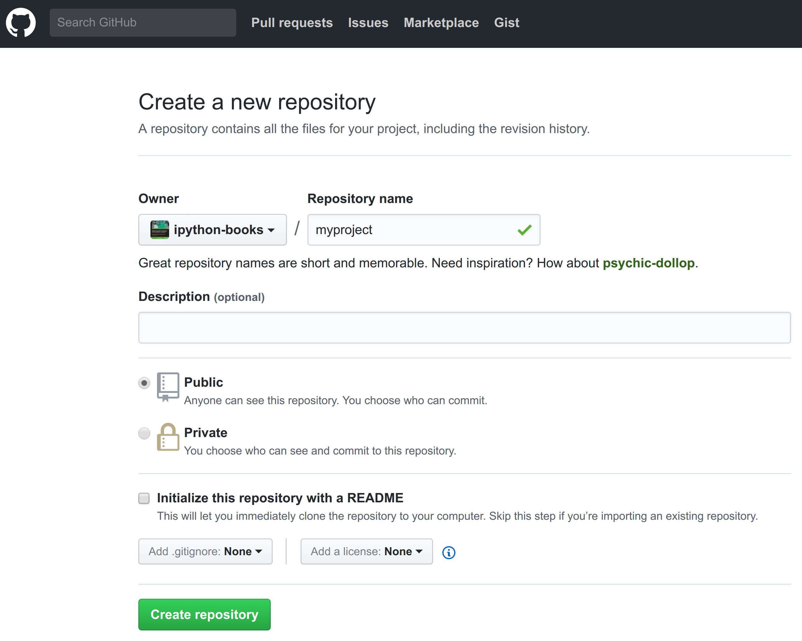

<a href="https://github.com/ipython-books/cookbook-2nd"></a> *This is one of the 100+ free recipes of the [IPython Cookbook, Second Edition](https://github.com/ipython-books/cookbook-2nd), by [Cyrille Rossant](http://cyrille.rossant.net), a guide to numerical computing and data science in the Jupyter Notebook. The ebook and printed book are available for purchase at [Packt Publishing](https://www.packtpub.com/big-data-and-business-intelligence/ipython-interactive-computing-and-visualization-cookbook-second-e).*

▶ *[Text on GitHub](https://github.com/ipython-books/cookbook-2nd) with a [CC-BY-NC-ND license](https://creativecommons.org/licenses/by-nc-nd/3.0/us/legalcode)*  
▶ *[Code on GitHub](https://github.com/ipython-books/cookbook-2nd-code) with a [MIT license](https://opensource.org/licenses/MIT)*

[*Chapter 2 : Best practices in Interactive Computing*](./)

# 2.3. Learning the basics of the distributed version control system Git

Using a **version control system** is an absolute requirement in programming and research. This is the tool that makes it barely impossible to lose one's work. In this recipe, we will cover the basics of Git.

## Getting ready

Notable distributed version control systems include **Git**, **Mercurial**, and **Bazaar**, among others. In this chapter, we will use the popular Git system. You can download the Git program and Git GUI clients from http://git-scm.com.

> Distributed systems tend to be more popular than centralized systems such as SVN or CVS. Distributed systems allow local (offline) changes and offer more flexible collaboration systems.

An online provider allows you to host your code in the cloud. You can use it as a backup of your work and as a platform to share your code with your colleagues. These services include **GitHub** (https://github.com), **Gitlab** (https://gitlab.com), and **Bitbucket** (https://bitbucket.org). All of these websites offer free and paid plans with unlimited public and/or private repositories.

GitHub offers desktop applications for Windows and macOS at https://desktop.github.com/.

This book's code is stored on GitHub. Most Python libraries are also developed on GitHub.

## How to do it...

1. The very first thing to do when starting a new project or computing experiment is create a new folder locally:

```bash
mkdir myproject
cd myproject
```

2. We initialize a Git repository:

```bash
git init
```

```{output:stdout}
Initialized empty Git repository in
~/git/cookbook-2nd/chapter02/myproject/.git/
```

```bash
pwd
```

```{output:stdout}
~/git/cookbook-2nd/chapter02/myproject
```

```bash
ls -a
```

```{output:stdout}
.  ..  .git
```

Git created a  `.git` subdirectory that contains all the parameters and history of the repository.

3. Let's set our name and e-mail address globally:

```bash
git config --global user.name "My Name"
git config --global user.email "me@home.com"
```

4. We create a new file, and we tell Git to track it:

```bash
echo "Hello world" > file.txt
git add file.txt
```

5. Let's create our first commit:

```bash
git commit -m "Initial commit"
```

```{output:stdout}
[master (root-commit) 02971c0] Initial commit
 1 file changed, 1 insertion(+)
 create mode 100644 file.txt
```

6. We can check the list of commits:

```bash
git log
```

```{output:stdout}
commit 02971c0e1176cd26ec33900e359b192a27df2821
Author: My Name <me@home.com>
Date:   Tue Dec 12 10:50:37 2017 +0100

    Initial commit
```

7. Next, we edit the file by appending an exclamation mark:

```bash
echo "Hello world!" > file.txt
```

```bash
cat file.txt
```

```{output:stdout}
Hello world!
```

8. We can see the differences between the current state of our repository, and the state in the last commit:

```bash
git diff
```

```{output:stdout}
diff --git a/file.txt b/file.txt
index 802992c..cd08755 100644
--- a/file.txt
+++ b/file.txt
@@ -1 +1 @@
-Hello world
+Hello world!
```

The output of `git diff` shows that the contents of `file.txt` were changed from `Hello world` to `Hello world!`. Git compares the states of all tracked files and computes the differences between the files.

9. We can also get a summary of the changes as follows:

```bash
git status
```

```{output:stdout}
On branch master
Changes not staged for commit:
  (use "git add <file>..." to update what will
      be committed)

    modified:   file.txt

no changes added to commit (use "git add")
```

```bash
git diff --stat
```

```{output:stdout}
 file.txt | 2 +-
 1 file changed, 1 insertion(+), 1 deletion(-)
```

The `git status` command gives a summary of all changes since the last commit. The `git diff --stat` command shows, for each modified text file, the number of changed lines.

10. Finally, we commit our change with a shortcut that automatically adds all changes in the tracked files (`-a` option):

```bash
git commit -am "Add exclamation mark to file.txt"
```

```{output:stdout}
[master 045df6a] Add exclamation mark to file.txt
 1 file changed, 1 insertion(+), 1 deletion(-)
```

```bash
git log
```

```{output:stdout}
commit 045df6a6f8a62b19f45025d15168d6d7382a8429
Author: My Name <me@home.com>
Date:   Tue Dec 12 10:59:39 2017 +0100

    Add exclamation mark to file.txt

commit 02971c0e1176cd26ec33900e359b192a27df2821
Author: My Name <me@home.com>
Date:   Tue Dec 12 10:50:37 2017 +0100

    Initial commit
```

## How it works...

When you start a new project or a new computing experiment, create a new folder on your computer. You will eventually add code, text files, datasets, and other resources in this folder. The distributed version control system keeps track of the changes you make to your files as your project evolves. It is more than a simple backup, as every change you make on any file can be saved along with the corresponding timestamp. You can even revert to a previous state at any time; never be afraid of breaking your code anymore!

> Git works best with text files. It can handle binary files but with limitations. It is better to use a separate system such as Git Large File Storage, or Git LFS (see https://git-lfs.github.com/).

Specifically, you can take a snapshot of your project at any time by doing a **commit**. The snapshot includes all staged (or tracked) files. You are in total control of which files and changes will be tracked. With Git, you specify a file as staged for your next commit with `git add`, before committing your changes with `git commit`. The `git commit -a` command allows you to commit all changes in the files that are already being tracked.

When committing, you should provide a clear and short message describing the changes you made. This makes the repository's history considerably more informative than just writing "work in progress". If the commit message is long, write a short title (less than 50 characters), insert two line breaks, and write a longer description.

> How often should you commit? The answer is very often. Git only takes responsibility of your work when you commit changes. What happens between two commits may be lost, so you'd better commit very regularly. Besides, commits are quick and cheap as they are local; that is, they do not involve any remote communication with an external server.

Git is a *distributed* version control system; your local repository does not need to synchronize with an external server. However, you should synchronize if you need to work on several computers, or if you prefer to have a remote backup. Synchronization with a remote repository can be done with `git push` (send your local commits on the remote server), `git fetch` (download remote branches and objects), and `git pull` (synchronize the remote changes on your local repository), after you've set up remotes.

## There's more...

We can also create a new repository on an online git provider such as GitHub:



On the main webpage of the newly created project, click on the **Clone or download** button to get the repository URL and type in a terminal:

```bash
git clone https://github.com/mylogin/myproject.git
```

If the local repository already exists, do not tick the *Initialize this repository with a README* box on the GitHub page, and add the remote with `git remote add origin https://github.com/yourlogin/myproject.git`. See https://help.github.com/articles/adding-a-remote/ for more details.

The simplistic workflow shown in this recipe is linear. In practice though, workflows with Git are typically nonlinear; this is the concept of branching. We will describe this idea in the next recipe, *A typical workflow with Git branching*.

Here are some references on Git:

* Hands-on tutorial, available at https://try.github.io
* Git, a simple guide by Roger Dudler, available at http://rogerdudler.github.io/git-guide/
* Git Immersion, a guided tour, at http://gitimmersion.com
* Atlassian Git tutorial, available at http://www.atlassian.com/git
* Online Git course, available at http://www.codeschool.com/courses/try-git
* Git tutorial by Lars Vogel, available at http://www.vogella.com/tutorials/Git/article.html
* GitHub and Git tutorial, available at http://git-lectures.github.io
* Intro to Git for scientists, available at http://karthik.github.io/git_intro/
* GitHub help, available at https://help.github.com

## See also

* A typical workflow with Git branching
