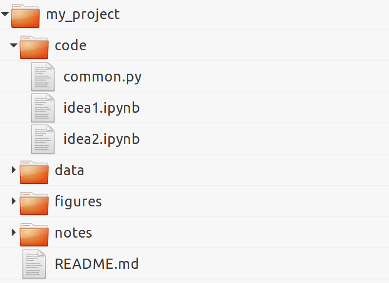

 *This is one of the 100+ free recipes of the [IPython Cookbook, Second Edition](https://github.com/ipython-books/cookbook-2nd), by [Cyrille Rossant](http://cyrille.rossant.net), a guide to numerical computing and data science in the Jupyter Notebook. The ebook and printed book are available for purchase at [Packt Publishing](https://www.packtpub.com/big-data-and-business-intelligence/ipython-interactive-computing-and-visualization-cookbook-second-e).*

▶ *[Text on GitHub](https://github.com/ipython-books/cookbook-2nd) with a [CC-BY-NC-ND license](https://creativecommons.org/licenses/by-nc-nd/3.0/us/legalcode)*  
▶ *[Code on GitHub](https://github.com/ipython-books/cookbook-2nd-code) with a [MIT license](https://opensource.org/licenses/MIT)*

[*Chapter 2 : Best practices in Interactive Computing*](./)

# 2.6. Ten tips for conducting reproducible interactive computing experiments

In this recipe, we present ten tips that can help you conduct efficient and reproducible interactive computing experiments. These are more guidelines than absolute rules.

First, we will show how you can improve your productivity by minimizing the time spent doing repetitive tasks and maximizing the time spent thinking about your core work.

Second, we will demonstrate how you can achieve more reproducibility in your computing work. Notably, academic research requires experiments to be reproducible so that any result or conclusion can be verified independently by other researchers. It is not uncommon for errors or manipulations in methods to result in erroneous conclusions that can have damaging consequences. For example, in the 2010 research paper in economics *Growth in a Time of Debt*, by Carmen Reinhart and Kenneth Rogoff, computational errors were partly responsible for a flawed study with global ramifications for policy makers (see https://en.wikipedia.org/wiki/Growth_in_a_Time_of_Debt).

## How to do it...

1. Organize your directory structure carefully and coherently. The specific structure does not matter. What matters is to be consistent throughout your projects regarding file-naming conventions, folders, subfolders, and so on. Here is a simple example:

2. Write notes in text files using a lightweight markup language such as **Markdown** (http://daringfireball.net/projects/markdown/), **CommonMark** (http://commonmark.org/), or **reStructuredText (reST)**. All meta-information related to your project, files, data sets, code, figures, lab notebooks, and so on, should be written down in text files.
3. Relatedly, document everything non-trivial in your code with comments, docstrings, and so on. You can use a documentation tool such as **Sphinx** (http://sphinx-doc.org). However, do not spend too much time documenting unstable and bleeding-edge code while you are working on it; it might change frequently and your documentation may soon be out of date. Write your code in such a way that it's easily understandable without comments (name your variables and functions well, use Pythonic patterns, and so on). See also the next recipe, *Write high-quality Python code*.
4. Use a version control system such as Git for all text-based files, but not binary files (except maybe for very small ones when you really need to). You should use one repository per project. Synchronize the repositories on a remote server, using a free or paid hosting provider (such as GitHub, Gitlab, or Bitbucket) or your own server (your host institution might be able to set up one for you). Use a specific system to store and share binary data files, such as http://figshare.com or http://datadryad.org.
5. Write all your interactive computing code in Jupyter notebooks first and refactor it into standalone Python components only when it is sufficiently mature and stable.
6. Make sure that you record the exact versions of all components in your entire software stack (operating system, Python distribution, modules, and so on). A possibility is to use virtual environments with **virtualenv** or **conda**. Another possibility is to use **Docker** (https://www.docker.com).
7. Cache long-to-compute intermediary results using Python's native **pickle** module, **dill** (https://github.com/uqfoundation/dill), or **Joblib** (http://pythonhosted.org/joblib/). Joblib notably implements a NumPy-aware **memoize** pattern (not to be confused with memorize), which allows you to cache the results of computationally intensive functions.

> How to save persistent data in Python? For purely internal purposes, you can use Joblib, NumPy's `save()` and `savez()` functions for arrays, and `pickle` for any other Python object (prefer native types such as lists and dictionaries rather than custom classes). For sharing purposes, prefer text files for small datasets (less than 10,000 points), for example, CSV for arrays, and JSON or YAML for highly structured data. For larger datasets, you can use HDF5 (see the *Manipulating large arrays with HDF5* recipe of *Chapter 4, Profiling and Optimization*).

8. When developing and trying out algorithms on large data sets, run them and compare them on small portions of your data first, before moving to the full sets.
9. When running jobs in a batch, use parallel computing to take advantage of your multicore processing units, for example, with **ipyparallel**, Joblib, **dask** (https://dask.pydata.org/en/latest/), Python's multiprocessing package, or any other parallel computing library.
10. Automate your work as much as possible with Python functions or scripts. Use command-line arguments for user-exposed scripts, but prefer Python functions over scripts when possible. On Unix systems, learn terminal commands to improve your productivity. For repetitive tasks on Windows or GUI-based systems, use automation tools such as **AutoHotKey** (http://www.autohotkey.com). Learn keyboard shortcuts in the programs you use a lot, or create your own shortcuts. Automatic steps are reproducible, manual steps are not.

## How it works...

The tips given in this recipe ultimately aim to optimize your workflows, in terms of human time, computer time, and quality. Using coherent conventions and structure for your code makes it easier for you to organize your work. Documenting everything saves everyone's time, including (eventually) yours!

Using a distributed version control system with an online hosting service makes it easy for you to work on the same code base from multiple locations, without ever worrying about backups. As you can go back in time in your code, you have very little chance of unintentionally breaking it.

The Jupyter Notebook is an excellent tool for reproducible interactive computing. It lets you keep a detailed record of your work. Also, the ease of use of the Jupyter Notebook ease of use means that you don't have to worry about reproducibility; just do all of your interactive work in notebooks, put them under version control, and commit regularly. Don't forget to refactor your code into independent reusable components.

Be sure to optimize the time you spend in front of your computer. When working on an algorithm, this cycle frequently happens: you do a slight modification, you launch the code, get the results, make another change, and so on and so forth. If you need to try out a lot of changes, you should ensure that the execution time is fast enough (no more than a few seconds). Using advanced optimization techniques is not necessarily the best option at this stage of experimentation. You should cache your results, try out your algorithms on data subsets, and run your simulations with shorter durations. You can also launch batch jobs in parallel when you want to test different parameter values.

Finally, desperately try to avoid doing repetitive tasks. It is worth spending time automating such tasks when they occur frequently in your day-to-day work. It is more difficult to automate tasks that involve GUIs, but it is feasible thanks to free tools such as AutoHotKey.

## There's more...

Here are a few references:

* Barbagroup reproducibility syllabus, at http://lorenabarba.com/blog/barbagroup-reproducibility-syllabus/
* An efficient workflow for reproducible science, a talk by Trevor Bekolay, available at http://bekolay.org/scipy2013-workflow/.
* Ten Simple Rules for Reproducible Computational Research, Sandve et al., PLoS Computational Biology, 2013, available at http://dx.doi.org/10.1371/journal.pcbi.1003285.
* Software Carpentry, a volunteer organization running workshops for scientists; the workshops cover scientific programming, interactive computing, version control, testing, reproducibility, and task automation. You can find more information at http://software-carpentry.org.
* Reproducible Science, at https://reproduciblescience.org/

## See also

* Learning the basics of the Unix shell
* Efficient interactive computing workflows with IPython
* Writing high-quality Python code
