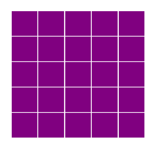
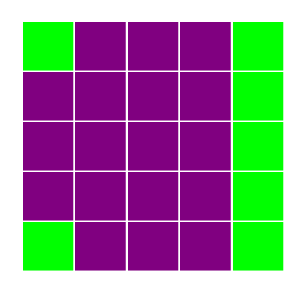
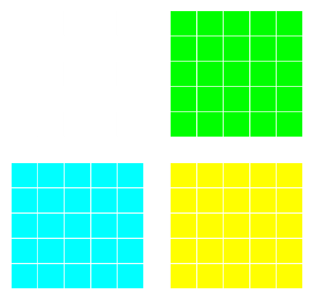
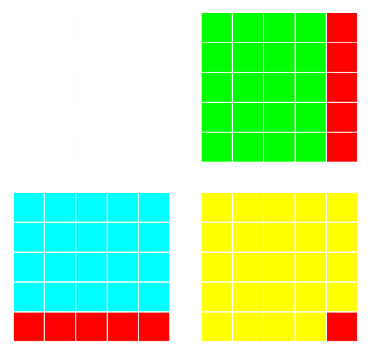

<a href="https://github.com/ipython-books/cookbook-2nd"></a> *This is one of the 100+ free recipes of the [IPython Cookbook, Second Edition](https://github.com/ipython-books/cookbook-2nd), by [Cyrille Rossant](http://cyrille.rossant.net), a guide to numerical computing and data science in the Jupyter Notebook. The ebook and printed book are available for purchase at [Packt Publishing](https://www.packtpub.com/big-data-and-business-intelligence/ipython-interactive-computing-and-visualization-cookbook-second-e).*

▶ *[Text on GitHub](https://github.com/ipython-books/cookbook-2nd) with a [CC-BY-NC-ND license](https://creativecommons.org/licenses/by-nc-nd/3.0/us/legalcode)*  
▶ *[Code on GitHub](https://github.com/ipython-books/cookbook-2nd-code) with a [MIT license](https://opensource.org/licenses/MIT)*

[*Chapter 3 : Mastering the Jupyter Notebook*](./)

# 3.1. Teaching programming in the Notebook with IPython blocks

The Jupyter Notebook is not only a tool for scientific research and data analysis but also a great tool for teaching. In this recipe, we show a simple and fun Python library for teaching programming notions: **IPython Blocks** (available at http://ipythonblocks.org). This library allows you or your students to create grids of colorful blocks. You can change the color and size of individual blocks, and you can even animate your grids. There are many basic technical notions you can illustrate with this tool. The visual aspect of this tool makes the learning process more effective and engaging.

In this recipe, we will notably perform the following tasks:

* Illustrate matrix multiplication with an animation
* Display an image as a block grid

## Getting ready

To install IPython Blocks, type `pip install ipythonblocks` in a terminal.

## How to do it...

1. First, we import some modules as follows:

```python
import time
from IPython.display import clear_output
from ipythonblocks import BlockGrid, colors
```

2. Now, we create a block grid with five columns and five rows, and we fill each block in purple:

```python
grid = BlockGrid(width=5, height=5,
                 fill=colors['Purple'])
grid.show()
```



3. We can access individual blocks with 2D indexing. This illustrates the indexing syntax in Python. We can also access an entire row or line with a `:` (colon). Each block is represented by an RGB color. The library comes with a handy dictionary of colors, assigning RGB tuples to standard color names as follows:

```python
grid[0, 0] = colors['Lime']
grid[-1, 0] = colors['Lime']
grid[:, -1] = colors['Lime']
grid.show()
```



4. Now, we are going to illustrate matrix multiplication. We will represent two `(n, n)` matrices, `A` (in cyan) and `B` (lime) aligned with `C = A B` (yellow). To do this, we use a small trick of creating a big white grid of size `(2n+1, 2n+1)`. The matrices `A`, `B`, and `C` are just views on parts of the grid.

```python
n = 5
grid = BlockGrid(width=2 * n + 1,
                 height=2 * n + 1,
                 fill=colors['White'])
A = grid[n + 1:, :n]
B = grid[:n, n + 1:]
C = grid[n + 1:, n + 1:]
A[:, :] = colors['Cyan']
B[:, :] = colors['Lime']
C[:, :] = colors['Yellow']
grid.show()
```



5. Let's turn to matrix multiplication itself. We perform a loop over all rows and columns, and we highlight the corresponding rows and columns in A and B that are multiplied together during the matrix product. We combine IPython's `clear_output()` method with `grid.show()` and `time.sleep()` (pause) to implement the animation as follows:

```python
for i in range(n):
    for j in range(n):
        # We reset the matrix colors.
        A[:, :] = colors['Cyan']
        B[:, :] = colors['Lime']
        C[:, :] = colors['Yellow']
        # We highlight the adequate rows
        # and columns in red.
        A[i, :] = colors['Red']
        B[:, j] = colors['Red']
        C[i, j] = colors['Red']
        # We animate the grid in the loop.
        clear_output()
        grid.show()
        time.sleep(.25)
```



6. Finally, we will display an image with IPython Blocks. We download and import a PNG image with `matplotlib` and we retrieve the data as follows:

```python
# We downsample the image by a factor of 4 for
# performance reasons.
img = plt.imread('https://github.com/ipython-books/'
                 'cookbook-2nd-data/blob/master/'
                 'beach.png?raw=true')[::4, ::4, :]
```

```python
rgb = [img[..., i].ravel() for i in range(3)]
```

7. Now, we create a `BlockGrid` instance with the appropriate number of rows and columns, and we set each block's color to the corresponding pixel's color in the image (multiplying by 255 to convert from a floating-point number in `[0, 1]` into an 8-bit integer). We use a small block size, and we remove the lines between the blocks as follows:

```python
height, width = img.shape[:2]
grid = BlockGrid(width=width, height=height,
                 block_size=2, lines_on=False)
for block, r, g, b in zip(grid, *rgb):
    block.rgb = (r * 255, g * 255, b * 255)
grid.show()
```


