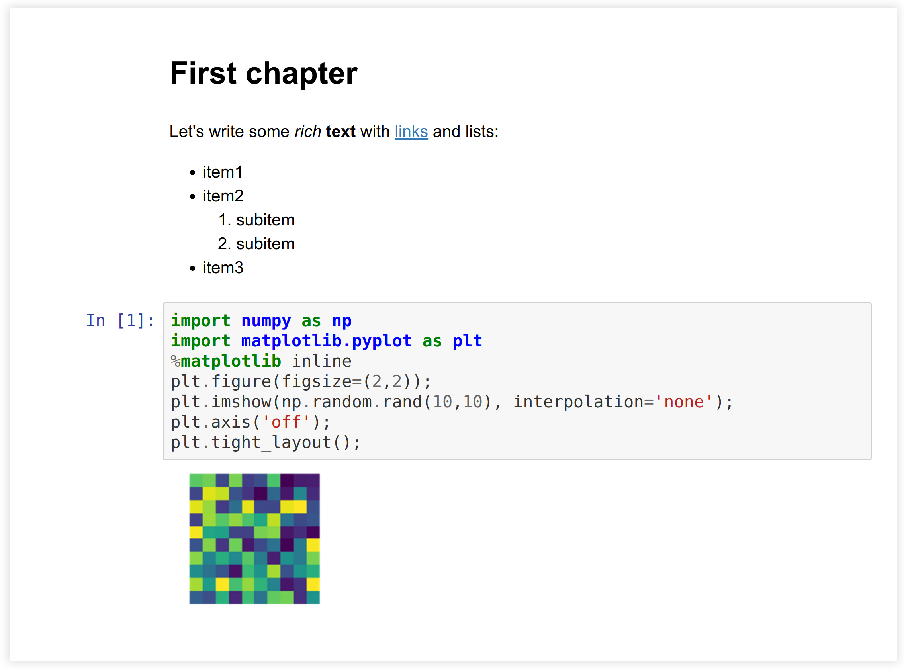
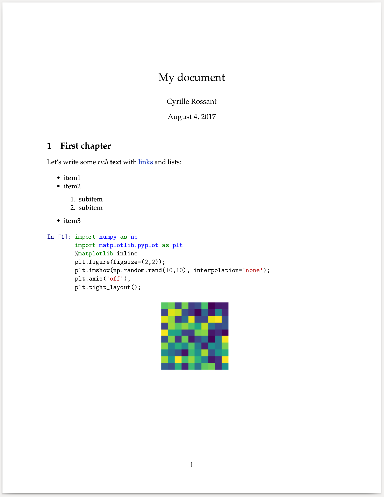

<a href="https://github.com/ipython-books/cookbook-2nd"></a> *This is one of the 100+ free recipes of the [IPython Cookbook, Second Edition](https://github.com/ipython-books/cookbook-2nd), by [Cyrille Rossant](http://cyrille.rossant.net), a guide to numerical computing and data science in the Jupyter Notebook. The ebook and printed book are available for purchase at [Packt Publishing](https://www.packtpub.com/big-data-and-business-intelligence/ipython-interactive-computing-and-visualization-cookbook-second-e).*

▶ *[Text on GitHub](https://github.com/ipython-books/cookbook-2nd) with a [CC-BY-NC-ND license](https://creativecommons.org/licenses/by-nc-nd/3.0/us/legalcode)*  
▶ *[Code on GitHub](https://github.com/ipython-books/cookbook-2nd-code) with a [MIT license](https://opensource.org/licenses/MIT)*

[*Chapter 3 : Mastering the Jupyter Notebook*](./)

# 3.2. Converting a Jupyter notebook to other formats with nbconvert

A Jupyter notebook is saved in a JSON text file. This file contains the entire contents of the notebook: text, code, and outputs. The matplotlib figures are encoded as base64 strings within the notebooks, resulting in standalone, but sometimes big, notebook files.

> JSON is a human-readable, text-based, open standard format that can represent structured data. Although derived from JavaScript, it is language independent. Its syntax bears some resemblance with Python dictionaries. JSON can be parsed in many languages including JavaScript and Python (using the `json` module in Python's standard library).

**nbconvert** (https://nbconvert.readthedocs.io/en/stable/) is a tool that can convert notebooks to other formats: raw text, Markdown, HTML, LaTeX/PDF, and even slides with the reveal.js library. You will find more information about the different supported formats on the nbconvert documentation.

One typically uses the **nbformat** (https://nbformat.readthedocs.io/en/latest/) library to manipulate a notebook. However, in this recipe, we will see how to manipulate the contents of a notebook (which is just a plain text JSON file) directly with Python, and how to convert it to other formats with nbconvert.

## Getting ready

You need to install pandoc, available at http://pandoc.org. This tool is used to convert markup files to various formats. On Ubuntu, type `sudo apt-get install pandoc` in a terminal.

To convert a notebook to PDF, you need a LaTeX distribution, which you can download and install at http://latex-project.org/ftp.html.

## How to do it...

1. Let's download and open the test notebook. A notebook is just a plain text file (JSON):

```python
import io
import requests
```

```python
url = ('https://github.com/ipython-books/'
       'cookbook-2nd-data/blob/master/'
       'test.ipynb?raw=true')
```

```python
contents = requests.get(url).text
print(len(contents))
```

```{output:stdout}
3857
```

2. Here is an excerpt of the `test.ipynb` file:

```python
print(contents[:345] + '...' + contents[-33:])
```

```{output:stdout}
{
 "cells": [
  {
   "cell_type": "markdown",
   "metadata": {},
   "source": [
    "# First chapter"
   ]
  },
  {
   "cell_type": "markdown",
   "metadata": {
    "my_field": [
     "value1",
     "2405"
    ]
   },
   "source": [
    "Let's write some *rich* **text** with
        [links](http://www.ipython.org) and lists:\n",
    "\n",
    "* item1...rmat": 4,
 "nbformat_minor": 4
}
```

3. Now that we have loaded the notebook in a string, let's parse it with the `json` module as follows:

```python
import json
nb = json.loads(contents)
```

4. Let's have a look at the keys in the notebook dictionary:

```python
print(nb.keys())
print('nbformat %d.%d' % (nb['nbformat'],
                          nb['nbformat_minor']))
```

```{output:stdout}
dict_keys(['cells', 'metadata',
           'nbformat', 'nbformat_minor'])
nbformat 4.4
```

5. Each cell has a type, optional metadata, some contents (text or code), possibly one or several outputs, and other information. Let's look at a Markdown cell and a code cell:

```python
nb['cells'][1]
```

```{output:result}
{'cell_type': 'markdown',
 'metadata': {'my_field': ['value1', '2405']},
 'source': ["Let's write some *rich* **text** with
        [links](http://www.ipython.org) and lists:\n",
  '\n',
  '* item1\n',
  '* item2\n',
  '    1. subitem\n',
  '    2. subitem\n',
  '* item3']}
```

```python
nb['cells'][2]
```

```{output:result}
{'cell_type': 'code',
 'execution_count': 1,
 'metadata': {},
 'outputs': [{'data': {'image/png': 'iVBOR...QmCC\n',
    'text/plain': ['<matplotlib Figure at ...>']},
   'metadata': {},
   'output_type': 'display_data'}],
 'source': ['import numpy as np\n',
  'import matplotlib.pyplot as plt\n',
  '%matplotlib inline\n',
  'plt.figure(figsize=(2,2));\n',
  "plt.imshow(np.random.rand(10,10),
              interpolation='none');\n",
  "plt.axis('off');\n",
  'plt.tight_layout();']}
```

6. Once parsed, the notebook is represented as a Python dictionary. Manipulating it is therefore quite convenient in Python. Here, we count the number of Markdown and code cells as follows:

```python
cells = nb['cells']
nm = len([cell for cell in cells
          if cell['cell_type'] == 'markdown'])
nc = len([cell for cell in cells
          if cell['cell_type'] == 'code'])
print((f"There are {nm} Markdown cells and "
       f"{nc} code cells."))
```

```{output:stdout}
There are 2 Markdown cells and 1 code cells.
```

7. Let's have a closer look at the image output of the cell with the matplotlib figure:

```python
cells[2]['outputs'][0]['data']
```

```{output:result}
{'image/png': 'iVBOR...QmCC\n',
 'text/plain': ['<matplotlib.figure.Figure at ...>']}
```

In general, there can be zero, one, or multiple outputs. Additionally, each output can have multiple representations. Here, the matplotlib figure has a PNG representation (the base64-encoded image) and a text representation (the internal representation of the figure).
8. Now, we convert our text notebook to HTML using nbconvert:

```python
# We write the notebook to a file on disk.
with open('test.ipynb', 'w') as f:
    f.write(contents)
```

```python
!jupyter nbconvert --to html test.ipynb
```

```{output:stdout}
[NbConvertApp] Converting notebook test.ipynb to html
[NbConvertApp] Writing 253784 bytes to test.html
```

9. Let's display this document in an `<iframe>` (a small window showing an external HTML document within the notebook):

```python
from IPython.display import IFrame
IFrame('test.html', 600, 200)
```



10. We can also convert the notebook to LaTeX and PDF. In order to specify the title and author of the document, we need to extend the default LaTeX template. First, we create a file called `temp.tplx` that extends the default `article.tplx` template provided by nbconvert. We specify the contents of the author and title blocks as follows:

```python
%%writefile temp.tplx
((*- extends 'article.tplx' -*))

((* block author *))
\author{Cyrille Rossant}
((* endblock author *))

((* block title *))
\title{My document}
((* endblock title *))
```

```{output:stdout}
Writing temp.tplx
```

11. Then, we can run nbconvert by specifying our custom template as follows:

```python
%%bash
jupyter nbconvert --to pdf --template temp test.ipynb
```

```{output:stderr}
[NbConvertApp] Converting notebook test.ipynb to pdf
[NbConvertApp] Support files will be in test_files/
[NbConvertApp] Making directory test_files
[NbConvertApp] Writing 16695 bytes to notebook.tex
[NbConvertApp] Building PDF
[NbConvertApp] Running xelatex 3 times:
    ['xelatex', 'notebook.tex']
[NbConvertApp] Running bibtex 1 time:
    ['bibtex', 'notebook']
[NbConvertApp] PDF successfully created
[NbConvertApp] Writing 16147 bytes to test.pdf
```

We used nbconvert to convert the notebook to LaTeX, and pdflatex (coming with our LaTeX distribution) to compile the LaTeX document to PDF. The following screenshot shows the PDF version of the notebook:



## How it works...

As we have seen in this recipe, an `.ipynb` file contains a structured representation of the notebook. This JSON file can be easily parsed and manipulated in Python and other languages. However, it is better practice to use the **nbformat** package to manipulate a notebook. The internal JSON format may change, whereas the nbformat API is not expected to change.

nbconvert is a tool for converting a notebook to another format. The conversion can be customized in several ways. Here, we extended an existing template using jinja2, a templating package (see http://jinja.pocoo.org/docs/).

## There's more...

There is a free online service, **nbviewer**, that lets us render Jupyter notebooks in HTML dynamically in the cloud. The idea is that we provide to nbviewer a URL to a raw notebook (in JSON), and we get a rendered HTML output. The main page of nbviewer (http://nbviewer.jupyter.org/) contains a few examples. This service is maintained by the Jupyter developers and is hosted on Rackspace (https://www.rackspace.com).

GitHub automatically renders Jupyter notebooks stored in repositories.

**binder**, available at https://mybinder.org, allows one to turn a GitHub repository into a collection of interactive notebooks in the cloud. The service is free and the code is open source, so that anyone can provide their own binder service.

Here are some more references:

* Documentation of nbconvert, at https://nbconvert.readthedocs.io/en/stable/
* RISE, create interactive slideshows out of Jupyter notebooks, at https://damianavila.github.io/RISE/
