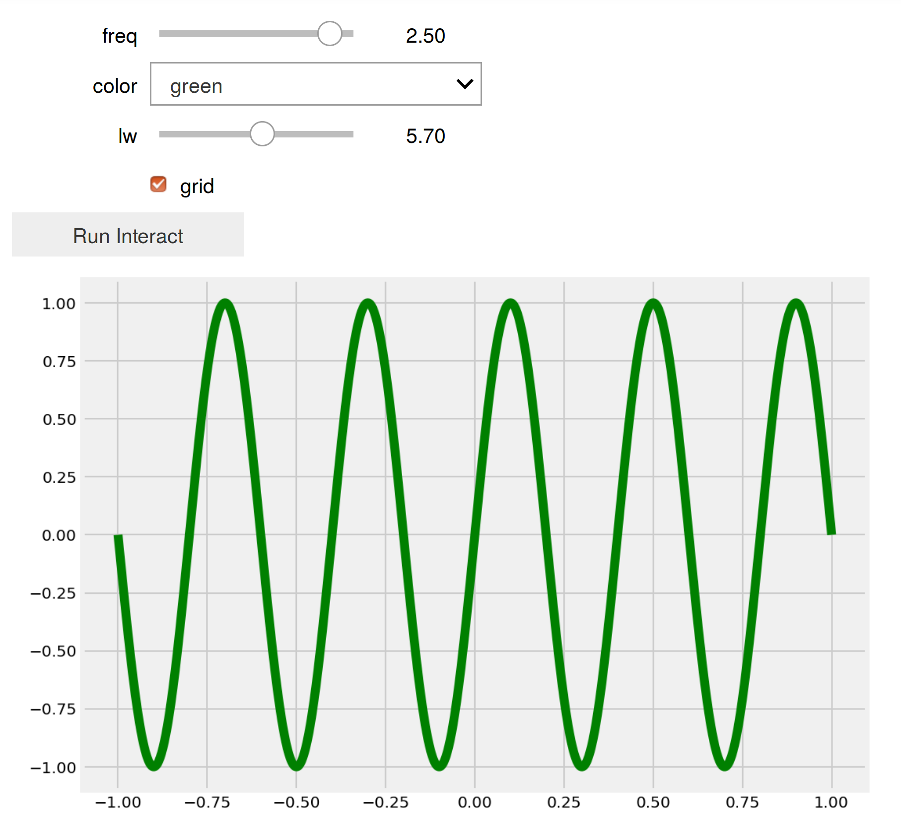
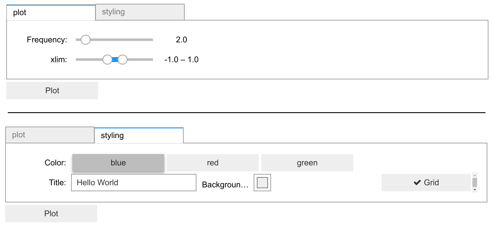

<a href="https://github.com/ipython-books/cookbook-2nd"></a> *This is one of the 100+ free recipes of the [IPython Cookbook, Second Edition](https://github.com/ipython-books/cookbook-2nd), by [Cyrille Rossant](http://cyrille.rossant.net), a guide to numerical computing and data science in the Jupyter Notebook. The ebook and printed book are available for purchase at [Packt Publishing](https://www.packtpub.com/big-data-and-business-intelligence/ipython-interactive-computing-and-visualization-cookbook-second-e).*

▶ *[Text on GitHub](https://github.com/ipython-books/cookbook-2nd) with a [CC-BY-NC-ND license](https://creativecommons.org/licenses/by-nc-nd/3.0/us/legalcode)*  
▶ *[Code on GitHub](https://github.com/ipython-books/cookbook-2nd-code) with a [MIT license](https://opensource.org/licenses/MIT)*

[*Chapter 3 : Mastering the Jupyter Notebook*](./)

# 3.3. Mastering widgets in the Jupyter Notebook

The **ipywidgets** package provides many common user interface controls for exploring code and data interactively. These controls can be assembled and customized to create complex graphical user interfaces. In this recipe, we introduce the various ways we can create user interfaces with ipywidgets.

## Getting ready

The ipywidgets package should be installed by default in Anaconda, but you can also install it manually with `conda install ipywidgets`.

Alternatively, you can install ipywidgets with `pip install ipywidgets`, but then you also need to type the following command in order to enable the extension in the Jupyter Notebook:

```bash
jupyter nbextension enable --py --sys-prefix widgetsnbextension
```

## How to do it...

1. Let's import the packages:

```python
import ipywidgets as widgets
from ipywidgets import HBox, VBox
import numpy as np
import matplotlib.pyplot as plt
from IPython.display import display
%matplotlib inline
```

2. The `@interact` decorator shows a widget for controlling the arguments of a function. Here, the function `f()` accepts an integer as an argument. By default, the `@interact` decorator displays a slider to control the value passed to the function:

```python
@widgets.interact
def f(x=5):
    print(x)
```


The function `f()` is called whenever the slider value changes.

3. We can customize the slider parameters. Here, we specify a minimum and maximum integer range for the slider:

```python
@widgets.interact(x=(0, 5))
def f(x=5):
    print(x)
```


4. There is also an `@interact_manual` decorator which provides a button to call the function manually. This is useful with long-lasting computations that should not run every time a widget value changes. Here, we create a simple user interface for controlling four parameters of a function that displays a plot. There are two floating-point sliders, a dropdown menu for choosing a value among a few predefined options, and a checkbox for boolean values:

```python
@widgets.interact_manual(
    color=['blue', 'red', 'green'], lw=(1., 10.))
def plot(freq=1., color='blue', lw=2, grid=True):
    t = np.linspace(-1., +1., 1000)
    fig, ax = plt.subplots(1, 1, figsize=(8, 6))
    ax.plot(t, np.sin(2 * np.pi * freq * t),
            lw=lw, color=color)
    ax.grid(grid)
```



5. In addition to the `@interact` and `@interact_manual` decorators, ipywidgets provides a simple API to create individual widgets. Here, we create a floating-point slider:

```python
freq_slider = widgets.FloatSlider(
    value=2.,
    min=1.,
    max=10.0,
    step=0.1,
    description='Frequency:',
    readout_format='.1f',
)
freq_slider
```


6. Here is an example of slider for selecting pairs of numbers, like intervals and ranges:

```python
range_slider = widgets.FloatRangeSlider(
    value=[-1., +1.],
    min=-5., max=+5., step=0.1,
    description='xlim:',
    readout_format='.1f',
)
range_slider
```


7. The toggle button can control a boolean value:

```python
grid_button = widgets.ToggleButton(
    value=False,
    description='Grid',
    icon='check'
)
grid_button
```


8. Dropdown menus and toggle buttons are useful when selecting a value among a predefined set of options:

```python
color_buttons = widgets.ToggleButtons(
    options=['blue', 'red', 'green'],
    description='Color:',
)
color_buttons
```


9. The text widget allows the user to write a string:

```python
title_textbox = widgets.Text(
    value='Hello World',
    description='Title:',
)
title_textbox
```


10. We can let the user choose a color using the built-in system color picker:

```python
color_picker = widgets.ColorPicker(
    concise=True,
    description='Background color:',
    value='#efefef',
)
color_picker
```


11. We can also simply create a button:

```python
button = widgets.Button(
    description='Plot',
)
button
```


12. Now, we will see how to combine these widgets into a complex graphical user interface, and how to react to user interactions with these controls. We create a function that will display a plot as defined by the created controls. We can access the control value with the `value` property of the widgets:

```python
def plot2(b=None):
    xlim = range_slider.value
    freq = freq_slider.value
    grid = grid_button.value
    color = color_buttons.value
    title = title_textbox.value
    bgcolor = color_picker.value

    t = np.linspace(xlim[0], xlim[1], 1000)
    f, ax = plt.subplots(1, 1, figsize=(8, 6))
    ax.plot(t, np.sin(2 * np.pi * freq * t),
            color=color)
    ax.grid(grid)
```

13. The `on_click` decorator of a button widget lets us react to click events. Here, we simply declare that the plotting function should be called when the button is pressed:

```python
@button.on_click
def plot_on_click(b):
    plot2()
```

14. To display all of our widgets in a unified graphical interface, we define a layout with two tabs. The first tab shows widgets related to the plot itself, whereas the second tab shows widgets related to the styling of the plot. Each tab contains a vertical stack of widgets defined with the `VBox` class:

```python
tab1 = VBox(children=[freq_slider,
                      range_slider,
                      ])
tab2 = VBox(children=[color_buttons,
                      HBox(children=[title_textbox,
                                     color_picker,
                                     grid_button]),
                                     ])
```

15. Finally, we create the `Tab` instance with our two tabs, we set the titles of the tabs, and we add the plot button below the tabs:

```python
tab = widgets.Tab(children=[tab1, tab2])
tab.set_title(0, 'plot')
tab.set_title(1, 'styling')
VBox(children=[tab, button])
```



## There's more...

The documentation of ipywidgets demonstrates many other features of the package. The styling of the widgets can be customized. New widgets can be created by writing Python and JavaScript code (see recipe *Creating custom Jupyter Notebook widgets in Python, HTML, and JavaScript*). Widgets can also remain at least partly functional in a static notebook export.

Here are a few references:

* ipywidgets user guide at https://ipywidgets.readthedocs.io/en/stable/user_guide.html
* Building a custom widget at https://ipywidgets.readthedocs.io/en/stable/examples/Widget%20Custom.html

## See also

* Creating custom Jupyter Notebook widgets in Python, HTML, and JavaScript
