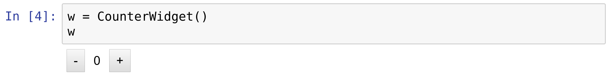
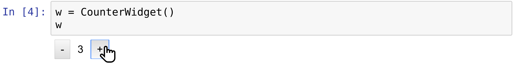
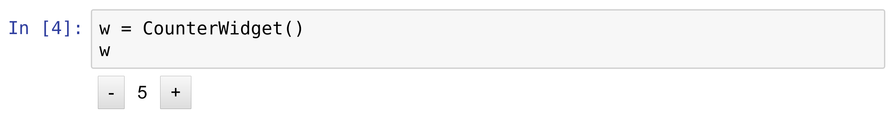

<a href="https://github.com/ipython-books/cookbook-2nd"></a> *This is one of the 100+ free recipes of the [IPython Cookbook, Second Edition](https://github.com/ipython-books/cookbook-2nd), by [Cyrille Rossant](http://cyrille.rossant.net), a guide to numerical computing and data science in the Jupyter Notebook. The ebook and printed book are available for purchase at [Packt Publishing](https://www.packtpub.com/big-data-and-business-intelligence/ipython-interactive-computing-and-visualization-cookbook-second-e).*

▶ *[Text on GitHub](https://github.com/ipython-books/cookbook-2nd) with a [CC-BY-NC-ND license](https://creativecommons.org/licenses/by-nc-nd/3.0/us/legalcode)*  
▶ *[Code on GitHub](https://github.com/ipython-books/cookbook-2nd-code) with a [MIT license](https://opensource.org/licenses/MIT)*

[*Chapter 3 : Mastering the Jupyter Notebook*](./)

# 3.4. Creating custom Jupyter Notebook widgets in Python, HTML, and JavaScript

The ipywidgets packages provides many built-in control widgets to interact with code and data in the Jupyter Notebook. In this recipe, we show how to build a custom interactive widget from scratch, using Python on the kernel side, and HTML/JavaScript on the client side (frontend). The widget just displays two buttons to increase and decrease a number. The number can be accessed and updated either from the kernel (Python code) or the client (browser).

## How to do it...

1. Let's import the packages:

```python
import ipywidgets as widgets
from traitlets import Unicode, Int, validate
```

2. We create a `CounterWidget` class deriving from `DOMWidget`:

```python
class CounterWidget(widgets.DOMWidget):
    _view_name = Unicode('CounterView').tag(sync=True)
    _view_module = Unicode('counter').tag(sync=True)
    value = Int(0).tag(sync=True)
```

This class represents the Python part of the widget. The `_view_name` and `_view_module` attributes refer to the name and module of the JavaScript part. We use the traitlets package to specify the type of the variables. The `value` attribute is the counter value, an integer initialized at 0. All of these attributes' values are synchronized between Python and JavaScript, hence the `sync=True` option.

3. We now turn to the JavaScript side of the widget. We can write the code directly in the notebook using the `%%javascript` cell magic. The widgets framework relies on several JavaScript libraries: jQuery (represented as the `$` variable), require.js (modules and dependencies), and Backbone.js (a model view controller framework):

```python
%%javascript
// We make sure the `counter` module is defined
// only once.
require.undef('counter');

// We define the `counter` module depending on the
// Jupyter widgets framework.
define('counter', ["@jupyter-widgets/base"],
       function(widgets) {

    // We create the CounterView frontend class,
    // deriving from DOMWidgetView.
    var CounterView = widgets.DOMWidgetView.extend({

        // This method creates the HTML widget.
        render: function() {
            // The value_changed() method should be
            // called when the model's value changes
            // on the kernel side.
            this.value_changed();
            this.model.on('change:value',
                          this.value_changed, this);

            var model = this.model;
            var that = this;

            // We create the plus and minus buttons.
            this.bm = $('<button/>')
            .text('-')
            .click(function() {
                // When the button is clicked,
                // the model's value is updated.
                var x = model.get('value');
                model.set('value', x - 1);
                that.touch();
            });

            this.bp = $('<button/>')
            .text('+')
            .click(function() {
                var x = model.get('value');
                model.set('value', x + 1);
                that.touch();
            });

            // This element displays the current
            // value of the counter.
            this.span = $('<span />')
            .text('0')
            .css({marginLeft: '10px',
                  marginRight: '10px'});

            // this.el represents the widget's DOM
            // element. We add the minus button,
            // the span element, and the plus button.
            $(this.el)
            .append(this.bm)
            .append(this.span)
            .append(this.bp);
        },

        value_changed: function() {
            // Update the displayed number when the
            // counter's value changes.
            var x = this.model.get('value');
            $($(this.el).children()[1]).text(x);
        },
    });

    return {
        CounterView : CounterView
    };
});
```

4. Let's display the widget:

```python
w = CounterWidget()
w
```



5. Pressing the buttons updates the value immediately.



6. The counter's value is automatically updated on the kernel side:

```python
print(w.value)
```

```{output:stdout}
4
```

7. Conversely, we can update the value from Python, and it is updated in the frontend:

```python
w.value = 5
```



## There's more...

Here are a few references:

* Custom widget tutorial at https://ipywidgets.readthedocs.io/en/stable/examples/Widget%20Custom.html
* Require.js library at http://requirejs.org/
* Backbone.js library at http://backbonejs.org/

## See also

* Mastering widgets in the Jupyter Notebook
