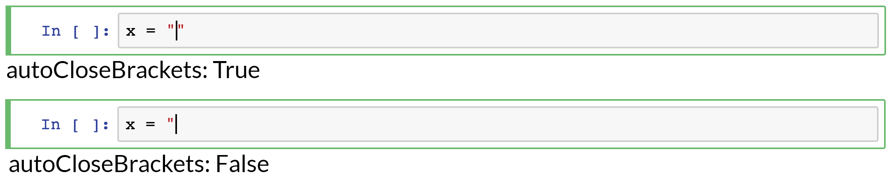

<a href="https://github.com/ipython-books/cookbook-2nd"></a> *This is one of the 100+ free recipes of the [IPython Cookbook, Second Edition](https://github.com/ipython-books/cookbook-2nd), by [Cyrille Rossant](http://cyrille.rossant.net), a guide to numerical computing and data science in the Jupyter Notebook. The ebook and printed book are available for purchase at [Packt Publishing](https://www.packtpub.com/big-data-and-business-intelligence/ipython-interactive-computing-and-visualization-cookbook-second-e).*

▶ *[Text on GitHub](https://github.com/ipython-books/cookbook-2nd) with a [CC-BY-NC-ND license](https://creativecommons.org/licenses/by-nc-nd/3.0/us/legalcode)*  
▶ *[Code on GitHub](https://github.com/ipython-books/cookbook-2nd-code) with a [MIT license](https://opensource.org/licenses/MIT)*

[*Chapter 3 : Mastering the Jupyter Notebook*](./)

# 3.5. Configuring the Jupyter Notebook

[The recipe is available in the book, to be purchased on Packt.](https://www.packtpub.com/big-data-and-business-intelligence/ipython-interactive-computing-and-visualization-cookbook-second-e)

<!-- REMOVE AS PER PACKT AGREEMENT

Many aspects of the Jupyter Notebook can be configured. We covered the configuration of the IPython kernel in Chapter 1, recipe *Mastering IPython's configuration system*. In this recipe, we show how to configure the Jupyter application and the Jupyter Notebook frontend.

## How to do it...

1. Let's check whether the Jupyter Notebook configuration file already exists:

```python
%ls ~/.jupyter/jupyter_notebook_config.py
```

```{output:stdout}
~/.jupyter/jupyter_notebook_config.py
```

If it does not, type `!jupyter notebook --generate-config -y` in the notebook. If the file already exists, this command will delete its contents and replace it by the default file.

> A Jupyter configuration file may exist in Python or in JSON (same location and filename, but different file extension). JSON files have a higher priority. Contrary to Python files, JSON files may be edited programmatically.

2. We can inspect the contents of the file with the following command:

```python
%cat ~/.jupyter/jupyter_notebook_config.py
```

```{output:stdout}
# Configuration file for jupyter-notebook.

#-------------------------------------------------------
# Application(SingletonConfigurable) configuration
#-------------------------------------------------------

## This is an application.

## The date format used by logging formatters
#c.Application.log_datefmt = '%Y-%m-%d %H:%M:%S'

[...]

#-------------------------------------------------------
# JupyterApp(Application) configuration
#-------------------------------------------------------

## Base class for Jupyter applications

## Answer yes to any prompts.
#c.JupyterApp.answer_yes = False

## Full path of a config file.
#c.JupyterApp.config_file = ''

...
```

For example, to change the default name of a new notebook, we can add the following line to this file:

```
c.ContentsManager.untitled_notebook = 'MyNotebook'
```

3. We now turn to the configuration of the Jupyter Notebook frontend. The configuration files are in the following folder:

```python
%ls ~/.jupyter/nbconfig/
```

```{output:stdout}
notebook.json  tree.json
```

4. Let's inspect the contents of the notebook configuration file (in JSON):

```python
%cat ~/.jupyter/nbconfig/notebook.json
```

```{output:stdout}
{
  "Cell": {
    "cm_config": {
      "lineNumbers": false
    }
  },
  "Notebook": {
    "Header": false,
    "Toolbar": false
  }
}
```

5. There are several ways to configure the Notebook frontend. We can edit directly this JSON file and reload the notebook. We can also do it in the client using JavaScript. For example, here is how we can disable the auto-closing brackets option in code cells:

```python
%%javascript
var cell = Jupyter.notebook.get_selected_cell();
var config = cell.config;
var patch = {
      CodeCell:{
        cm_config: {autoCloseBrackets: false}
      }
    }
config.update(patch)
```

If we reload the notebook, this option will be permanently turnt off.



6. In fact, this command automatically updates the JSON file:

```python
%cat ~/.jupyter/nbconfig/notebook.json
```

```{output:stdout}
{
  "Cell": {
    "cm_config": {
      "lineNumbers": false
    }
  },
  "Notebook": {
    "Header": false,
    "Toolbar": false
  },
  "CodeCell": {
    "cm_config": {
      "autoCloseBrackets": false
    }
  }
}
```

7. We can also get and change the frontend options from Python:

```python
from notebook.services.config import ConfigManager
c = ConfigManager()
c.get('notebook').get('CodeCell')
```

```{output:result}
{'cm_config': {'autoCloseBrackets': False}}
```

```python
c.update('notebook', {"CodeCell":
         {"cm_config": {"autoCloseBrackets": True}}})
```

```{output:result}
{'Cell': {'cm_config': {'lineNumbers': False}},
 'CodeCell': {'cm_config': {'autoCloseBrackets': True}},
 'Notebook': {'Header': False, 'Toolbar': False}}
```

```python
%cat ~/.jupyter/nbconfig/notebook.json
```

```{output:stdout}
{
  "Cell": {
    "cm_config": {
      "lineNumbers": false
    }
  },
  "Notebook": {
    "Header": false,
    "Toolbar": false
  },
  "CodeCell": {
    "cm_config": {
      "autoCloseBrackets": true
    }
  }
}
```

# There's more...

The code cell editor used in the notebook is handled by the CodeMirror JavaScript library. All options are detailed in the CodeMirror documentation.

Here are a few references:

* Notebook configuration at http://jupyter-notebook.readthedocs.io/en/stable/config.html
* Notebook frontend configuration at https://jupyter-notebook.readthedocs.io/en/stable/frontend_config.html
* CodeMirror options at https://codemirror.net/doc/manual.html#option_indentUnit

# See also

* Chapter 1, Mastering IPython's configuration system

-->
