 *This is one of the 100+ free recipes of the [IPython Cookbook, Second Edition](https://github.com/ipython-books/cookbook-2nd), by [Cyrille Rossant](http://cyrille.rossant.net), a guide to numerical computing and data science in the Jupyter Notebook. The ebook and printed book are available for purchase at [Packt Publishing](https://www.packtpub.com/big-data-and-business-intelligence/ipython-interactive-computing-and-visualization-cookbook-second-e).*

▶ *[Text on GitHub](https://github.com/ipython-books/cookbook-2nd) with a [CC-BY-NC-ND license](https://creativecommons.org/licenses/by-nc-nd/3.0/us/legalcode)*  
▶ *[Code on GitHub](https://github.com/ipython-books/cookbook-2nd-code) with a [MIT license](https://opensource.org/licenses/MIT)*

[*Chapter 3 : Mastering the Jupyter Notebook*](./)

# 3.6. Introducing JupyterLab

**JupyterLab** is the next generation of the Jupyter Notebook. It aims at fixing many usability issues of the Notebook, and it greatly expands its scope. JupyterLab offers a general framework for interactive computing and data science in the browser, using Python, Julia, R, or one of many other languages.

In addition to providing an improved interface to existing notebooks, JupyterLab also brings within the same interface a file browser, consoles, terminals, text editors, Markdown editors, CSV editors, JSON editors, interactive maps, widgets, and so on. The architecture is completely extensible and open to developers. In a word, JupyterLab is a web-based, hackable IDE for data science and interactive computing.

JupyterLab uses the exact same Notebook server and file format as the classic Jupyter Notebook, so that it is fully compatible with the existing notebooks and kernels. The Classic Notebook and Jupyterlab can run side to side on the same computer. One can easily switch between the two interfaces.

> At the time of this writing, JupyterLab is still in an early stage of development. However, it is already fairly usable. The interface may change until the production release. The developer API used to customize JupyterLab is still not stable. There is no user documentation yet.

## Getting ready

To install JupyterLab, type `conda install -c conda-forge jupyterlab` in a terminal.

To be able to render GeoJSON files in an interactive map, install the GeoJSON JupyterLab extension with: `jupyter labextension install @jupyterlab/geojson-extension`.

## How to do it...

1. We can launch JupyterLab by typing `jupyter lab` in a terminal. Then, we go to `http://localhost:8888/lab` in the web browser.
2. The dashboard shows, on the left, a list of files and subdirectories in the current working directory. On the right, the launcher lets us create notebooks, text files, or open a Jupyter console or a terminal. Available Jupyter kernels are automatically displayed (here, IPython, but also IR and IJulia).

3. On the left panel, we can also see the list of open tabs, the list of running sessions, or the list of available commands:

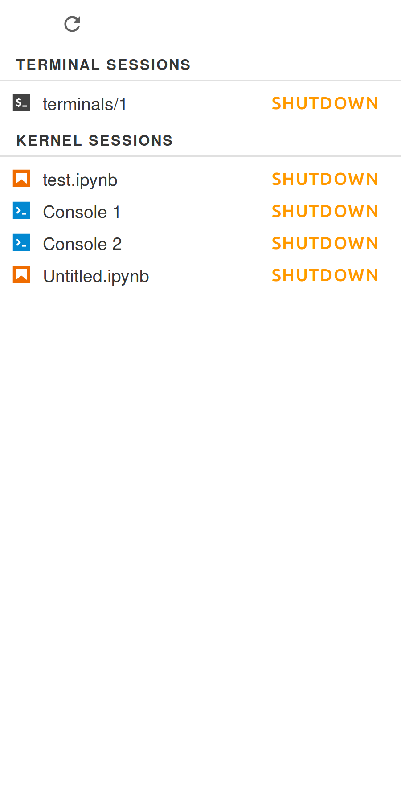

4. If we open a Jupyter notebook, we get an interface that closely resembles the classic Notebook interface:

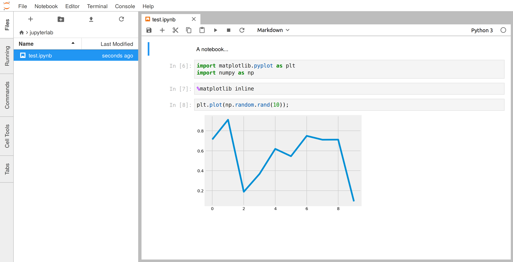

There are a few improvements compared to the classic Notebook. For example, we can drag and drop one or several cells:

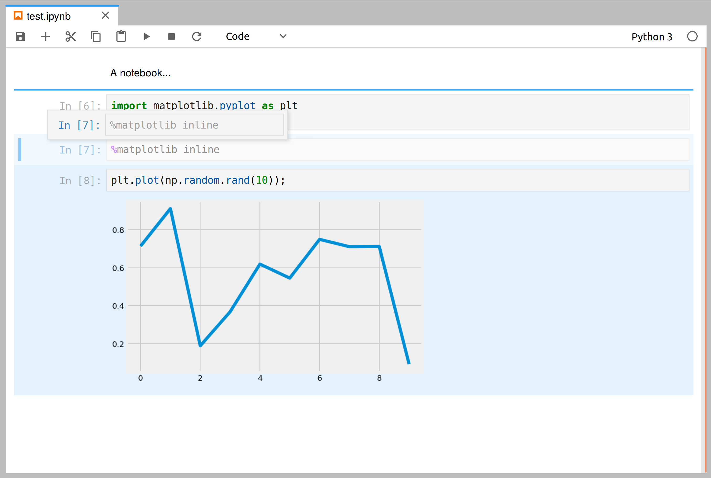

We can also collapse cells.

5. If we right-click in the notebook, a contextual menu appears:

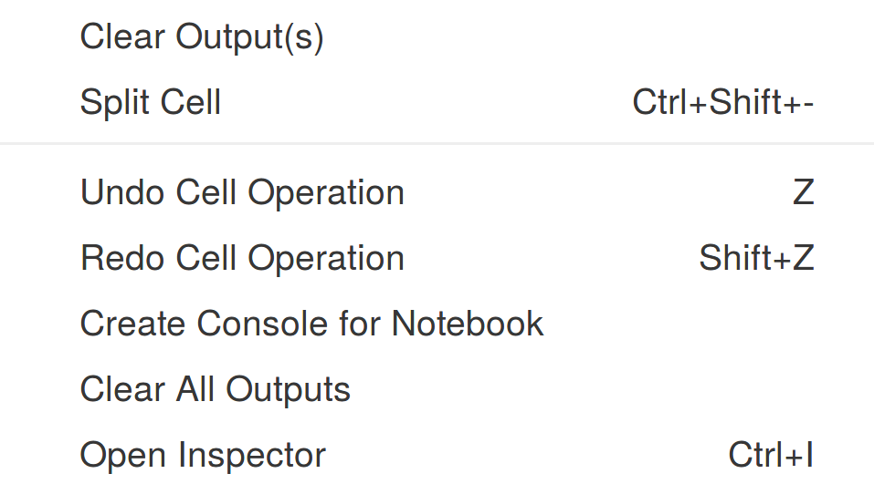

If we click on *Create Console for Notebook*, a new tab appears with a standard IPython console. We can drag and drop the tab anywhere in the screen, for example below the notebook panel:

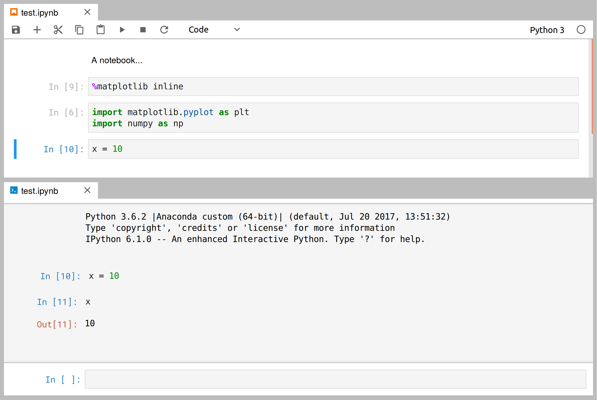

The IPython console is connected to the same kernel as the Notebook, so they share the same namespace. We can also open a new IPython console from the launcher, running in a separate kernel.

6. We can also open a system shell directly in the browser, using the term.js library:

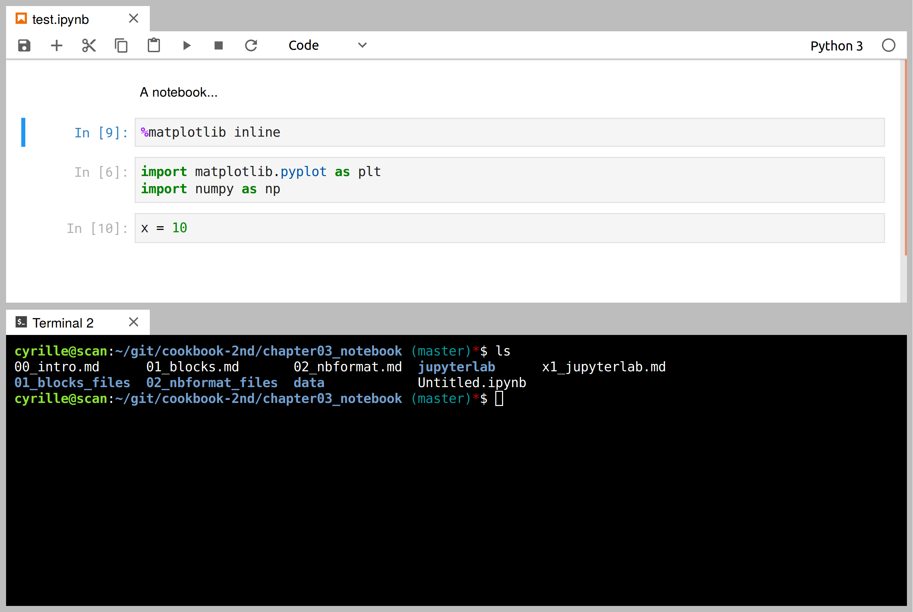

7. JupyterLab includes a text editor. We can create a new text file from the launcher, rename it by giving it the `.md` extension, and edit it:

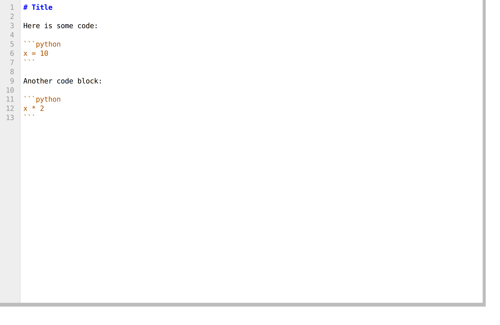

Let's right-click on the Markdown file. A contextual menu appears:

We can add a new panel that renders the Markdown file in real-time:

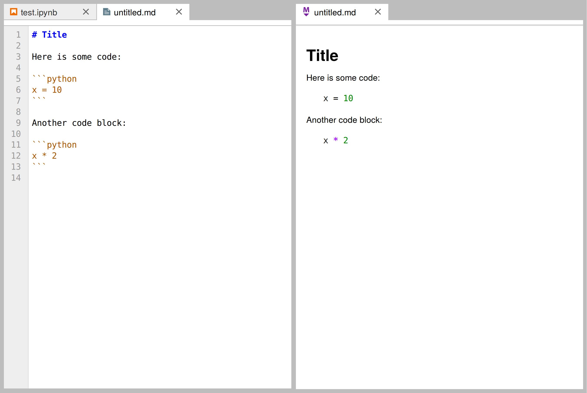

We can also attach an IPython console to our Markdown file. By clicking within a code block and pressing *Shift+Enter*, we send the code directly to the console:

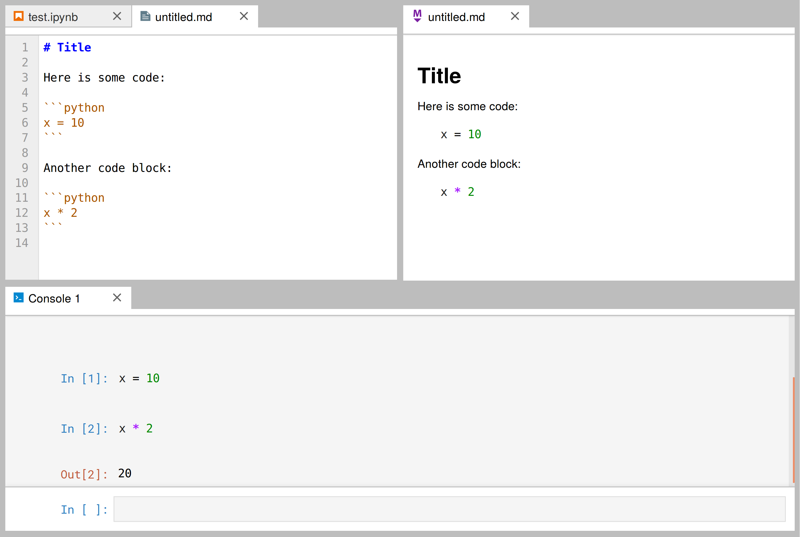

8. We can also create and open CSV files in JupyterLab:

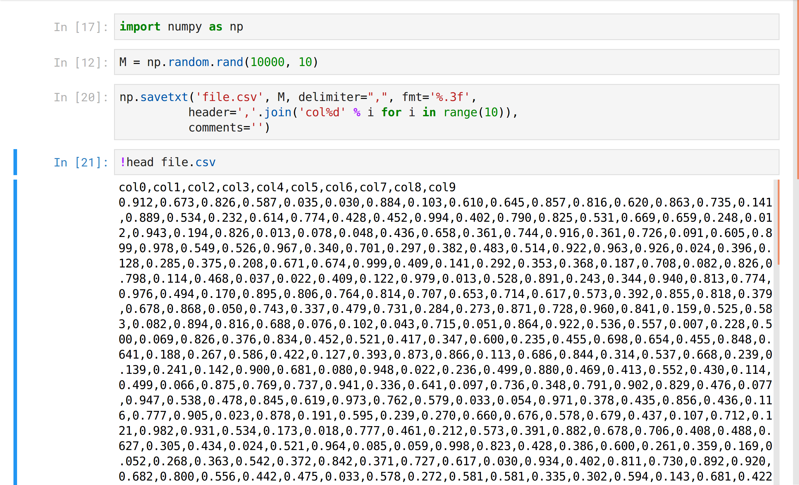

The CSV viewer is highly efficient. It can smoothly display huge tables with millions or even billions of values:

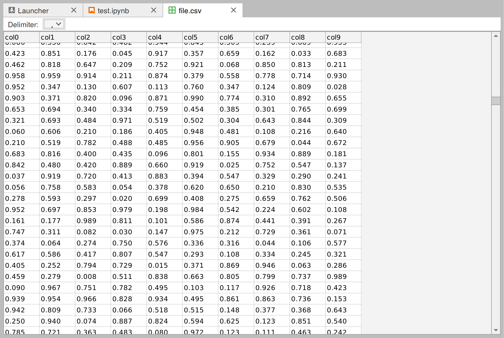

9. GeoJSON files (files that contain geographic information) can also be edited or viewed with the Leaflet mapping library:

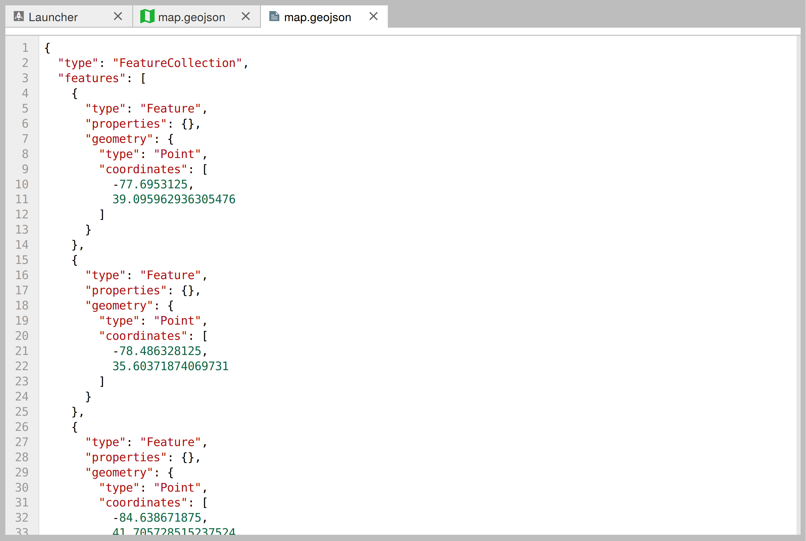
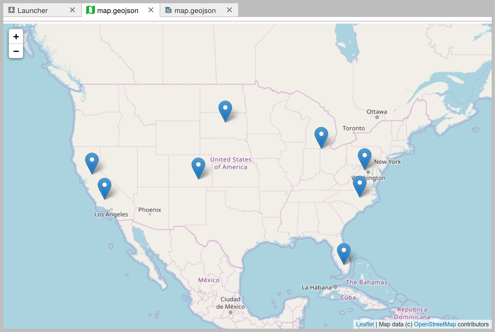

## There's more...

JupyterLab is fully extendable. In fact, the philosophy is that all existing features are implemented as plugins.

It is possible to work collaboratively on a notebook, like with Google Docs. This feature is still in active development at the time of this writing.

Here are a few references:

* JupyterLab GitHub project at https://github.com/jupyterlab/jupyterlab
* Jupyter renderers at https://github.com/jupyterlab/jupyter-renderers
* Talk at PyData 2017, available at https://channel9.msdn.com/Events/PyData/Seattle2017/BRK11
* Talk at PlotCON 2017, available at https://www.youtube.com/watch?v=p7Hr54VhOp0
* Talk at ESIP Tech, available at https://www.youtube.com/watch?v=K1AsGeak51A
* JupyterLab screencast at https://www.youtube.com/watch?v=sf8PuLcijuA
* Realtime collaboration and cloud storage for JupyterLab through Google Drive, at https://github.com/jupyterlab/jupyterlab-google-drive

## See also

* Introducing IPython and the Jupyter Notebook
