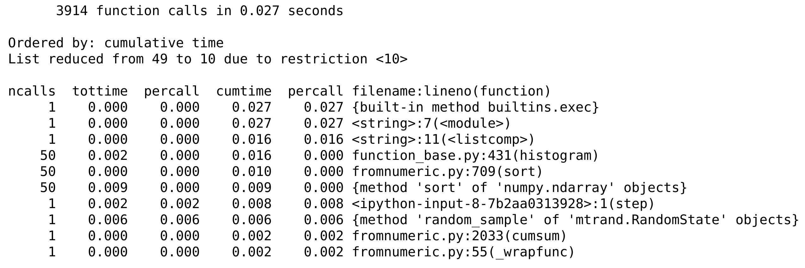

<a href="https://github.com/ipython-books/cookbook-2nd"></a> *This is one of the 100+ free recipes of the [IPython Cookbook, Second Edition](https://github.com/ipython-books/cookbook-2nd), by [Cyrille Rossant](http://cyrille.rossant.net), a guide to numerical computing and data science in the Jupyter Notebook. The ebook and printed book are available for purchase at [Packt Publishing](https://www.packtpub.com/big-data-and-business-intelligence/ipython-interactive-computing-and-visualization-cookbook-second-e).*

▶ *[Text on GitHub](https://github.com/ipython-books/cookbook-2nd) with a [CC-BY-NC-ND license](https://creativecommons.org/licenses/by-nc-nd/3.0/us/legalcode)*  
▶ *[Code on GitHub](https://github.com/ipython-books/cookbook-2nd-code) with a [MIT license](https://opensource.org/licenses/MIT)*

[*Chapter 4 : Profiling and Optimization*](./)

# 4.2. Profiling your code easily with cProfile and IPython

The `%timeit` magic command is often helpful, yet a bit limited when we need detailed information about what takes most of the execution time. This magic command is meant for **benchmarking** (comparing the execution times of different versions of a function) rather than **profiling** (getting a detailed report of the execution time, function by function).

Python includes a profiler named **cProfile** that breaks down the execution time into the contributions of all called functions. IPython provides convenient ways to leverage this tool in an interactive session.

## How to do it...

IPython offers the `%prun` line magic and the `%%prun` cell magic to easily profile one or multiple lines of code. The `%run` magic command also accepts a `-p` flag to run a Python script under the control of the profiler. These commands accept a lot of options as can be seen with `%prun?` and `%run?`.

In this example, we will profile a numerical simulation of random walks. We will cover these kinds of simulations in more detail in *Chapter 13, Stochastic Dynamical Systems*.

1. Let's import NumPy:

```python
import numpy as np
```

2. Let's create a function generating random +1 and -1 values in an array:

```python
def step(*shape):
    # Create a random n-vector with +1 or -1 values.
    return 2 * (np.random.random_sample(shape)<.5) - 1
```

3. Now, we write the simulation code in a cell starting with `%%prun` in order to profile the entire simulation. The various options allow us to save the report in a file and to sort the first 10 results by cumulative time. We will explain these options in more detail in the *How it works...* section.

```python
%%prun -s cumulative -q -l 10 -T prun0
# We profile the cell, sort the report by "cumulative
# time", limit it to 10 lines, and save it to a file
# named "prun0".

n = 10000
iterations = 50
x = np.cumsum(step(iterations, n), axis=0)
bins = np.arange(-30, 30, 1)
y = np.vstack([np.histogram(x[i,:], bins)[0]
               for i in range(iterations)])
```

```{output:stdout}
*** Profile printout saved to text file 'prun0'.
```

4. The profiling report has been saved in a text file named `prun0`. Let's display it (the following output is a stripped down version that fits on this page):

```python
print(open('prun0', 'r').read())
```



Here, we observe the time taken by the different functions involved, directly or indirectly, in our code.

## How it works...

Python's profiler creates a detailed report of the execution time of our code, function by function. Here, we can observe the number of calls of the functions `histogram()`, `cumsum()`, `step()`, `sort()`, and `rand()`, and the total time spent in those functions during the code's execution. Internal functions are also profiled. For each function, we get the total number of calls, the total and cumulative times, and their per-call counterparts (division by `ncalls`). The **total time** represents how long the interpreter stays in a given function, *excluding* the time spent in calls to subfunctions. The **cumulative time** is similar but includes the time spent in calls to subfunctions. The filename, function name, and line number are displayed in the last column.

The `%prun` and `%%prun` magic commands accept multiple optional options (type `%prun?` for more details). In the example, `-s` allows us to sort the report by a particular column, `-q` to suppress (quell) the pager output (which is useful when we want to integrate the output in a notebook), `-l` to limit the number of lines displayed or to filter the results by function name (which is useful when we are interested in a particular function), and `-T` to save the report in a text file. In addition, we can choose to save (dump) the binary report in a file with `-D`, or to return it in IPython with `-r`. This database-like object contains all information about the profiling and can be analyzed through Python's pstats module.

> Every profiler brings its own overhead that can bias the profiling results (**probe effect**). In other words, a profiled program may run significantly slower than a non-profiled program. That's a point to keep in mind.

### "Premature optimization is the root of all evil"

As Donald Knuth's well-known quote suggests, optimizing code prematurely is generally considered a bad practice. Code optimization should only be conducted when it's really needed, that is, when the code is really too slow in normal situations. Additionally, we should know exactly where we need to optimize your code; typically, the vast majority of the execution time comprises a relatively small part of the code. The only way to find out is by profiling your code; optimization should never be done without preliminary profiling.

> I was once dealing with some fairly complicated code that was slower than expected. I thought I had a pretty good idea of what was causing the problem and how I could resolve it. The solution would involve significant changes in the code. By profiling my code first, I discovered that my diagnosis was wrong; I had written somewhere `max(x)` instead of `np.max(x)` by mistake, where `x` was a huge vector. It was Python's built-in function that was called, instead of NumPy's heavily optimized routine for arrays. If I hadn't profiled my code, I would probably have missed this mistake forever. The program was working perfectly fine, only 150 times slower!

For more general advice on programming optimization, see https://en.wikipedia.org/wiki/Program_optimization.

## There's more...

Profiling code in IPython is particularly simple (especially in the Notebook), as we have seen in this recipe. However, it may be undesirable or difficult to execute the code that we need to profile from IPython (GUIs, for example). In this case, we can use `cProfile` directly. It is slightly less straightforward than with IPython.

1. First, we call the following command:

```bash
$ python -m cProfile -o profresults myscript.py
```

The file `profresults` will contain the dump of the profiling results of `myscript.py`.

2. Then, we execute the following code from Python or IPython to display the profiling results in a human-readable form:

```
import pstats
p = pstats.Stats('profresults')
p.strip_dirs().sort_stats("cumulative").print_stats()
```

Explore the documentation of the `cProfile` and `pstats` modules to discover all of the analyses that you can perform on the profiling reports.

There are a few GUI tools for exploring and visualizing the output of a profiling session. For example, **SnakeViz** allows you to view profile dumps in a GUI program.

Here are a few references:

* Documentation of cProfile and pstats, available at https://docs.python.org/3/library/profile.html
* SnakeViz, available at https://jiffyclub.github.io/snakeviz/
* Heat, magic command to profile and view Python code as a heat map, at https://github.com/csurfer/pyheatmagic
* Python profiling tools, available at http://blog.ionelmc.ro/2013/06/08/python-profiling-tools/
* accelerate.profiling at https://docs.anaconda.com/accelerate/profiling

## See also

* Profiling your code line-by-line with line_profiler
