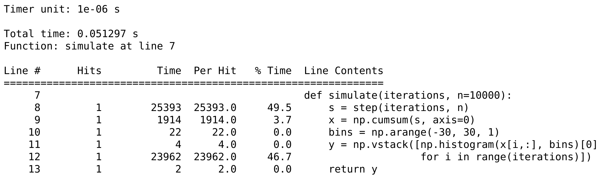

<a href="https://github.com/ipython-books/cookbook-2nd"></a> *This is one of the 100+ free recipes of the [IPython Cookbook, Second Edition](https://github.com/ipython-books/cookbook-2nd), by [Cyrille Rossant](http://cyrille.rossant.net), a guide to numerical computing and data science in the Jupyter Notebook. The ebook and printed book are available for purchase at [Packt Publishing](https://www.packtpub.com/big-data-and-business-intelligence/ipython-interactive-computing-and-visualization-cookbook-second-e).*

▶ *[Text on GitHub](https://github.com/ipython-books/cookbook-2nd) with a [CC-BY-NC-ND license](https://creativecommons.org/licenses/by-nc-nd/3.0/us/legalcode)*  
▶ *[Code on GitHub](https://github.com/ipython-books/cookbook-2nd-code) with a [MIT license](https://opensource.org/licenses/MIT)*

[*Chapter 4 : Profiling and Optimization*](./)

# 4.3. Profiling your code line-by-line with line_profiler

Python's native cProfile module and the corresponding `%prun` magic break down the execution time of code function by function. Sometimes, we may need an even more fine-grained analysis of code performance with a line-by-line report. Such reports can be easier to read than the reports of cProfile.

To profile code line-by-line, we need an external Python module named `line_profiler`. In this recipe, we will demonstrate how to use this module within IPython.

## Getting ready

To install `line_profiler`, type `conda install line_profiler` in a terminal.

### How do to it...

We will profile the same simulation code as in the previous recipe, line-by-line.

1. First, let's import NumPy and the `line_profiler` IPython extension module that comes with the package:

```python
import numpy as np
%load_ext line_profiler
```

2. This IPython extension module provides an `%lprun` magic command to profile a Python function line-by-line. It works best when the function is defined in a file and not in the interactive namespace or in the Notebook. Therefore, here we write our code in a Python script using the %%writefile cell magic:

```python
%%writefile simulation.py
import numpy as np

def step(*shape):
    # Create a random n-vector with +1 or -1 values.
    return 2 * (np.random.random_sample(shape)<.5) - 1

def simulate(iterations, n=10000):
    s = step(iterations, n)
    x = np.cumsum(s, axis=0)
    bins = np.arange(-30, 30, 1)
    y = np.vstack([np.histogram(x[i,:], bins)[0]
                   for i in range(iterations)])
    return y
```

3. Now, let's import this script into the interactive namespace so that we can execute and profile our code:

```python
from simulation import simulate
```

4. We execute the function under the control of the line profiler. The functions to be profiled need to be explicitly specified in the `%lprun` magic command. We also save the report in a file named `lprof0`:

```python
%lprun -T lprof0 -f simulate simulate(50)
```

```{output:stdout}
*** Profile printout saved to text file 'lprof0'.
```

5. Let's display the report:

```python
print(open('lprof0', 'r').read())
```



## How it works...

The `%lprun` command accepts a Python statement as its main argument. The functions to profile need to be explicitly specified with `-f`. Other optional arguments include `-D`, `-T`, and `-r`, and they work in a similar way to their `%prun` magic command counterparts.

The `line_profiler` module displays the time spent on each line of the profiled functions, either in timer units or as a fraction of the total execution time. These details are essential when we are looking for hotspots in our code.

## There's more...

Tracing is a related method. Python's **trace** module allows us to trace program execution of Python code. That's particularly useful during in-depth debugging and profiling sessions. We can follow the entire sequence of instructions executed by the Python interpreter. More information on the trace module is available at https://docs.python.org/3/library/trace.html.

In addition, the Online Python Tutor is an online interactive educational tool that can help us understand what the Python interpreter is doing step-by-step as it executes a program's source code. The Online Python Tutor is available at http://pythontutor.com/.

Here are a few references:

* `line_profiler` repository at https://github.com/rkern/line_profiler

## See also

* Profiling your code easily with cProfile and IPython
* Profiling the memory usage of your code with memory_profiler
