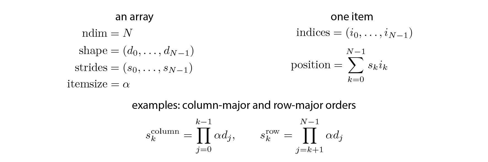

<a href="https://github.com/ipython-books/cookbook-2nd"></a> *This is one of the 100+ free recipes of the [IPython Cookbook, Second Edition](https://github.com/ipython-books/cookbook-2nd), by [Cyrille Rossant](http://cyrille.rossant.net), a guide to numerical computing and data science in the Jupyter Notebook. The ebook and printed book are available for purchase at [Packt Publishing](https://www.packtpub.com/big-data-and-business-intelligence/ipython-interactive-computing-and-visualization-cookbook-second-e).*

▶ *[Text on GitHub](https://github.com/ipython-books/cookbook-2nd) with a [CC-BY-NC-ND license](https://creativecommons.org/licenses/by-nc-nd/3.0/us/legalcode)*  
▶ *[Code on GitHub](https://github.com/ipython-books/cookbook-2nd-code) with a [MIT license](https://opensource.org/licenses/MIT)*

[*Chapter 4 : Profiling and Optimization*](./)

# 4.6. Using stride tricks with NumPy

In this recipe, we will dig deeper into the internals of NumPy arrays, by generalizing the notion of row-major and column-major orders to multidimensional arrays. The general notion is that of strides, which describe how the items of a multidimensional array are organized within a one-dimensional data buffer. Strides are mostly an implementation detail, but they can also be used in specific situations to optimize some algorithms.

## Getting ready

We suppose that NumPy has been imported and that the `aid()` function has been defined (see the previous recipe, *Understanding the internals of NumPy to avoid unnecessary array copying*).

```python
import numpy as np
```

```python
def aid(x):
    # This function returns the memory
    # block address of an array.
    return x.__array_interface__['data'][0]
```

## How to do it...

1. Strides are integer numbers describing the byte step in the contiguous block of memory for each dimension.

```python
x = np.zeros(10)
x.strides
```

```{output:result}
(8,)
```

This vector `x` contains double-precision floating point numbers (float64, 8 bytes); one needs to go *8 bytes forward* to go from one item to the next.

2. Now, let's look at the strides of a 2D array:

```python
y = np.zeros((10, 10))
y.strides
```

```{output:result}
(80, 8)
```

In the first dimension (vertical), one needs to go *80 bytes* (10 float64 items) *forward* to go from one item to the next, because the items are internally stored in row-major order. In the second dimension (horizontal), one needs to go *8 bytes forward* to go from one item to the next.

3. Let's show how we can revisit the broadcasting rules from the previous recipe using strides:

```python
n = 1000
a = np.arange(n)
```

We will create a new array, `b`, pointing to the same memory block as `a`, but with a different shape and different strides. This new array will look like a vertically-tiled version of `a`. We use a special function in NumPy to change the strides of an array:

```python
b = np.lib.stride_tricks.as_strided(a, (n, n), (0, 8))
```

```python
b
```

```{output:result}
array([[  0,   1,   2, ..., 997, 998, 999],
       [  0,   1,   2, ..., 997, 998, 999],
       [  0,   1,   2, ..., 997, 998, 999],
       ...,
       [  0,   1,   2, ..., 997, 998, 999],
       [  0,   1,   2, ..., 997, 998, 999],
       [  0,   1,   2, ..., 997, 998, 999]])
```

```python
b.size, b.shape, b.nbytes
```

```{output:result}
(1000000, (1000, 1000), 8000000)
```

NumPy believes that this array contains one million different elements, whereas the data buffer actually contains the same 1000 elements as `a`.

4. We can now perform an efficient outer product using the same principle as with broadcasting rules:

```python
%timeit b * b.T
```

```{output:stdout}
766 µs ± 2.59 µs per loop (mean ± std. dev. of 7 runs,
1000 loops each)
```

```python
%%timeit
np.tile(a, (n, 1)) * np.tile(a[:, np.newaxis], (1, n))
```

```{output:stdout}
5.55 ms ± 9.1 µs per loop (mean ± std. dev. of 7 runs,
100 loops each)
```

## How it works...

Every array has a number of dimensions, a shape, a data type, and strides. Strides describe how the items of a multidimensional array are organized in the data buffer. There are many different schemes for arranging the items of a multidimensional array in a one-dimensional block. NumPy implements a **strided indexing scheme**, where the position of any element is a **linear combination** of the dimensions, the coefficients being the strides. In other words, strides describe, in any dimension, how many bytes we need to jump over in the data buffer to go from one item to the next.

The position of any element in a multidimensional array is given by a linear combination of its indices, as follows:



Artificially changing the strides allows us to make some array operations more efficient than with standard methods, which may involve array copies. Internally, that's how broadcasting works in NumPy.

The `as_strided()` method takes an array, a shape, and strides as arguments. It creates a new array, but uses the same data buffer as the original array. The only thing that changes is the metadata. This trick lets us manipulate NumPy arrays as usual, except that they may take much less memory than what NumPy thinks. Here, using 0 in the strides implies that any array item can be addressed by many multidimensional indices, resulting in memory savings.

> Be very careful with strided arrays! The `as_strided()` function does not check whether you stay inside the memory block bounds. This means that you need to handle edge effects manually; otherwise, you may end up with garbage values in your arrays. The documentation says: "*This function has to be used with extreme care, see notes. (...) It is advisable to avoid `as_strided()` when possible.*"

We will see a more useful application of stride tricks in the next recipe.

## See also

* Implementing an efficient rolling average algorithm with stride tricks
