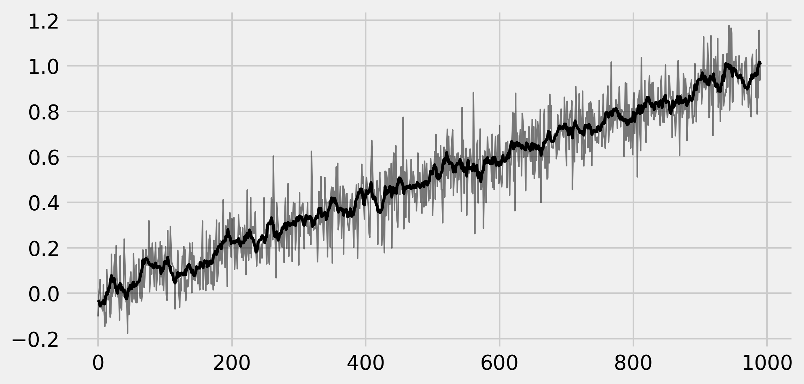

<a href="https://github.com/ipython-books/cookbook-2nd"></a> *This is one of the 100+ free recipes of the [IPython Cookbook, Second Edition](https://github.com/ipython-books/cookbook-2nd), by [Cyrille Rossant](http://cyrille.rossant.net), a guide to numerical computing and data science in the Jupyter Notebook. The ebook and printed book are available for purchase at [Packt Publishing](https://www.packtpub.com/big-data-and-business-intelligence/ipython-interactive-computing-and-visualization-cookbook-second-e).*

▶ *[Text on GitHub](https://github.com/ipython-books/cookbook-2nd) with a [CC-BY-NC-ND license](https://creativecommons.org/licenses/by-nc-nd/3.0/us/legalcode)*  
▶ *[Code on GitHub](https://github.com/ipython-books/cookbook-2nd-code) with a [MIT license](https://opensource.org/licenses/MIT)*

[*Chapter 4 : Profiling and Optimization*](./)

# 4.7. Implementing an efficient rolling average algorithm with stride tricks

Stride tricks can be useful for local computations on arrays, when the computed value at a given position depends on the neighboring values. Examples include dynamical systems, digital filters, and cellular automata.

In this recipe, we will implement an efficient **rolling average** algorithm (a particular type of convolution-based linear filter) with NumPy stride tricks. A rolling average of a 1D vector contains, at each position, the average of the elements around this position in the original vector. Roughly speaking, this process filters out the noisy components of a signal so as to keep only the slower components.

## How to do it...

The idea is to start from a 1D vector, and make a *virtual* 2D array where each line is a shifted version of the previous line. When using stride tricks, this process is very efficient as it does not involve any copy.

1. Let's generate a 1D vector:

```python
import numpy as np
from numpy.lib.stride_tricks import as_strided
```

```python
def aid(x):
    # This function returns the memory
    # block address of an array.
    return x.__array_interface__['data'][0]
```

```python
n = 5
k = 2
a = np.linspace(1, n, n)
ax = aid(a)
```

2. Let's change the strides of `a` to add shifted rows:

```python
as_strided(a, (k, n), (8, 8))
```

```{output:result}
array([[ 1e+000,  2e+000,  3e+000,  4e+000,  5e+000],
       [ 2e+000,  3e+000,  4e+000,  5e+000,  9e-321]])
```

The last value indicates an out-of-bounds problem: stride tricks can be dangerous as memory access is not checked. Here, we should take edge effects into account by limiting the shape of the array.

3. Now, let's implement the computation of the rolling average. The first version (standard method) involves explicit array copies, whereas the second version uses stride tricks:

```python
def shift1(x, k):
    return np.vstack([x[i:n - k + i + 1]
                      for i in range(k)])
```

```python
def shift2(x, k):
    return as_strided(x, (k, n - k + 1),
                      (x.itemsize, x.itemsize))
```

4. These two functions return the same result, except that the array returned by the second function refers to the original data buffer:

```python
b = shift1(a, k)
```

```python
b
```

```{output:result}
array([[ 1.,  2.,  3.,  4.],
       [ 2.,  3.,  4.,  5.]])
```

```python
aid(b) == ax
```

```{output:result}
False
```

And now with the second function:

```python
c = shift2(a, k)
```

```python
c
```

```{output:result}
array([[ 1.,  2.,  3.,  4.],
       [ 2.,  3.,  4.,  5.]])
```

```python
aid(c) == ax
```

```{output:result}
True
```

5. Let's generate a signal:

```python
n, k = 1000, 10
t = np.linspace(0., 1., n)
x = t + .1 * np.random.randn(n)
```

6. We compute the signal rolling average by creating the shifted version of the signal, and averaging along the vertical dimension:

```python
y = shift2(x, k)
x_avg = y.mean(axis=0)
```

7. Let's plot these arrays:

```python
import matplotlib.pyplot as plt
%matplotlib inline
```

```python
fig, ax = plt.subplots(1, 1, figsize=(8, 4))
ax.plot(x[:-k + 1], '-k', lw=1, alpha=.5)
ax.plot(x_avg, '-k', lw=2)
```



8. Let's evaluate the time taken by the first method:

```python
%timeit shift1(x, k)
```

```{output:stdout}
15.4 µs ± 302 ns per loop (mean ± std. dev. of 7 runs,
    100000 loops each)
```

```python
%%timeit y = shift1(x, k)
z = y.mean(axis=0)
```

```{output:stdout}
10.3 µs ± 123 ns per loop (mean ± std. dev. of 7 runs,
    100000 loops each)
```

Here, most of the total time is spent in the array copy (the `shift1()` function).

9. Let's benchmark the second method:

```python
%timeit shift2(x, k)
```

```{output:stdout}
4.77 µs ± 70.3 ns per loop (mean ± std. dev. of 7 runs,
    100000 loops each)
```

```python
%%timeit y = shift2(x, k)
z = y.mean(axis=0)
```

```{output:stdout}
9 µs ± 179 ns per loop (mean ± std. dev. of 7 runs,
    100000 loops each)
```

This time, thanks to the stride tricks, most of the time is instead spent in the computation of the average.

## See also

* Using stride tricks with NumPy
