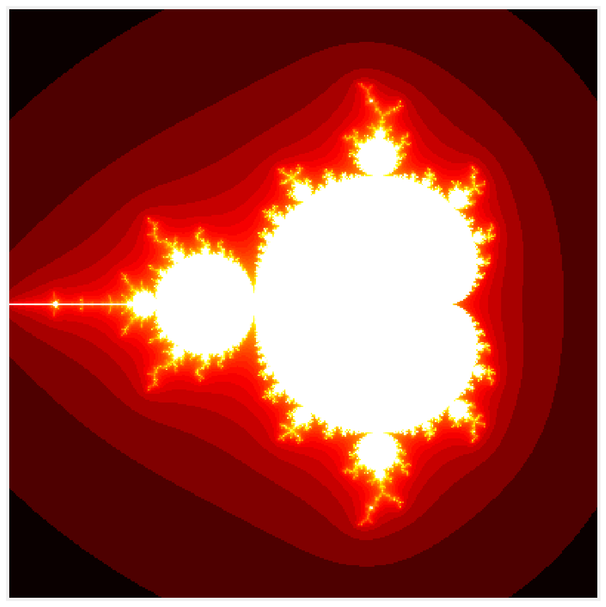

<a href="https://github.com/ipython-books/cookbook-2nd"></a> *This is one of the 100+ free recipes of the [IPython Cookbook, Second Edition](https://github.com/ipython-books/cookbook-2nd), by [Cyrille Rossant](http://cyrille.rossant.net), a guide to numerical computing and data science in the Jupyter Notebook. The ebook and printed book are available for purchase at [Packt Publishing](https://www.packtpub.com/big-data-and-business-intelligence/ipython-interactive-computing-and-visualization-cookbook-second-e).*

▶ *[Text on GitHub](https://github.com/ipython-books/cookbook-2nd) with a [CC-BY-NC-ND license](https://creativecommons.org/licenses/by-nc-nd/3.0/us/legalcode)*  
▶ *[Code on GitHub](https://github.com/ipython-books/cookbook-2nd-code) with a [MIT license](https://opensource.org/licenses/MIT)*

[*Chapter 5 : High-Performance Computing*](./)

# 5.2. Accelerating pure Python code with Numba and just-in-time compilation

**Numba** (http://numba.pydata.org) is a package created by Anaconda, Inc (http://www.anaconda.com). Numba takes pure Python code and translates it automatically (just-in-time) into optimized machine code. In practice, this means that we can write a non-vectorized function in pure Python, using `for` loops, and have this function vectorized automatically by using a single decorator. Performance speedups when compared to pure Python code can reach several orders of magnitude and may even outmatch manually-vectorized NumPy code.

In this section, we will show how to accelerate pure Python code generating the Mandelbrot fractal.

## Getting ready

Numba should already be installed in Anaconda, but you can also install it manually with `conda install numba`.

## How to do it...

1. Let's import NumPy and define a few variables:

```python
import numpy as np
import matplotlib.pyplot as plt
%matplotlib inline
```

```python
size = 400
iterations = 100
```

2. The following function generates the fractal in pure Python. It accepts an empty array `m` as argument.

```python
def mandelbrot_python(size, iterations):
    m = np.zeros((size, size))
    for i in range(size):
        for j in range(size):
            c = (-2 + 3. / size * j +
                 1j * (1.5 - 3. / size * i))
            z = 0
            for n in range(iterations):
                if np.abs(z) <= 10:
                    z = z * z + c
                    m[i, j] = n
                else:
                    break
    return m
```

3. Let's run the simulation and display the fractal:

```python
m = mandelbrot_python(size, iterations)
```

```python
fig, ax = plt.subplots(1, 1, figsize=(10, 10))
ax.imshow(np.log(m), cmap=plt.cm.hot)
ax.set_axis_off()
```



4. Now, we evaluate the time taken by this function:

```python
%timeit mandelbrot_python(size, iterations)
```

```{output:stdout}
5.45 s ± 18.6 ms per loop (mean ± std. dev. of 7 runs,
    1 loop each)
```

5. Let's try to accelerate this function using Numba. First, we import the package:

```python
from numba import jit
```

6. Next, we add the `@jit` decorator right above the function definition, without changing a single line of code in the body of the function:

```python
@jit
def mandelbrot_numba(size, iterations):
    m = np.zeros((size, size))
    for i in range(size):
        for j in range(size):
            c = (-2 + 3. / size * j +
                 1j * (1.5 - 3. / size * i))
            z = 0
            for n in range(iterations):
                if np.abs(z) <= 10:
                    z = z * z + c
                    m[i, j] = n
                else:
                    break
    return m
```

7. This function works just like the pure Python version. How much faster is it?

```python
mandelbrot_numba(size, iterations)
```

```python
%timeit mandelbrot_numba(size, iterations)
```

```{output:stdout}
34.5 ms ± 59.4 µs per loop (mean ± std. dev. of 7 runs,
    10 loops each)
```

The Numba version is about 150 times faster than the pure Python version here!

## How it works...

Python bytecode is normally interpreted at runtime by the Python interpreter (most often, CPython). By contrast, a Numba function is parsed and translated directly to machine code ahead of execution, using a powerful compiler architecture named **LLVM (Low Level Virtual Machine)**.

Numba supports a significant but not exhaustive subset of Python semantics. You can find the list of supported Python features at http://numba.pydata.org/numba-doc/latest/reference/pysupported.html. When Numba cannot compile Python code to assembly, it will automatically fallback to a much slower mode. You can prevent this behavior with `@jit(nopython=True)`.

Numba generally gives the most impressive speedups on functions that involve tight loops on NumPy arrays (such as in this recipe). This is because there is an overhead running loops in Python, and this overhead becomes non-negligible when there are many iterations of few cheap operations. In this example, the number of iterations is `size * size * iterations = 16,000,000`.

## There's more...

Let's compare the performance of Numba with manually-vectorized code using NumPy, which is the standard way of accelerating pure Python code such as the code given in this recipe. In practice, it means replacing the code inside the two loops over `i` and `j` with array computations. This is relatively easy here as the operations closely follow the **Single Instruction, Multiple Data (SIMD)** paradigm:

```python
def initialize(size):
    x, y = np.meshgrid(np.linspace(-2, 1, size),
                       np.linspace(-1.5, 1.5, size))
    c = x + 1j * y
    z = c.copy()
    m = np.zeros((size, size))
    return c, z, m
```

```python
def mandelbrot_numpy(c, z, m, iterations):
    for n in range(iterations):
        indices = np.abs(z) <= 10
        z[indices] = z[indices] ** 2 + c[indices]
        m[indices] = n
```

```python
%%timeit -n1 -r10 c, z, m = initialize(size)
mandelbrot_numpy(c, z, m, iterations)
```

```{output:stdout}
174 ms ± 2.91 ms per loop (mean ± std. dev. of 10 runs,
    1 loop each)
```

In this example, Numba still beats NumPy.

Numba supports many other features, like multiprocessing and GPU computing.

Here are a few references:

* Documentation of Numba available at http://numba.pydata.org
* Supported Python features in Numba, available at http://numba.pydata.org/numba-doc/latest/reference/pysupported.html
* Supported NumPy features in Numba, available at http://numba.pydata.org/numba-doc/latest/reference/numpysupported.html

## See also

* Accelerating array computations with Numexpr
