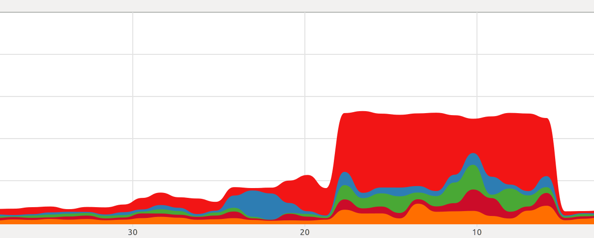

<a href="https://github.com/ipython-books/cookbook-2nd"></a> *This is one of the 100+ free recipes of the [IPython Cookbook, Second Edition](https://github.com/ipython-books/cookbook-2nd), by [Cyrille Rossant](http://cyrille.rossant.net), a guide to numerical computing and data science in the Jupyter Notebook. The ebook and printed book are available for purchase at [Packt Publishing](https://www.packtpub.com/big-data-and-business-intelligence/ipython-interactive-computing-and-visualization-cookbook-second-e).*

▶ *[Text on GitHub](https://github.com/ipython-books/cookbook-2nd) with a [CC-BY-NC-ND license](https://creativecommons.org/licenses/by-nc-nd/3.0/us/legalcode)*  
▶ *[Code on GitHub](https://github.com/ipython-books/cookbook-2nd-code) with a [MIT license](https://opensource.org/licenses/MIT)*

[*Chapter 5 : High-Performance Computing*](./)

# 5.3. Accelerating array computations with Numexpr

**Numexpr** is a package that can offer some speedup on complex computations on NumPy arrays. Numexpr evaluates algebraic expressions involving arrays, parses them, compiles them, and finally executes them, possibly on multiple processors.

This principle is somewhat similar to Numba, in that normal Python code is compiled dynamically to machine code. However, Numexpr only tackles algebraic array expressions rather than arbitrary Python code. We will see how that works in this recipe.

## Getting ready

Numexpr should already be installed in Anaconda, but you can also install it manually with `conda install numexpr`.

## How to do it...

1. Let's import NumPy and Numexpr:

```python
import numpy as np
import numexpr as ne
```

2. Then, we generate three large vectors:

```python
x, y, z = np.random.rand(3, 1000000)
```

3. Now, we evaluate the time taken by NumPy to calculate a complex algebraic expression involving our vectors:

```python
%timeit x + (y**2 + (z*x + 1)*3)
```

```{output:stdout}
6.94 ms ± 223 µs per loop (mean ± std. dev. of 7 runs,
    100 loops each)
```

4. Let's perform the same calculation with Numexpr. We need to give the expression as a string:

```python
%timeit ne.evaluate('x + (y**2 + (z*x + 1)*3)')
```

```{output:stdout}
1.47 ms ± 8.07 µs per loop (mean ± std. dev. of 7 runs,
    1000 loops each)
```

The following screenshot shows the CPU usage when we ran the code with NumPy and then with Numexpr, which automatically use multiple CPUs:



5. Numexpr can use multiple cores. Here, we have 4 physical cores and 8 virtual threads with Intel's Hyper-Threading Technology. We can specify how many cores we want Numexpr to use using the `set_num_threads()` function:

```python
ne.ncores
```

```{output:result}
8
```

```python
for i in range(1, 5):
    ne.set_num_threads(i)
    %timeit ne.evaluate('x + (y**2 + (z*x + 1)*3)',)
```

```{output:stdout}
3.53 ms ± 12.9 µs per loop (mean ± std. dev. of 7 runs,
    100 loops each)
2.35 ms ± 276 µs per loop (mean ± std. dev. of 7 runs,
    100 loops each)
1.6 ms ± 60 µs per loop (mean ± std. dev. of 7 runs,
    1000 loops each)
1.5 ms ± 24.6 µs per loop (mean ± std. dev. of 7 runs,
    1000 loops each)
```

## How it works...

Numexpr analyzes the array expression, parses it, and compiles it into a lower-level language. Numexpr is aware of CPU-vectorized instructions as well as CPU cache characteristics. As such, Numexpr can optimize vectorized computations dynamically.

Here are a few references:

* Numexpr on GitHub, at https://github.com/pydata/numexpr
* Numexpr documentation at https://numexpr.readthedocs.io/en/latest/intro.html

## See also

* Accelerating pure Python code with Numba and just-in-time compilation
