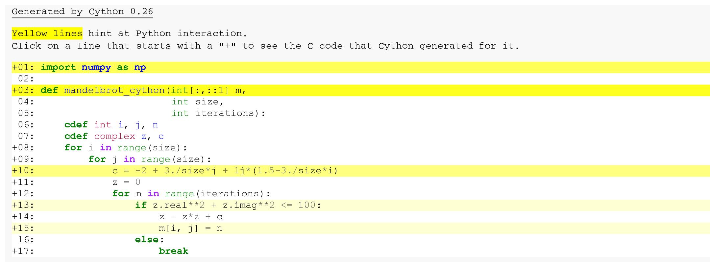

<a href="https://github.com/ipython-books/cookbook-2nd"></a> *This is one of the 100+ free recipes of the [IPython Cookbook, Second Edition](https://github.com/ipython-books/cookbook-2nd), by [Cyrille Rossant](http://cyrille.rossant.net), a guide to numerical computing and data science in the Jupyter Notebook. The ebook and printed book are available for purchase at [Packt Publishing](https://www.packtpub.com/big-data-and-business-intelligence/ipython-interactive-computing-and-visualization-cookbook-second-e).*

▶ *[Text on GitHub](https://github.com/ipython-books/cookbook-2nd) with a [CC-BY-NC-ND license](https://creativecommons.org/licenses/by-nc-nd/3.0/us/legalcode)*  
▶ *[Code on GitHub](https://github.com/ipython-books/cookbook-2nd-code) with a [MIT license](https://opensource.org/licenses/MIT)*

[*Chapter 5 : High-Performance Computing*](./)

# 5.5. Accelerating Python code with Cython

**Cython** is both a language (a superset of Python) and a Python library. With Cython, we start from a regular Python program and we add annotations about the type of the variables. Then, Cython translates that code to C and compiles the result into a Python extension module. Finally, we can use this compiled module in any Python program.

While dynamic typing comes with a performance cost in Python, statically-typed variables in Cython generally lead to faster code execution.

Performance gains are most significant in CPU-bound programs, notably in tight Python loops. By contrast, I/O bound programs are not expected to benefit much from a Cython implementation.

In this recipe, we will see how to accelerate the Mandelbrot code example with Cython.

## Getting ready

A C compiler is required. You will find all compiler-related instructions in the introduction of this chapter.

You also need Cython, which should be installed by default with Anaconda. If needed, you can also install it with `conda install cython`.

## How to do it...

1. Let's define some variables:

```python
import numpy as np
```

```python
size = 400
iterations = 100
```

2. To use Cython in the Jupyter Notebook, we first need to import the Cython Jupyter extension:

```python
%load_ext cython
```

3. As a first try, let's just add the `%%cython` magic before the definition of the `mandelbrot()` function. Internally, this cell magic compiles the cell into a standalone Cython module, hence the need for all required imports to occur within the same cell. This cell does not have access to any variable or function defined in the interactive namespace:

```python
%%cython -a
import numpy as np

def mandelbrot_cython(m, size, iterations):
    for i in range(size):
        for j in range(size):
            c = -2 + 3./size*j + 1j*(1.5-3./size*i)
            z = 0
            for n in range(iterations):
                if np.abs(z) <= 10:
                    z = z*z + c
                    m[i, j] = n
                else:
                    break
```


The `-a` option tells Cython to annotate lines of code with a background color indicating how optimized it is. The darker the color, the less optimized the line. The color depends on the relative number of Python API calls at each line. We can click on any line to see the generated C code. Here, this version does not appear to be optimized.

4. How fast is this version?

```python
s = (size, size)
```

```python
%%timeit -n1 -r1 m = np.zeros(s, dtype=np.int32)
mandelbrot_cython(m, size, iterations)
```

```{output:stdout}
4.52 s ± 0 ns per loop (mean ± std. dev. of 1 run,
    1 loop each)
```

We get virtually no speedup here. We need to specify the type of our Python variables.

5. Let's add type information using typed memory views for NumPy arrays (we explain these in the *How it works...* section). We also use a slightly different way to test whether particles have escaped from the domain (`if` test):

```python
%%cython -a
import numpy as np

def mandelbrot_cython(int[:,::1] m,
                      int size,
                      int iterations):
    cdef int i, j, n
    cdef complex z, c
    for i in range(size):
        for j in range(size):
            c = -2 + 3./size*j + 1j*(1.5-3./size*i)
            z = 0
            for n in range(iterations):
                if z.real**2 + z.imag**2 <= 100:
                    z = z*z + c
                    m[i, j] = n
                else:
                    break
```



5. How fast is this new version?

```python
%%timeit -n1 -r1 m = np.zeros(s, dtype=np.int32)
mandelbrot_cython(m, size, iterations)
```

```{output:stdout}
12.7 ms ± 0 ns per loop (mean ± std. dev. of 1 run,
    1 loop each)
```

This version is almost 350 times faster than the first version!

All we have done is to specify the type of the local variables and function arguments, and bypass NumPy's `np.abs()` function when computing the absolute value of `z`. These changes have helped Cython generate more optimized C code from Python code.

## How it works...

The `cdef` keyword declares a variable as a statically-typed C variable. C variables lead to faster code execution because the overhead from Python's dynamic typing is bypassed. Function arguments can also be declared as statically-typed C variables.

There are two ways of declaring NumPy arrays as C variables with Cython: using **array buffers** or using **typed memory views**. In this recipe, we used typed memory views. We will cover array buffers in the next recipe.

Typed memory views allow efficient access to data buffers with a NumPy-like indexing syntax. For example, we can use `int[:,::1]` to declare a C-ordered 2D NumPy array with integer values, with `::1` meaning a contiguous layout in this dimension. Typed memory views can be indexed just like NumPy arrays.

However, memory views do not implement element-wise operations like NumPy. Thus, memory views act as convenient data containers within tight for loops. For element-wise NumPy-like operations, array buffers should be used instead.

We could achieve a significant performance speedup by replacing the call to `np.abs()` with a faster expression. The reason is that `np.abs()` is a NumPy function with a slight call overhead. It is designed to work with relatively large arrays, not scalar values. This overhead results in a significant performance hit in a tight loop such as here. This bottleneck can be spotted with Cython annotations.

## There's more...

Using Cython from Jupyter is very convenient with the `%%cython` cell magic. However, it is sometimes necessary to create a reusable C extension module with Cython. This is actually what the `%%cython` cell magic does under the hood. You will find more information at http://cython.readthedocs.io/en/latest/src/quickstart/build.html.

Here are a few references:

* Distributing Cython modules, explained at http://docs.cython.org/src/userguide/source_files_and_compilation.html
* Compilation with Cython, explained at http://docs.cython.org/src/reference/compilation.html
* Cython and Numpy, at http://cython.readthedocs.io/en/latest/src/userguide/memoryviews.html

## See also

* Optimizing Cython code by writing less Python and more C
* Releasing the GIL to take advantage of multicore processors with Cython and OpenMP
