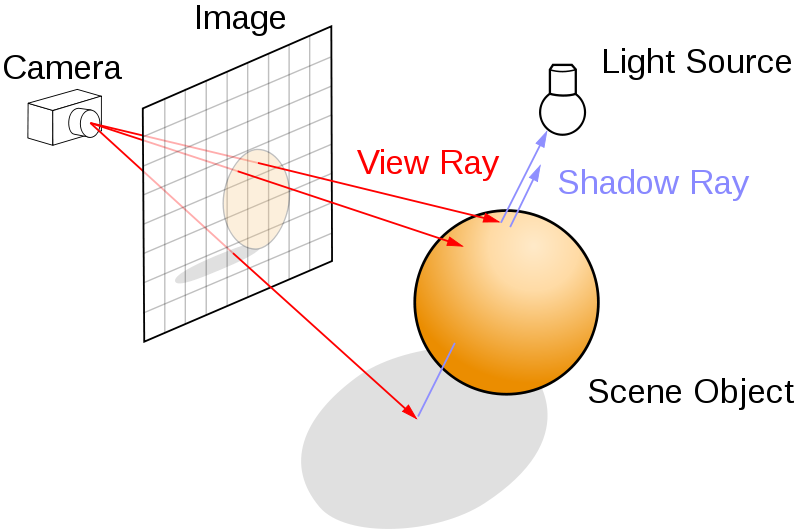
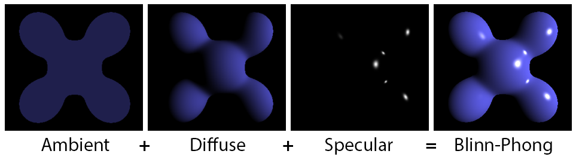

<a href="https://github.com/ipython-books/cookbook-2nd"></a> *This is one of the 100+ free recipes of the [IPython Cookbook, Second Edition](https://github.com/ipython-books/cookbook-2nd), by [Cyrille Rossant](http://cyrille.rossant.net), a guide to numerical computing and data science in the Jupyter Notebook. The ebook and printed book are available for purchase at [Packt Publishing](https://www.packtpub.com/big-data-and-business-intelligence/ipython-interactive-computing-and-visualization-cookbook-second-e).*

▶ *[Text on GitHub](https://github.com/ipython-books/cookbook-2nd) with a [CC-BY-NC-ND license](https://creativecommons.org/licenses/by-nc-nd/3.0/us/legalcode)*  
▶ *[Code on GitHub](https://github.com/ipython-books/cookbook-2nd-code) with a [MIT license](https://opensource.org/licenses/MIT)*

[*Chapter 5 : High-Performance Computing*](./)

# 5.6. Optimizing Cython code by writing less Python and more C

In this recipe, we will consider a more complicated Cython example. Starting from a slow implementation in pure Python, we will use different Cython features to speed it up progressively.

We will implement a very simple ray tracing engine. **Ray tracing** consists of rendering a scene by simulating the physical properties of light propagation. This rendering method leads to photorealistic scenes, but it is computationally intensive.

Here, we will render a single sphere with diffuse and specular lighting. First we'll give the example's code in pure Python. Then, we will accelerate it incrementally with Cython.

> The code is long and contains many functions. We will first give the full code of the pure Python version. Then, we will just describe the changes required to accelerate the code with Cython. The entire scripts are available on the book's website.

## How to do it...

1. First, let's implement the pure Python version:

```python
import numpy as np
import matplotlib.pyplot as plt
```

```python
%matplotlib inline
```

```python
w, h = 400, 400  # Size of the screen in pixels.
```

2. We create a normalization function for vectors:

```python
def normalize(x):
    # This function normalizes a vector.
    x /= np.linalg.norm(x)
    return x
```

3. We create a function that computes the intersection of a ray with a sphere:

```python
def intersect_sphere(O, D, S, R):
    # Return the distance from O to the intersection
    # of the ray (O, D) with the sphere (S, R), or
    # +inf if there is no intersection.
    # O and S are 3D points, D (direction) is a
    # normalized vector, R is a scalar.
    a = np.dot(D, D)
    OS = O - S
    b = 2 * np.dot(D, OS)
    c = np.dot(OS, OS) - R * R
    disc = b * b - 4 * a * c
    if disc > 0:
        distSqrt = np.sqrt(disc)
        q = (-b - distSqrt) / 2.0 if b < 0 \
            else (-b + distSqrt) / 2.0
        t0 = q / a
        t1 = c / q
        t0, t1 = min(t0, t1), max(t0, t1)
        if t1 >= 0:
            return t1 if t0 < 0 else t0
    return np.inf
```

4. The following function traces a ray:

```python
def trace_ray(O, D):
    # Find first point of intersection with the scene.
    t = intersect_sphere(O, D, position, radius)
    # No intersection?
    if t == np.inf:
        return
    # Find the point of intersection on the object.
    M = O + D * t
    N = normalize(M - position)
    toL = normalize(L - M)
    toO = normalize(O - M)
    # Ambient light.
    col = ambient
    # Lambert shading (diffuse).
    col += diffuse * max(np.dot(N, toL), 0) * color
    # Blinn-Phong shading (specular).
    col += specular_c * color_light * \
        max(np.dot(N, normalize(toL + toO)), 0) \
        ** specular_k
    return col
```

5. Finally, the main loop is implemented in the following function:

```python
def run():
    img = np.zeros((h, w, 3))
    # Loop through all pixels.
    for i, x in enumerate(np.linspace(-1, 1, w)):
        for j, y in enumerate(np.linspace(-1, 1, h)):
            # Position of the pixel.
            Q[0], Q[1] = x, y
            # Direction of the ray going through
            # the optical center.
            D = normalize(Q - O)
            # Launch the ray and get the color
            # of the pixel.
            col = trace_ray(O, D)
            if col is None:
                continue
            img[h - j - 1, i, :] = np.clip(col, 0, 1)
    return img
```

6. Now, we initialize the scene and define a few parameters:

```python
# Sphere properties.
position = np.array([0., 0., 1.])
radius = 1.
color = np.array([0., 0., 1.])
diffuse = 1.
specular_c = 1.
specular_k = 50

# Light position and color.
L = np.array([5., 5., -10.])
color_light = np.ones(3)
ambient = .05

# Camera.
O = np.array([0., 0., -1.])  # Position.
Q = np.array([0., 0., 0.])  # Pointing to.
```

7. Let's render the scene:

```python
img = run()
fig, ax = plt.subplots(1, 1, figsize=(10, 10))
ax.imshow(img)
ax.set_axis_off()
```


In this figure, the left panel shows the result of this recipe's code. The right panel shows an extended version of the simple ray tracing engine implemented here.

8. How slow is this implementation (`ray1` example on the book's website)?

```python
%timeit run()
```

```{output:stdout}
2.75 s ± 29.9 ms per loop (mean ± std. dev. of 7 runs,
    1 loop each)
```

9. If we just use the `%%cython` magic with the adequate `import numpy as np` and `cimport numpy as np` commands at the top of the cell, we only get a ~6% speed improvement (`ray2` example).
10. We could do better by giving information about the type of the variables. Since we use vectorized computations on NumPy arrays, we cannot easily use memory views. Rather, we will use array buffers. First, at the very beginning of the Cython module (or `%%cython` cell), we declare NumPy data types as follows:

```
import numpy as np
cimport numpy as np
DBL = np.double ctypedef
np.double_t DBL_C
```

Then, we declare a NumPy array with `cdef np.ndarray[DBL_C, ndim=1]` (in this example, a 1D array of double precision floating point numbers). There is a difficulty here because NumPy arrays can only be declared inside functions, not at the top level. Thus, we need to slightly tweak the overall architecture of the code by passing some arrays as function arguments instead of using global variables. However, even by declaring the type of all variables, we gain no speedup at all (`ray3` example).

11. In the current implementation, we incur a performance hit because of the large number of NumPy function calls on tiny arrays (three elements). NumPy is designed to deal with large arrays, and it does not make much sense to use it for arrays that small. In this specific situation, we can try to bypass NumPy by rewriting some functions using the C standard library. We use the `cdef` keyword to declare a C-style function. These functions can yield significant performance speedups. Here is the C function replacing `normalize()`:

```
from libc.math cimport sqrt
cdef normalize(np.ndarray[DBL_C, ndim=1] x):
    cdef double n
    n = sqrt(x[0]*x[0] + x[1]*x[1] + x[2]*x[2])
    x[0] /= n
    x[1] /= n
    x[2] /= n
    return x
```

We obtain a 25% speed improvement (`ray4` example).

12. To get the most interesting speedups, we need to completely bypass NumPy. Where do we use NumPy precisely?

* Many variables are NumPy arrays (mostly one-dimensional vectors with three elements).
* Element-wise operations yield implicit NumPy API calls.
* We also use a few NumPy built-in functions such as `np.dot()`.

In order to bypass NumPy in our example, we need to reimplement all these features for our specific needs. The first possibility is to use a native Python type for vectors (for example, tuples), and write C-style functions that implement operations on tuples (always assuming they have exactly three elements). For example, the addition between two tuples can be implemented as follows:

```
cdef tuple add(tuple x, tuple y):
    return (x[0]+y[0], x[1]+y[1], x[2]+y[2])
```

This time, we get 18x speedup compared to the pure Python version (`ray5` example)! But we can do even better...

13. We are going to define a pure C structure instead of using a Python type for our vectors. In other words, we are not only bypassing NumPy, but we are also bypassing Python by moving to pure C code. To declare a C structure representing a 3D vector in Cython, we can use the following code:

```
cdef struct Vec3:
    double x, y, z
```

To create a new `Vec3` variable, we can use the following function:

```
cdef Vec3 vec3(double x, double y, double z):
    cdef Vec3 v
    v.x = x
    v.y = y
    v.z = z
    return v
```

As an example, here is the function used to add two `Vec3` objects:

```
cdef Vec3 add(Vec3 u, Vec3 v):
    return vec3(u.x + v.x, u.y + v.y, u.z + v.z)
```

The code can be updated to make use of these fast C-style functions. Finally, the image can be declared as a 3D memory view. With all these changes, the Cython implementation runs in ~8 ms instead of almost a couple of seconds, or 330 times faster (`ray6` example)!

In summary, we have achieved a very interesting speedup by basically rewriting the entire implementation in C with an enhanced Python syntax.

## How it works...

Let's explain briefly how the ray tracing code works. We model a three-dimensional scene with objects such as planes and spheres (here, there is only one sphere). There is also a camera and a plane representing the rendered image:



There is a main loop over all pixels of the image. For each pixel, we launch a ray from the camera center to the scene through the current pixel and compute the first intersection point between that ray and an object from the scene. Then, we compute the pixel's color as a function of the object material's color, the position of the lights, the normal of the object at the intersection point, and so on. There are several physics-based lighting equations that describe how the color depends on these parameters. Here, we use the **Blinn-Phong shading model** with ambient, diffuse, and specular lighting components:



Of course, a full ray tracing engine is far more complex than what we have implemented in this example. We can model other optic and lighting characteristics such as reflections, refractions, shadows, depth of field, and others. It is also possible to implement ray tracing algorithms on the graphics card for real-time photorealistic rendering. Here are a few references:

* Blinn-Phong shading model on Wikipedia, available at https://en.wikipedia.org/wiki/Blinn-Phong_shading_model
* Ray tracing on Wikipedia, available at https://en.wikipedia.org/wiki/Ray_tracing_%28graphics%29

## There's more...

Although powerful, Cython requires a good understanding of Python, NumPy, and C. The most interesting performance speedups are achieved when dynamically-typed Python variables are converted to statically-typed C variables, notably within tight loops.

Here are a few references:

* Cython extension types available at http://docs.cython.org/src/userguide/extension_types.html
* Extended version of the ray tracing example available at http://gist.github.com/rossant/6046463

## See also

* Accelerating Python code with Cython
* Releasing the GIL to take advantage of multicore processors with Cython and OpenMP
