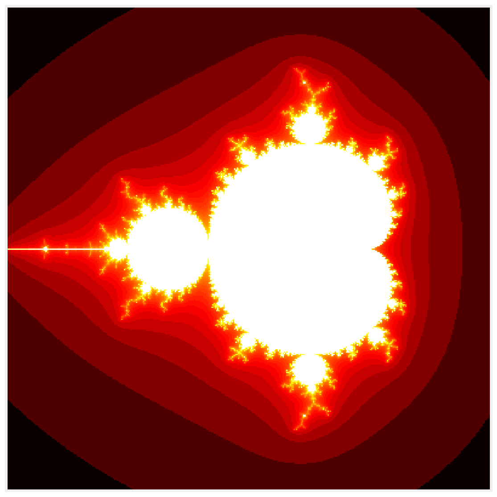
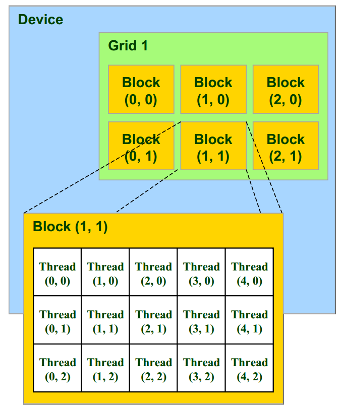

<a href="https://github.com/ipython-books/cookbook-2nd"></a> *This is one of the 100+ free recipes of the [IPython Cookbook, Second Edition](https://github.com/ipython-books/cookbook-2nd), by [Cyrille Rossant](http://cyrille.rossant.net), a guide to numerical computing and data science in the Jupyter Notebook. The ebook and printed book are available for purchase at [Packt Publishing](https://www.packtpub.com/big-data-and-business-intelligence/ipython-interactive-computing-and-visualization-cookbook-second-e).*

▶ *[Text on GitHub](https://github.com/ipython-books/cookbook-2nd) with a [CC-BY-NC-ND license](https://creativecommons.org/licenses/by-nc-nd/3.0/us/legalcode)*  
▶ *[Code on GitHub](https://github.com/ipython-books/cookbook-2nd-code) with a [MIT license](https://opensource.org/licenses/MIT)*

[*Chapter 5 : High-Performance Computing*](./)

# 5.8. Writing massively parallel code for NVIDIA graphics cards (GPUs) with CUDA

**Graphics Processing Units (GPUs)** are powerful processors specialized in real-time rendering. We find GPUs in virtually any computer, laptop, video game console, tablet, or smartphone. Their massively parallel architecture comprises tens to thousands of cores. The video game industry has been fostering the development of increasingly powerful GPUs over the last two decades.

Since the mid-2000s, GPUs are no longer limited to graphics processing. We can now implement scientific algorithms on a GPU. The only condition is that the algorithm follows the **SIMD (Single Instruction, Multiple Data) paradigm**, where a sequence of instructions is executed in parallel with multiple data. This is called **General Purpose Programming on Graphics Processing Units (GPGPU)**. GPGPU is used in many areas: meteorology, machine learning (most particularly deep learning), computer vision, image processing, finance, physics, bioinformatics, and many more. Writing code for GPUs can be challenging as it requires understanding the internal architecture of the hardware.

**CUDA** is a proprietary GPGPU framework created in 2007 by NVIDIA Corporation, one of the main GPU manufacturers. Programs written in CUDA only work on NVIDIA graphics cards. There is another competing GPGPU framework called **OpenCL**, an open standard supported by other major companies. OpenCL programs can work on GPUs and CPUs from most manufacturers (notably NVIDIA, AMD, and Intel).

CUDA kernels are typically written in a C dialect that runs on the GPU. However, Numba allows us to CUDA kernels in Python. Numba takes care of compiling the code automatically for the GPU.

In this recipe, we will implement the embarrassingly parallel computation of the Mandelbrot fractal in CUDA using Numba.

## Getting ready

You need an NVIDIA graphics processing unit installed on your computer. You also need the CUDA toolkit which you can install with `conda install cudatoolkit`.

## How to do it...

1. Let's import the packages:

```python
import math
import numpy as np
from numba import cuda
import matplotlib.pyplot as plt
%matplotlib inline
```

2. Let's check whether Numba correctly identifed our GPU:

```python
len(cuda.gpus)
```

```{output:result}
1
```

```python
cuda.gpus[0].name
```

```{output:result}
b'GeForce GTX 980M'
```

3. We write our function in Python. It will be compiled to CUDA code. The object `m` represents a pointer to the array stored on the GPU. The function is called on the GPU in parallel on every pixel of the image. Numba provides a `cuda.grid()` function that gives the index of the pixel in the image:

```python
@cuda.jit
def mandelbrot_numba(m, iterations):
    # Matrix index.
    i, j = cuda.grid(2)
    size = m.shape[0]
    # Skip threads outside the matrix.
    if i >= size or j >= size:
        return
    # Run the simulation.
    c = (-2 + 3. / size * j +
         1j * (1.5 - 3. / size * i))
    z = 0
    for n in range(iterations):
        if abs(z) <= 10:
            z = z * z + c
            m[i, j] = n
        else:
            break
```

4. We initialize the matrix:

```python
size = 400
iterations = 100
```

```python
m = np.zeros((size, size))
```

5. We initialize the execution grid (see the *How it works...* section):

```python
# 16x16 threads per block.
bs = 16
# Number of blocks in the grid.
bpg = math.ceil(size / bs)
# We prepare the GPU function.
f = mandelbrot_numba[(bpg, bpg), (bs, bs)]
```

6. We execute the GPU function, passing our empty array:

```python
f(m, iterations)
```

7. Let's display the result:

```python
fig, ax = plt.subplots(1, 1, figsize=(10, 10))
ax.imshow(np.log(m), cmap=plt.cm.hot)
ax.set_axis_off()
```



8. Now, let's benchmark this function:

```python
%timeit -n10 -r100 f(m, iterations)
```

```{output:stdout}
2.99 ms ± 173 µs per loop (mean ± std. dev. of 100 runs,
    10 loops each)
```

That's about 10 times faster than the CPU version obtained with Numba in the first recipe of this chapter, and 1800 times faster than the pure Python version! But we can do even better.

9. Numba takes care of transferring arrays automatically between the host machine (CPU) and the device (GPU). These data transfers are slow, sometimes even more than the actual on-device computation. Numba provides facilities to deal with these transfers manually, which can be interesting in some use-cases. Let's estimate the time of the data transfers and the computation on the GPU.

First, we send the NumPy array to the GPU with the `cuda.to_device()` function:

```python
%timeit -n10 -r100 cuda.to_device(m)
```

```{output:stdout}
481 µs ± 106 µs per loop (mean ± std. dev. of 100 runs,
    10 loops each)
```

10. Second, we run the computation on the GPU:

```python
%%timeit -n10 -r100 m_gpu = cuda.to_device(m)
f(m_gpu, iterations)
```

```{output:stdout}
101 µs ± 11.8 µs per loop (mean ± std. dev. of 100 runs,
    10 loops each)
```

11. Third, we copy the modified array from the GPU to the CPU.

```python
m_gpu = cuda.to_device(m)
```

```python
%timeit -n10 -r100 m_gpu.copy_to_host()
```

```{output:stdout}
238 µs ± 67.8 µs per loop (mean ± std. dev. of 100 runs,
    10 loops each)
```

If we consider only the GPU computation time excluding the data transfer times, we obtain a version that is 340 times faster than the version compiled on the CPU with Numba, and 54,000 times faster than the pure Python version!

This astronomic speed improvement is explained by the fact that the GPU version is compiled and runs on 1536 CUDA cores on the NVIDIA GTX 980M, whereas the pure Python version is interpreted and runs on 1 CPU.

## How it works...

GPU programming is a rich and highly technical topic, encompassing low-level architectural details of GPUs. Of course, we only scratched the surface here with the simplest paradigm possible (the "embarrassingly parallel" problem). We give further references in a later section.

A CUDA GPU has a number of **multiprocessors**, and each multiprocessor has multiple **stream processors** (also called **CUDA cores**). Each multiprocessor executes in parallel with the others. Within a multiprocessor, the stream processors execute the same instruction at the same time, but on multiple data bits (SIMD paradigm).

Central notions to the CUDA programming model are those of kernels, threads, blocks, and grids:

* A **kernel** is a program written in a C-like language that runs on the GPU.
* A **thread** represents one execution of a kernel on one stream processor.
* A **block** contains multiple threads executing on one multiprocessor.
* A **grid** contains a number of blocks.

The number of threads per block is limited by the size of the multiprocessors and depends on the graphics card model (1024, for example). However, a grid can contain an arbitrary number of blocks.

Within a block, threads are executed within **warps** of typically 32 threads. Better performance is achieved when conditional branching in a kernel is organized into groups of 32 threads.

Threads within a block can synchronize at synchronization barriers using the CUDA `__syncthreads()` function. This feature enables inter-thread communication within one block. However, blocks execute independently so that two threads from different blocks cannot synchronize.

Within a block, threads are organized into a 1D, 2D, or 3D structure, and similarly for blocks within a grid, as shown in the following figure. This structure is convenient as it matches most common multidimensional datasets encountered in real-world problems.



In CUDA, the kernel can retrieve the thread index within the block (`threadIdx`), as well as the block index within the grid (`blockIdx`) to determine which bit of data it should work on. In this recipe, the 2D image of the fractal is partitioned into 16 x 16 blocks, each block containing 256 pixels, with one thread per pixel. The kernel computes the color of a single pixel.

Numba provides the `cuda.grid(ndim)` function to obtain directly the 1D, 2D, or 3D index of the thread within the grid. Alternatively, one can use the following code snippet to control the exact position of the current thread within the block and the grid (code given in the Numba documentation):

```
# Thread id in a 1D block
tx = cuda.threadIdx.x
# Block id in a 1D grid
ty = cuda.blockIdx.x
# Block width, i.e. number of threads per block
bw = cuda.blockDim.x
# Compute flattened index inside the array
pos = tx + ty * bw
if pos < an_array.size:  # Check array boundaries
    # One can access `an_array[pos]`
```

There are several levels of memory on the GPU, ranging from small, fast, and local memory shared by a few threads within a block; to large, slow, and global memory shared by all blocks. We need to tweak the memory access patterns in the code to match the hardware constraints and achieve higher performance. In particular, data access is more efficient when the threads within a warp access consecutive addresses in the global memory; the hardware coalesces all memory accesses into a single access to consecutive **DRAM (Dynamic Random Access Memory)** locations.

## There's more...

Here are a few references:

* Numba CUDA documentation at http://numba.pydata.org/numba-doc/dev/cuda/index.html
* Official CUDA portal at http://developer.nvidia.com/category/zone/cuda-zone
* Education and training for CUDA, at http://developer.nvidia.com/cuda-education-training
* Suggested books about CUDA, at http://developer.nvidia.com/suggested-reading

## See also

* Accelerating pure Python code with Numba and just-in-time compilation
