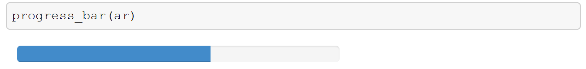

<a href="https://github.com/ipython-books/cookbook-2nd"></a> *This is one of the 100+ free recipes of the [IPython Cookbook, Second Edition](https://github.com/ipython-books/cookbook-2nd), by [Cyrille Rossant](http://cyrille.rossant.net), a guide to numerical computing and data science in the Jupyter Notebook. The ebook and printed book are available for purchase at [Packt Publishing](https://www.packtpub.com/big-data-and-business-intelligence/ipython-interactive-computing-and-visualization-cookbook-second-e).*

▶ *[Text on GitHub](https://github.com/ipython-books/cookbook-2nd) with a [CC-BY-NC-ND license](https://creativecommons.org/licenses/by-nc-nd/3.0/us/legalcode)*  
▶ *[Code on GitHub](https://github.com/ipython-books/cookbook-2nd-code) with a [MIT license](https://opensource.org/licenses/MIT)*

[*Chapter 5 : High-Performance Computing*](./)

# 5.10. Interacting with asynchronous parallel tasks in IPython

In this recipe, we will show how to interact with asynchronous tasks running in parallel with ipyparallel.

## Getting ready

You need to start the IPython engines (see the previous recipe). The simplest option is to launch them from the *IPython Clusters* tab in the Notebook dashboard. In this recipe, we use four engines.

## How to do it...

1. Let's import a few modules:

```python
import sys
import time
import ipyparallel
import ipywidgets
from IPython.display import clear_output, display
```

2. We create a `Client`:

```python
rc = ipyparallel.Client()
```

3. Now, we create a load-balanced view on the IPython engines:

```python
view = rc.load_balanced_view()
```

4. We define a simple function for our parallel tasks:

```python
def f(x):
    import time
    time.sleep(.1)
    return x * x
```

5. We will run this function on 100 integer numbers in parallel:

```python
numbers = list(range(100))
```

6. We execute `f` on our list `numbers` in parallel across all of our engines, using `map_async()`. This function immediately returns an `AsyncResult` object that allows us to interactively retrieve information about the tasks:

```python
ar = view.map_async(f, numbers)
```

7. This object has a `metadata` attribute: a list of dictionaries for all engines. We can get the date of submission and completion, the status, the standard output and error, and other information:

```python
ar.metadata[0]
```

```{output:result}
{'after': None,
 'completed': None,
 'data': {},
 ...
 'submitted': datetime.datetime(2017, ...)}
```

8. Iterating over the `AsyncResult` instance works normally; the iteration progresses in real-time while the tasks are being completed:

```python
for i in ar:
    print(i, end=', ')
```

```{output:stdout}
0, 1, 4, ..., 9801,
```

9. Now, we create a simple progress bar for our asynchronous tasks. The idea is to create a loop polling for the tasks' status at every second. An `IntProgressWidget` widget is updated in real-time and shows the progress of the tasks:

```python
def progress_bar(ar):
    # We create a progress bar.
    w = ipywidgets.IntProgress()
    # The maximum value is the number of tasks.
    w.max = len(ar.msg_ids)
    # We display the widget in the output area.
    display(w)
    # Repeat:
    while not ar.ready():
        # Update the widget's value with the
        # number of tasks that have finished
        # so far.
        w.value = ar.progress
        time.sleep(.1)
    w.value = w.max
```

```python
ar = view.map_async(f, numbers)
```

The progress bar is shown in the following screenshot:

```python
progress_bar(ar)
```



## How it works...

`AsyncResult` instances are returned by asynchronous parallel functions. They implement several useful attributes and methods, notably:

* `elapsed`: Elapsed time since submission
* `progress`: Number of tasks that have competed so far
* `serial_time`: Sum of the computation time of all of the tasks done in parallel
* `metadata`: Dictionary with further information about the task
* `ready()`: Returns whether the call has finished
* `successful()`: Returns whether the call has completed without raising an exception (an exception is raised if the task has not completed yet)
* `wait()`: Blocks until the tasks have completed (there is an optional `timeout` argument)
* `get()`: Blocks until the tasks have completed and returns the result (there is an optional `timeout` argument)

## There's more...

Here are a few references:

* Documentation of the AsyncResult class available at http://ipyparallel.readthedocs.io/en/latest/asyncresult.html
* Documenation of the AsyncResult of the native multiprocessing module at https://docs.python.org/3/library/multiprocessing.html#multiprocessing.pool.AsyncResult
* Documentation of the task interface available at http://ipyparallel.readthedocs.io/en/latest/task.html

## See also

* Distributing your code across multiple cores with IPython
