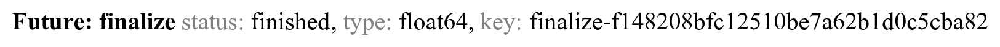
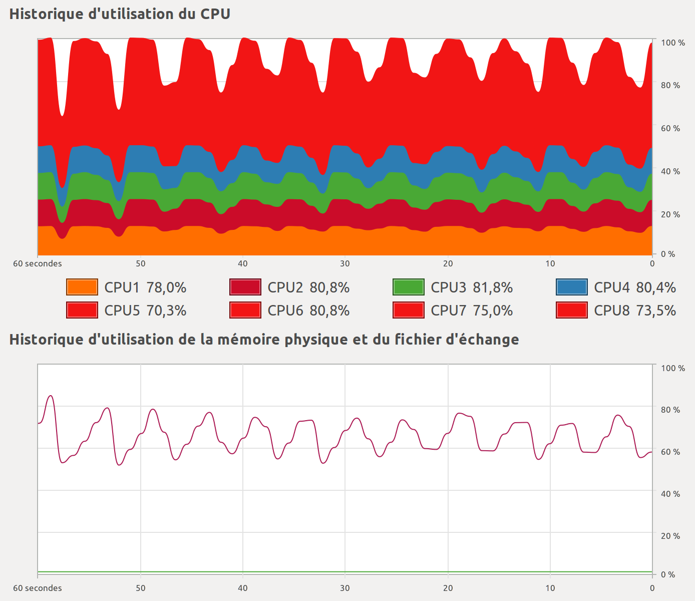

<a href="https://github.com/ipython-books/cookbook-2nd"></a> *This is one of the 100+ free recipes of the [IPython Cookbook, Second Edition](https://github.com/ipython-books/cookbook-2nd), by [Cyrille Rossant](http://cyrille.rossant.net), a guide to numerical computing and data science in the Jupyter Notebook. The ebook and printed book are available for purchase at [Packt Publishing](https://www.packtpub.com/big-data-and-business-intelligence/ipython-interactive-computing-and-visualization-cookbook-second-e).*

▶ *[Text on GitHub](https://github.com/ipython-books/cookbook-2nd) with a [CC-BY-NC-ND license](https://creativecommons.org/licenses/by-nc-nd/3.0/us/legalcode)*  
▶ *[Code on GitHub](https://github.com/ipython-books/cookbook-2nd-code) with a [MIT license](https://opensource.org/licenses/MIT)*

[*Chapter 5 : High-Performance Computing*](./)

# 5.11. Performing out-of-core computations on large arrays with Dask

**Dask** is a parallel computing library that offers not only a general framework for distributing complex computations on many nodes, but also a set of convenient high-level APIs to deal with out-of-core computations on large arrays. Dask provides data structures resembling NumPy arrays (*dask.array*) and pandas DataFrames (*dask.dataframe*) that efficiently scale to huge datasets. The core idea of Dask is to split a large array into smaller arrays (chunks).

In this recipe, we illustrate the basic principles of *dask.array*.

## Getting started

Dask should already be installed in Anaconda, but you can always install it manually with `conda install dask`. You also need `memory_profiler`, which you can install with `conda install memory_profiler`.

## How to do it...

1. Let's import the libraries:

```python
import numpy as np
import dask.array as da
import memory_profiler
```

```python
%load_ext memory_profiler
```

2. We initialize a large 10,000 x 10,000 array with random values using dask. The array is chunked into 100 smaller arrays with size 1000 x 1000:

```python
Y = da.random.normal(size=(10000, 10000),
                     chunks=(1000, 1000))
```

```python
Y
```

```{output:result}
dask.array<da.random.normal, shape=(10000, 10000),
    dtype=float64, chunksize=(1000, 1000)>
```

```python
Y.shape, Y.size, Y.chunks
```

```{output:result}
((10000, 10000),
 100000000,
 ((1000, ..., 1000),
  (1000, ..., 1000)))
```

Memory is not allocated for this huge array. Values will be computed on-the-fly at the last moment.

3. Let's say we want to compute the mean of every column:

```python
mu = Y.mean(axis=0)
mu
```

```{output:result}
dask.array<mean_agg-aggregate, shape=(10000,),
    dtype=float64, chunksize=(1000,)>
```

This object `mu` is still a dask array and nothing has been computed yet.

4. We need to call the `compute()` method to actually launch the computation. Here, only part of the array is allocated because dask is smart enough to compute just what is necessary for the computation. Here, the 10 chunks containing the first column of the array are allocated and involved in the computation of `mu[0]`:

```python
mu[0].compute()
```

```{output:result}
0.011
```

5. Now, we profile the memory usage and time of the same computation using either NumPy or dask.array:

```python
def f_numpy():
    X = np.random.normal(size=(10000, 10000))
    x = X.mean(axis=0)[0:100]
```

```python
%%memit
f_numpy()
```

```{output:stdout}
peak memory: 916.32 MiB, increment: 763.00 MiB
```

```python
%%time
f_numpy()
```

```{output:stdout}
CPU times: user 3.86 s, sys: 664 ms, total: 4.52 s
Wall time: 4.52 s
```

NumPy used 763 MB to allocate the entire array, and the entire process (allocation and computation) took more than 4 seconds. NumPy wasted time generating all random values and computing the mean of all columns whereas we only requested the first 100 columns.

6. Next, we use dask.array to perform the same computation:

```python
def f_dask():
    Y = da.random.normal(size=(10000, 10000),
                         chunks=(1000, 1000))
    y = Y.mean(axis=0)[0:100].compute()
```

```python
%%memit
f_dask()
```

```{output:stdout}
peak memory: 221.42 MiB, increment: 67.64 MiB
```

```python
%%time
f_dask()
```

```{output:stdout}
CPU times: user 492 ms, sys: 12 ms, total: 504 ms
Wall time: 105 ms
```

This time, dask used only 67 MB and the computation lasted about 100 milliseconds.

7. We can do even better by changing the shape of the chunks. Instead of using 100 square chunks, we use 100 rectangular chunks containing 100 full columns each. The size of the chunks (10,000 elements) remains the same:

```python
def f_dask2():
    Y = da.random.normal(size=(10000, 10000),
                         chunks=(10000, 100))
    y = Y.mean(axis=0)[0:100].compute()
```

```python
%%memit
f_dask2()
```

```{output:stdout}
peak memory: 145.60 MiB, increment: 6.93 MiB
```

```python
%%time
f_dask2()
```

```{output:stdout}
CPU times: user 48 ms, sys: 8 ms, total: 56 ms
Wall time: 57.4 ms
```

This is more efficient when computing per-column quantities, because only a single chunk is involved in the computation of the mean of the first 100 columns, compared to 10 chunks in the previous example. The memory usage is therefore 10 times lower here.

8. Finally, we illustrate how we can use multiple cores to perform computations on large arrays. We create a client using *dask.distributed*, a distributed computing library that complements dask:

```python
from dask.distributed import Client
```

```python
client = Client()
```

```python
client
```

9. The computation represented by the `Y.sum()` dask array can be launch locally, or using the dask.distributed client:

```python
Y.sum().compute()
```

```{output:result}
4090.221
```

```python
future = client.compute(Y.sum())
```

```python
future
```



```python
future.result()
```

```{output:result}
4090.221
```

The second method scales to large clusters containing many nodes.

10. We have seen how dask.array could help us manage larger datasets in less memory. Now, we show how we can manipulate arrays that would never fit in our computer. For example, let's compute the average of a large terabyte array:

```python
huge = da.random.uniform(
    size=(1500000, 100000), chunks=(10000, 10000))
"Size in memory: %.1f GB" % (huge.nbytes / 1024 ** 3)
```

```{output:result}
'Size in memory: 1117.6 GB'
```

```python
from dask.diagnostics import ProgressBar
# WARNING: this will take a very long time computing
# useless values. This is for pedagogical purposes
# only.
with ProgressBar():
    m = huge.mean().compute()
```

```{output:stdout}
[##                   ] | 11% Completed |  1min 44.8s
```

The way this task is processed, chunk after chunk, can be seen on this graphic showing CPU and RAM usage as a function of time:



## There's more...

The dask.array interface shown here is just one of the many possibilities offered by the low-level, graph-based distributed computing framework implemented in Dask. With **task scheduling**, a large computation is split into many smaller computations that may have complex dependencies represented by a dependency graph. A scheduler implements algorithms to execute these computations in parallel by respecting the dependencies.

Here are a few references:

* Dask documentation at https://dask.pydata.org/en/latest/index.html
* Integrate Dask with IPython at http://distributed.readthedocs.io/en/latest/ipython.html
* Dask examples at https://dask.pydata.org/en/latest/examples-tutorials.html
* *Parallelizing Scientific Python with Dask*, by James Crist, SciPy 2017 video tutorial at https://www.youtube.com/watch?v=mbfsog3e5DA
* Dask tutorial at https://github.com/dask/dask-tutorial/

## See also

* Distributing Python code across multiple cores with IPython
* Interacting with asynchronous parallel tasks in IPython
