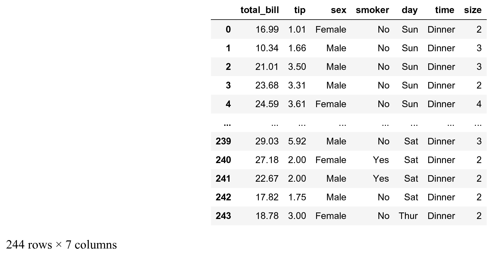
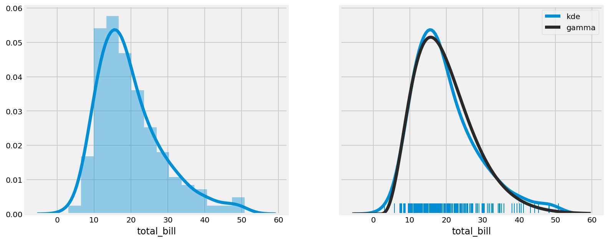
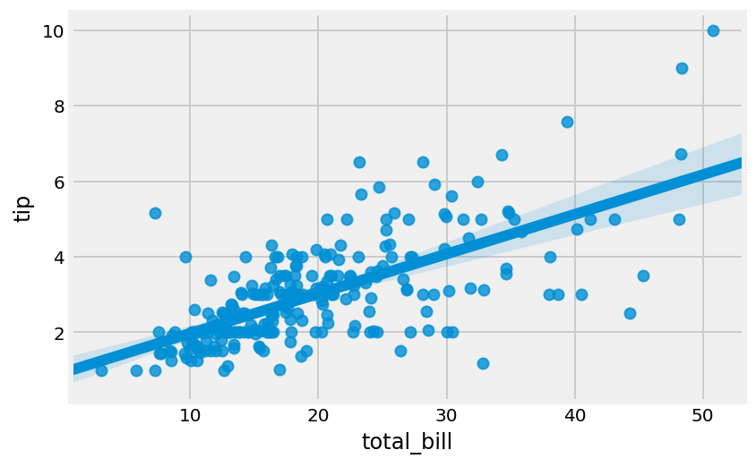
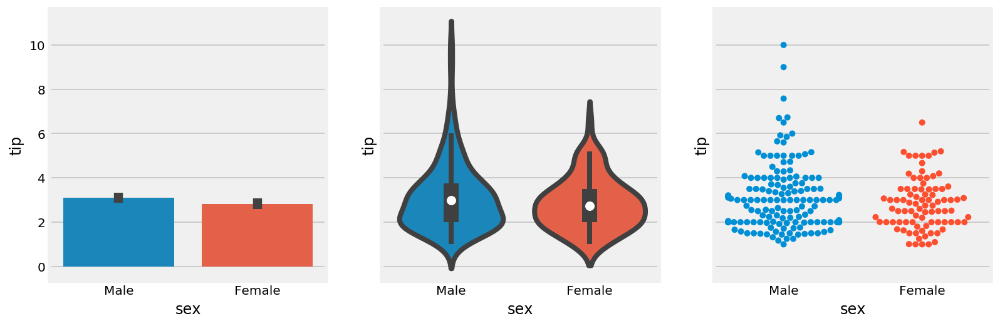
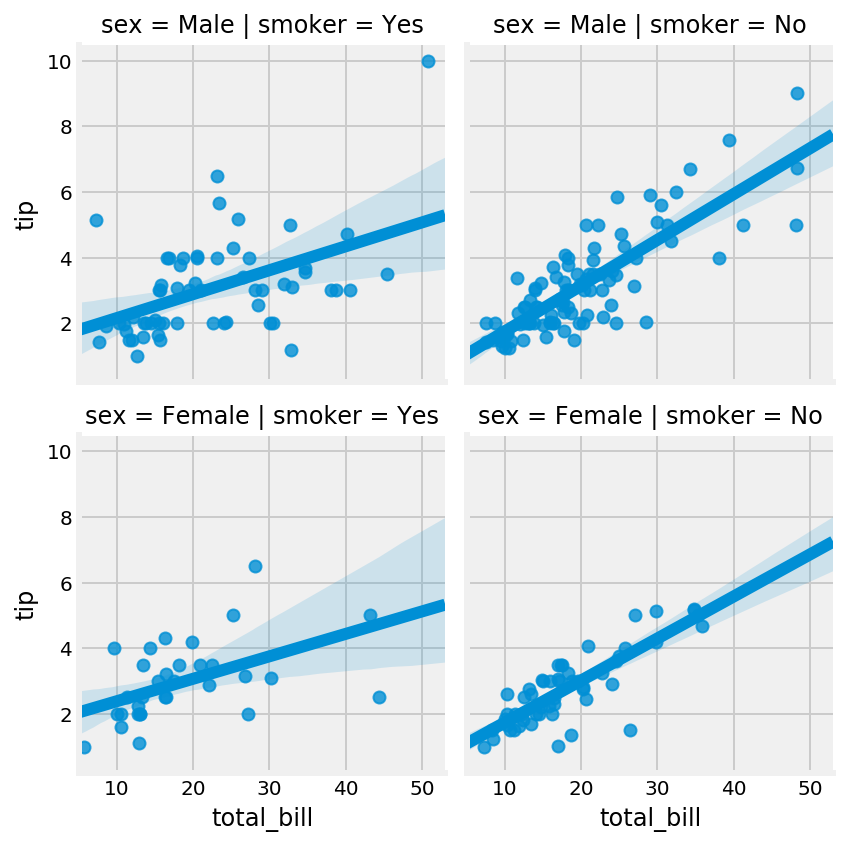

<a href="https://github.com/ipython-books/cookbook-2nd"></a> *This is one of the 100+ free recipes of the [IPython Cookbook, Second Edition](https://github.com/ipython-books/cookbook-2nd), by [Cyrille Rossant](http://cyrille.rossant.net), a guide to numerical computing and data science in the Jupyter Notebook. The ebook and printed book are available for purchase at [Packt Publishing](https://www.packtpub.com/big-data-and-business-intelligence/ipython-interactive-computing-and-visualization-cookbook-second-e).*

▶ *[Text on GitHub](https://github.com/ipython-books/cookbook-2nd) with a [CC-BY-NC-ND license](https://creativecommons.org/licenses/by-nc-nd/3.0/us/legalcode)*  
▶ *[Code on GitHub](https://github.com/ipython-books/cookbook-2nd-code) with a [MIT license](https://opensource.org/licenses/MIT)*

[*Chapter 6 : Data Visualization*](./)

# 6.2. Creating statistical plots easily with seaborn

**seaborn** is a library that builds on top of matplotlib and pandas to provide easy-to-use statistical plotting routines. In this recipe, we give a few examples of the types of statistical plots that can be created with seaborn.

## How to do it...

1. Let's import NumPy, matplotlib, and seaborn:

```python
import numpy as np
from scipy import stats
import matplotlib.pyplot as plt
import seaborn as sns
%matplotlib inline
```

2. seaborn comes with builtin datasets, which are useful when making demos. The `tips` datasets contains the bills and tips of taxi trips:

```python
tips = sns.load_dataset('tips')
tips
```



3. seaborn implements easy-to-use functions to visualize the distribution of datasets. Here, we plot the histogram, **kernel density estimation** (KDE), and a gamma distribution fit of our dataset:

```python
# We create two subplots sharing the same y axis.
f, (ax1, ax2) = plt.subplots(1, 2,
                       figsize=(12, 5),
                       sharey=True)

# Left subplot.
# Histogram and KDE (active by default).
sns.distplot(tips.total_bill,
             ax=ax1,
             hist=True)

# Right subplot.
# "Rugplot", KDE, and gamma fit.
sns.distplot(tips.total_bill,
             ax=ax2,
             hist=False,
             kde=True,
             rug=True,
             fit=stats.gamma,
             fit_kws=dict(label='gamma'),
             kde_kws=dict(label='kde'))
ax2.legend()
```



4. We can make a quick linear regression to visualize the correlation between two variables:

```python
sns.regplot(x="total_bill", y="tip", data=tips)
```



5. We can also visualize the distribution of categorical data with different types of plots. Here, we display a bar plot, a violin plot, and a swarmplot, which show an increasing amount of details:

```python
f, (ax1, ax2, ax3) = plt.subplots(
    1, 3, figsize=(12, 4), sharey=True)
sns.barplot(x='sex', y='tip', data=tips, ax=ax1)
sns.violinplot(x='sex', y='tip', data=tips, ax=ax2)
sns.swarmplot(x='sex', y='tip', data=tips, ax=ax3)
```



The bar plot shows the mean and standard deviation of the tip, for males and females. The violin plot shows an estimation of the distribution in a more informative way than the bar plot, especially with non-Gaussian or multimodal distributions. The swarm plot displays all points, using the x axis to make them non-overlapping.

6. The `FacetGrid` lets us explore a multidimensional dataset with several subplots organized within a grid. Here, we plot the tip as a function of the bill with a linear regression, for every combination of smoker (Yes/No) and sex (Male/Female):

```python
g = sns.FacetGrid(tips, col='smoker', row='sex')
g.map(sns.regplot, 'total_bill', 'tip')
```



## There's more...

Besides seaborn, there are other high-level plotting interfaces:

* The *Grammar of Graphics* is a book by Dr. Leland Wilkinson that has influenced many high-level plotting interfaces such as R's *ggplot2*, Python's *ggplot* by ŷhat, and others.
* **Vega**, by Trifacta, is a declarative visualization grammar that can be translated to D3.js (a JavaScript visualization library). **Altair** provides a Python API for the Vega-Lite specification (a higher-level specification that compiles to Vega).

Here are some more references:

* seaborn tutorial at https://seaborn.pydata.org/tutorial.html
* seaborn gallery at https://seaborn.pydata.org/examples/index.html
* Altair available at https://altair-viz.github.io
* plotnine, a Grammar of Graphics implementation in Python, at https://plotnine.readthedocs.io/en/stable/
* ggplot for Python available at http://ggplot.yhathq.com/
* ggplot2 for the R programming language, available at http://ggplot2.org/
* Python Plotting for Exploratory Data Analysis at http://pythonplot.com/

## See also

* Using matplotlib styles
* Discovering interactive visualization libraries in the Notebook
* Creating plots with Altair and the Vega-Lite specification
