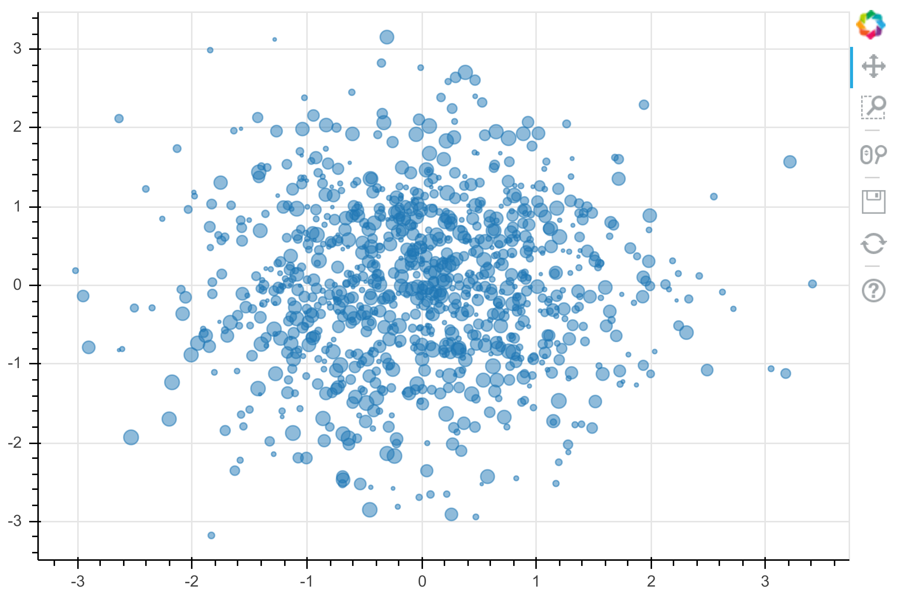
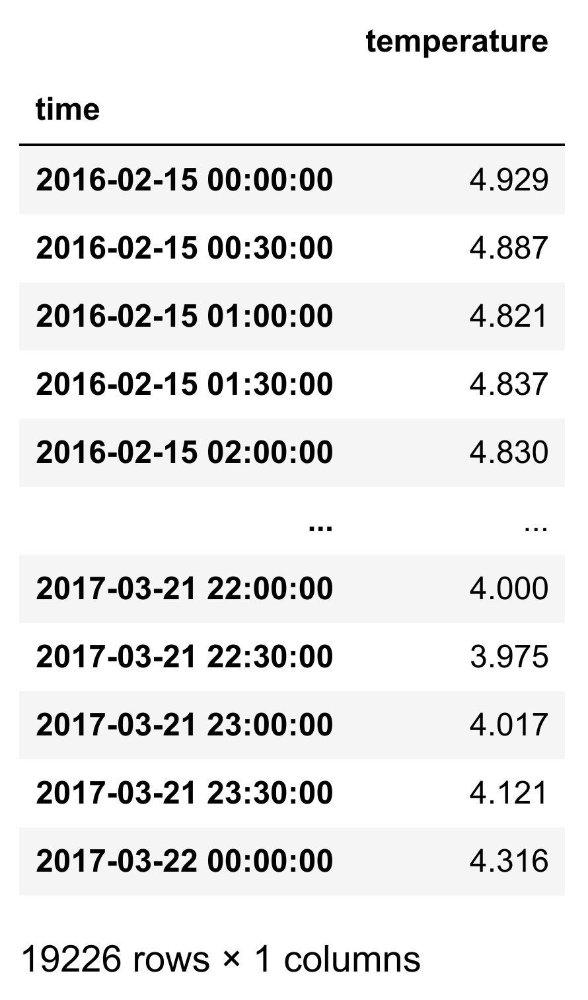
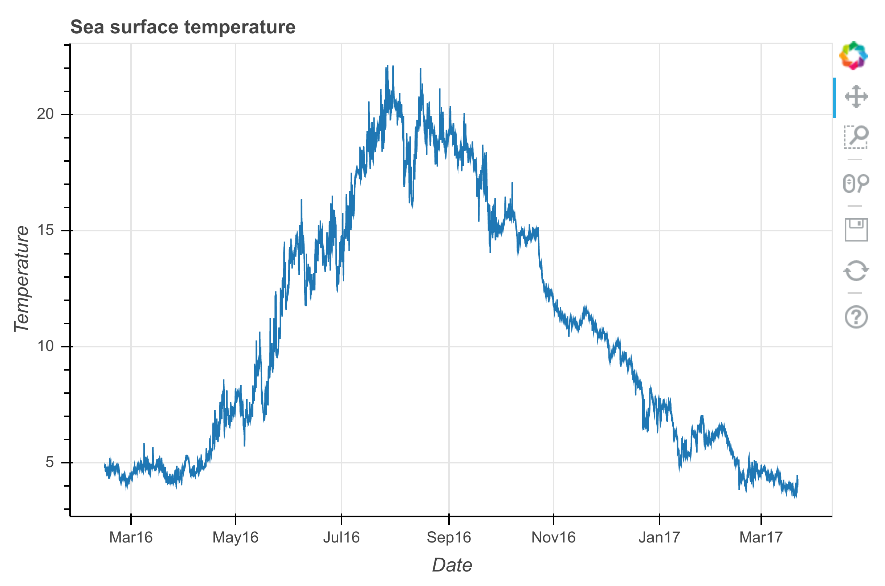
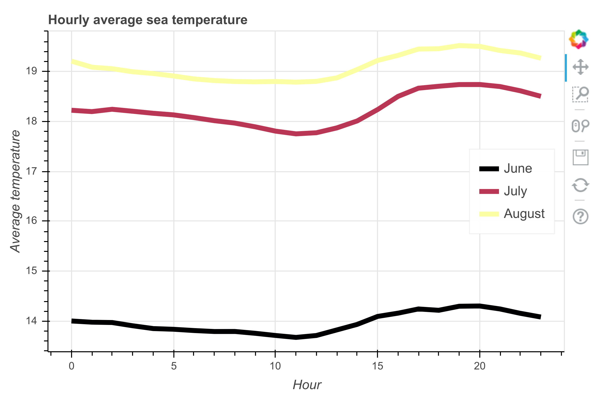
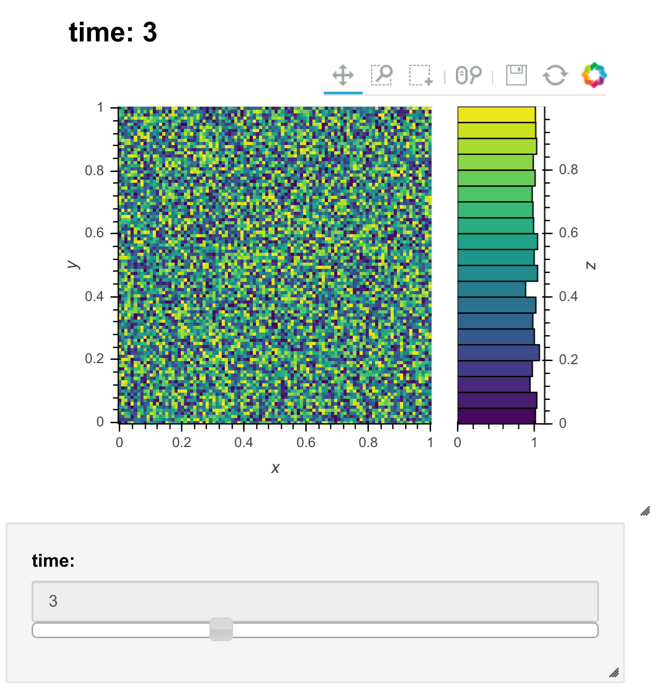

<a href="https://github.com/ipython-books/cookbook-2nd"></a> *This is one of the 100+ free recipes of the [IPython Cookbook, Second Edition](https://github.com/ipython-books/cookbook-2nd), by [Cyrille Rossant](http://cyrille.rossant.net), a guide to numerical computing and data science in the Jupyter Notebook. The ebook and printed book are available for purchase at [Packt Publishing](https://www.packtpub.com/big-data-and-business-intelligence/ipython-interactive-computing-and-visualization-cookbook-second-e).*

▶ *[Text on GitHub](https://github.com/ipython-books/cookbook-2nd) with a [CC-BY-NC-ND license](https://creativecommons.org/licenses/by-nc-nd/3.0/us/legalcode)*  
▶ *[Code on GitHub](https://github.com/ipython-books/cookbook-2nd-code) with a [MIT license](https://opensource.org/licenses/MIT)*

[*Chapter 6 : Data Visualization*](./)

# 6.3. Creating interactive Web visualizations with Bokeh and HoloViews

**Bokeh** (http://bokeh.pydata.org/en/latest/) is a library for creating rich interactive visualizations in a browser. Plots are designed in Python, and they are rendered in the browser.

In this recipe, we will give a few examples of interactive Bokeh figures in the Jupyter Notebook. We will also introduce **HoloViews** which provides a high-level API for bokeh and other plotting libraries.

## Getting ready

Bokeh should be installed by default in Anaconda, but you can also install it manually by typing `conda install bokeh` in a terminal.

To install HoloViews, type `conda install -c ioam holoviews`.

## How to do it...

1. Let's import NumPy and Bokeh. We need to call `output_notebook()` to tell Bokeh to render plots in the Jupyter Notebook.

```python
import numpy as np
import pandas as pd
import bokeh
import bokeh.plotting as bkh
bkh.output_notebook()
```

2. Let's create a scatter plot of random data:

```python
f = bkh.figure(width=600, height=400)
f.circle(np.random.randn(1000),
         np.random.randn(1000),
         size=np.random.uniform(2, 10, 1000),
         alpha=.5)
bkh.show(f)
```



An interactive plot is rendered in the notebook. We can pan and zoom by clicking on the toolbar buttons on the right.

3. Let's load a sample dataset, `sea_surface_temperature`:

```python
from bokeh.sampledata import sea_surface_temperature
data = sea_surface_temperature.sea_surface_temperature
data
```



4. Now, we plot the evolution of the temperature as a function of time:

```python
f = bkh.figure(x_axis_type="datetime",
               title="Sea surface temperature",
               width=600, height=400)
f.line(data.index, data.temperature)
f.xaxis.axis_label = "Date"
f.yaxis.axis_label = "Temperature"
bkh.show(f)
```



5. We use pandas to plot the hourly average temperature:

```python
months = (6, 7, 8)
data_list = [data[data.index.month == m]
             for m in months]
```

```python
# We group by the hour of the measure:
data_avg = [d.groupby(d.index.hour).mean()
            for d in data_list]
```

```python
f = bkh.figure(width=600, height=400,
               title="Hourly average sea temperature")
for d, c, m in zip(data_avg,
                   bokeh.palettes.Inferno[3],
                   ('June', 'July', 'August')):
    f.line(d.index, d.temperature,
           line_width=5,
           line_color=c,
           legend=m,
           )
f.xaxis.axis_label = "Hour"
f.yaxis.axis_label = "Average temperature"
f.legend.location = 'center_right'
bkh.show(f)
```



6. Let's move to HoloViews:

```python
import holoviews as hv
hv.extension('bokeh')
```

7. We create a 3D array which could represent a time-dependent 2D image:

```python
data = np.random.rand(100, 100, 10)
```

```python
ds = hv.Dataset((np.arange(10),
                 np.linspace(0., 1., 100),
                 np.linspace(0., 1., 100),
                 data),
                kdims=['time', 'y', 'x'],
                vdims=['z'])
```

```python
ds
```

```{output:result}
:Dataset   [time,y,x]   (z)
```

The `ds` object is a `Dataset` instance representing our time-dependent data. The **kdims** are the key dimensions (time and space) whereas the **vdims** are the quantities of interest (here, a scalar `z`). In other words, the kdims represent the axes of the 3D array `data`, whereas the vdims represent the values stored in the array.

8. We can easily display the 2D image with a slider to change the time, and a histogram of `z` as a function of time:

```python
%opts Image(cmap='viridis')
ds.to(hv.Image, ['x', 'y']).hist()
```



## There's more...

Bokeh figures in the Notebook are interactive even in the absence of a Python server. For example, our figures can be interactive in nbviewer. Bokeh can also generate standalone HTML/JavaScript documents from our plots. More examples can be found in the gallery.

The **xarray** library (see http://xarray.pydata.org/en/stable/) provides a way to represent multidimensional arrays with axes. HoloViews can work with xarray objects.

**plotly** is a company specialized in interactive visualization. They provide an open-source Python visualization library (see https://plot.ly/python/). They also propose tools for building dashboard-style Web-based interfaces (see https://plot.ly/products/dash/).

**Datashader** (http://datashader.readthedocs.io/en/latest/) and **vaex** (http://vaex.astro.rug.nl/) are two visualization libraries that target very large datasets.

Here are a few references:

* Bokeh user guide at http://bokeh.pydata.org/en/latest/docs/user_guide.html
* Bokeh gallery at http://bokeh.pydata.org/en/latest/docs/gallery.html
* Using Bokeh in the Notebook, available at http://bokeh.pydata.org/en/latest/docs/user_guide/notebook.html
* HoloViews at http://holoviews.org
* HoloViews gallery at http://holoviews.org/gallery/index.html
* HoloViews tutorial at https://github.com/ioam/jupytercon2017-holoviews-tutorial
