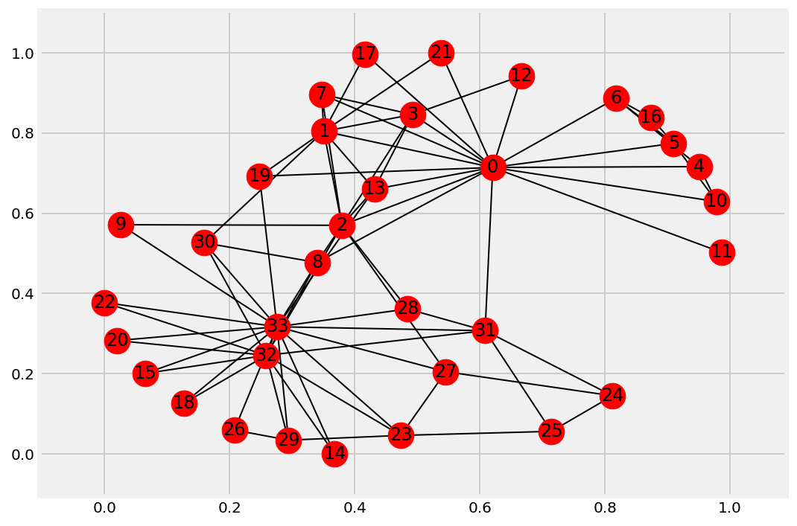
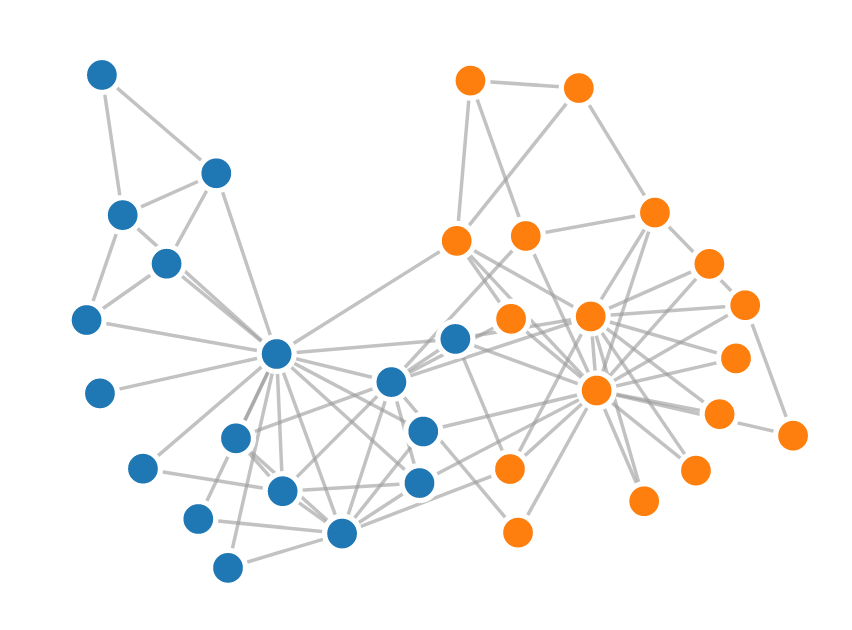

<a href="https://github.com/ipython-books/cookbook-2nd"></a> *This is one of the 100+ free recipes of the [IPython Cookbook, Second Edition](https://github.com/ipython-books/cookbook-2nd), by [Cyrille Rossant](http://cyrille.rossant.net), a guide to numerical computing and data science in the Jupyter Notebook. The ebook and printed book are available for purchase at [Packt Publishing](https://www.packtpub.com/big-data-and-business-intelligence/ipython-interactive-computing-and-visualization-cookbook-second-e).*

▶ *[Text on GitHub](https://github.com/ipython-books/cookbook-2nd) with a [CC-BY-NC-ND license](https://creativecommons.org/licenses/by-nc-nd/3.0/us/legalcode)*  
▶ *[Code on GitHub](https://github.com/ipython-books/cookbook-2nd-code) with a [MIT license](https://opensource.org/licenses/MIT)*

[*Chapter 6 : Data Visualization*](./)

# 6.4. Visualizing a NetworkX graph in the Notebook with D3.js

**D3.js** (http://d3js.org) is a popular interactive visualization framework for the Web. Written in JavaScript, it allows us to create data-driven visualizations based on Web technologies such as HTML, SVG, and CSS. The officiall gallery contains many examples (https://github.com/d3/d3/wiki/gallery). There are many other JavaScript visualization and charting libraries, but we will focus on D3.js in this recipe.

Being a pure JavaScript library, D3.js has in principle nothing to do with Python. However, the HTML-based Jupyter Notebook can integrate D3.js visualizations seamlessly.

In this recipe, we will create a graph in Python with NetworkX and visualize it in the Jupyter Notebook with D3.js.

## Getting ready

You need to know the basics of HTML, JavaScript, and D3.js for this recipe.

## How to do it...

1. Let's import the packages:

```python
import json
import numpy as np
import networkx as nx
import matplotlib.pyplot as plt
%matplotlib inline
```

2. We load a famous social graph published in 1977 called **Zachary's Karate Club graph**. This graph represents the friendships between members of a Karate club. The club's president and the instructor were involved in a dispute, resulting in a split of this group. Here, we simply display the graph with matplotlib (using the `networkx.draw()` function):

```python
g = nx.karate_club_graph()
fig, ax = plt.subplots(1, 1, figsize=(8, 6));
nx.draw_networkx(g, ax=ax)
```



3. Now, we're going to display this graph in the notebook with D3.js. The first step is to bring this graph to JavaScript. Here, we choose to export the graph to JSON. D3.js generally expects each edge to be an object with a source and target. Also, we specify which side each member has taken (`club` attribute):

```python
nodes = [{'name': str(i), 'club': g.node[i]['club']}
         for i in g.nodes()]
links = [{'source': u[0], 'target': u[1]}
         for u in g.edges()]
with open('graph.json', 'w') as f:
    json.dump({'nodes': nodes, 'links': links},
              f, indent=4,)
```

4. The next step is to create an HTML object that will contain the visualization. Here, we create a `<div>` element in the notebook. We also specify a few CSS styles for nodes and links (also called edges):

```python
%%html
<div id="d3-example"></div>
<style>
.node {stroke: #fff; stroke-width: 1.5px;}
.link {stroke: #999; stroke-opacity: .6;}
</style>
```

5. The last step is trickier. We write the JavaScript code to load the graph from the JSON file and display it with D3.js. Knowing the basics of D3.js is required here (see the documentation of D3.js):

```python
%%javascript
// We load the d3.js library from the Web.
require.config({paths:
    {d3: "http://d3js.org/d3.v3.min"}});
require(["d3"], function(d3) {
  // The code in this block is executed when the
  // d3.js library has been loaded.

  // First, we specify the size of the canvas
  // containing the visualization (size of the
  // <div> element).
  var width = 300, height = 300;

  // We create a color scale.
  var color = d3.scale.category10();

  // We create a force-directed dynamic graph layout.
  var force = d3.layout.force()
    .charge(-120)
    .linkDistance(30)
    .size([width, height]);

  // In the <div> element, we create a <svg> graphic
  // that will contain our interactive visualization.
  var svg = d3.select("#d3-example").select("svg")
  if (svg.empty()) {
    svg = d3.select("#d3-example").append("svg")
          .attr("width", width)
          .attr("height", height);
  }

  // We load the JSON file.
  d3.json("graph.json", function(error, graph) {
    // In this block, the file has been loaded
    // and the 'graph' object contains our graph.

    // We load the nodes and links in the
    // force-directed graph.
    force.nodes(graph.nodes)
      .links(graph.links)
      .start();

    // We create a <line> SVG element for each link
    // in the graph.
    var link = svg.selectAll(".link")
      .data(graph.links)
      .enter().append("line")
      .attr("class", "link");

    // We create a <circle> SVG element for each node
    // in the graph, and we specify a few attributes.
    var node = svg.selectAll(".node")
      .data(graph.nodes)
      .enter().append("circle")
      .attr("class", "node")
      .attr("r", 5)  // radius
      .style("fill", function(d) {
         // The node color depends on the club.
         return color(d.club);
      })
      .call(force.drag);

    // The name of each node is the node number.
    node.append("title")
        .text(function(d) { return d.name; });

    // We bind the positions of the SVG elements
    // to the positions of the dynamic force-directed
    // graph, at each time step.
    force.on("tick", function() {
      link.attr("x1", function(d){return d.source.x})
          .attr("y1", function(d){return d.source.y})
          .attr("x2", function(d){return d.target.x})
          .attr("y2", function(d){return d.target.y});

      node.attr("cx", function(d){return d.x})
          .attr("cy", function(d){return d.y});
    });
  });
});
```

When we execute this cell, the HTML object created in the previous cell is updated. The graph is animated and interactive; we can click on nodes, see their labels, and move them within the canvas:



## There's more...

NetworkX implements routines to import/export graphs from/into files in different formats.

Here are a few references:

* Reading and writing graphs with NetworkX, at https://networkx.github.io/documentation/stable/reference/readwrite/index.html
* NetworkX and JSON, at https://networkx.github.io/documentation/stable/reference/readwrite/json_graph.html

## See also

* Creating interactive Web visualizations with Bokeh and HoloViews
