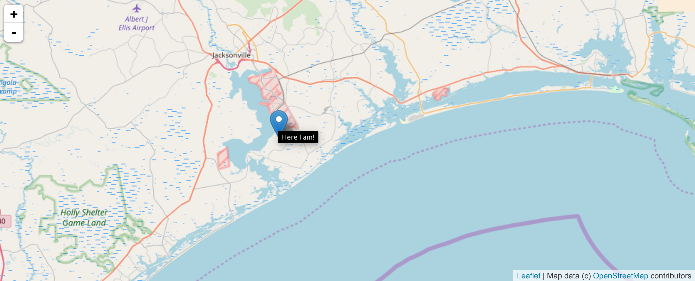
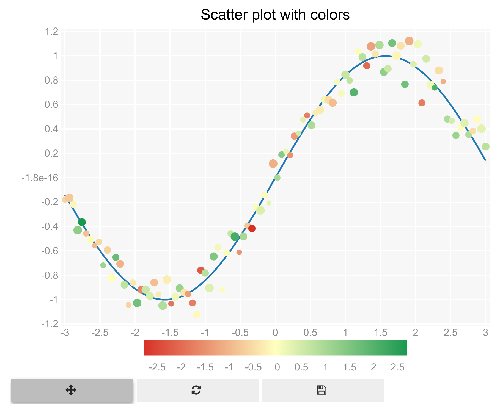
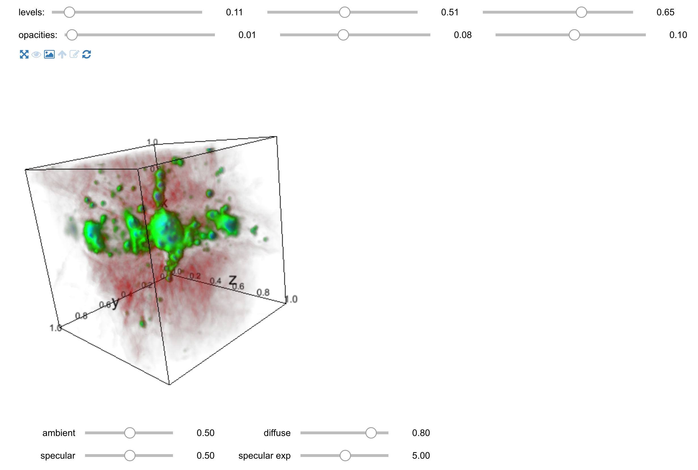

<a href="https://github.com/ipython-books/cookbook-2nd"></a> *This is one of the 100+ free recipes of the [IPython Cookbook, Second Edition](https://github.com/ipython-books/cookbook-2nd), by [Cyrille Rossant](http://cyrille.rossant.net), a guide to numerical computing and data science in the Jupyter Notebook. The ebook and printed book are available for purchase at [Packt Publishing](https://www.packtpub.com/big-data-and-business-intelligence/ipython-interactive-computing-and-visualization-cookbook-second-e).*

▶ *[Text on GitHub](https://github.com/ipython-books/cookbook-2nd) with a [CC-BY-NC-ND license](https://creativecommons.org/licenses/by-nc-nd/3.0/us/legalcode)*  
▶ *[Code on GitHub](https://github.com/ipython-books/cookbook-2nd-code) with a [MIT license](https://opensource.org/licenses/MIT)*

[*Chapter 6 : Data Visualization*](./)

# 6.5. Discovering interactive visualization libraries in the Notebook

[The recipe is available in the book, to be purchased on Packt.](https://www.packtpub.com/big-data-and-business-intelligence/ipython-interactive-computing-and-visualization-cookbook-second-e)

<!-- REMOVE AS PER PACKT AGREEMENT

Several libraries provide interactive visualization of 2D or 3D data in the Notebook, using the capabilities of the Jupyter widgets. We give basic examples using four of these libraries: **ipyleaflet**, **bqplot**, **pythreejs**, and **ipyvolume**.

## Getting started

To install the libraries, type `conda install -c conda-forge ipyleaflet bqplot pythreejs ipyvolume` in a terminal.

## How to do it...

1. First, we show a simple example of *ipyleaflet* which offers a Python interface to use the Leaflet.js interactive mapping library (similar to Google Maps, but based on the open source project OpenStreetMaps):

```python
from ipyleaflet import Map, Marker
```

2. We create a map around a given position specified in GPS coordinates:

```python
pos = [34.62, -77.34]
m = Map(center=pos, zoom=10)
```

3. We also add a marker at that position:

```python
marker = Marker(location=pos,
                rise_on_hover=True,
                title="Here I am!",
                )
```

```python
m += marker
```

4. We display the map in the notebook:

```python
m
```



5. Let's move to the **bqplot** interactive plotting library which implements an API inspired by Grammar of Graphics:

```python
import numpy as np
import bqplot.pyplot as plt
```

6. We display an interactive plot using an API that should be familiar to any matplotlib user:

```python
plt.figure(title='Scatter plot with colors')
t = np.linspace(-3, 3, 100)
x = np.sin(t)
y = np.sin(t) + .1 * np.random.randn(100)
plt.plot(t, x)
plt.scatter(t, y,
            size=np.random.uniform(15, 50, 100),
            color=np.random.randn(100))
plt.show()
```



7. Next, we show an example of **pythreejs**, a Python bridge to the **three.js** 3D library in Javascript. This library uses WebGL, an API that leverages the GPU for fast real-time rendering in the browser:

```python
from pythreejs import *
```

8. We will display a parametric surface plot. We define the function as a string containing Javascript code:

```python
f = """
function f(x, y) {
    x = 2 * (x - .5);
    y = 2 * (y - .5);
    r2 = x * x + y * y;
    var z = Math.exp(-2 * r2) * (
        Math.cos(12*x) * Math.sin(12*y));
    return new THREE.Vector3(x, y, z)
}
"""
```

9. We also create a texture for the surface:

```python
texture = np.random.uniform(.5, .9, (20, 20))
material = LambertMaterial(
    map=height_texture(texture))
```

10. We create ambient and directional lights:

```python
alight = AmbientLight(color='#777777')
dlight = DirectionalLight(color='white',
                          position=[3, 5, 1],
                          intensity=0.6)
```

11. We create the surface mesh:

```python
surf_g = ParametricGeometry(func=f)
surf = Mesh(geometry=surf_g,
            material=material)
```

12. Finally, we initialize the scene, the camera, and we display the plot:

```python
scene = Scene(children=[surf, alight])
c = PerspectiveCamera(position=[2.5, 2.5, 2.5],
                      up=[0, 0, 1],
                      children=[dlight])
Renderer(camera=c, scene=scene,
         controls=[OrbitControls(controlling=c)])
```


13. The last libary is **ipyvolume**, a 3D plotting library in Python that also uses WebGL in the Notebook:

```python
import ipyvolume
```

14. This library provides volume rendering features, where a volumetric dataset represented as a 3D array is visualized using ray tracing techniques:

```python
ds = ipyvolume.datasets.aquariusA2.fetch()
ipyvolume.quickvolshow(ds.data, lighting=True)
```



## There's more

Here are several references:

* Jupyter widgets at http://jupyter.org/widgets.html
* ipyleaflet at https://github.com/ellisonbg/ipyleaflet
* bqplot at https://bqplot.readthedocs.io/en/stable/
* pythreejs at https://github.com/jovyan/pythreejs
* three.js at https://threejs.org/
* ipyvolume at https://github.com/maartenbreddels/ipyvolume
* Jupyter Google Maps at http://jupyter-gmaps.readthedocs.io/en/latest/
* An interactive 3D molecular viewer for Jupyter, based on NGL, at http://nglviewer.org/nglview/latest/

-->
