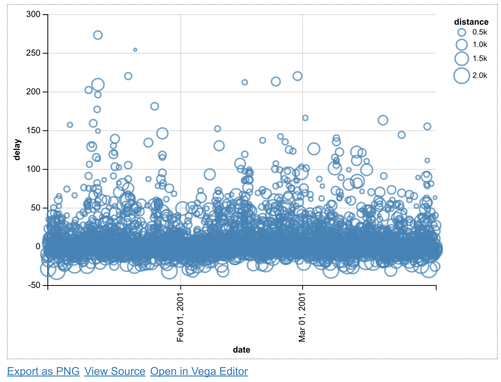
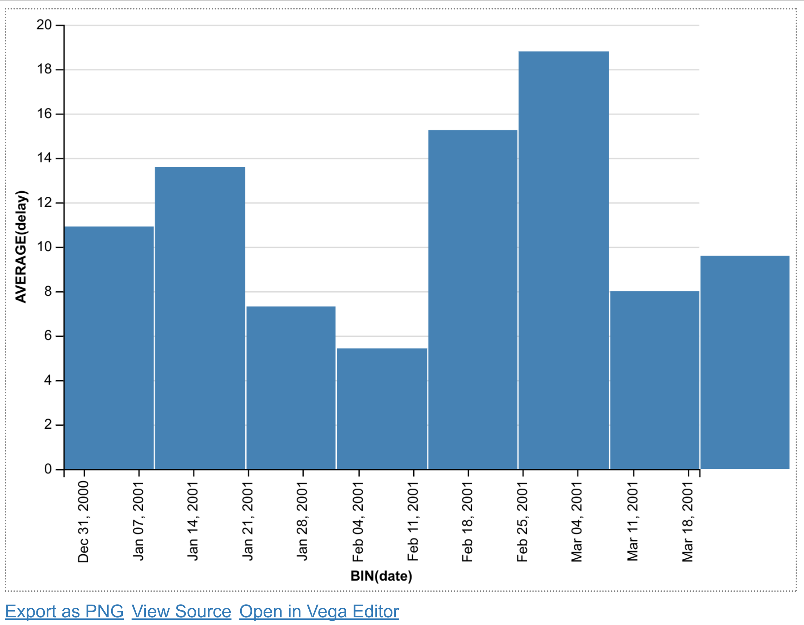
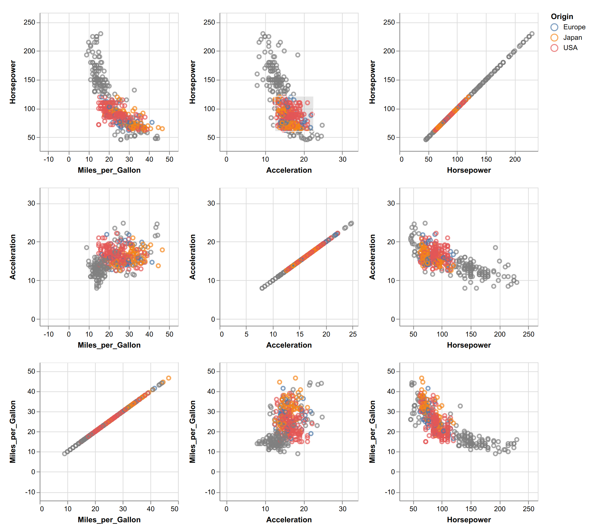

<a href="https://github.com/ipython-books/cookbook-2nd"></a> *This is one of the 100+ free recipes of the [IPython Cookbook, Second Edition](https://github.com/ipython-books/cookbook-2nd), by [Cyrille Rossant](http://cyrille.rossant.net), a guide to numerical computing and data science in the Jupyter Notebook. The ebook and printed book are available for purchase at [Packt Publishing](https://www.packtpub.com/big-data-and-business-intelligence/ipython-interactive-computing-and-visualization-cookbook-second-e).*

▶ *[Text on GitHub](https://github.com/ipython-books/cookbook-2nd) with a [CC-BY-NC-ND license](https://creativecommons.org/licenses/by-nc-nd/3.0/us/legalcode)*  
▶ *[Code on GitHub](https://github.com/ipython-books/cookbook-2nd-code) with a [MIT license](https://opensource.org/licenses/MIT)*

[*Chapter 6 : Data Visualization*](./)

# 6.6. Creating plots with Altair and the Vega-Lite specification

**Vega** is a declarative format for designing static and interactive visualizations. It provides a JSON-based visualization grammar that focuses on the *what* instead of the *how*. **Vega-Lite** is a higher-level specification that is easier to use than Vega, and that compiles directly to Vega.

**Altair** is a Python library that provides a simple API to define and display Vega-Lite visualizations. It works in the Jupyter Notebook, JupyterLab, and nteract.

> Altair is under active development and some details of the API might change in future versions.

## Getting started...

Install Altair with `conda install -c conda-forge altair`.

## How to do it...

1. Let's import Altair:

```python
import altair as alt
```

2. Altair provides several example datasets:

```python
alt.list_datasets()
```

```{output:result}
['airports',
 ...
 'driving',
 'flare',
 'flights-10k',
 'flights-20k',
 'flights-2k',
 'flights-3m',
 'flights-5k',
 'flights-airport',
 'gapminder',
 ...
 'wheat',
 'world-110m']
```

3. We load the `flights-5k` dataset:

```python
df = alt.load_dataset('flights-5k')
```

The `load_dataset()` function returns a pandas `DataFrame`.

```python
df.head(3)
```


This dataset provides the date, origin, destination, flight distance, and delay of many flights.

4. Let's create a scatter plot showing the delay as a function of the date, with the marker size depending on the flight distance:

```python
alt.Chart(df).mark_point().encode(
    x='date',
    y='delay',
    size='distance',
)
```



The `mark_point()` method specifies that we're creating a scatter plot. The `encode()` function allows us to link parameters of the plot (*x* and *y* coordinates, the point size) to specific columns in our DataFrame.

5. Next, we create a bar plot with the average delay of all flights departing from Los Angeles, as a function of time:

```python
df_la = df[df['origin'] == 'LAX']

x = alt.X('date', bin=True)
y = 'average(delay)'

alt.Chart(df_la).mark_bar().encode(
    x=x,
    y=y,
)
```



We select all flights departing from the `LAX` airport using pandas. For the *x* coordinate, we use the `alt.X` class to specify that we want a histogram (`bin=True`). For the *y* coordinate, we specify the average of all delays for every bin.

6. Now, we create a histogram of the average delay of every origin airport. We use the `sort` option of the `X` class to specify that we want to order the *x* axis (origin) as a function of the average delay, in descending order:

```python
sort_delay = alt.SortField(
    'delay', op='average', order='descending')

x = alt.X('origin', sort=sort_delay)
y = 'average(delay)'

alt.Chart(df).mark_bar().encode(
    x=x,
    y=y,
)
```


## How it works...

Altair provides a Python API to generate a Vega-Lite specification in JSON. The `to_json()` method of an Altair chart can be used to inspect the JSON created by Altair. For example, here is the JSON of the last chart example above:

```json
{
 "$schema": "https://vega.github.io/schema/vega-lite/v1.2.1.json",
 "data": {
  "values": [
   {
    "date": "2001-01-10 18:20:00",
    "delay": 25,
    "destination": "HOU",
    "distance": 192,
    "origin": "SAT"
   },
   ...
  ]
 },
 "encoding": {
  "x": {
   "field": "origin",
   "sort": {
    "field": "delay",
    "op": "average",
    "order": "descending"
   },
   "type": "nominal"
  },
  "y": {
   "aggregate": "average",
   "field": "delay",
   "type": "quantitative"
  }
 },
 "mark": "bar"
}
```

The JSON may contain the data itself, like here, or a URL to a data file. It also defines the *encoding channels* which link the chart parameters to the data.

In the Jupyter Notebook, Altair leverages the Vega-Lite library to create a Canvas or SVG figure with the requested plot.

## There's more...

Altair and Vega-Lite support much more complex charts, as can be seen in the galleries of these projects.

Vega-Lite supports interactive plots. The following example from the Vega-Lite gallery illustrates linked brushing between subplots, where a rectangular selection can be drawn with the mouse in any subplot:



There is also an online editor on the Vega-Lite website that can be used to create plots directly in the browser without installing anything.

Here are a few references:

* Altair documentation at https://altair-viz.github.io/
* Altair gallery at https://altair-viz.github.io/gallery/index.html
* Vega-Lite documentation at https://vega.github.io/vega-lite/
* Vega-Lite gallery at https://vega.github.io/vega-lite/examples/
* Vega-Lite online editor at https://vega.github.io/editor/#/custom/vega-lite

## See also

* Creating statistical plots easily with seaborn
* Discovering interactive visualization libraries in the Notebook
