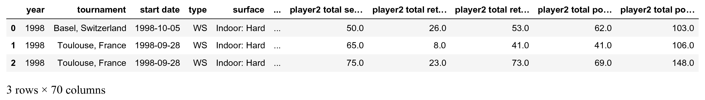
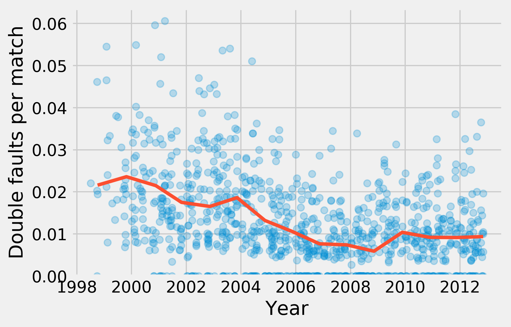

<a href="https://github.com/ipython-books/cookbook-2nd"></a> *This is one of the 100+ free recipes of the [IPython Cookbook, Second Edition](https://github.com/ipython-books/cookbook-2nd), by [Cyrille Rossant](http://cyrille.rossant.net), a guide to numerical computing and data science in the Jupyter Notebook. The ebook and printed book are available for purchase at [Packt Publishing](https://www.packtpub.com/big-data-and-business-intelligence/ipython-interactive-computing-and-visualization-cookbook-second-e).*

▶ *[Text on GitHub](https://github.com/ipython-books/cookbook-2nd) with a [CC-BY-NC-ND license](https://creativecommons.org/licenses/by-nc-nd/3.0/us/legalcode)*  
▶ *[Code on GitHub](https://github.com/ipython-books/cookbook-2nd-code) with a [MIT license](https://opensource.org/licenses/MIT)*

[*Chapter 7 : Statistical Data Analysis*](./)

# 7.1. Exploring a dataset with pandas and matplotlib

In this first recipe, we will show how to conduct a preliminary analysis of a dataset with pandas. This is typically the first step after getting access to the data. pandas lets us load the data very easily, explore the variables, and make basic plots with matplotlib.

We will take a look at a dataset containing all ATP matches played by the Swiss tennis player Roger Federer until 2012.

## How to do it...

1. We import NumPy, pandas, and matplotlib:

```python
from datetime import datetime
import numpy as np
import pandas as pd
import matplotlib.pyplot as plt
%matplotlib inline
```

2. The dataset is a CSV file, that is, a text file with comma-separated values. pandas lets us load this file with a single function:

```python
player = 'Roger Federer'
df = pd.read_csv('https://github.com/ipython-books/'
                 'cookbook-2nd-data/blob/master/'
                 'federer.csv?raw=true',
                 parse_dates=['start date'],
                 dayfirst=True)
```

We can have a first look at this dataset by just displaying it in the Jupyter Notebook:

```python
df.head(3)
```



3. There are many columns. Each row corresponds to a match played by Roger Federer. Let's add a Boolean variable indicating whether he has won the match or not. The `tail()` method displays the last rows of the column:

```python
df['win'] = df['winner'] == player
df['win'].tail()
```

```{output:result}
1174    False
1175     True
1176     True
1177     True
1178    False
Name: win, dtype: bool
```

4. `df['win']` is a `Series` object. It is very similar to a NumPy array, except that each value has an index (here, the match index). This object has a few standard statistical functions. For example, let's look at the proportion of matches won:

```python
won = 100 * df['win'].mean()
print(f"{player} has won {won:.0f}% of his matches.")
```

```{output:stdout}
Roger Federer has won 82% of his matches.
```

5. Now, we are going to look at the evolution of some variables across time. The `df['start date']` field contains the start date of the tournament:

```python
date = df['start date']
```

6. We are now looking at the proportion of double faults in each match (taking into account that there are logically more double faults in longer matches!). This number is an indicator of the player's state of mind, his level of self-confidence, his willingness to take risks while serving, and other parameters.

```python
df['dblfaults'] = (df['player1 double faults'] /
                   df['player1 total points total'])
```

7. We can use the `head()` and `tail()` methods to take a look at the beginning and the end of the column, and `describe()` to get summary statistics. In particular, let's note that some rows have `NaN` values (that is, the number of double faults is not available for all matches).

```python
df['dblfaults'].tail()
```

```{output:result}
1174    0.018116
1175    0.000000
1176    0.000000
1177    0.011561
1178         NaN
Name: dblfaults, dtype: float64
```

```python
df['dblfaults'].describe()
```

```{output:result}
count    1027.000000
mean        0.012129
std         0.010797
min         0.000000
25%         0.004444
50%         0.010000
75%         0.018108
max         0.060606
Name: dblfaults, dtype: float64
```

8. A very powerful feature in pandas is `groupby()`. This function allows us to group together rows that have the same value in a particular column. Then, we can aggregate this group by value to compute statistics in each group. For instance, here is how we can get the proportion of wins as a function of the tournament's surface:

```python
df.groupby('surface')['win'].mean()
```

```{output:result}
surface
Indoor: Carpet    0.736842
Indoor: Clay      0.833333
Indoor: Hard      0.836283
Outdoor: Clay     0.779116
Outdoor: Grass    0.871429
Outdoor: Hard     0.842324
Name: win, dtype: float64
```

9. Now, we are going to display the proportion of double faults as a function of the tournament date, as well as the yearly average. To do this, we also use `groupby()`:

```python
gb = df.groupby('year')
```

10. `gb` is a `GroupBy` instance. It is similar to a `DataFrame` object, but there are multiple rows per group (all matches played in each year). We can aggregate these rows using the `mean()` operation. We use the matplotlib `plot_date()` function because the x-axis contains dates:

```python
fig, ax = plt.subplots(1, 1)
ax.plot_date(date.astype(datetime), df['dblfaults'],
             alpha=.25, lw=0)
ax.plot_date(gb['start date'].max().astype(datetime),
             gb['dblfaults'].mean(), '-', lw=3)
ax.set_xlabel('Year')
ax.set_ylabel('Double faults per match')
ax.set_ylim(0)
```



## There's more...

pandas is an excellent tool for data wrangling and exploratory analysis. pandas accepts all sorts of formats (text-based, and binary files) and it lets us manipulate tables in many ways. In particular, the `groupby()` function is particularly powerful.

What we covered here is only the first step in a data-analysis process. We need more advanced statistical methods to obtain reliable information about the underlying phenomena, make decisions and predictions, and so on. This is the topic of the following recipes.

In addition, more complex datasets demand more sophisticated analysis methods. For example, digital recordings, images, sounds, and videos require specific signal processing treatments before we can apply statistical techniques. These questions will be covered in subsequent chapters.

Here are a few references about pandas:

* pandas website at https://pandas.pydata.org/
* pandas tutorial at http://pandas.pydata.org/pandas-docs/stable/10min.html
* Python for Data Analysis, 2nd Edition, Wes McKinney, O'Reilly Media, at http://shop.oreilly.com/product/0636920050896.do
