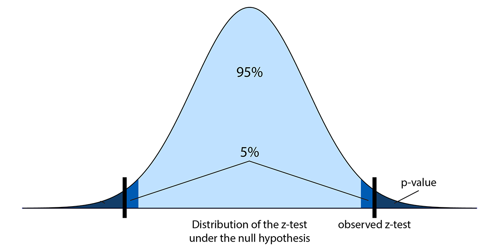

<a href="https://github.com/ipython-books/cookbook-2nd"></a> *This is one of the 100+ free recipes of the [IPython Cookbook, Second Edition](https://github.com/ipython-books/cookbook-2nd), by [Cyrille Rossant](http://cyrille.rossant.net), a guide to numerical computing and data science in the Jupyter Notebook. The ebook and printed book are available for purchase at [Packt Publishing](https://www.packtpub.com/big-data-and-business-intelligence/ipython-interactive-computing-and-visualization-cookbook-second-e).*

▶ *[Text on GitHub](https://github.com/ipython-books/cookbook-2nd) with a [CC-BY-NC-ND license](https://creativecommons.org/licenses/by-nc-nd/3.0/us/legalcode)*  
▶ *[Code on GitHub](https://github.com/ipython-books/cookbook-2nd-code) with a [MIT license](https://opensource.org/licenses/MIT)*

[*Chapter 7 : Statistical Data Analysis*](./)

# 7.2. Getting started with statistical hypothesis testing — a simple z-test

**Statistical hypothesis testing** allows us to make decisions in the presence of incomplete data. By definition, these decisions are uncertain. Statisticians have developed rigorous methods to evaluate this risk. Nevertheless, some subjectivity is always involved in the decision-making process. The theory is just a tool that helps us make decisions in an uncertain world.

Here, we introduce the most basic ideas behind statistical hypothesis testing. We will follow an particularly simple example: coin tossing. More precisely, we will show how to perform a **z-test**, and we will briefly explain the mathematical ideas underlying it. This kind of method (also called the *frequentist method*), although widely used in science, is not without flaws and interpretation difficulties. We will show another approach based on Bayesian theory later in this chapter. It is very helpful to understand both approaches.

## Getting ready

You need to have a basic knowledge of probability theory for this recipe (random variables, distributions, expectancy, variance, central limit theorem, and so on).

## How to do it...

Many frequentist methods for hypothesis testing roughly involve the following steps:

1. Writing down the hypotheses, notably the **null hypothesis**, which is the *opposite* of the hypothesis we want to prove (with a certain degree of confidence).
2. Computing a **test statistic**, a mathematical formula depending on the test type, the model, the hypotheses, and the data.
3. Using the computed value to reject the hypothesis with a given level of uncertainty, or fail to conclude (and, consequently, accept the hypothesis until future studies reject it).

For example, to test the efficacy of a new drug, doctors may consider, as a null hypothesis, that the drug has no statistically significant effect on a group of patients compared to a control group of patients who do not take the drug. If studies reject the null hypothesis, it is an argument in favor of the efficacy of the drug (but it is not a definite proof).

Here, we flip a coin $n$ times and we observe $h$ heads. We want to know whether the coin is fair (null hypothesis). This example is particularly simple yet quite useful for pedagogical purposes. Besides, it is the basis of many more complex methods.

We denote the Bernoulli distribution by $B(q)$ with the unknown parameter $q$. You can refer to https://en.wikipedia.org/wiki/Bernoulli_distribution for more information.

A Bernoulli variable is:

* 0 (tail) with probability $1-q$
* 1 (head) with probability $q$

Here are the steps required to conduct a simple statistical z-test:

1. Let's suppose that after $n=100$ flips, we get $h=61$ heads. We choose a significance level of 0.05: is the coin fair or not? Our null hypothesis is: *the coin is fair* ($q = 1/2$). We set these variables:

```python
import numpy as np
import scipy.stats as st
import scipy.special as sp
```

```python
n = 100  # number of coin flips
h = 61  # number of heads
q = .5  # null-hypothesis of fair coin
```

2. Let's compute the **z-score**, which is defined by the following formula (`xbar` is the estimated average of the distribution). We will explain this formula in the next section, *How it works...*

```python
xbar = float(h) / n
z = (xbar - q) * np.sqrt(n / (q * (1 - q)))
# We don't want to display more than 4 decimals.
z
```

```{output:result}
 2.2000
```

3. Now, from the z-score, we can compute the p-value as follows:

```python
pval = 2 * (1 - st.norm.cdf(z))
pval
```

```{output:result}
 0.0278
```

4. This p-value is less than 0.05, so we reject the null hypothesis and conclude that *the coin is probably not fair*.

## How it works...

The coin tossing experiment is modeled as a sequence of $n$ independent random variables $x_i \in \{0,1\}$ following the Bernoulli distribution $B(q)$. Each $x_i$ represents one coin flip. After our experiment, we get actual values (samples) for these variables. A different notation is sometimes used to distinguish between the random variables (probabilistic objects) and the actual values (samples).

The following formula gives the **sample mean** (proportion of heads here):

$$\overline x = \frac{1}{n} \sum_i x_i$$

Knowing the expectancy $\mu = q$ and variance $\sigma^2 = q (1 - q)$ of the distribution $B(q)$, we compute:

$$\begin{align*}
E[\overline x] &= \mu = q\\
\mathrm{var}(\overline x) &= \frac{\sigma^2}{n} = \frac{q(1-q)}{n}
\end{align*}$$

The z-test is the normalized version of $\overline x$ (we remove its mean, and divide by the standard deviation, thus we get a variable with mean 0 and standard deviation 1):

$$z = \frac{\overline x - E[\overline x]}{\mathrm{std}(\overline x)} = (\overline x - q) \sqrt{\frac{n}{q(1-q)}}$$

Under the null hypothesis, what is the probability of obtaining a z-test higher (in absolute value) than some quantity $z_0$? This probability is called the (two-sided) **p-value**. According to the central limit theorem, the z-test approximately follows a standard Gaussian distribution $N(0,1)$ for large $n$, so we get:

$$p = P[|z|>z_0] = 2P[z>z_0] \simeq 2(1-\Phi(z_0))$$

The following diagram illustrates the z-score and the p-value:



In this formula, $\Phi$ is the **cumulative distribution function** of a standard normal distribution. In SciPy, we can get it with `scipy.stats.norm.cdf`. So, given the z-test computed from the data, we compute the p-value: the probability of observing a z-test more extreme than the observed test, under the null hypothesis.

If the p-value is less than five percent (a frequently-chosen significance level, for arbitrary and historical reasons), we conclude that either:

* The null hypothesis is false, thus we conclude that the coin is unfair.
* The null hypothesis is true, and it's just bad luck if we obtained these values. We cannot make a conclusion.

We cannot disambiguate between these two options in this framework, but typically the first option is chosen. We hit the limits of frequentist statistics, although there are ways to mitigate this problem (for example, by conducting several independent studies and looking at all of their conclusions).

## There's more...

There are many statistical tests that follow this pattern. Reviewing all those tests is largely beyond the scope of this book, but you can take a look at the reference at https://en.wikipedia.org/wiki/Statistical_hypothesis_testing.

As a p-value is not easy to interpret, it can lead to wrong conclusions, even in peer-reviewed scientific publications. For an in-depth treatment of the subject, see http://www.refsmmat.com/statistics/.

## See also

* The *Getting started with Bayesian methods* recipe
