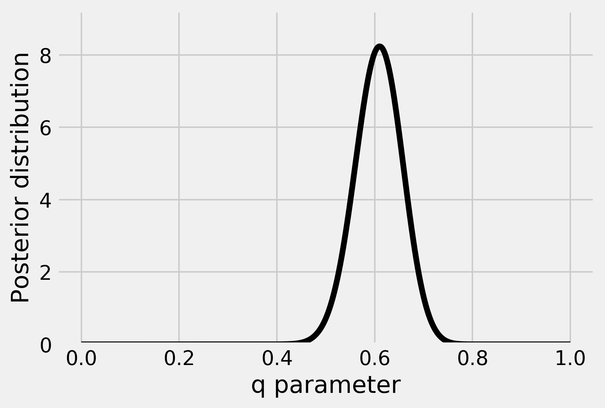

<a href="https://github.com/ipython-books/cookbook-2nd"></a> *This is one of the 100+ free recipes of the [IPython Cookbook, Second Edition](https://github.com/ipython-books/cookbook-2nd), by [Cyrille Rossant](http://cyrille.rossant.net), a guide to numerical computing and data science in the Jupyter Notebook. The ebook and printed book are available for purchase at [Packt Publishing](https://www.packtpub.com/big-data-and-business-intelligence/ipython-interactive-computing-and-visualization-cookbook-second-e).*

▶ *[Text on GitHub](https://github.com/ipython-books/cookbook-2nd) with a [CC-BY-NC-ND license](https://creativecommons.org/licenses/by-nc-nd/3.0/us/legalcode)*  
▶ *[Code on GitHub](https://github.com/ipython-books/cookbook-2nd-code) with a [MIT license](https://opensource.org/licenses/MIT)*

[*Chapter 7 : Statistical Data Analysis*](./)

# 7.3. Getting started with Bayesian methods

In the last recipe, we used a frequentist method to test a hypothesis on incomplete data. Here, we will see an alternative approach based on **Bayesian theory**. The main idea is to consider that *unknown parameters are random variables*, just like the variables describing the experiment. Prior knowledge about the parameters is integrated into the model. This knowledge is updated as more and more data is observed.

Frequentists and Bayesians interpret probabilities differently. Frequentists interpret a probability as a limit of frequencies when the number of samples tends to infinity. Bayesians interpret it as a belief; this belief is updated as more and more data is observed.

Here, we revisit the previous coin flipping example with a Bayesian approach. This example is sufficiently simple to permit an analytical treatment. In general, as we will see later in this chapter, analytical results cannot be obtained and numerical methods become essential.

## Getting ready

This is a math-heavy recipe. Knowledge of basic probability theory (random variables, distributions, Bayes formula) and calculus (derivatives, integrals) is recommended. We use the same notations as in the previous recipe.

## How to do it...

Let $q$ be the probability of obtaining a head. Whereas $q$ was just a fixed number in the previous recipe, we consider here that it is a **random variable**. Initially, this variable follows a distribution called the **prior probability distribution**. It represents our knowledge about $q$ *before* we start flipping the coin. We will update this distribution after each trial (posterior distribution).

1. First, we assume that $q$ is a *uniform* random variable on the interval $[0, 1]$. That's our prior distribution: for all $q$, $P(q)=1$.
2. Then, we flip our coin $n$ times. We note $x_i$ the outcome of the $i$th flip ($0$ for tail, $1$ for head).
3. What is the probability distribution of $q$ knowing the observations $x_i$? **Bayes' theorem** allows us to compute the *posterior distribution* analytically (see the next section for the mathematical details):

$$P \left( q \mid \{x_i\} \right) = \frac{P(\{x_i\} \mid q) P(q)}{\displaystyle\int_0^1 P(\{x_i\} \mid q) P(q) dq} = (n+1)\binom n h q^h (1-q)^{n-h}$$

4. We define the posterior distribution according to the mathematical formula above. We remark that this expression is $(n+1)$ times the **probability mass function (PMF)** of the binomial distribution, which is directly available in `scipy.stats`. (For more information on Binomial distribution, refer to https://en.wikipedia.org/wiki/Binomial_distribution.)

```python
import numpy as np
import scipy.stats as st
import matplotlib.pyplot as plt
%matplotlib inline
```

```python
def posterior(n, h, q):
    return (n + 1) * st.binom(n, q).pmf(h)
```

5. Let's plot this distribution for an observation of $h=61$ heads and $n=100$ total flips:

```python
n = 100
h = 61
q = np.linspace(0., 1., 1000)
d = posterior(n, h, q)
```

```python
fig, ax = plt.subplots(1, 1)
ax.plot(q, d, '-k')
ax.set_xlabel('q parameter')
ax.set_ylabel('Posterior distribution')
ax.set_ylim(0, d.max() + 1)
```



This curve represents our belief about the parameter q after we have observed 61 heads.

## How it works...

In this section, we explain Bayes' theorem, and we give the mathematical details underlying this example.

### Bayes' theorem

There is a very general idea in data science that consists of explaining data with a mathematical model. This is formalized with a one-way process, *model → data*.

Once this process is formalized, the task of the data scientist is to exploit the data to recover information about the model. In other words, we want to *invert* the original process and get *data → model*.

In a probabilistic setting, the direct process is represented as a **conditional probability distribution** $P(data \mid model)$. This is the probability of observing the data when the model is entirely specified.

Similarly, the inverse process is $P(model \mid data)$. It gives us information about the model (what we're looking for), knowing the observations (what we have).

Bayes' theorem is at the core of a general framework for inverting a probabilistic process of *model → data*. It can be stated as follows:

$$P(\textrm{model} \mid \textrm{data}) = \frac{P(\textrm{data} \mid \textrm{model}) \, P(\textrm{model})}{P(\textrm{data})}$$

This equation gives us information about our model, knowing the observed data. Bayes' equation is widely used in signal processing, statistics, machine learning, inverse problems, and in many other scientific applications.

In Bayes' equation, $P(model)$ reflects our prior knowledge about the model. Also, $P(data)$ is the distribution of the data. It is generally expressed as an integral of $P(data \mid model) \, P(model)$.

In conclusion, Bayes' equation gives us a general roadmap for data inference:

1. Specify a mathematical model for the direct process *model → data* (the $P(data \mid model)$ term).
2. Specify a prior probability distribution for the model ($P(model)$ term).
3. Perform analytical or numerical calculations to solve this equation.

### Computation of the posterior distribution

In this recipe's example, we found the posterior distribution with the following equation (deriving directly from Bayes' theorem):

$$P(q \mid \{x_i\}) = \frac{P(\{x_i\} \mid q) \, P(q)}{\displaystyle\int_0^1 P(\{x_i\} \mid q) \, P(q) \, dq}$$

Knowing that the $x_i$ are independent, we get ($h$ being the number of heads):

$$P(\{x_i\} \mid q) = \prod_{i=1}^n P(x_i \mid q) = q^h (1-q)^{n-h}$$

In addition, we can compute analytically the following integral (using an integration by parts and an induction):

$$\int_0^1 P(\{x_i\} \mid q) P(q) dq = \int_0^1 q^h (1-q)^{n-h} dq = \frac{1}{(n+1)\binom n h}$$

Finally, we get:

$$P(q \mid \{x_i\}) = \frac{P(\{x_i\} \mid q) \, P(q)}{\displaystyle\int_0^1 P(\{x_i\} \mid q) \, P(q) \, dq} = (n+1)\binom n h  q^h (1-q)^{n-h}$$

### Maximum a posteriori estimation

We can get a point estimate from the posterior distribution. For example, the **maximum a posteriori (MAP) estimation** consists of considering the maximum of the posterior distribution as an estimate for $q$. We can find this maximum analytically or numerically. For more information on MAP, refer to https://en.wikipedia.org/wiki/Maximum_a_posteriori_estimation.

Here, we can get this estimate analytically by deriving the posterior distribution with respect to $q$. We get (assuming $1 \leq h \leq n-1$):

$$\frac{d P(q \mid \{x_i\})}{dq} = (n+1)\frac{n!}{(n-h)! \, h!} \left( h q^{h-1} (1-q)^{n-h} - (n-h)q^h (1-q)^{n-h-1} \right)$$

This expression is equal to zero when $q = h/n$. This is the MAP estimate of the parameter $q$. This value happens to be the proportion of heads obtained in the experiment.

## There's more...

In this recipe, we showed a few basic notions in Bayesian theory. We illustrated them with a simple example. The fact that we were able to derive the posterior distribution analytically is not very common in real-world applications. This example is nevertheless informative because it explains the core mathematical ideas behind the complex numerical methods we will see later.

### Credible interval

The posterior distribution indicates the plausible values for $q$ given the observations. We could use it to derive a **credible interval**, likely to contain the actual value. Credible intervals are the Bayesian analog to confidence intervals in frequentist statistics. For more information on credible intervals, refer to https://en.wikipedia.org/wiki/Credible_interval.

### Conjugate distributions

In this recipe, the prior and posterior distributions are **conjugate**, meaning that they belong to the same family (the beta distribution). For this reason, we were able to compute the posterior distribution analytically. You will find more details about conjugate distributions at https://en.wikipedia.org/wiki/Conjugate_prior.

### Non-informative (objective) prior distributions

We chose a uniform distribution as prior distribution for the unknown parameter $q$. It is a simple choice and it leads to tractable computations. It reflects the intuitive fact that we do not favor any particular value a priori. However, there are rigorous ways of choosing completely uninformative priors (see https://en.wikipedia.org/wiki/Prior_probability#Uninformative_priors). An example is the Jeffreys prior, based on the idea that the prior distribution should not depend on the parameterization of the parameters. For more information on Jeffreys prior, refer to https://en.wikipedia.org/wiki/Jeffreys_prior. In our example, the Jeffreys prior is:

$$P(q) = \frac{1}{\sqrt{q(1-q)}}$$

## See also

* The *Fitting a Bayesian model by sampling from a posterior distribution with a Markov chain Monte Carlo method* recipe
