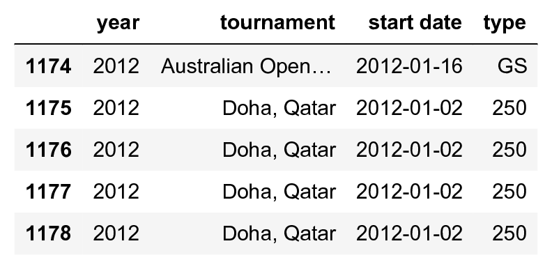
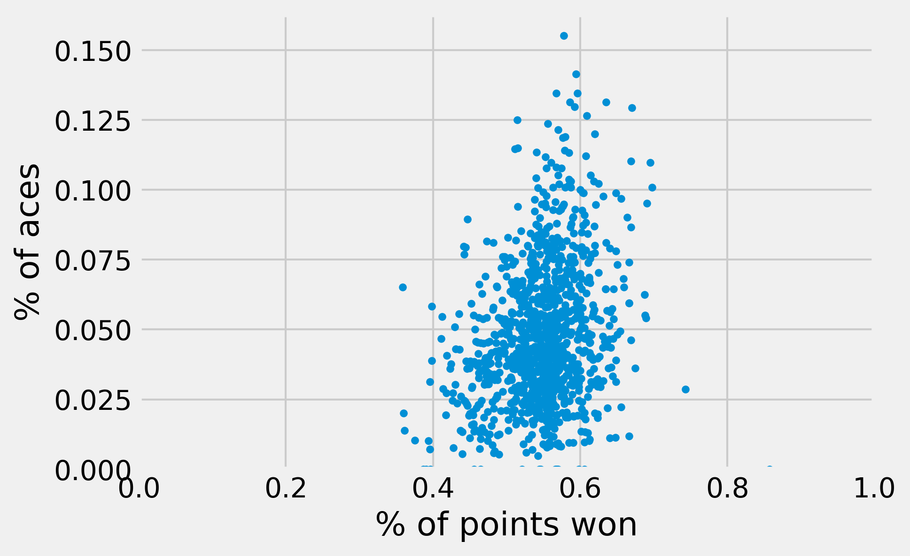
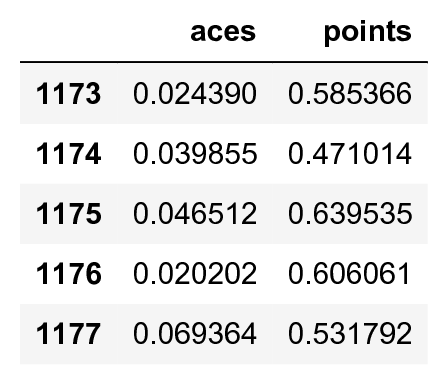
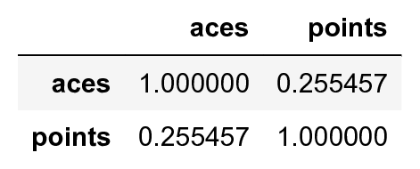

<a href="https://github.com/ipython-books/cookbook-2nd"></a> *This is one of the 100+ free recipes of the [IPython Cookbook, Second Edition](https://github.com/ipython-books/cookbook-2nd), by [Cyrille Rossant](http://cyrille.rossant.net), a guide to numerical computing and data science in the Jupyter Notebook. The ebook and printed book are available for purchase at [Packt Publishing](https://www.packtpub.com/big-data-and-business-intelligence/ipython-interactive-computing-and-visualization-cookbook-second-e).*

▶ *[Text on GitHub](https://github.com/ipython-books/cookbook-2nd) with a [CC-BY-NC-ND license](https://creativecommons.org/licenses/by-nc-nd/3.0/us/legalcode)*  
▶ *[Code on GitHub](https://github.com/ipython-books/cookbook-2nd-code) with a [MIT license](https://opensource.org/licenses/MIT)*

[*Chapter 7 : Statistical Data Analysis*](./)

# 7.4. Estimating the correlation between two variables with a contingency table and a chi-squared test

Whereas univariate methods deal with single-variable observations, multivariate methods consider observations with several features. Multivariate datasets allow the study of *relations* between variables, more particularly their correlation, or lack thereof (that is, independence).

In this recipe, we will take a look at the same tennis dataset as in the first recipe of this chapter. Following a frequentist approach, we will estimate the correlation between the number of aces and the proportion of points won by a tennis player.

## How to do it...

1. Let's import NumPy, pandas, SciPy.stats, and matplotlib:

```python
import numpy as np
import pandas as pd
import scipy.stats as st
import matplotlib.pyplot as plt
%matplotlib inline
```

2. We download and load the dataset:

```python
player = 'Roger Federer'
df = pd.read_csv('https://github.com/ipython-books/'
                 'cookbook-2nd-data/blob/master/'
                 'federer.csv?raw=true',
                 parse_dates=['start date'],
                 dayfirst=True)
```

3. Each row corresponds to a match, and the 70 columns contain many player characteristics during that match:

```python
print(f"Number of columns: {len(df.columns)}")
df[df.columns[:4]].tail()
```

```{output:stdout}
Number of columns: 70
```



4. Here, we only look at the proportion of points won, and the (relative) number of aces:

```python
npoints = df['player1 total points total']
points = df['player1 total points won'] / npoints
aces = df['player1 aces'] / npoints
```

```python
fig, ax = plt.subplots(1, 1)
ax.plot(points, aces, '.')
ax.set_xlabel('% of points won')
ax.set_ylabel('% of aces')
ax.set_xlim(0., 1.)
ax.set_ylim(0.)
```



If the two variables were independent, we would not see any trend in the cloud of points. On this plot, it is a bit hard to tell. Let's use pandas to compute a coefficient correlation.

5. For simplicity, we create a new `DataFrame` object with only these fields. We also remove the rows where one field is missing (using `dropna()`):

```python
df_bis = pd.DataFrame({'points': points,
                       'aces': aces}).dropna()
df_bis.tail()
```



6. Let's compute the Pearson's correlation coefficient between the relative number of aces in the match, and the number of points won:

```python
df_bis.corr()
```



A correlation of ~0.26 seems to indicate a positive correlation between our two variables. In other words, the more aces in a match, the more points the player wins (which is not very surprising!).

7. Now, to determine if there is a *statistically significant* correlation between the variables, we use a **chi-squared test** of the independence of variables in a **contingency table**.
8. First, we binarize our variables. Here, the value corresponding to the number of aces is `True` if the player is serving more aces than usual in a match, and `False` otherwise:

```python
df_bis['result'] = (df_bis['points'] >
                    df_bis['points'].median())
df_bis['manyaces'] = (df_bis['aces'] >
                      df_bis['aces'].median())
```

9. Then, we create a contingency table, with the frequencies of all four possibilities (True and True, True and False, and so on):

```python
pd.crosstab(df_bis['result'], df_bis['manyaces'])
```


10. Finally, we compute the chi-squared test statistic and the associated p-value. The null hypothesis is the independence between the variables. SciPy implements this test in `scipy.stats.chi2_contingency()`, which returns several objects. We're interested in the second result, which is the p-value:

```python
st.chi2_contingency(_)
```

```{output:result}
(2.780e+01, 1.338e-07, 1,
    array([[ 257.250,  256.749],
           [ 256.749,  256.250]]))
```

The p-value is much lower than 0.05, so we reject the null hypothesis and conclude that there is a statistically significant correlation between the proportion of aces and the proportion of points won in a match in this dataset.

> Correlation does not imply causation. Here, it is likely that external factors influence both variables. See https://en.wikipedia.org/wiki/Correlation_does_not_imply_causation for more details.

## How it works...

We give here a few details about the statistical concepts used in this recipe.

### Pearson's correlation coefficient

Pearson's correlation coefficient measures the linear correlation between two random variables, $X$ and $Y$. It is a normalized version of the covariance:

$$\rho = \frac{\mathrm{cov}(X,Y)}{\sqrt{\mathrm{var}(X)\mathrm{var}(Y)}} = \frac{E\Big(\big(X-E(X)\big)\big(Y-E(Y)\big)\Big)}{\sqrt{\mathrm{var}(X)\mathrm{var}(Y)}}$$

It can be estimated by substituting, in this formula, the expectancy with the sample mean, and the variance with the sample variance. More details about its inference can be found at https://en.wikipedia.org/wiki/Pearson_product-moment_correlation_coefficient.

### Contingency table and chi-squared test

The contingency table contains the frequencies $O_{ij}$ of all combinations of outcomes, when there are multiple random variables that can take a finite number of values. Under the null hypothesis of independence, we can compute the *expected frequencies* $E_{ij}$, based on the marginal sums (sums in each row). The chi-squared statistic, by definition, is:

$$\chi = \sum_{i,j} \frac{(O_{ij} - E_{ij})^2}{E_{ij}}$$

When there are sufficiently many observations, this variable approximately follows a chi-squared distribution (the distribution of the sum of normal variables squared). Once we get the p-value, as explained in the *Getting started with statistical hypothesis testing – a simple z-test* recipe, we can reject or accept the null hypothesis of independence. Then, we can conclude (or not) that there exists a significant correlation between the variables.

## There's more...

There are many other sorts of chi-squared tests, that is, tests where the test statistic follows a chi-squared distribution. These tests are widely used for testing the goodness-of-fit of a distribution, or testing the independence of variables. More information can be found in the following pages:

* Chi2 test in SciPy documentation available at http://docs.scipy.org/doc/scipy/reference/generated/scipy.stats.chi2_contingency.html
* Contingency table introduced at https://en.wikipedia.org/wiki/Contingency_table
* Chi-squared test introduced at https://en.wikipedia.org/wiki/Pearson's_chi-squared_test

## See also

* The *Getting started with statistical hypothesis testing – a simple z-test* recipe
