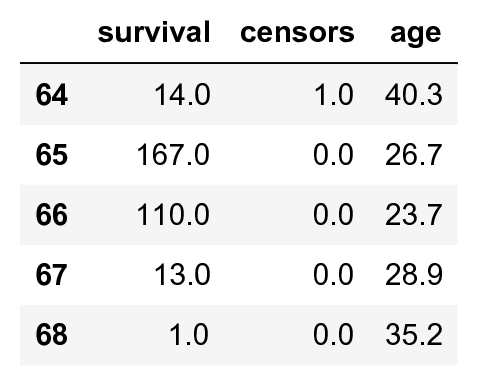
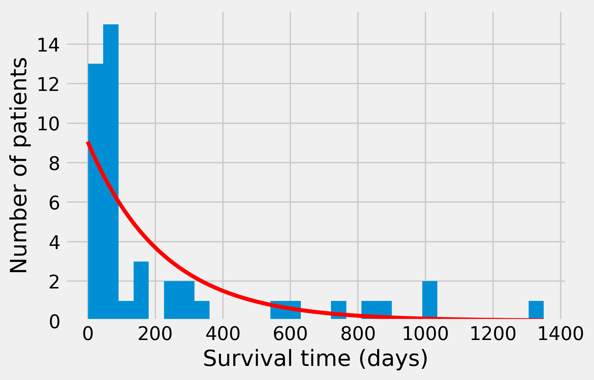
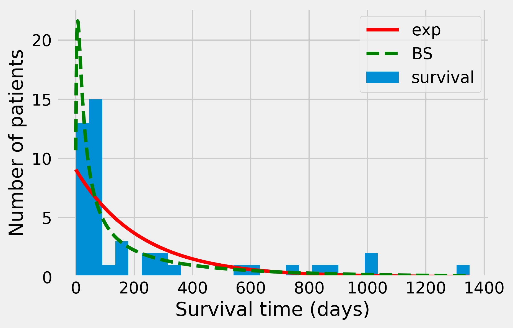

<a href="https://github.com/ipython-books/cookbook-2nd"></a> *This is one of the 100+ free recipes of the [IPython Cookbook, Second Edition](https://github.com/ipython-books/cookbook-2nd), by [Cyrille Rossant](http://cyrille.rossant.net), a guide to numerical computing and data science in the Jupyter Notebook. The ebook and printed book are available for purchase at [Packt Publishing](https://www.packtpub.com/big-data-and-business-intelligence/ipython-interactive-computing-and-visualization-cookbook-second-e).*

▶ *[Text on GitHub](https://github.com/ipython-books/cookbook-2nd) with a [CC-BY-NC-ND license](https://creativecommons.org/licenses/by-nc-nd/3.0/us/legalcode)*  
▶ *[Code on GitHub](https://github.com/ipython-books/cookbook-2nd-code) with a [MIT license](https://opensource.org/licenses/MIT)*

[*Chapter 7 : Statistical Data Analysis*](./)

# 7.5. Fitting a probability distribution to data with the maximum likelihood method

A good way to explain a dataset is to apply a probabilistic model to it. Finding an adequate model can be a job in its own. Once a model is chosen, it is necessary to compare it to the data. This is what statistical estimation is about. In this recipe, we apply the **maximum likelihood method** on a dataset of survival times after heart transplant (1967-1974 study).

## Getting ready

As usual in this chapter, a background in probability theory and real analysis is recommended. In addition, you need the statsmodels package to retrieve the test dataset. It should be included in Anaconda, but you can always install it with the `conda install statsmodels` command.

## How to do it...

1. statsmodels is a Python package for conducting statistical data analyses. It also contains real-world datasets that we can use when experimenting with new methods. Here, we load the *heart* dataset:

```python
import numpy as np
import scipy.stats as st
import statsmodels.datasets
import matplotlib.pyplot as plt
%matplotlib inline
```

```python
data = statsmodels.datasets.heart.load_pandas().data
```

2. Let's take a look at this DataFrame.

```python
data.tail()
```



This dataset contains censored and uncensored data: a censor of 0 means that the patient was alive at the end of the study, and thus we don't know the exact survival time. We only know that the patient survived *at least* the indicated number of days. For simplicity here, we only keep uncensored data (we thereby introduce a bias toward patients that did not survive very long after their transplant):

```python
data = data[data.censors == 1]
survival = data.survival
```

3. Let's take a look at the data graphically, by plotting the raw survival data and the histogram:

```python
fig, (ax1, ax2) = plt.subplots(1, 2, figsize=(10, 4))

ax1.plot(sorted(survival)[::-1], 'o')
ax1.set_xlabel('Patient')
ax1.set_ylabel('Survival time (days)')

ax2.hist(survival, bins=15)
ax2.set_xlabel('Survival time (days)')
ax2.set_ylabel('Number of patients')
```


4. We observe that the histogram is decreasing very rapidly. Fortunately, the survival rates today are much higher (~70 percent after 5 years). Let's try to fit an exponential distribution (more information on the exponential distribution is available at https://en.wikipedia.org/wiki/Exponential_distribution) to the data. According to this model, $S$ (number of days of survival) is an exponential random variable with the parameter $\lambda$, and the observations $s_i$ are sampled from this distribution. Let the sample mean be:

$$\overline s = \frac 1 n \sum s_i$$

The likelihood function of an exponential distribution is as follows, by definition (see proof in the next section):

$$\mathcal{L}(\lambda, \{s_i\}) = P(\{s_i\} \mid \lambda) = \lambda^n \exp\left(-\lambda n \overline s\right)$$

The **maximum likelihood estimate** for the rate parameter is, by definition, the value $\lambda$ that maximizes the likelihood function. In other words, it is the parameter that maximizes the probability of observing the data, assuming that the observations are sampled from an exponential distribution.

Here, it can be shown that the likelihood function has a maximum value when $\lambda = 1/s$, which is the maximum likelihood estimate for the rate parameter. Let's compute this parameter numerically:

```python
smean = survival.mean()
rate = 1. / smean
```

5. To compare the fitted exponential distribution to the data, we first need to generate linearly spaced values for the x-axis (days):

```python
smax = survival.max()
days = np.linspace(0., smax, 1000)
# bin size: interval between two
# consecutive values in `days`
dt = smax / 999.
```

We can obtain the probability density function of the exponential distribution with SciPy. The parameter is the scale, the inverse of the estimated rate.

```python
dist_exp = st.expon.pdf(days, scale=1. / rate)
```

6. Now, let's plot the histogram and the obtained distribution. We need to rescale the theoretical distribution to the histogram (depending on the bin size and the total number of data points):

```python
nbins = 30
fig, ax = plt.subplots(1, 1, figsize=(6, 4))
ax.hist(survival, nbins)
ax.plot(days, dist_exp * len(survival) * smax / nbins,
        '-r', lw=3)
ax.set_xlabel("Survival time (days)")
ax.set_ylabel("Number of patients")
```



The fit is far from perfect. We were able to find an analytical formula for the maximum likelihood estimate here. In more complex situations, that is not always possible. Thus we may need to resort to numerical methods. SciPy actually integrates numerical maximum likelihood routines for a large number of distributions. Here, we use this other method to estimate the parameter of the exponential distribution.

```python
dist = st.expon
args = dist.fit(survival)
args
```

```{output:result}
(1.000, 222.289)
```

7. We can use these parameters to perform a **Kolmogorov-Smirnov test**, which assesses the goodness of fit of the distribution with respect to the data. This test is based on a distance between the **empirical distribution function** of the data and the **cumulative distribution function (CDF)** of the reference distribution.

```python
st.kstest(survival, dist.cdf, args)
```

```{output:result}
KstestResult(statistic=0.362, pvalue=8.647e-06)
```

Here, the p-value is very low: the null hypothesis (stating that the observed data stems from an exponential distribution with a maximum likelihood rate parameter) can be rejected with high confidence. Let's try another distribution, the Birnbaum-Sanders distribution, which is typically used to model failure times. (More information on the Birnbaum-Sanders distribution is available at https://en.wikipedia.org/wiki/Birnbaum-Saunders_distribution.)

```python
dist = st.fatiguelife
args = dist.fit(survival)
st.kstest(survival, dist.cdf, args)
```

```{output:result}
KstestResult(statistic=0.188, pvalue=0.073)
```

This time, the p-value is about 0.073, so that we would not reject the null hypothesis with a five percent confidence level. When plotting the resulting distribution, we observe a better fit than with the exponential distribution:

```python
dist_fl = dist.pdf(days, *args)
nbins = 30
fig, ax = plt.subplots(1, 1, figsize=(6, 4))
ax.hist(survival, nbins)
ax.plot(days, dist_exp * len(survival) * smax / nbins,
        '-r', lw=3, label='exp')
ax.plot(days, dist_fl * len(survival) * smax / nbins,
        '--g', lw=3, label='BS')
ax.set_xlabel("Survival time (days)")
ax.set_ylabel("Number of patients")
ax.legend()
```



## How it works...

Here, we give the calculations leading to the maximum likelihood estimation of the rate parameter for an exponential distribution:

$$\begin{align*}
\mathcal{L}(\lambda, \{s_i\}) &= P(\{s_i\} \mid \lambda) &\\
&= \prod_{i=1}^n P(s_i \mid \lambda) & \textrm{(by independence of the $s_i$)}\\
&= \prod_{i=1}^n \lambda \exp(-\lambda s_i) &\\
&= \lambda^n \exp\left(-\lambda \sum_{i=1}^n s_i\right) &\\
&= \lambda^n \exp\left(-\lambda n \overline s\right) &
\end{align*}$$

Here, $\overline s$ is the sample mean. In more complex situations, we would require numerical optimization methods in which the principle is to maximize the likelihood function using a standard numerical optimization algorithm (see *Chapter 9, Numerical Optimization*).

To find the maximum of this function, let's compute its derivative function with respect to $\lambda$:

$$\frac{d\mathcal{L}(\lambda, \{s_i\})}{d\lambda} = \lambda^{n-1} \exp\left(-\lambda n \overline s \right) \left( n - n \lambda \overline s \right)$$

The root of this derivative is therefore $\lambda = 1/\overline s$.

## There's more...

Here are a few references:

* Maximum likelihood on Wikipedia, available at https://en.wikipedia.org/wiki/Maximum_likelihood
* Kolmogorov-Smirnov test on Wikipedia, available at https://en.wikipedia.org/wiki/Kolmogorov-Smirnov_test
* Goodness of fit at https://en.wikipedia.org/wiki/Goodness_of_fit

The maximum likelihood method is parametric: the model belongs to a prespecified parametric family of distributions. In the next recipe, we will see a nonparametric kernel-based method.

## See also

* Estimating a probability distribution nonparametrically with a kernel density estimation
