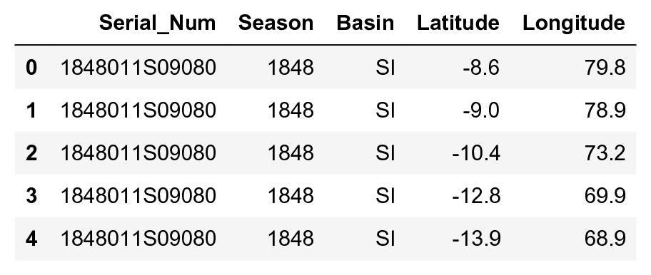
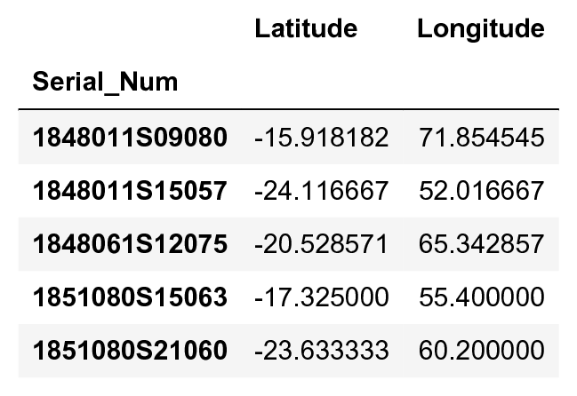
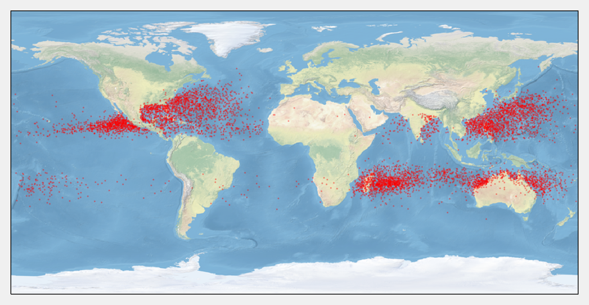
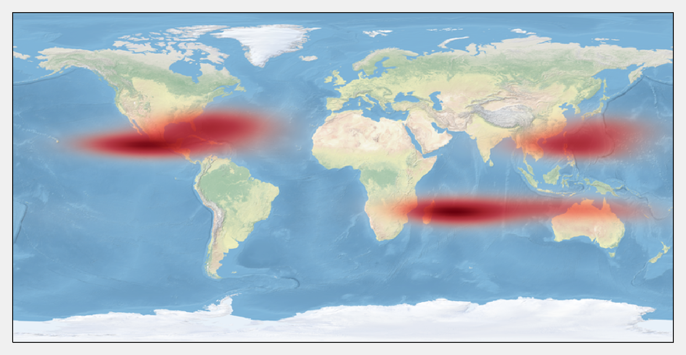
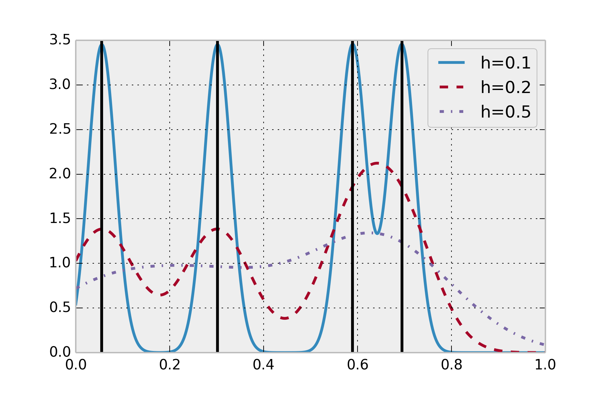

<a href="https://github.com/ipython-books/cookbook-2nd"></a> *This is one of the 100+ free recipes of the [IPython Cookbook, Second Edition](https://github.com/ipython-books/cookbook-2nd), by [Cyrille Rossant](http://cyrille.rossant.net), a guide to numerical computing and data science in the Jupyter Notebook. The ebook and printed book are available for purchase at [Packt Publishing](https://www.packtpub.com/big-data-and-business-intelligence/ipython-interactive-computing-and-visualization-cookbook-second-e).*

▶ *[Text on GitHub](https://github.com/ipython-books/cookbook-2nd) with a [CC-BY-NC-ND license](https://creativecommons.org/licenses/by-nc-nd/3.0/us/legalcode)*  
▶ *[Code on GitHub](https://github.com/ipython-books/cookbook-2nd-code) with a [MIT license](https://opensource.org/licenses/MIT)*

[*Chapter 7 : Statistical Data Analysis*](./)

# 7.6. Estimating a probability distribution nonparametrically with a kernel density estimation

In the previous recipe, we applied a **parametric estimation method**. We had a statistical model (the exponential distribution) describing our data, and we estimated a single parameter (the rate of the distribution). **Nonparametric estimation** deals with statistical models that do not belong to a known family of distributions. The parameter space is then *infinite-dimensional* instead of *finite-dimensional* (that is, we estimate *functions* rather than *numbers*).

Here, we use a **kernel density estimation (KDE)** to estimate the density of probability of a spatial distribution. We look at the geographical locations of tropical cyclones from 1848 to 2013, based on data provided by the NOAA, the US' National Oceanic and Atmospheric Administration.

## Getting ready

You need **cartopy**, available at http://scitools.org.uk/cartopy/. You can install it with `conda install -c conda-forge cartopy`.

## How to do it...

1. Let's import the usual packages. The kernel density estimation with a Gaussian kernel is implemented in `scipy.stats`:

```python
import numpy as np
import pandas as pd
import scipy.stats as st
import matplotlib.pyplot as plt
from matplotlib.colors import ListedColormap
import cartopy.crs as ccrs
%matplotlib inline
```

2. Let's open the data with pandas:

```python
# www.ncdc.noaa.gov/ibtracs/index.php?name=wmo-data
df = pd.read_csv('https://github.com/ipython-books/'
                 'cookbook-2nd-data/blob/master/'
                 'Allstorms.ibtracs_wmo.v03r05.csv?'
                 'raw=true')
```

3. The dataset contains information about most storms since 1848. A single storm may appear multiple times across several consecutive days.

```python
df[df.columns[[0, 1, 3, 8, 9]]].head()
```



4. We use pandas' `groupby()` function to obtain the average location of every storm:

```python
dfs = df.groupby('Serial_Num')
pos = dfs[['Latitude', 'Longitude']].mean()
x = pos.Longitude.values
y = pos.Latitude.values
pos.head()
```



5. We display the storms on a map with cartopy. This toolkit allows us to easily project the geographical coordinates on the map.

```python
# We use a simple equirectangular projection,
# also called Plate Carree.
geo = ccrs.Geodetic()
crs = ccrs.PlateCarree()
# We create the map plot.
ax = plt.axes(projection=crs)
# We display the world map picture.
ax.stock_img()
# We display the storm locations.
ax.scatter(x, y, color='r', s=.5, alpha=.25, transform=geo)
```



6. Before performing the kernel density estimation, we transform the storms' positions from the **geodetic coordinate system** (longitude and latitude) into the map's coordinate system, called **plate carrée**.

```python
h = crs.transform_points(geo, x, y)[:, :2].T
h.shape
```

```{output:result}
(2, 6940)
```

7. Now, we perform the kernel density estimation on our `(2, N)` array.

```python
kde = st.gaussian_kde(h)
```

8. The `gaussian_kde()` routine returned a Python function. To see the results on a map, we need to evaluate this function on a 2D grid spanning the entire map. We create this grid with `meshgrid()`, and we pass the `x` and `y` values to the `kde()` function:

```python
k = 100
# Coordinates of the four corners of the map.
x0, x1, y0, y1 = ax.get_extent()
# We create the grid.
tx, ty = np.meshgrid(np.linspace(x0, x1, 2 * k),
                     np.linspace(y0, y1, k))
# We reshape the grid for the kde() function.
mesh = np.vstack((tx.ravel(), ty.ravel()))
# We evaluate the kde() function on the grid.
v = kde(mesh).reshape((k, 2 * k))
```

9. Before displaying the KDE heatmap on the map, we need to use a special colormap with a transparent channel. This will allow us to superimpose the heatmap on the stock image:

```python
# https://stackoverflow.com/a/37334212/1595060
cmap = plt.get_cmap('Reds')
my_cmap = cmap(np.arange(cmap.N))
my_cmap[:, -1] = np.linspace(0, 1, cmap.N)
my_cmap = ListedColormap(my_cmap)
```

10. Finally, we display the estimated density with `imshow()`:

```python
ax = plt.axes(projection=crs)
ax.stock_img()
ax.imshow(v, origin='lower',
          extent=[x0, x1, y0, y1],
          interpolation='bilinear',
          cmap=my_cmap)
```



## How it works...

The kernel density estimator of a set of n points $\{x_i\}$ is given as:

$$\hat{f}_h(x) = \frac{1}{nh} \sum_{i=1}^n K\Big(\frac{x-x_i}{h}\Big)$$

Here, $h>0$ is a scaling parameter (the **bandwidth**) and $K(u)$ is the **kernel**, a symmetric function that integrates to 1. This estimator is to be compared with a classical histogram, where the kernel would be a *top-hat* function (a rectangle function taking its values in $\{0,1\}$), but the blocks would be located on a regular grid instead of the data points. For more information on kernel density estimator, refer to https://en.wikipedia.org/wiki/Kernel_density_estimation.

Multiple kernels can be chosen. Here, we chose a **Gaussian kernel**, so that the KDE is the superposition of Gaussian functions centered on all the data points. It is an estimation of the density.

The choice of the bandwidth is not trivial; there is a tradeoff between a too low value (small bias, high variance: overfitting) and a too high value (high bias, small variance: underfitting). We will return to this important concept of **bias-variance tradeoff** in the next chapter. For more information on the bias-variance tradeoff, refer to https://en.wikipedia.org/wiki/Bias-variance_dilemma.

There are several methods to automatically choose a sensible bandwidth. SciPy uses a **rule of thumb** called **Scott's Rule**: `h = n**(-1. / (d + 4))`. You will find more information at http://scipy.github.io/devdocs/generated/scipy.stats.gaussian_kde.html.

The following figure illustrates the KDE. The sample dataset contains four points in $[0,1]$ (black lines). The estimated density is a smooth curve, represented here with different bandwidth values.



> There are other implementations of KDE in statsmodels and scikit-learn. You can find more information here: http://jakevdp.github.io/blog/2013/12/01/kernel-density-estimation/

## See also

* Fitting a probability distribution to data with the maximum likelihood method
