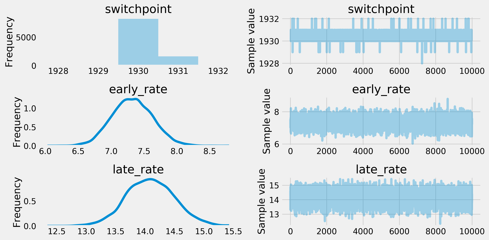
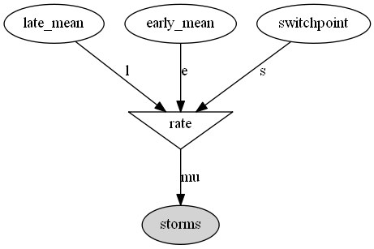

<a href="https://github.com/ipython-books/cookbook-2nd"></a> *This is one of the 100+ free recipes of the [IPython Cookbook, Second Edition](https://github.com/ipython-books/cookbook-2nd), by [Cyrille Rossant](http://cyrille.rossant.net), a guide to numerical computing and data science in the Jupyter Notebook. The ebook and printed book are available for purchase at [Packt Publishing](https://www.packtpub.com/big-data-and-business-intelligence/ipython-interactive-computing-and-visualization-cookbook-second-e).*

▶ *[Text on GitHub](https://github.com/ipython-books/cookbook-2nd) with a [CC-BY-NC-ND license](https://creativecommons.org/licenses/by-nc-nd/3.0/us/legalcode)*  
▶ *[Code on GitHub](https://github.com/ipython-books/cookbook-2nd-code) with a [MIT license](https://opensource.org/licenses/MIT)*

[*Chapter 7 : Statistical Data Analysis*](./)

# 7.7. Fitting a Bayesian model by sampling from a posterior distribution with a Markov Chain Monte Carlo method

In this recipe, we illustrate a very common and useful method for characterizing a posterior distribution in a Bayesian model. Imagine that you have some data and you want to obtain information about the underlying random phenomenon. In a frequentist approach, you could try to fit a probability distribution within a given family of distributions, using a parametric method such as the maximum likelihood method. The optimization procedure would yield parameters that maximize the probability of observing the data if given the null hypothesis.

In a Bayesian approach, you consider the parameters themselves as random variables. Their prior distributions reflect your initial knowledge about these parameters. After the observations, your knowledge is updated, and this is reflected in the posterior distributions of the parameters.

A typical goal for Bayesian inference is to characterize the posterior distributions. Bayes' theorem gives an analytical way to do this, but it is often impractical in real-world problems due to the complexity of the models and the number of dimensions. A **Markov chain Monte Carlo method**, such as the **Metropolis-Hastings algorithm**, gives a numerical method to approximate a posterior distribution.

Here, we introduce the **PyMC3** package, which gives an effective and natural interface for fitting a probabilistic model to data in a Bayesian framework. We will look at the annual frequency of storms in the northern Atlantic Ocean since the 1850s using data from NOAA, the US' National Oceanic and Atmospheric Administration. This example is largely inspired by the tutorial available in the official PyMC3 documentation at http://docs.pymc.io/notebooks/getting_started.html#Case-study-2:-Coal-mining-disasters.

## Getting ready

You need PyMC3, available at http://docs.pymc.io. You can install it with `conda install -c conda-forge pymc3`.

## How to do it...

1. Let's import the standard packages and PyMC3:

```python
import numpy as np
import pandas as pd
import pymc3 as pm
import matplotlib.pyplot as plt
%matplotlib inline
```

2. Let's import the data with pandas:

```python
# www.ncdc.noaa.gov/ibtracs/index.php?name=wmo-data
df = pd.read_csv('https://github.com/ipython-books/'
                 'cookbook-2nd-data/blob/master/'
                 'Allstorms.ibtracs_wmo.v03r05.csv?'
                 'raw=true',
                 delim_whitespace=False)
```

3. With pandas, it only takes a single line of code to get the annual number of storms in the North Atlantic Ocean. We first select the storms in that basin (`NA`), then we group the rows by year (`Season`), and finally we take the number of unique storms (`Serial_Num`), as each storm can span several days (the `nunique()` method):

```python
cnt = df[df['Basin'] == ' NA'].groupby(
    'Season')['Serial_Num'].nunique()
# The years from 1851 to 2012.
years = cnt.index
y0, y1 = years[0], years[-1]
arr = cnt.values
```

```python
# Plot the annual number of storms.
fig, ax = plt.subplots(1, 1, figsize=(8, 4))
ax.plot(years, arr, '-o')
ax.set_xlim(y0, y1)
ax.set_xlabel("Year")
ax.set_ylabel("Number of storms")
```


4. Now, we define our probabilistic model. We assume that storms arise following a time-dependent **Poisson process** with a deterministic rate. We assume that this rate is a piecewise-constant function that takes a first value `early_mean` before a switch point `switchpoint`, and a second value `late_mean` after that point. These three unknown parameters are treated as random variables (we will describe them more in the *How it works...* section). In the model, the annual number of storms per year follows a Poisson distribution (this is a property of Poisson processes).

> A Poisson process (https://en.wikipedia.org/wiki/Poisson_process) is a particular **point process**, that is, a stochastic process describing the random occurrence of instantaneous events. The Poisson process is fully random: the events occur independently at a given rate. See also *Chapter 13, Stochastic Dynamical Systems*.

```python
# We define our model.
with pm.Model() as model:
    # We define our three variables.
    switchpoint = pm.DiscreteUniform(
        'switchpoint', lower=y0, upper=y1)
    early_rate = pm.Exponential('early_rate', 1)
    late_rate = pm.Exponential('late_rate', 1)
    # The rate of the Poisson process is a piecewise
    # constant function.
    rate = pm.math.switch(switchpoint >= years,
                          early_rate, late_rate)
    # The annual number of storms per year follows
    # a Poisson distribution.
    storms = pm.Poisson('storms', rate, observed=arr)
```

5. Now, we sample from the posterior distribution given the observed data. The `sample(10000)` method launches the fitting iterative procedure with 10000 iterations, which may take a few seconds:

```python
with model:
    trace = pm.sample(10000)
```

```{output:stderr}
Assigned Metropolis to switchpoint
Assigned NUTS to early_rate_log__
Assigned NUTS to late_rate_log__
100%|██████████| 10500/10500 [00:05<00:00, 1757.23it/s]
```

6. Once the sampling has finished, we can plot the distribution and paths of the Markov chains:

```python
pm.traceplot(trace)
```



Each row represents a variable. The left plot is a histogram of the corresponding Markov chain, which gives the posterior distribution of the variable. The right plot is an arbitrarily-chosen path of a Markov chain, showing the evolution of the variable during the fitting procedure.

7. Taking the sample mean of these distributions, we get posterior estimates for the three unknown parameters, including the year where the frequency of storms suddenly increased:

```python
s = trace['switchpoint'].mean()
em = trace['early_rate'].mean()
lm = trace['late_rate'].mean()
s, em, lm
```

```{output:result}
(1930.171, 7.316, 14.085)
```

8. Finally, we can plot the estimated rate on top of the observations:

```python
fig, ax = plt.subplots(1, 1, figsize=(8, 4))
ax.plot(years, arr, '-o')
ax.axvline(s, color='k', ls='--')
ax.plot([y0, s], [em, em], '-', lw=3)
ax.plot([s, y1], [lm, lm], '-', lw=3)
ax.set_xlim(y0, y1)
ax.set_xlabel("Year")
ax.set_ylabel("Number of storms")
```


## How it works...

The general idea is to define a Bayesian probabilistic model and to fit it to the data. This model may be the starting point of an estimation or decision task. The model is essentially described by stochastic or deterministic variables linked together within a **direct acyclic graph (DAG)**. A is linked to B if B is entirely or partially determined by A. The following figure shows the graph of the model used in this recipe:



Stochastic variables follow distributions that can be parameterized by fixed numbers or other variables in the model. Parameters may be random variables themselves, reflecting knowledge prior to the observations. This is the core of Bayesian modeling.

The goal of the analysis is to include the observations into the model in order to update our knowledge as more and more data is available. Although Bayes' theorem gives us an exact way to compute those posterior distributions, it is rarely practical in real-world problems. This is notably due to the complexity of the models. Alternatively, numerical methods have been developed in order to tackle this problem.

The **Markov chain Monte Carlo (MCMC) method** used here allows us to sample from a complex distribution by simulating a Markov chain that has the desired distribution as its equilibrium distribution. The **Metropolis-Hastings algorithm** is a particular application of this method to our current example.

## There's more...

Here are a few references:

* A free e-book on the subject, by Cameron Davidson-Pilon, entirely written in the Jupyter Notebook, available at http://camdavidsonpilon.github.io/Probabilistic-Programming-and-Bayesian-Methods-for-Hackers/
* The Markov chain Monte Carlo method introduced at https://en.wikipedia.org/wiki/Markov_chain_Monte_Carlo
* The Metropolis-Hastings algorithm introduced at https://en.wikipedia.org/wiki/Metropolis-Hastings_algorithm

## See also

* Getting started with Bayesian methods
