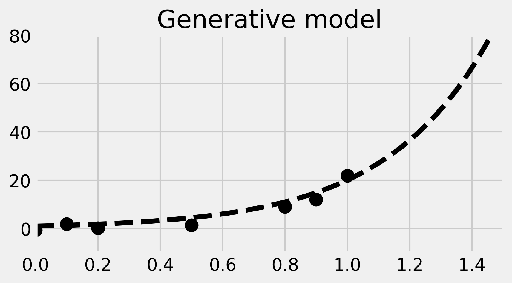
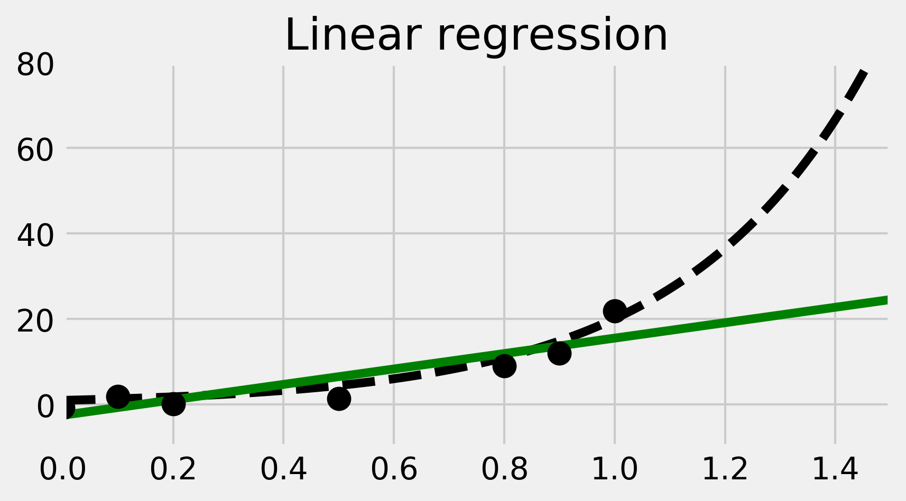
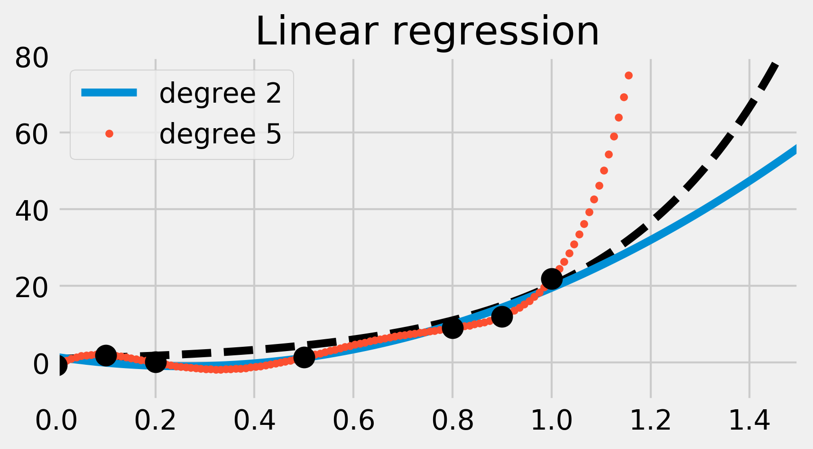
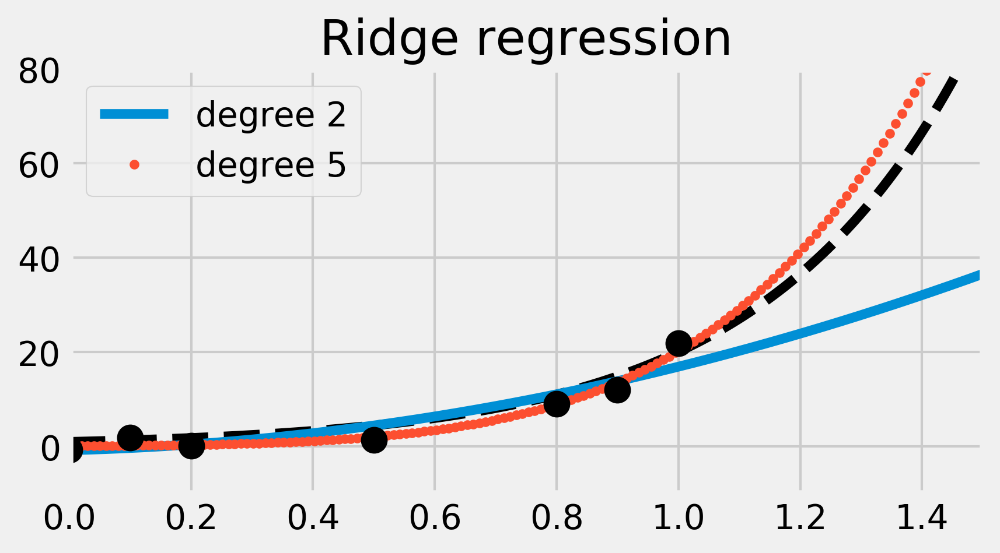

<a href="https://github.com/ipython-books/cookbook-2nd"></a> *This is one of the 100+ free recipes of the [IPython Cookbook, Second Edition](https://github.com/ipython-books/cookbook-2nd), by [Cyrille Rossant](http://cyrille.rossant.net), a guide to numerical computing and data science in the Jupyter Notebook. The ebook and printed book are available for purchase at [Packt Publishing](https://www.packtpub.com/big-data-and-business-intelligence/ipython-interactive-computing-and-visualization-cookbook-second-e).*

▶ *[Text on GitHub](https://github.com/ipython-books/cookbook-2nd) with a [CC-BY-NC-ND license](https://creativecommons.org/licenses/by-nc-nd/3.0/us/legalcode)*  
▶ *[Code on GitHub](https://github.com/ipython-books/cookbook-2nd-code) with a [MIT license](https://opensource.org/licenses/MIT)*

[*Chapter 8 : Machine Learning*](./)

# 8.1. Getting started with scikit-learn

In this recipe, we introduce the basics of the machine learning **scikit-learn** package (http://scikit-learn.org). This package is the main tool we will use throughout this chapter. Its clean API makes it easy to define, train, and test models.

We will show here a basic example of linear regression in the context of curve fitting. This toy example will allow us to illustrate key concepts such as linear models, overfitting, underfitting, regularization, and cross-validation.

## Getting ready

You can find all instructions to install scikit-learn in the main documentation. For more information, refer to http://scikit-learn.org/stable/install.html. Anaconda comes with scikit-learn by default, but, if needed, you can install it manually by typing `conda install scikit-learn` in a terminal.

## How to do it...

We will generate a one-dimensional dataset with a simple model (including some noise), and we will try to fit a function to this data. With this function, we can predict values on new data points. This is a curve fitting regression problem.

1. First, let's make all the necessary imports:

```python
import numpy as np
import scipy.stats as st
import sklearn.linear_model as lm
import matplotlib.pyplot as plt
%matplotlib inline
```

2. We now define a deterministic nonlinear function underlying our generative model:

```python
def f(x):
    return np.exp(3 * x)
```

3. We generate the values along the curve on $[0, 2]$.

```python
x_tr = np.linspace(0., 2, 200)
y_tr = f(x_tr)
```

4. Now, let's generate data points within $[0, 1]$. We use the function $f$ and we add some Gaussian noise.

```python
x = np.array([0, .1, .2, .5, .8, .9, 1])
y = f(x) + 2 * np.random.randn(len(x))
```

5. Let's plot our data points on $[0, 1]$.

```python
fig, ax = plt.subplots(1, 1, figsize=(6, 3))
ax.plot(x_tr, y_tr, '--k')
ax.plot(x, y, 'ok', ms=10)
ax.set_xlim(0, 1.5)
ax.set_ylim(-10, 80)
ax.set_title('Generative model')
```



In the image, the dotted curve represents the generative model.

6. Now, we use scikit-learn to fit a linear model to the data. There are three steps. First, we create the model (an instance of the `LinearRegression` class). Then, we fit the model to our data. Finally, we predict values from our trained model.

```python
# We create the model.
lr = lm.LinearRegression()
# We train the model on our training dataset.
lr.fit(x[:, np.newaxis], y)
# Now, we predict points with our trained model.
y_lr = lr.predict(x_tr[:, np.newaxis])
```

We need to convert `x` and `x_tr` to column vectors, as it is a general convention in scikit-learn that observations are rows, while features are columns. Here, we have seven observations with one feature.

7. We now plot the result of the trained linear model. We obtain a regression line in green here:

```python
fig, ax = plt.subplots(1, 1, figsize=(6, 3))
ax.plot(x_tr, y_tr, '--k')
ax.plot(x_tr, y_lr, 'g')
ax.plot(x, y, 'ok', ms=10)
ax.set_xlim(0, 1.5)
ax.set_ylim(-10, 80)
ax.set_title("Linear regression")
```



8. The linear fit is not well-adapted here, as the data points are generated according to a nonlinear model (an exponential curve). Therefore, we are now going to fit a nonlinear model. More precisely, we will fit a polynomial function to our data points. We can still use linear regression for this, by precomputing the exponents of our data points. This is done by generating a Vandermonde matrix, using the `np.vander()` function. We will explain this trick in *How it works...*. In the following code, we perform and plot the fit:

```python
lrp = lm.LinearRegression()
fig, ax = plt.subplots(1, 1, figsize=(6, 3))
ax.plot(x_tr, y_tr, '--k')

for deg, s in zip([2, 5], ['-', '.']):
    lrp.fit(np.vander(x, deg + 1), y)
    y_lrp = lrp.predict(np.vander(x_tr, deg + 1))
    ax.plot(x_tr, y_lrp, s,
            label=f'degree {deg}')
    ax.legend(loc=2)
    ax.set_xlim(0, 1.5)
    ax.set_ylim(-10, 80)
    # Print the model's coefficients.
    print(f'Coefficients, degree {deg}:\n\t',
          ' '.join(f'{c:.2f}' for c in lrp.coef_))
ax.plot(x, y, 'ok', ms=10)
ax.set_title("Linear regression")
```

```{output:stdout}
Coefficients, degree 2:
    36.95 -18.92 0.00
Coefficients, degree 5:
    903.98 -2245.99 1972.43 -686.45 78.64 0.00
```



We have fitted two polynomial models of degree 2 and 5. The degree 2 polynomial appears to fit the data points less precisely than the degree 5 polynomial. However, it seems more robust; the degree 5 polynomial seems really bad at predicting values outside the data points (look for example at the $x \geq 1$ portion). This is what we call **overfitting**; by using a too-complex model, we obtain a better fit on the trained dataset, but a less robust model outside this set.

9. We will now use a different learning model called **ridge regression**. It works like linear regression except that it prevents the polynomial's coefficients from becoming too big. This is what happened in the previous example. By adding a **regularization term** in the **loss function**, ridge regression imposes some structure on the underlying model. We will see more details in the next section.

The ridge regression model has a meta-parameter, which represents the weight of the regularization term. We could try different values with trial and error using the `Ridge` class. However, scikit-learn provides another model called `RidgeCV`, which includes a parameter search with cross-validation. In practice, this means that we don't have to tweak this parameter by hand—scikit-learn does it for us. As the models of scikit-learn always follow the fit-predict API, all we have to do is replace `lm.LinearRegression()` with `lm.RidgeCV()` in the previous code. We will give more details in the next section.

```python
ridge = lm.RidgeCV()

fig, ax = plt.subplots(1, 1, figsize=(6, 3))
ax.plot(x_tr, y_tr, '--k')

for deg, s in zip([2, 5], ['-', '.']):
    ridge.fit(np.vander(x, deg + 1), y)
    y_ridge = ridge.predict(np.vander(x_tr, deg + 1))
    ax.plot(x_tr, y_ridge, s,
            label='degree ' + str(deg))
    ax.legend(loc=2)
    ax.set_xlim(0, 1.5)
    ax.set_ylim(-10, 80)
    # Print the model's coefficients.
    print(f'Coefficients, degree {deg}:',
          ' '.join(f'{c:.2f}' for c in ridge.coef_))

ax.plot(x, y, 'ok', ms=10)
ax.set_title("Ridge regression")
```

```{output:stdout}
Coefficients, degree 2: 14.43 3.27 0.00
Coefficients, degree 5: 7.07 5.88 4.37 2.37 0.40 0.00
```



This time, the degree 5 polynomial seems more precise than the simpler degree 2 polynomial (which now causes **underfitting**). Ridge regression mitigates the overfitting issue here. Observe how the degree 5 polynomial's coefficients are much smaller than in the previous example.

## How it works...

In this section, we explain all the aspects covered in this recipe.

### Scikit-learn API

scikit-learn implements a clean and coherent API for supervised and unsupervised learning. Our data points should be stored in an $(N, D)$ matrix $X$, where $N$ is the number of observations and $D$ is the number of features. In other words, each row is an observation. The first step in a machine learning task is to define what the matrix $X$ is exactly.

In a supervised learning setup, we also have a *target*, an N-long vector $y$ with a scalar value for each observation. This value is either continuous or discrete, depending on whether we have a regression or classification problem, respectively.

In scikit-learn, models are implemented in classes that have the `fit()` and `predict()` methods. The `fit()` method accepts the data matrix $X$ as input, and $y$ as well for supervised learning models. This method trains the model on the given data.

The `predict()` method also takes data points as input (as an $(M, D)$ matrix). It returns the labels or transformed points as predicted by the trained model.

### Ordinary Least Squares regression

**Ordinary least squares regression** is one of the simplest regression methods. It consists of approaching the output values $y_i$ with a linear combination of $X_ij$:

$$\forall i \in \{1, \ldots, N\}, \quad \hat{y}_i = \sum_{j=1}^D w_j X_{ij}, \quad \textrm{or, in matrix form:} \quad \mathbf{\hat{y}} = \mathbf{X} \mathbf{w}.$$

Here, $w = (w_1, ..., w_D)$ is the (unknown) **parameter vector**. Also, $\hat y$ represents the model's output. We want this vector to match the data points $y$ as closely as possible. Of course, the exact equality $\hat y = y$ cannot hold in general (there is always some noise and uncertainty—models are idealizations of reality). Therefore, we want to *minimize* the difference between these two vectors. The ordinary least squares regression method consists of minimizing the following **loss function**:

$$\min_{\mathbf{w}} \left\lVert \mathbf{y} - \mathbf{X} \mathbf{w} \right\rVert_2^2 = \min_{\mathbf{w}} \left( \sum_{i=1}^N \left(y_i - \hat{y}_i\right)^2 \right)$$

This sum of the components squared is called the **L² norm**. It is convenient because it leads to *differentiable* loss functions so that gradients can be computed and common optimization procedures can be performed.

### Polynomial interpolation with linear regression

Ordinary least squares regression fits a linear model to the data. The model is linear both in the data points $X_i$ and in the parameters $w_j$. In our example, we obtain a poor fit because the data points were generated according to a nonlinear generative model (an exponential function).

However, we can still use the linear regression method with a model that is linear in $w_j$ but nonlinear in $x_i$. To do this, we need to increase the number of dimensions in our dataset by using a basis of polynomial functions. In other words, we consider the following data points:

$$\mathbf{x}_i, \mathbf{x}_i^2, \ldots, \mathbf{x}_i^D$$

Here, $D$ is the maximum degree. The input matrix $X$ is therefore the **Vandermonde matrix** associated to the original data points $x_i$. For more information on the Vandermonde matrix, refer to https://en.wikipedia.org/wiki/Vandermonde_matrix.

Training a linear model on these new data points is equivalent to training a polynomial model on the original data points.

### Ridge regression

Polynomial interpolation with linear regression can lead to overfitting if the degree of the polynomials is too large. By capturing the random fluctuations (noise) instead of the general trend of the data, the model loses some of its predictive power. This corresponds to a divergence of the polynomial's coefficients $w_j$.

A solution to this problem is to prevent these coefficients from growing unboundedly. With **ridge regression** (also known as **Tikhonov regularization**), this is done by adding a regularization term to the loss function. For more details on Tikhonov regularization, refer to https://en.wikipedia.org/wiki/Tikhonov_regularization.

$$\min_{\mathbf{w}} || \mathbf{y} - \mathbf{X} \mathbf{w} ||_2^2 + \alpha ||\mathbf{w}||_2^2$$

By minimizing this loss function, we not only minimize the error between the model and the data (first term, related to the bias), but also the size of the model's coefficients (second term, related to the variance). The bias-variance trade-off is quantified by the hyperparameter $\alpha$, which specifies the relative weight between the two terms in the loss function.

Here, ridge regression led to a polynomial with smaller coefficients, and thus a better fit.

### Cross-validation and grid search

A drawback of the ridge regression model compared to the ordinary least squares model is the presence of an extra hyperparameter $\alpha$. The quality of the prediction depends on the choice of this parameter. One possibility would be to fine-tune this parameter manually, but this procedure can be tedious and can also lead to overfitting problems.

To solve this problem, we can use a **grid search**; we loop over many possible values for $\alpha$, and we evaluate the performance of the model for each possible value. Then, we choose the parameter that yields the best performance.

How can we assess the performance of a model with a given $\alpha$ value? A common solution is to use **cross-validation**. This procedure consists of splitting the dataset into a training set and a test set. We fit the model on the train set, and we test its predictive performance on the test set. By testing the model on a different dataset than the one used for training, we reduce overfitting.

There are many ways to split the initial dataset into two parts like this. One possibility is to remove *one* sample to form the train set and to put this one sample into the test set. This is called **Leave-One-Out cross-validation**. With $N$ samples, we obtain $N$ sets of train and test sets. The cross-validated performance is the average performance on all these set decompositions.

As we will see later, scikit-learn implements several easy-to-use functions to do cross-validation and grid search. In this recipe, we used a special estimator called `RidgeCV` that implements a cross-validation and grid search procedure that is specific to the ridge regression model. Using this class ensures that the best hyperparameter $\alpha$ is found automatically for us.

## There's more...

Here are a few references about least squares:

* Ordinary least squares on Wikipedia, available at https://en.wikipedia.org/wiki/Ordinary_least_squares
* Linear least squares on Wikipedia, available at https://en.wikipedia.org/wiki/Linear_least_squares_%28mathematics%29

Here are a few references about cross-validation and grid search:

* Cross-validation in scikit-learn's documentation, available at http://scikit-learn.org/stable/modules/cross_validation.html
* Grid search in scikit-learn's documentation, available at http://scikit-learn.org/stable/modules/grid_search.html
* Cross-validation on Wikipedia, available at https://en.wikipedia.org/wiki/Cross-validation_%28statistics%29

Here are a few references about scikit-learn:

* scikit-learn basic tutorial available at http://scikit-learn.org/stable/tutorial/basic/tutorial.html
* scikit-learn tutorial given at the SciPy 2017 conference, available at https://www.youtube.com/watch?v=2kT6QOVSgSg
