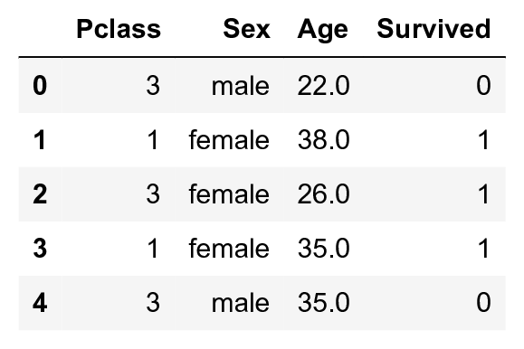
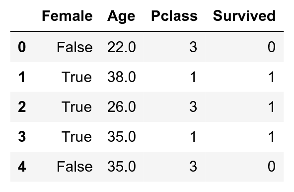
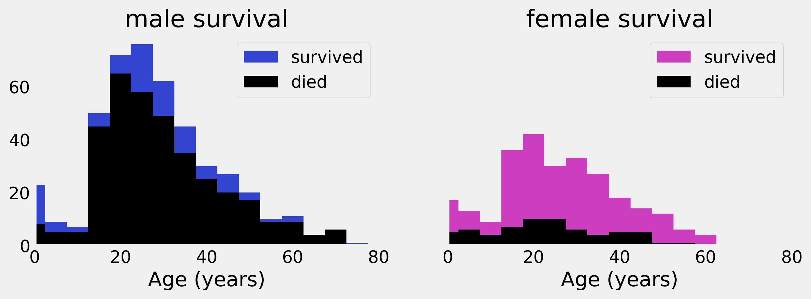
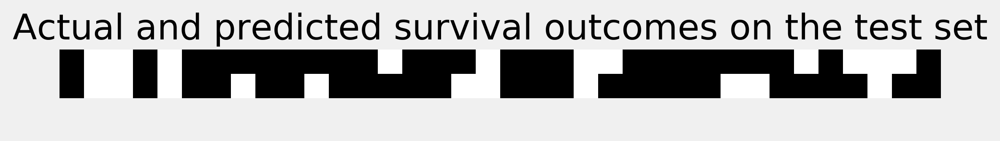
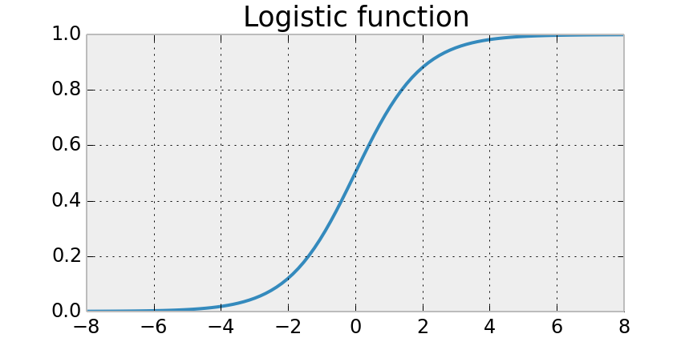

<a href="https://github.com/ipython-books/cookbook-2nd"></a> *This is one of the 100+ free recipes of the [IPython Cookbook, Second Edition](https://github.com/ipython-books/cookbook-2nd), by [Cyrille Rossant](http://cyrille.rossant.net), a guide to numerical computing and data science in the Jupyter Notebook. The ebook and printed book are available for purchase at [Packt Publishing](https://www.packtpub.com/big-data-and-business-intelligence/ipython-interactive-computing-and-visualization-cookbook-second-e).*

▶ *[Text on GitHub](https://github.com/ipython-books/cookbook-2nd) with a [CC-BY-NC-ND license](https://creativecommons.org/licenses/by-nc-nd/3.0/us/legalcode)*  
▶ *[Code on GitHub](https://github.com/ipython-books/cookbook-2nd-code) with a [MIT license](https://opensource.org/licenses/MIT)*

[*Chapter 8 : Machine Learning*](./)

# 8.2. Predicting who will survive on the Titanic with logistic regression

[The recipe is available in the book, to be purchased on Packt.](https://www.packtpub.com/big-data-and-business-intelligence/ipython-interactive-computing-and-visualization-cookbook-second-e)

<!-- REMOVE AS PER PACKT AGREEMENT

In this recipe, we will introduce **logistic regression**, a basic classifier. We will apply these techniques on a **Kaggle** dataset where the goal is to predict survival on the Titanic based on real data (see http://www.kaggle.com/c/titanic).

> Kaggle (http://www.kaggle.com/competitions) hosts machine learning competitions where anyone can download a dataset, train a model, and test the predictions on the website.

## How to do it...

1. We import the standard packages:

```python
import numpy as np
import pandas as pd
import sklearn
import sklearn.linear_model as lm
import sklearn.model_selection as ms
import matplotlib.pyplot as plt
%matplotlib inline
```

2. We load the training and test datasets with pandas:

```python
train = pd.read_csv('https://github.com/ipython-books'
                    '/cookbook-2nd-data/blob/master/'
                    'titanic_train.csv?raw=true')
test = pd.read_csv('https://github.com/ipython-books/'
                   'cookbook-2nd-data/blob/master/'
                   'titanic_test.csv?raw=true')
```

```python
train[train.columns[[2, 4, 5, 1]]].head()
```



3. Let's keep only a few fields for this example, and also convert the `sex` field to a binary variable so that it can be handled correctly by NumPy and scikit-learn. Finally, we remove the rows that contain `NaN` values:

```python
data = train[['Age', 'Pclass', 'Survived']]
# Add a 'Female' column.
data = data.assign(Female=train['Sex'] == 'female')
# Reorder the columns.
data = data[['Female', 'Age', 'Pclass', 'Survived']]
data = data.dropna()
data.head()
```



4. Now, we convert this `DataFrame` object to a NumPy array so that we can pass it to scikit-learn:

```python
data_np = data.astype(np.int32).values
X = data_np[:, :-1]
y = data_np[:, -1]
```

5. Let's have a look at the survival of male and female passengers as a function of their age:

```python
# We define a few boolean vectors.
# The first column is 'Female'.
female = X[:, 0] == 1

# The last column is 'Survived'.
survived = y == 1

# This vector contains the age of the passengers.
age = X[:, 1]

# We compute a few histograms.
bins_ = np.arange(0, 81, 5)
S = {'male': np.histogram(age[survived & ~female],
                          bins=bins_)[0],
     'female': np.histogram(age[survived & female],
                            bins=bins_)[0]}
D = {'male': np.histogram(age[~survived & ~female],
                          bins=bins_)[0],
     'female': np.histogram(age[~survived & female],
                            bins=bins_)[0]}
```

```python
# We now plot the data.
bins = bins_[:-1]
fig, axes = plt.subplots(1, 2, figsize=(10, 3),
                         sharey=True)
for ax, sex, color in zip(axes, ('male', 'female'),
                          ('#3345d0', '#cc3dc0')):
    ax.bar(bins, S[sex], bottom=D[sex], color=color,
           width=5, label='survived')
    ax.bar(bins, D[sex], color='k',
           width=5, label='died')
    ax.set_xlim(0, 80)
    ax.set_xlabel("Age (years)")
    ax.set_title(sex + " survival")
    ax.grid(None)
    ax.legend()
```



6. Let's try to train a `LogisticRegression` classifier in order to predict the survival of people based on their gender, age, and class. We first need to create a train and a test dataset:

```python
# We split X and y into train and test datasets.
(X_train, X_test, y_train, y_test) = \
    ms.train_test_split(X, y, test_size=.05)
```

```python
# We instanciate the classifier.
logreg = lm.LogisticRegression()
```

7. We train the model and we get the predicted values on the test set:

```python
logreg.fit(X_train, y_train)
y_predicted = logreg.predict(X_test)
```

The following figure shows the actual and predicted results:

```python
fig, ax = plt.subplots(1, 1, figsize=(8, 3))
ax.imshow(np.vstack((y_test, y_predicted)),
          interpolation='none', cmap='bone')
ax.set_axis_off()
ax.set_title("Actual and predicted survival outcomes "
             "on the test set")
```



8. To get an estimation of the model's performance, we compute the cross-validation score with the `cross_val_score()` function. This function uses a three-fold stratified cross-validation procedure by default, but this can be changed with the `cv` keyword argument:

```python
ms.cross_val_score(logreg, X, y)
```

```{output:result}
array([ 0.78661088,  0.78991597,  0.78059072])
```

This function returns, for each pair of train and test set, a prediction score (we give more details in *How it works...*).

9. The `LogisticRegression` class accepts a `C` hyperparameter as an argument. This parameter quantifies the regularization strength. To find a good value, we can perform a grid search with the generic `GridSearchCV` class. It takes an estimator as input and a dictionary of parameter values. We can also specify the number of cores to use on a multicore processor with the `n_jobs` argument. This new estimator uses cross-validation to select the best parameter:

```python
grid = ms.GridSearchCV(
    logreg, {'C': np.logspace(-5, 5, 200)}, n_jobs=4)
grid.fit(X_train, y_train)
grid.best_params_
```

```{output:result}
{'C': 0.042}
```

10. Here is the performance of the best estimator:

```python
ms.cross_val_score(grid.best_estimator_, X, y)
```

```{output:result}
array([ 0.77405858,  0.80672269,  0.78902954])
```

## How it works...

Logistic regression is *not* a regression model, it is a classification model. Yet, it is closely related to linear regression. This model predicts the probability that a binary variable is 1, by applying a **sigmoid function** (more precisely, a logistic function) to a linear combination of the variables. The equation of the sigmoid is:

$$\forall i \in \{1, \ldots, N\}, \quad \mathbf{\hat{y}}_i = f(\mathbf{x}_i \mathbf{w}) \quad \textrm{where} \quad f(x) = \frac{1}{1+\exp(-x)}.$$

The following figure shows a logistic function:



If a binary variable has to be obtained, we can round the value to the closest integer.

The parameter `w` is obtained with an optimization procedure during the learning step.

## There's more...

Here are a few references:

* Logistic regression in scikit-learn's documentation, available at http://scikit-learn.org/stable/modules/linear_model.html#logistic-regression
* Logistic regression on Wikipedia, available at https://en.wikipedia.org/wiki/Logistic_regression

## See also

* Geting started with scikit-learn
* Learning to recognize handwritten digits with a K-nearest neighbors classifier
* Using support vector machines for classification tasks

-->
