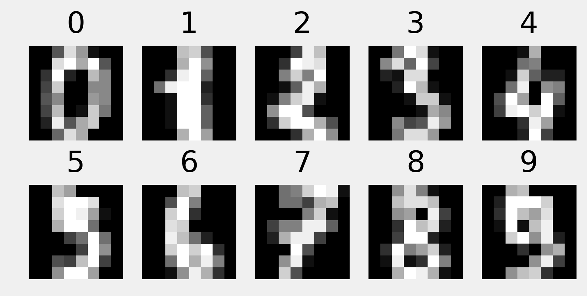
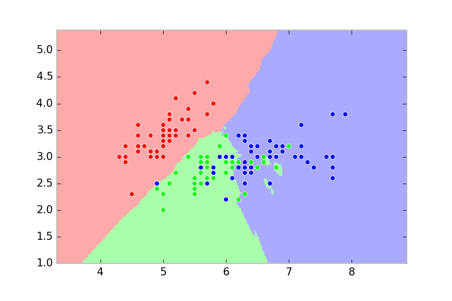

<a href="https://github.com/ipython-books/cookbook-2nd"></a> *This is one of the 100+ free recipes of the [IPython Cookbook, Second Edition](https://github.com/ipython-books/cookbook-2nd), by [Cyrille Rossant](http://cyrille.rossant.net), a guide to numerical computing and data science in the Jupyter Notebook. The ebook and printed book are available for purchase at [Packt Publishing](https://www.packtpub.com/big-data-and-business-intelligence/ipython-interactive-computing-and-visualization-cookbook-second-e).*

▶ *[Text on GitHub](https://github.com/ipython-books/cookbook-2nd) with a [CC-BY-NC-ND license](https://creativecommons.org/licenses/by-nc-nd/3.0/us/legalcode)*  
▶ *[Code on GitHub](https://github.com/ipython-books/cookbook-2nd-code) with a [MIT license](https://opensource.org/licenses/MIT)*

[*Chapter 8 : Machine Learning*](./)

# 8.3. Learning to recognize handwritten digits with a K-nearest neighbors classifier

In this recipe, we will see how to recognize handwritten digits with a **K-nearest neighbors (K-NN) classifier**. This classifier is a simple but powerful model, well-adapted to complex, highly nonlinear datasets such as images. We will explain how it works later in this recipe.

## How to do it...

1. We import the modules:

```python
import numpy as np
import sklearn
import sklearn.datasets as ds
import sklearn.model_selection as ms
import sklearn.neighbors as nb
import matplotlib.pyplot as plt
%matplotlib inline
```

2. Let's load the *digits* dataset, part of the `datasets` module of scikit-learn. This dataset contains handwritten digits that have been manually labeled:

```python
digits = ds.load_digits()
X = digits.data
y = digits.target
print((X.min(), X.max()))
print(X.shape)
```

```{output:stdout}
(0.0, 16.0)
(1797, 64)
```

In the matrix `X`, each row contains `8*8=64` pixels (in grayscale, values between 0 and 16). The row-major ordering is used.

3. Let's display some of the images along with their labels:

```python
nrows, ncols = 2, 5
fig, axes = plt.subplots(nrows, ncols,
                         figsize=(6, 3))
for i in range(nrows):
    for j in range(ncols):
        # Image index
        k = j + i * ncols
        ax = axes[i, j]
        ax.matshow(digits.images[k, ...],
                   cmap=plt.cm.gray)
        ax.set_axis_off()
        ax.set_title(digits.target[k])
```



4. Now, let's fit a K-nearest neighbors classifier on the data:

```python
(X_train, X_test, y_train, y_test) = \
    ms.train_test_split(X, y, test_size=.25)
```

```python
knc = nb.KNeighborsClassifier()
```

```python
knc.fit(X_train, y_train)
```

5. Let's evaluate the score of the trained classifier on the test dataset:

```python
knc.score(X_test, y_test)
```

```{output:result}
0.987
```

6. Now, let's see if our classifier can recognize a handwritten digit:

```python
# Let's draw a 1.
one = np.zeros((8, 8))
one[1:-1, 4] = 16  # The image values are in [0, 16].
one[2, 3] = 16
```

```python
fig, ax = plt.subplots(1, 1, figsize=(2, 2))
ax.imshow(one, interpolation='none',
          cmap=plt.cm.gray)
ax.grid(False)
ax.set_axis_off()
ax.set_title("One")
```


```python
# We need to pass a (1, D) array.
knc.predict(one.reshape((1, -1)))
```

```{output:result}
array([1])
```

Good job!

## How it works...

This example illustrates how to deal with images in scikit-learn. An image is a 2D $(N, M)$ matrix, which has $NM$ features. This matrix needs to be flattened when composing the data matrix; each row is a full image.

The idea of K-nearest neighbors is as follows: given a new point in the feature space, find the K closest points from the training set and assign the label of the majority of those points.

The distance is generally the Euclidean distance, but other distances can be used too.

The following image, obtained from the scikit-learn documentation at http://scikit-learn.org/stable/modules/neighbors.html, shows the space partition obtained with a 15-nearest-neighbors classifier on a toy dataset (with three labels):



The number $K$ is a hyperparameter of the model. If it is too small, the model will not generalize well (high variance). In particular, it will be highly sensitive to outliers. By contrast, the precision of the model will worsen if $K$ is too large. At the extreme, if $K$ is equal to the total number of points, the model will always predict the exact same value disregarding the input (high bias). There are heuristics to choose this hyperparameter.

It should be noted that no model is learned by a K-nearest neighbor algorithm; the classifier just stores all data points and compares any new target points with them. This is an example of **instance-based learning**. It is in contrast to other classifiers such as the logistic regression model, which explicitly learns a simple mathematical model on the training data.

The K-nearest neighbors method works well on complex classification problems that have irregular decision boundaries. However, it might be computationally intensive with large training datasets because a large number of distances have to be computed for testing. Dedicated tree-based data structures such as **K-D trees** or **ball trees** can be used to accelerate the search of nearest neighbors.

The K-nearest neighbors method can be used for classification, like here, and also for regression problems. The model assigns the average of the target value of the nearest neighbors. In both cases, different weighting strategies can be used.

## There's more...

Here are a few references:

* The K-NN algorithm in scikit-learn's documentation, available at http://scikit-learn.org/stable/modules/neighbors.html
* The K-NN algorithm on Wikipedia, available at https://en.wikipedia.org/wiki/K-nearest_neighbors_algorithm
* Blog post about how to choose the K hyperparameter, available at http://datasciencelab.wordpress.com/2013/12/27/finding-the-k-in-k-means-clustering/
* Instance-based learning on Wikipedia, available at https://en.wikipedia.org/wiki/Instance-based_learning

## See also

* Predicting who will survive on the Titanic with logistic regression
* Using support vector machines for classification tasks
