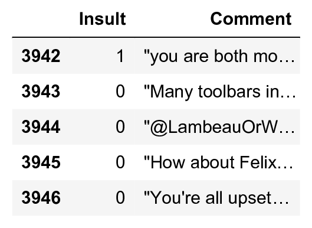

<a href="https://github.com/ipython-books/cookbook-2nd"></a> *This is one of the 100+ free recipes of the [IPython Cookbook, Second Edition](https://github.com/ipython-books/cookbook-2nd), by [Cyrille Rossant](http://cyrille.rossant.net), a guide to numerical computing and data science in the Jupyter Notebook. The ebook and printed book are available for purchase at [Packt Publishing](https://www.packtpub.com/big-data-and-business-intelligence/ipython-interactive-computing-and-visualization-cookbook-second-e).*

▶ *[Text on GitHub](https://github.com/ipython-books/cookbook-2nd) with a [CC-BY-NC-ND license](https://creativecommons.org/licenses/by-nc-nd/3.0/us/legalcode)*  
▶ *[Code on GitHub](https://github.com/ipython-books/cookbook-2nd-code) with a [MIT license](https://opensource.org/licenses/MIT)*

[*Chapter 8 : Machine Learning*](./)

# 8.4. Learning from text — Naive Bayes for Natural Language Processing

In this recipe, we show how to handle text data with scikit-learn. Working with text requires careful preprocessing and feature extraction. It is also quite common to deal with highly sparse matrices.

We will learn to recognize whether a comment posted during a public discussion is considered insulting to one of the participants. We will use a labeled dataset from Impermium, released during a Kaggle competition (see http://www.kaggle.com/c/detecting-insults-in-social-commentary).

## How to do it...

1. Let's import our libraries:

```python
import numpy as np
import pandas as pd
import sklearn
import sklearn.model_selection as ms
import sklearn.feature_extraction.text as text
import sklearn.naive_bayes as nb
import matplotlib.pyplot as plt
%matplotlib inline
```

2. Let's open the CSV file with pandas:

```python
df = pd.read_csv('https://github.com/ipython-books/'
                 'cookbook-2nd-data/blob/master/'
                 'troll.csv?raw=true')
```

3. Each row is a comment. We will consider two columns: whether the comment is insulting (1) or not (0) and the unicode-encoded contents of the comment:

```python
df[['Insult', 'Comment']].tail()
```



4. Now, we are going to define the feature matrix `X` and the labels `y`:

```python
y = df['Insult']
```

Obtaining the feature matrix from the text is not trivial. scikit-learn can only work with numerical matrices. So how do we convert text into a matrix of numbers? A classical solution is to first extract a **vocabulary**, a list of words used throughout the corpus. Then, we count, for each sample, the frequency of each word. We end up with a **sparse matrix**, a huge matrix containing mostly zeros. Here, we do this in two lines. We will give more details in *How it works...*.

> The general rule here is that whenever one of our features is categorical (that is, the presence of a word, a color belonging to a fixed set of $n$ colors, and so on), we should *vectorize* it by considering one binary feature per item in the class. For example, instead of a feature color being `red`, `green`, or `blue`, we should consider three *binary* features `color_red`, `color_green`, and `color_blue`. We give further references in the *There's more...* section.

```python
tf = text.TfidfVectorizer()
X = tf.fit_transform(df['Comment'])
print(X.shape)
```

```{output:stdout}
(3947, 16469)
```

5. There are 3947 comments and 16469 different words. Let's estimate the sparsity of this feature matrix:

```python
p = 100 * X.nnz / float(X.shape[0] * X.shape[1])
print(f"Each sample has ~{p:.2f}% non-zero features.")
```

```{output:stdout}
Each sample has ~0.15% non-zero features.
```

6. Now, we are going to train a classifier as usual. We first split the data into a train and test set:

```python
(X_train, X_test, y_train, y_test) = \
    ms.train_test_split(X, y, test_size=.2)
```

7. We use a **Bernoulli Naive Bayes classifier** with a grid search on the $\alpha$ parameter:

```python
bnb = ms.GridSearchCV(
    nb.BernoulliNB(),
    param_grid={'alpha': np.logspace(-2., 2., 50)})
bnb.fit(X_train, y_train)
```

8. Let's check the performance of this classifier on the test dataset:

```python
bnb.score(X_test, y_test)
```

```{output:result}
0.761
```

9. Let's take a look at the words corresponding to the largest coefficients (the words we find frequently in insulting comments):

```python
# We first get the words corresponding to each feature
names = np.asarray(tf.get_feature_names())
# Next, we display the 50 words with the largest
# coefficients.
print(','.join(names[np.argsort(
    bnb.best_estimator_.coef_[0, :])[::-1][:50]]))
```

```{output:stdout}
you,are,your,to,the,and,of,that,is,in,it,like,have,on,not,for,just,re,with,be,an,so,this,xa0,all,idiot,what,get,up,go,****,don,stupid,no,as,do,can,***,or,but,if,know,who,about,dumb,****,me,******,because,back
```

10. Finally, let's test our estimator on a few test sentences:

```python
print(bnb.predict(tf.transform([
    "I totally agree with you.",
    "You are so stupid."
])))
```

```{output:stdout}
[0 1]
```

## How it works...

scikit-learn implements several utility functions to obtain a sparse feature matrix from text data. A **vectorizer** such as `CountVectorizer()`extracts a vocabulary from a corpus (`fit()`) and constructs a sparse representation of the corpus based on this vocabulary (`transform()`). Each sample is represented by the vocabulary's word frequencies. The trained instance also contains attributes and methods to map feature indices to the corresponding words (`get_feature_names()`) and conversely (`vocabulary_`).

N-grams can also be extracted: those are pairs or tuples of words occurring successively (`ngram_range` keyword).

The frequency of the words can be weighted in different ways. Here, we have used **tf-idf**, or **term frequency-inverse document frequency**. This quantity reflects how important a word is to a corpus. Frequent words in comments have a high weight except if they appear in most comments (which means that they are common terms, for example, "the" and "and" would be filtered out using this technique).

Naive Bayes algorithms are Bayesian methods based on the naive assumption of independence between the features. This strong assumption drastically simplifies the computations and leads to very fast yet decent classifiers.

## There's more...

Here are a few references:

* Text feature extraction in scikit-learn's documentation, available at http://scikit-learn.org/stable/modules/feature_extraction.html#text-feature-extraction
* Term frequency-inverse document-frequency on Wikipedia, available at https://en.wikipedia.org/wiki/tf-idf
* Vectorizer in scikit-learn's documentation, available at http://scikit-learn.org/stable/modules/generated/sklearn.feature_extraction.DictVectorizer.html
* Naive Bayes classifier on Wikipedia, at https://en.wikipedia.org/wiki/Naive_Bayes_classifier
* Naive Bayes in scikit-learn's documentation, available at http://scikit-learn.org/stable/modules/naive_bayes.html
* Document classification example in scikit-learn's documentation, at http://scikit-learn.org/stable/datasets/twenty_newsgroups.html

Here are other natural language processing libraries in Python:

* NLTK available at http://www.nltk.org
* spaCy available at https://spacy.io/
* textacy available at http://textacy.readthedocs.io/en/stable/

## See also

* Predicting who will survive on the Titanic with logistic regression
* Learning to recognize handwritten digits with a K-nearest neighbors classifier
* Using support vector machines for classification tasks
