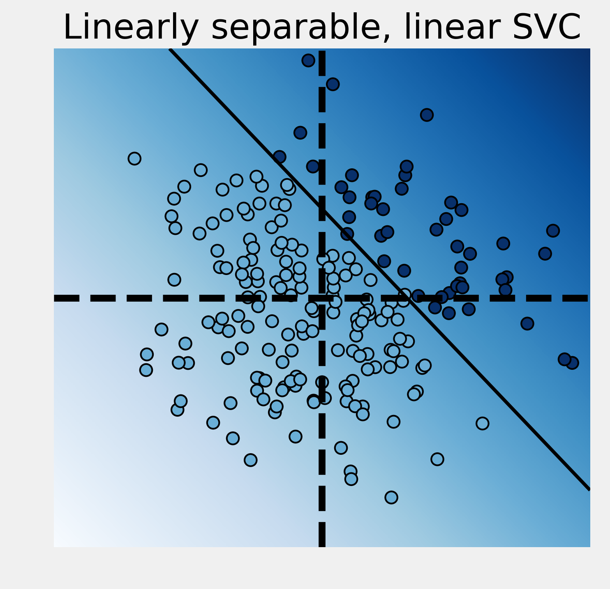
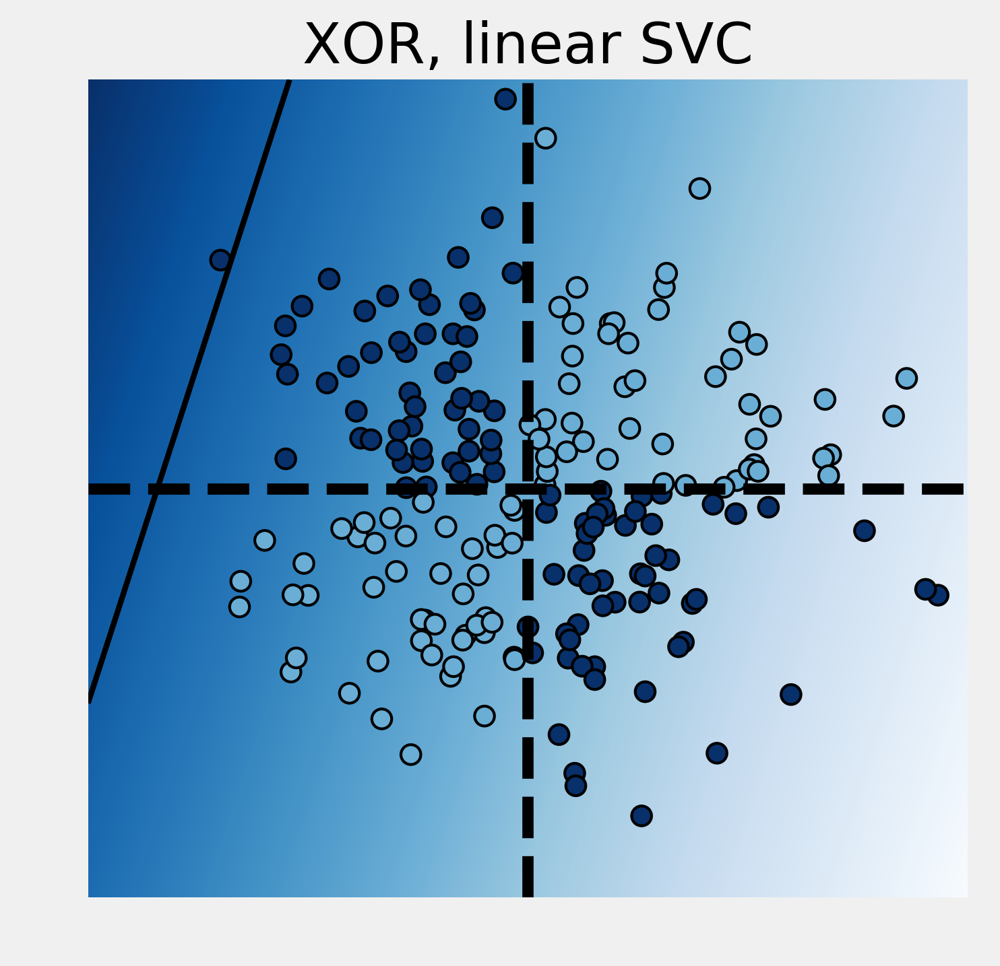
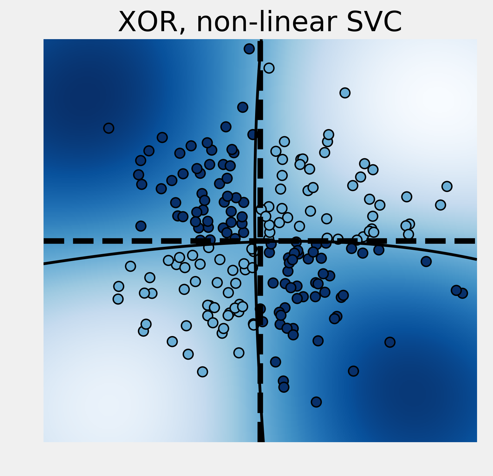
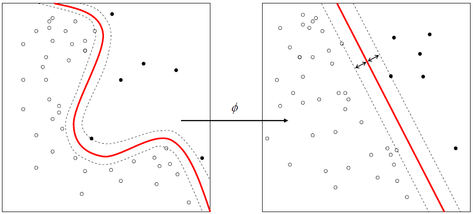

<a href="https://github.com/ipython-books/cookbook-2nd"></a> *This is one of the 100+ free recipes of the [IPython Cookbook, Second Edition](https://github.com/ipython-books/cookbook-2nd), by [Cyrille Rossant](http://cyrille.rossant.net), a guide to numerical computing and data science in the Jupyter Notebook. The ebook and printed book are available for purchase at [Packt Publishing](https://www.packtpub.com/big-data-and-business-intelligence/ipython-interactive-computing-and-visualization-cookbook-second-e).*

▶ *[Text on GitHub](https://github.com/ipython-books/cookbook-2nd) with a [CC-BY-NC-ND license](https://creativecommons.org/licenses/by-nc-nd/3.0/us/legalcode)*  
▶ *[Code on GitHub](https://github.com/ipython-books/cookbook-2nd-code) with a [MIT license](https://opensource.org/licenses/MIT)*

[*Chapter 8 : Machine Learning*](./)

# 8.5. Using support vector machines for classification tasks

In this recipe, we introduce **support vector machines**, or **SVMs**. These models can be used for classification and regression. Here, we illustrate how to use linear and nonlinear SVMs on a simple classification task. This recipe is inspired by an example in the scikit-learn documentation (see http://scikit-learn.org/stable/auto_examples/svm/plot_svm_nonlinear.html).

## How to do it...

1. Let's import the packages:

```python
import numpy as np
import pandas as pd
import sklearn
import sklearn.datasets as ds
import sklearn.model_selection as ms
import sklearn.svm as svm
import matplotlib.pyplot as plt
%matplotlib inline
```

2. We generate 2D points and assign a binary label according to a linear operation on the coordinates:

```python
X = np.random.randn(200, 2)
y = X[:, 0] + X[:, 1] > 1
```

3. We now fit a linear **Support Vector Classifier** (SVC). This classifier tries to separate the two groups of points with a linear boundary (a line here, but more generally a hyperplane):

```python
# We train the classifier.
est = svm.LinearSVC()
est.fit(X, y)
```

4. We define a function that displays the boundaries and decision function of a trained classifier:

```python
# We generate a grid in the square [-3,3 ]^2.
xx, yy = np.meshgrid(np.linspace(-3, 3, 500),
                     np.linspace(-3, 3, 500))

# This function takes a SVM estimator as input.


def plot_decision_function(est, title):
    # We evaluate the decision function on the grid.
    Z = est.decision_function(np.c_[xx.ravel(),
                                    yy.ravel()])
    Z = Z.reshape(xx.shape)
    cmap = plt.cm.Blues

    # We display the decision function on the grid.
    fig, ax = plt.subplots(1, 1, figsize=(5, 5))
    ax.imshow(Z,
              extent=(xx.min(), xx.max(),
                      yy.min(), yy.max()),
              aspect='auto',
              origin='lower',
              cmap=cmap)

    # We display the boundaries.
    ax.contour(xx, yy, Z, levels=[0],
               linewidths=2,
               colors='k')

    # We display the points with their true labels.
    ax.scatter(X[:, 0], X[:, 1],
               s=50, c=.5 + .5 * y,
               edgecolors='k',
               lw=1, cmap=cmap,
               vmin=0, vmax=1)
    ax.axhline(0, color='k', ls='--')
    ax.axvline(0, color='k', ls='--')
    ax.axis([-3, 3, -3, 3])
    ax.set_axis_off()
    ax.set_title(title)
```

5. Let's take a look at the classification results with the linear SVC:

```python
ax = plot_decision_function(
    est, "Linearly separable, linear SVC")
```



The linear SVC tried to separate the points with a line and it did a pretty good job here.

6. We now modify the labels with a `XOR` function. A point's label is 1 if the coordinates have different signs. This classification is not linearly separable. Therefore, a linear SVC fails completely:

```python
y = np.logical_xor(X[:, 0] > 0, X[:, 1] > 0)

# We train the classifier.
est = ms.GridSearchCV(svm.LinearSVC(),
                      {'C': np.logspace(-3., 3., 10)})
est.fit(X, y)
print("Score: {0:.1f}".format(
      ms.cross_val_score(est, X, y).mean()))

# We plot the decision function.
ax = plot_decision_function(
    est, "XOR, linear SVC")
```

```{output:stdout}
Score: 0.5
```



7. Fortunately, it is possible to use nonlinear SVCs by using **nonlinear kernels**. Kernels specify a nonlinear transformation of the points into a higher dimensional space. Transformed points in this space are assumed to be more linearly separable. By default, the `SVC` classifier in scikit-learn uses the **Radial Basis Function (RBF)** kernel:

```python
y = np.logical_xor(X[:, 0] > 0, X[:, 1] > 0)

est = ms.GridSearchCV(
    svm.SVC(), {'C': np.logspace(-3., 3., 10),
                'gamma': np.logspace(-3., 3., 10)})
est.fit(X, y)
print("Score: {0:.3f}".format(
      ms.cross_val_score(est, X, y).mean()))

plot_decision_function(
    est.best_estimator_, "XOR, non-linear SVC")
```

```{output:stdout}
Score: 0.955
```



This time, the nonlinear SVC successfully managed to classify these nonlinearly separable points.

## How it works...

A two-class linear SVC tries to find a hyperplane (defined as a linear equation) that best separates the two sets of points (grouped according to their labels). There is also the constraint that this separating hyperplane needs to be as far as possible from the points. This method works best when such a hyperplane exists. Otherwise, this method can fail completely, as we saw in the `XOR` example. `XOR` is known as being a nonlinearly separable operation.

The SVM classes in scikit-learn have a `C` hyperparameter. This hyperparameter trades off misclassification of training examples against simplicity of the decision surface. A low C value makes the decision surface smooth, while a high C value aims at classifying all training examples correctly. This is another example where a hyperparameter quantifies the bias-variance trade-off. This hyperparameter can be chosen with cross-validation and grid search.

The linear SVC can also be extended to multi-class problems. The multi-class SVC is directly implemented in scikit-learn.

The nonlinear SVC works by considering a nonlinear transformation $\phi(x)$ from the original space into a higher dimensional space. This nonlinear transformation can increase the linear separability of the classes. In practice, all dot products are replaced by the $k(x,x') = \phi(x) \cdot \phi(x')$ kernel.



There are several widely-used nonlinear kernels. By default, SVC uses Gaussian radial basis functions:

$$k(\mathbf{x}, \mathbf{x'}) = \exp\left(-\gamma||\mathbf{x}-\mathbf{x'}||^2\right)$$

Here, $\gamma$ is a hyperparameter of the model that can be chosen with grid search and cross-validation.

The $\phi$ function does not need to be computed explicitly. This is the **kernel trick**; it suffices to know the kernel $k(x,x')$. The existence of a function $\phi$ corresponding to a given kernel $k(x, x')$ is guaranteed by a mathematical theorem in functional analysis (Mercer's theorem).

## There's more...

Here are a few references about support vector machines:

* Exclusive OR on Wikipedia, available at https://en.wikipedia.org/wiki/Exclusive_or
* Support vector machines on Wikipedia, available at https://en.wikipedia.org/wiki/Support_vector_machine
* SVMs in scikit-learn's documentation, available at http://scikit-learn.org/stable/modules/svm.html
* Kernel trick on Wikipedia, available at https://en.wikipedia.org/wiki/Kernel_method
* Notes about the kernel trick available at http://www.eric-kim.net/eric-kim-net/posts/1/kernel_trick.html

## See also

* Predicting who will survive on the Titanic with logistic regression
* Learning to recognize handwritten digits with a K-nearest neighbors classifier
