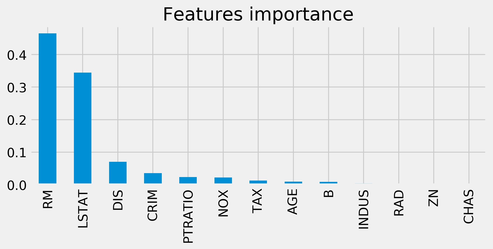
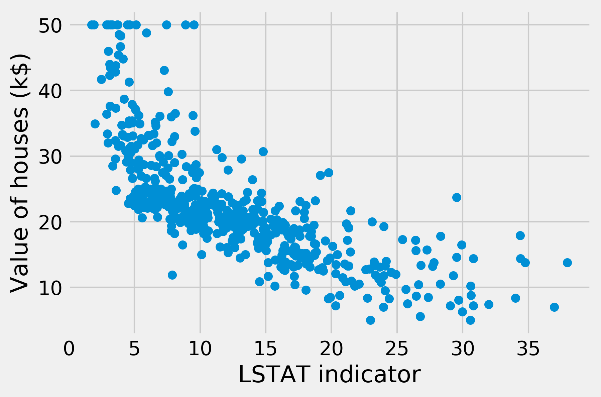
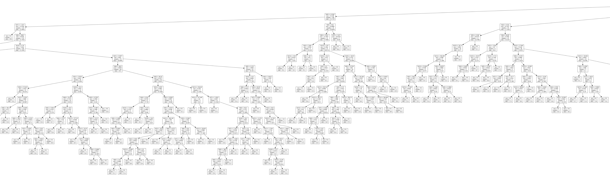
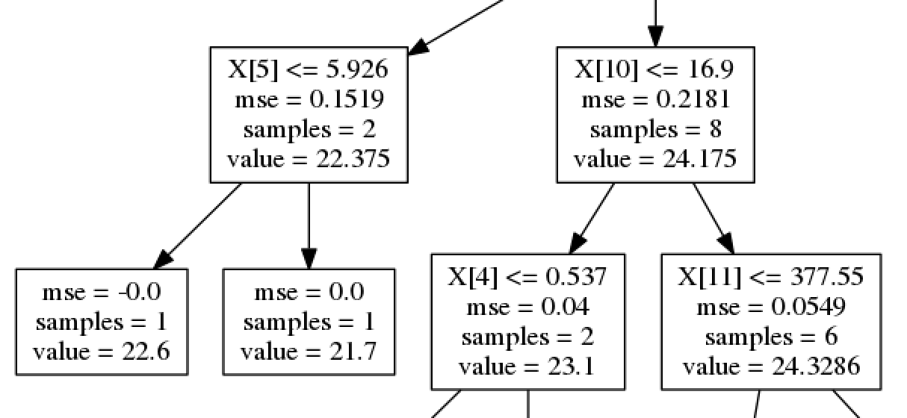

<a href="https://github.com/ipython-books/cookbook-2nd"></a> *This is one of the 100+ free recipes of the [IPython Cookbook, Second Edition](https://github.com/ipython-books/cookbook-2nd), by [Cyrille Rossant](http://cyrille.rossant.net), a guide to numerical computing and data science in the Jupyter Notebook. The ebook and printed book are available for purchase at [Packt Publishing](https://www.packtpub.com/big-data-and-business-intelligence/ipython-interactive-computing-and-visualization-cookbook-second-e).*

▶ *[Text on GitHub](https://github.com/ipython-books/cookbook-2nd) with a [CC-BY-NC-ND license](https://creativecommons.org/licenses/by-nc-nd/3.0/us/legalcode)*  
▶ *[Code on GitHub](https://github.com/ipython-books/cookbook-2nd-code) with a [MIT license](https://opensource.org/licenses/MIT)*

[*Chapter 8 : Machine Learning*](./)

# 8.6. Using a random forest to select important features for regression

**Decision trees** are frequently used to represent workflows or algorithms. They also form a method for nonparametric supervised learning. A tree mapping observations to target values is learned on a training set and gives the outcomes of new observations.

**Random forests** are ensembles of decision trees. Multiple decision trees are trained and aggregated to form a model that is more performant than any of the individual trees. This general idea is the purpose of **ensemble learning**.

There are many types of ensemble methods. Random forests are an instance of **bootstrap aggregating**, also called **bagging**, where models are trained on randomly drawn subsets of the training set.

Random forests yield information about the importance of each feature for the classification or regression task. In this recipe, we will find the most influential features of Boston house prices using a classic dataset that contains a range of diverse indicators about the houses' neighborhood.

## How to do it...

1. We import the packages:

```python
import numpy as np
import sklearn as sk
import sklearn.datasets as skd
import sklearn.ensemble as ske
import matplotlib.pyplot as plt
%matplotlib inline
```

2. We load the Boston dataset:

```python
data = skd.load_boston()
```

The details of this dataset can be found in `data['DESCR']`. Here is the description of some features:

* *CRIM*: Per capita crime rate by town
* *NOX*: Nitric oxide concentration (parts per 10 million)
* *RM*: Average number of rooms per dwelling
* *AGE*: Proportion of owner-occupied units built prior to 1940
* *DIS*: Weighted distances to five Boston employment centres
* *PTRATIO*: Pupil-teacher ratio by town
* *LSTAT*: Percentage of lower status of the population
* *MEDV*: Median value of owner-occupied homes in $1000s

The target value is `MEDV`.

3. We create a `RandomForestRegressor` model:

```python
reg = ske.RandomForestRegressor()
```

4. We get the samples and the target values from this dataset:

```python
X = data['data']
y = data['target']
```

5. Let's fit the model:

```python
reg.fit(X, y)
```

6. The importance of our features can be found in `reg.feature_importances_`. We sort them by decreasing order of importance:

```python
fet_ind = np.argsort(reg.feature_importances_)[::-1]
fet_imp = reg.feature_importances_[fet_ind]
```

7. Finally, we plot a histogram of the features' importance by creating a pandas `Series`:

```python
fig, ax = plt.subplots(1, 1, figsize=(8, 3))
labels = data['feature_names'][fet_ind]
pd.Series(fet_imp, index=labels).plot('bar', ax=ax)
ax.set_title('Features importance')
```



8. We find that *RM* (number of rooms per dwelling) and *LSTAT* (proportion of lower status of the population) are the most important features determining the price of a house. As an illustration, here is a scatter plot of the price as a function of *LSTAT*:

```python
fig, ax = plt.subplots(1, 1)
ax.scatter(X[:, -1], y)
ax.set_xlabel('LSTAT indicator')
ax.set_ylabel('Value of houses (k$)')
```



9. Optionally, we can display a graphic representation of the trees, using the **graphviz** package (available at http://www.graphviz.org):

```python
from sklearn import tree
tree.export_graphviz(reg.estimators_[0],
                     'tree.dot')
```

This command exports the first estimator of the random forest into a `.dot` file. We can convert this file into an image with the `dot` command-line executable (available in the graphviz package). The following image shows a small part of the image, which is otherwise too large to display:



The following image shows a close-up of the tree:



The intermediary nodes contain decisions of the form `feature <= value`. Every input point starts from the roof and ends up in a leaf node, depending on which conditions are satisfied. The leaf node's value gives the estimated target value for the input point. When using a random forest, an average of the values across trees is computed.

## How it works...

Several algorithms can be used to train a decision tree. scikit-learn uses the **CART**, or **Classification and Regression Trees algorithm**. This algorithm constructs binary trees using the feature and threshold that yield the largest information gain at each node. Terminal nodes give the outcomes of input values.

Decision trees are simple to understand. They can also be visualized with **pydot**, a Python package for drawing graphs and trees. This is useful when we want to understand what a tree has learned exactly (**white box model**); the conditions that apply on the observations at each node can be expressed easily with Boolean logic.

However, decision trees may suffer from overfitting, notably when they are too deep, and they might be unstable. Additionally, global convergence toward an optimal model is not guaranteed, particularly when greedy algorithms are used for training. These problems can be mitigated by using ensembles of decision trees, notably random forests.

In a random forest, multiple decision trees are trained on bootstrap samples of the training dataset (randomly sampled with replacement). Predictions are made with the averages of individual trees' predictions (bootstrap aggregating or bagging). Additionally, random subsets of the features are chosen at each node (**random subspace method**). These methods lead to an overall better model than the individual trees.

## There's more...

Here are a few references:

* Ensemble learning in scikit-learn's documentation, available at http://scikit-learn.org/stable/modules/ensemble.html
* API reference of RandomForestRegressor available at http://scikit-learn.org/stable/modules/generated/sklearn.ensemble.RandomForestRegressor.html
* Random forests on Wikipedia, available at https://en.wikipedia.org/wiki/Random_forest
* Decision tree learning on Wikipedia, available at https://en.wikipedia.org/wiki/Decision_tree_learning
* Bootstrap aggregating on Wikipedia, available at https://en.wikipedia.org/wiki/Bootstrap_aggregating
* Random subspace method on Wikipedia, available at https://en.wikipedia.org/wiki/Random_subspace_method
* Ensemble learning on Wikipedia, available at https://en.wikipedia.org/wiki/Ensemble_learning

## See also

* Using support vector machines for classification tasks
