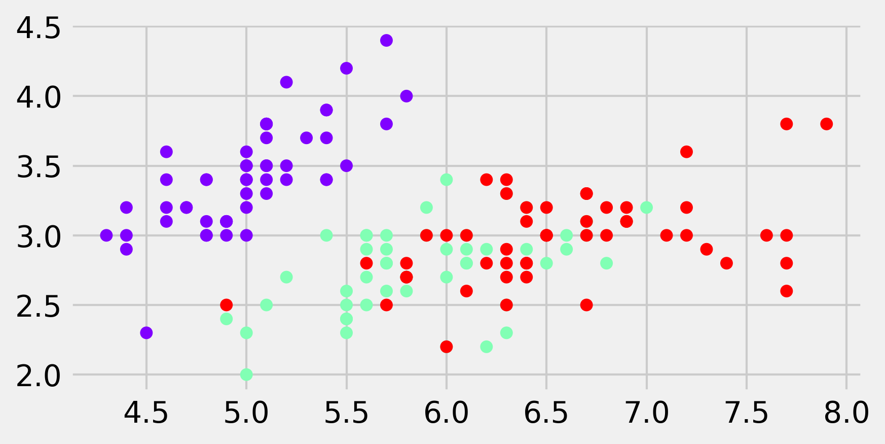
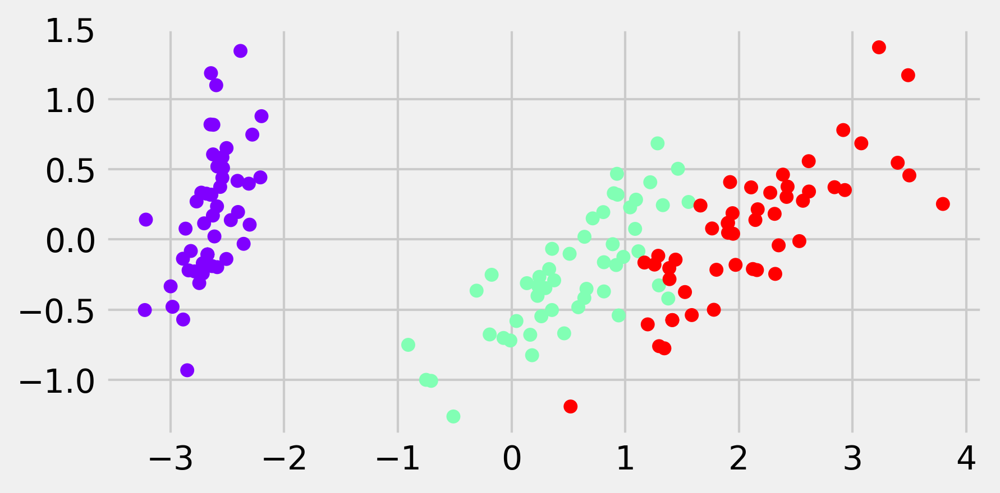
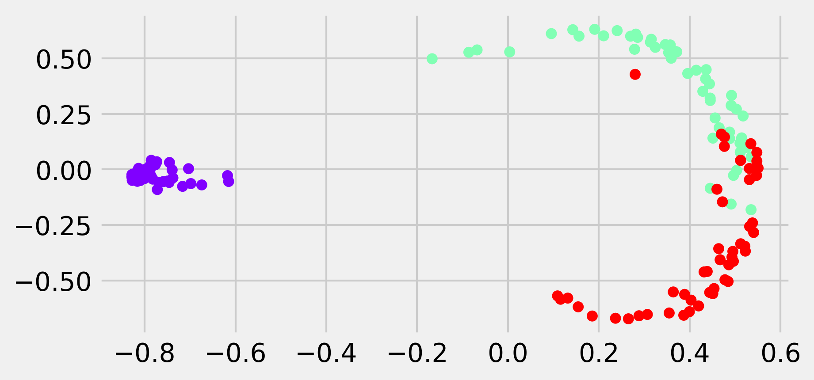

<a href="https://github.com/ipython-books/cookbook-2nd"></a> *This is one of the 100+ free recipes of the [IPython Cookbook, Second Edition](https://github.com/ipython-books/cookbook-2nd), by [Cyrille Rossant](http://cyrille.rossant.net), a guide to numerical computing and data science in the Jupyter Notebook. The ebook and printed book are available for purchase at [Packt Publishing](https://www.packtpub.com/big-data-and-business-intelligence/ipython-interactive-computing-and-visualization-cookbook-second-e).*

▶ *[Text on GitHub](https://github.com/ipython-books/cookbook-2nd) with a [CC-BY-NC-ND license](https://creativecommons.org/licenses/by-nc-nd/3.0/us/legalcode)*  
▶ *[Code on GitHub](https://github.com/ipython-books/cookbook-2nd-code) with a [MIT license](https://opensource.org/licenses/MIT)*

[*Chapter 8 : Machine Learning*](./)

# 8.7. Reducing the dimensionality of a dataset with a principal component analysis

[The recipe is available in the book, to be purchased on Packt.](https://www.packtpub.com/big-data-and-business-intelligence/ipython-interactive-computing-and-visualization-cookbook-second-e)

<!-- REMOVE AS PER PACKT AGREEMENT

In the previous recipes, we presented *supervised learning *methods; our data points came with discrete or continuous labels, and the algorithms were able to learn the mapping from the points to the labels.

Starting with this recipe, we will present **unsupervised learning** methods. These methods might be helpful prior to running a supervised learning algorithm. They can give a first insight into the data.

Let's assume that our data consists of points $x_i$ without any labels. The goal is to discover some form of hidden structure in this set of points. Frequently, data points have intrinsic low dimensionality: a small number of features suffice to accurately describe the data. However, these features might be hidden among many other features not relevant to the problem. Dimension reduction can help us find these structures. This knowledge can considerably improve the performance of subsequent supervised learning algorithms.

Another useful application of unsupervised learning is **data visualization**; high-dimensional datasets are hard to visualize in 2D or 3D. Projecting the data points on a subspace or submanifold yields more interesting visualizations.

In this recipe, we will illustrate a basic unsupervised linear method, **principal component analysis (PCA)**. This algorithm lets us project data points linearly on a low-dimensional subspace. Along the **principal components**, which are vectors forming a basis of this low-dimensional subspace, the variance of the data points is maximum.

We will use the classic *Iris flower* dataset as an example. This dataset contains the width and length of the petal and sepal of 150 iris flowers. These flowers belong to one of three categories: *Iris setosa*, *Iris virginica*, and *Iris versicolor*. We have access to the category in this dataset (labeled data). However, because we are interested in illustrating an unsupervised learning method, we will only use the data matrix *without* the labels.

## How to do it...

1. We import NumPy, matplotlib, and scikit-learn:

```python
import numpy as np
import sklearn
import sklearn.decomposition as dec
import sklearn.datasets as ds
import matplotlib.pyplot as plt
%matplotlib inline
```

2. The Iris flower dataset is available in the `datasets` module of scikit-learn:

```python
iris = ds.load_iris()
X = iris.data
y = iris.target
print(X.shape)
```

```{output:stdout}
(150, 4)
```

3. Each row contains four parameters related to the morphology of the flower. Let's display the first two dimensions. The color reflects the iris variety of the flower (the label, between 0 and 2):

```python
fig, ax = plt.subplots(1, 1, figsize=(6, 3))
ax.scatter(X[:, 0], X[:, 1], c=y,
           s=30, cmap=plt.cm.rainbow)
```



> If you're reading the printed version of this book, you might not be able to distinguish the colors. You will find the colored images on the book's website.

4. We now apply PCA on the dataset to get the transformed matrix. This operation can be done in a single line with scikit-learn: we instantiate a `PCA` model and call the `fit_transform()` method. This function computes the principal components and projects the data on them:

```python
X_bis = dec.PCA().fit_transform(X)
```

5. We now display the same dataset, but in a new coordinate system (or equivalently, a linearly transformed version of the initial dataset):

```python
fig, ax = plt.subplots(1, 1, figsize=(6, 3))
ax.scatter(X_bis[:, 0], X_bis[:, 1], c=y,
           s=30, cmap=plt.cm.rainbow)
```



Points belonging to the same classes are now grouped together, even though the `PCA` estimator did *not* use the labels. The PCA was able to find a projection maximizing the variance, which corresponds here to a projection where the classes are well separated.

6. The `scikit.decomposition` module contains several variants of the classic PCA estimator: `ProbabilisticPCA`, `SparsePCA`, `RandomizedPCA`, `KernelPCA`, and others. As an example, let's take a look at `KernelPCA`, a nonlinear version of PCA:

```python
X_ter = dec.KernelPCA(kernel='rbf').fit_transform(X)
fig, ax = plt.subplots(1, 1, figsize=(6, 3))
ax.scatter(X_ter[:, 0], X_ter[:, 1], c=y, s=30,
           cmap=plt.cm.rainbow)
```



## How it works...

Let's look at the mathematical ideas behind PCA. This method is based on a matrix decomposition called **Singular Value Decomposition (SVD)**:

$$X = U \Sigma V^T$$

Here, $X$ is the $(N, D)$ data matrix, $U$ and $V$ are orthogonal matrices, and $\Sigma$ is an $(N, D)$ diagonal matrix.

PCA transforms $X$ into $X'$ defined by:

$$X' = XV = U\Sigma$$

The diagonal elements of $\Sigma$ are the **singular values** of $X$. By convention, they are generally sorted in descending order. The columns of $U$ are orthonormal vectors called the **left singular vectors** of $X$. Therefore, the columns of $X'$ are the left singular vectors multiplied by the singular values.

In the end, PCA converts the initial set of observations, which are made of possibly correlated variables, into vectors of linearly uncorrelated variables called **principal components**.

The first new feature (or first component) is a transformation of all original features such that the dispersion (variance) of the data points is the highest in that direction. In the subsequent principal components, the variance is decreasing. In other words, PCA gives us an alternative representation of our data where the new features are sorted according to how much they account for the variability of the points.

## There's more...

Here are a few further references:

* Iris flower dataset on Wikipedia, available at https://en.wikipedia.org/wiki/Iris_flower_data_set
* PCA on Wikipedia, available at https://en.wikipedia.org/wiki/Principal_component_analysis
* SVD decomposition on Wikipedia, available at https://en.wikipedia.org/wiki/Singular_value_decomposition
* Iris dataset example available at http://scikit-learn.org/stable/auto_examples/datasets/plot_iris_dataset.html
* Decompositions in scikit-learn's documentation, available at http://scikit-learn.org/stable/modules/decomposition.html
* Unsupervised learning tutorial with scikit-learn available at http://scikit-learn.org/dev/tutorial/statistical_inference/unsupervised_learning.html

## See also

* Detecting hidden structures in a dataset with clustering

-->
