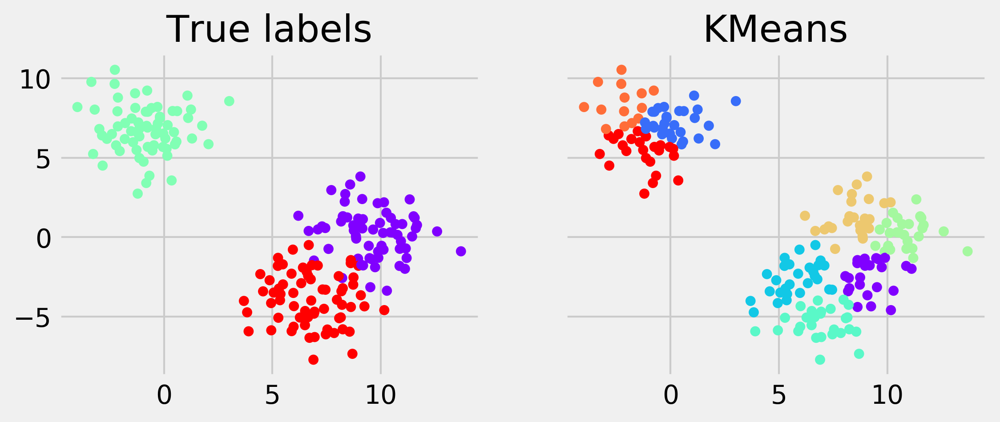
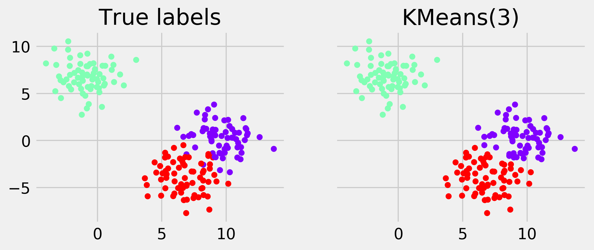
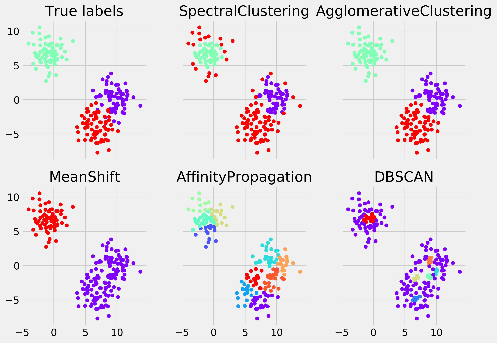

<a href="https://github.com/ipython-books/cookbook-2nd"></a> *This is one of the 100+ free recipes of the [IPython Cookbook, Second Edition](https://github.com/ipython-books/cookbook-2nd), by [Cyrille Rossant](http://cyrille.rossant.net), a guide to numerical computing and data science in the Jupyter Notebook. The ebook and printed book are available for purchase at [Packt Publishing](https://www.packtpub.com/big-data-and-business-intelligence/ipython-interactive-computing-and-visualization-cookbook-second-e).*

▶ *[Text on GitHub](https://github.com/ipython-books/cookbook-2nd) with a [CC-BY-NC-ND license](https://creativecommons.org/licenses/by-nc-nd/3.0/us/legalcode)*  
▶ *[Code on GitHub](https://github.com/ipython-books/cookbook-2nd-code) with a [MIT license](https://opensource.org/licenses/MIT)*

[*Chapter 8 : Machine Learning*](./)

# 8.8. Detecting hidden structures in a dataset with clustering

A large part of unsupervised learning is devoted to the **clustering** problem. The goal is to group similar points together in a totally unsupervised way. Clustering is a hard problem, as the very definition of **clusters** (or **groups**) is not necessarily well posed. In most datasets, stating that two points should belong to the same cluster may be context-dependent or even subjective.

There are many clustering algorithms. We will see a few of them in this recipe, applied to a toy example.

## How to do it...

1. Let's import the libraries:

```python
from itertools import permutations
import numpy as np
import sklearn
import sklearn.decomposition as dec
import sklearn.cluster as clu
import sklearn.datasets as ds
import sklearn.model_selection as ms
import matplotlib.pyplot as plt
%matplotlib inline
```

2. Let's generate a random dataset with three clusters:

```python
X, y = ds.make_blobs(n_samples=200,
                     n_features=2,
                     centers=3,
                     cluster_std=1.5,
                     )
```

3. We need a couple of functions to relabel and display the results of the clustering algorithms:

```python
def relabel(cl):
    """Relabel a clustering with three clusters
    to match the original classes."""
    if np.max(cl) != 2:
        return cl
    perms = np.array(list(permutations((0, 1, 2))))
    i = np.argmin([np.sum(np.abs(perm[cl] - y))
                   for perm in perms])
    p = perms[i]
    return p[cl]
```

```python
def display_clustering(labels, title):
    """Plot the data points with the cluster
    colors."""

    # We relabel the classes when there are 3 clusters
    labels = relabel(labels)
    fig, axes = plt.subplots(1, 2, figsize=(8, 3),
                             sharey=True)
    # Display the points with the true labels on the
    # left, and with the clustering labels on the
    # right.
    for ax, c, title in zip(
            axes,
            [y, labels],
            ["True labels", title]):
        ax.scatter(X[:, 0], X[:, 1], c=c, s=30,
                   linewidths=0, cmap=plt.cm.rainbow)
        ax.set_title(title)
```

4. Now, we cluster the dataset with the **K-means** algorithm, a classic and simple clustering algorithm:

```python
km = clu.KMeans()
km.fit(X)
display_clustering(km.labels_, "KMeans")
```



> If you're reading the printed version of this book, you might not be able to distinguish the colors. You will find the colored images on the book's website.

5. This algorithm needs to know the number of clusters at initialization time. In general, however, we do not necessarily know the number of clusters in the dataset. Here, let's try with `n_clusters=3` (that's cheating, because we happen to know that there are 3 clusters):

```python
km = clu.KMeans(n_clusters=3)
km.fit(X)
display_clustering(km.labels_, "KMeans(3)")
```



6. Let's try a few other clustering algorithms implemented in scikit-learn. The simplicity of the API makes it really easy to try different methods; it is just a matter of changing the name of the class:

```python
fig, axes = plt.subplots(2, 3,
                         figsize=(10, 7),
                         sharex=True,
                         sharey=True)

axes[0, 0].scatter(X[:, 0], X[:, 1],
                   c=y, s=30,
                   linewidths=0,
                   cmap=plt.cm.rainbow)
axes[0, 0].set_title("True labels")

for ax, est in zip(axes.flat[1:], [
    clu.SpectralClustering(3),
    clu.AgglomerativeClustering(3),
    clu.MeanShift(),
    clu.AffinityPropagation(),
    clu.DBSCAN(),
]):
    est.fit(X)
    c = relabel(est.labels_)
    ax.scatter(X[:, 0], X[:, 1], c=c, s=30,
               linewidths=0, cmap=plt.cm.rainbow)
    ax.set_title(est.__class__.__name__)

# Fix the spacing between subplots.
fig.tight_layout()
```



The first two algorithms required the number of clusters as input. The next one did not, but it was able to find the right number. The last two failed at finding the correct number of clusters (this is *overclustering*—too many clusters have been found).

## How it works...

The K-means clustering algorithm consists of partitioning the data points $x_j$ into $K$ clusters $S_i$ so as to minimize the within-cluster sum of squares:

$$\underset{\mathbf{S}} {\operatorname{arg min}}  \sum_{i=1}^{k} \sum_{\mathbf{x}_j \in S_i} \left\| \mathbf{x}_j - \mathbf{\mu}_i \right\|_2^2$$

Here, $\mu_i$ is the center of the cluster $i$ (average of all points in $S_i$).

Although it is very hard to solve this problem exactly, approximation algorithms exist. A popular one is **Lloyd's algorithm**. It consists of starting from an initial set of $K$ means $\mu_i$ and alternating between two steps:

* In the *assignment step*, the points are assigned to the cluster associated to the closest mean
* In the *update step*, the means are recomputed from the last assignments

The algorithm converges to a solution that is not guaranteed to be optimal.

The **expectation-maximization algorithm** can be seen as a probabilistic version of the K-means algorithm. It is implemented in the `mixture` module of scikit-learn.

The other clustering algorithms used in this recipe are explained in the scikit-learn documentation. There is no clustering algorithm that works uniformly better than all the others, and every algorithm has its strengths and weaknesses. You will find more details in the references in the next section.

## There's more...

Here are a few references:

* The K-means clustering algorithm on Wikipedia, available at https://en.wikipedia.org/wiki/K-means_clustering
* The expectation-maximization algorithm on Wikipedia, available at https://en.wikipedia.org/wiki/Expectation-maximization_algorithm
* Clustering in scikit-learn's documentation, available at http://scikit-learn.org/stable/modules/clustering.html
* t-distributed stochastic neighbor embedding, or t-SNE clustering method, at https://lvdmaaten.github.io/tsne/
* scikit-learn t-SNE implementation, at http://scikit-learn.org/stable/modules/generated/sklearn.manifold.TSNE.html
* Uniform Manifold Approximation and Projection, or UMAP, a t-SNE alternative, at https://github.com/lmcinnes/umap

## See also

* Reducing the dimensionality of a dataset with a principal component analysis
