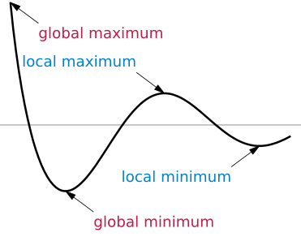

 *This is one of the 100+ free recipes of the [IPython Cookbook, Second Edition](https://github.com/ipython-books/cookbook-2nd), by [Cyrille Rossant](http://cyrille.rossant.net), a guide to numerical computing and data science in the Jupyter Notebook. The ebook and printed book are available for purchase at [Packt Publishing](https://www.packtpub.com/big-data-and-business-intelligence/ipython-interactive-computing-and-visualization-cookbook-second-e).*

▶ *[Text on GitHub](https://github.com/ipython-books/cookbook-2nd) with an [CC-BY-NC-ND license](https://creativecommons.org/licenses/by-nc-nd/3.0/us/legalcode)*  
▶ *[Code on GitHub](https://github.com/ipython-books/cookbook-2nd-code) with an [MIT license](https://opensource.org/licenses/MIT)*

[*Chapter 9 : Numerical Optimization*](../)

# Introduction

**Mathematical optimization** is a wide area of applied mathematics. It consists of finding the best solution to a given problem. Many real-world problems can be expressed in an optimization framework. What is the shortest path on the road from point A to point B? What is the best strategy to solve a puzzle? What is the most energy-efficient shape of a car (automotive aerodynamics)? Mathematical optimization is relevant in many domains including engineering, economics, finance, operations research, image processing, data analysis, and others.

Mathematically, an optimization problem consists of finding the maximum or minimum value of a function. We sometimes use the terms **continuous optimization** or **discrete optimization**, according to whether the function variable is real-valued or discrete.

In this chapter, we will focus on numerical methods for solving continuous optimization problems. Many optimization algorithms are implemented in the `scipy.optimize` module. We will come across other instances of optimization problems in several other chapters of this book. For example, we will see discrete optimization problems in *Chapter 14, Graphs, Geometry, and Geographic Information Systems*.

In this introduction, we give a few important definitions and key concepts related to mathematical optimization.

## The objective function

We will study methods to find a root or an **extremum** of a real-valued function $f$ called the **objective function**. An extremum is either a maximum or a minimum of a function. It can accept one or several variables, it can be continuous or not, and so on. The more assumptions we have about the function, the easier it can be optimized.

> INFO: A maximum of $f$ is a minimum of $-f$, so any minimization algorithm can be used to maximize a function by considering the opposite of that function. Therefore, from now on, when we talk about *minimization*, we will really mean *minimization or maximization*.

**Convex functions** are easier to optimize than non-convex functions, as they satisfy certain useful properties. For example, any local minimum is necessarily a global minimum. The field of **convex optimization** deals with algorithms that are specifically adapted to the optimization of convex functions on convex domains. Convex optimization is an advanced topic, and we can't cover much of it here.

**Differentiable functions** have gradients, and these gradients can be particularly useful in optimization algorithms. Similarly, **continuous functions** are typically easier to optimize than non-continuous functions.

Also, functions with a single variable are easier to optimize than functions with multiple variables.

The choice of the most adequate optimization algorithm depends on the properties satisfied by the objective function.

## Local and global minima

A **minimum** of a function $f$ is a point $x_0$ such that $f(x) \geq f(x_0)$, for a particular set of points $x$ in $E$. When this inequality is satisfied on the whole set $E$, we refer to $x_0$ as a **global minimum**. When it is only satisfied locally (around the point $x_0$), we say that $x_0$ is a **local minimum**. A **maximum** is defined similarly.

If $f$ is differentiable, an extremum $x_0$ satisfies:

$$f'(\mathbf{x}_0)=0$$

Therefore, finding the extrema of an objective function is closely related to finding the roots of the derivative. However, a point $x_0$ satisfying this property is not necessarily an extremum.

It is more difficult to find global minima than to find local minima. In general, when an algorithm finds a local minimum, there is no guarantee that it is also a global minimum. Frequently, an algorithm seeking a global minimum stays stuck in a local minimum. This problem needs to be accounted for, specifically in global minimization algorithms. However, things are simpler with convex functions since these do not have strictly local minima. Moreover, there are many cases where finding a local minimum is good enough (for example, when looking for a good solution to a problem rather than the absolute best solution).

Finally, let's note that a global minimum or maximum does not necessarily exist (the function can go to infinity). In that case, it may be necessary to constrain the space search; this is the subject of **constrained optimization**.

## Constrained and unconstrained optimization

* **Unconstrained optimization**: Finding the minimum of a function $f$ on the full set $E$ where $f$ is defined
* **Constrained optimization**: Finding the minimum of a function $f$ on a subset $E'$ of $E$; this set is generally described by equalities and inequalities:

$$\mathbf{x} \in E' \Longleftrightarrow \forall i, j, \quad g_i(\mathbf{x}) = c_i, \quad h_j(\mathbf{x}) \leq d_j$$

Here, the $g_i$ and $h_j$ are arbitrary functions defining the constraints.

For example, optimizing the aerodynamic shape of a car requires constraints on parameters such as the volume and mass of the car, the cost of the production process, and others.

## Deterministic and stochastic algorithms

Some global optimization algorithms are **deterministic**, others are **stochastic**. Stochastic methods are useful when dealing with the highly irregular and noisy functions that are typical of real-world data. Deterministic algorithms may be stuck in local minima, particularly if there are many non-global local minima. By spending some time exploring the space $E$, stochastic algorithms may have a chance of finding a global minimum.

## References

* The SciPy lecture notes are an excellent reference on mathematical optimization with SciPy and are available at http://scipy-lectures.github.io/advanced/mathematical_optimization/index.html
* Reference manual of scipy.optimize available at http://docs.scipy.org/doc/scipy/reference/optimize.html
* Numerical Analysis on Awesome Math, at https://github.com/rossant/awesome-math/#numerical-analysis
* Overview of mathematical optimization on Wikipedia, available at https://en.wikipedia.org/wiki/Mathematical_optimization
* Extrema, minima, and maxima on Wikipedia, available at https://en.wikipedia.org/wiki/Maxima_and_minima
* Convex optimization on Wikipedia, available at https://en.wikipedia.org/wiki/Convex_optimization
