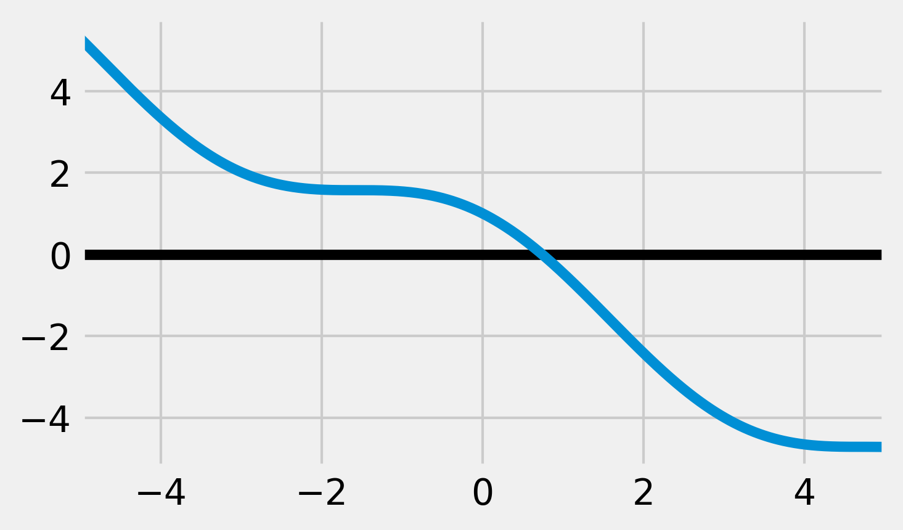
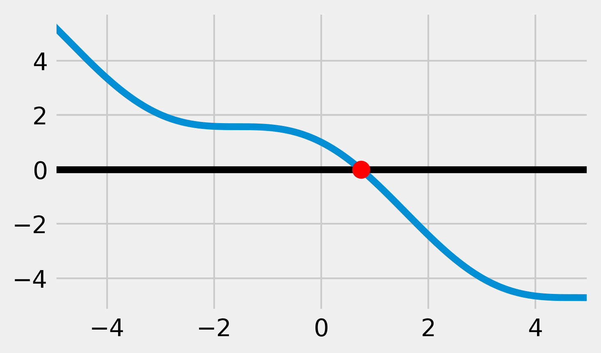

<a href="https://github.com/ipython-books/cookbook-2nd"></a> *This is one of the 100+ free recipes of the [IPython Cookbook, Second Edition](https://github.com/ipython-books/cookbook-2nd), by [Cyrille Rossant](http://cyrille.rossant.net), a guide to numerical computing and data science in the Jupyter Notebook. The ebook and printed book are available for purchase at [Packt Publishing](https://www.packtpub.com/big-data-and-business-intelligence/ipython-interactive-computing-and-visualization-cookbook-second-e).*

▶ *[Text on GitHub](https://github.com/ipython-books/cookbook-2nd) with a [CC-BY-NC-ND license](https://creativecommons.org/licenses/by-nc-nd/3.0/us/legalcode)*  
▶ *[Code on GitHub](https://github.com/ipython-books/cookbook-2nd-code) with a [MIT license](https://opensource.org/licenses/MIT)*

[*Chapter 9 : Numerical Optimization*](./)

# 9.1. Finding the root of a mathematical function

[The recipe is available in the book, to be purchased on Packt.](https://www.packtpub.com/big-data-and-business-intelligence/ipython-interactive-computing-and-visualization-cookbook-second-e)

<!-- REMOVE AS PER PACKT AGREEMENT

In this short recipe, we will see how to use SciPy to find the root of a simple mathematical function of a single real variable.

## How to do it...

1. Let's import NumPy, SciPy, scipy.optimize, and matplotlib:

```python
import numpy as np
import scipy as sp
import scipy.optimize as opt
import matplotlib.pyplot as plt
%matplotlib inline
```

2. We define the mathematical function $f(x)=\cos(x)-x$ in Python. We will try to find a root of this function numerically. Here, a root corresponds to a fixed point of the cosine function:

```python
def f(x):
    return np.cos(x) - x
```

3. Let's plot this function on the interval $[-5, 5]$ (using 1000 samples):

```python
x = np.linspace(-5, 5, 1000)
y = f(x)
fig, ax = plt.subplots(1, 1, figsize=(5, 3))
ax.axhline(0, color='k')
ax.plot(x, y)
ax.set_xlim(-5, 5)
```



4. We see that this function has a unique root on this interval (this is because the function's sign changes on this interval). The `scipy.optimize` module contains a few root-finding functions that are adapted here. For example, the `bisect()` function implements the **bisection method** (also called the **dichotomy method**). It takes as input the function and the interval to find the root in:

```python
opt.bisect(f, -5, 5)
```

```{output:result}
0.739
```

Let's visualize the root on the plot:

```python
fig, ax = plt.subplots(1, 1, figsize=(5, 3))
ax.axhline(0, color='k')
ax.plot(x, y)
# The zorder argument is used to put
# the dot on top of the other elements.
ax.scatter([_], [0], c='r', s=100,
           zorder=10)
ax.set_xlim(-5, 5)
```



5. A faster and more powerful method is `brentq()` (**Brent's method**). This algorithm also requires `f` to be continuous and `f(a)` and `f(b)` to have different signs:

```python
opt.brentq(f, -5, 5)
```

```{output:result}
0.739
```

The `brentq()` method is faster than `bisect()`. If the conditions are satisfied, it is a good idea to try Brent's method first:

```python
%timeit opt.bisect(f, -5, 5)
%timeit opt.brentq(f, -5, 5)
```

```{output:stdout}
34.5 µs ± 855 ns per loop (mean ± std. dev. of 7 runs,
    10000 loops each)
7.71 µs ± 170 ns per loop (mean ± std. dev. of 7 runs,
    100000 loops each)
```

## How it works...

The bisection method consists of iteratively cutting an interval in half and selecting a subinterval that necessarily contains a root. This method is based on the fact that, if $f$ is a continuous function of a single real variable, $f(a)>0$, and $f(b)<0$, then $f$ has a root in $(a,b)$ (**intermediate value theorem**).

**Brent's method** is a popular hybrid algorithm combining root bracketing, interval bisection, and inverse quadratic interpolation. It is a default method that works in many cases.

Let's also mention **Newton's method**. The idea is to approximate $f(x)$ by its tangent (found with $f'(x)$) and find the intersection with the $y=0$ line. If $f$ is regular enough, the intersection point will be closer to the actual root of $f$. By iterating this operation, the algorithm may converge to the sought solution.

## There's more

Here are a few references:

* Documentation of scipy.optimize available at http://docs.scipy.org/doc/scipy/reference/optimize.html#root-finding
* A course on root finding with SciPy available at http://quant-econ.net/scipy.html#roots-and-fixed-points
* The Bisection method on Wikipedia, available at https://en.wikipedia.org/wiki/Bisection_method
* The intermediate value theorem on Wikipedia, available at https://en.wikipedia.org/wiki/Intermediate_value_theorem
* Brent's method on Wikipedia, available at https://en.wikipedia.org/wiki/Brent%27s_method
* Newton's method on Wikipedia, available at https://en.wikipedia.org/wiki/Newton%27s_method

## See also

* Minimizing a mathematical function

-->
