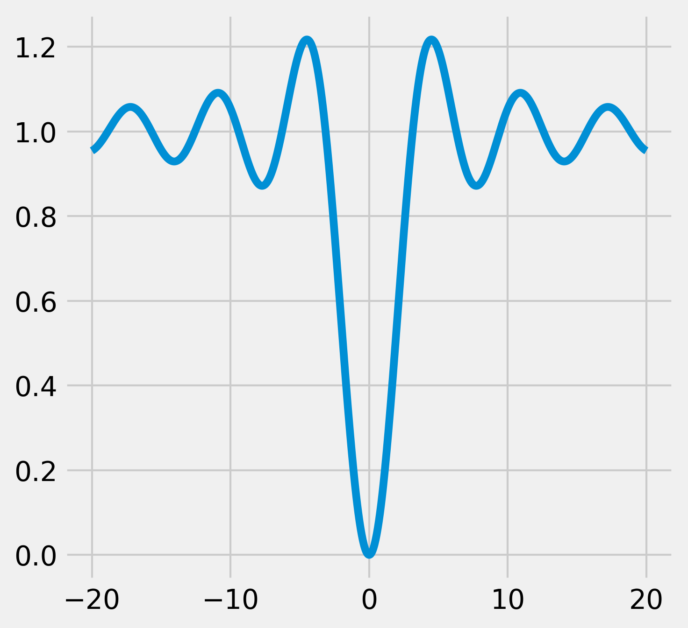
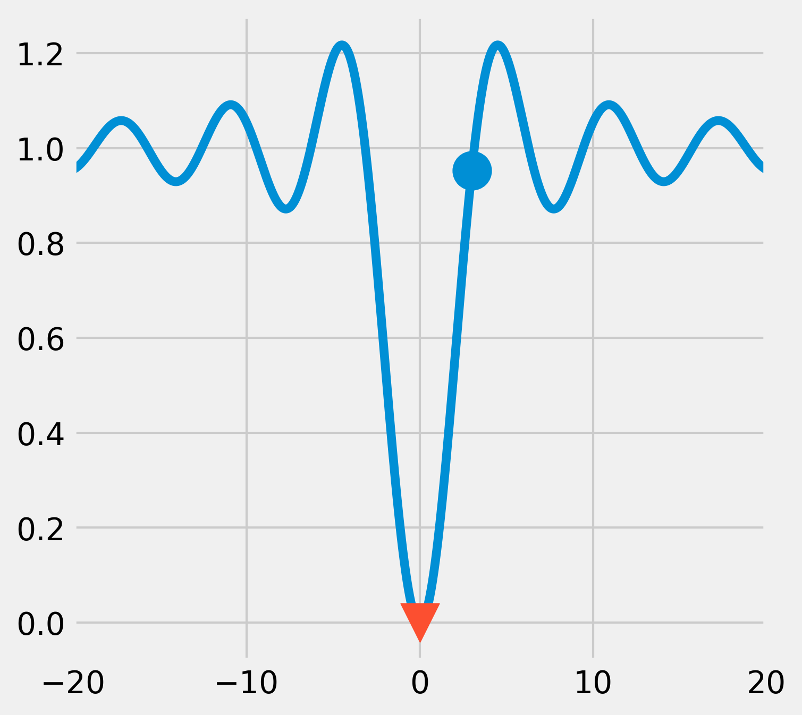
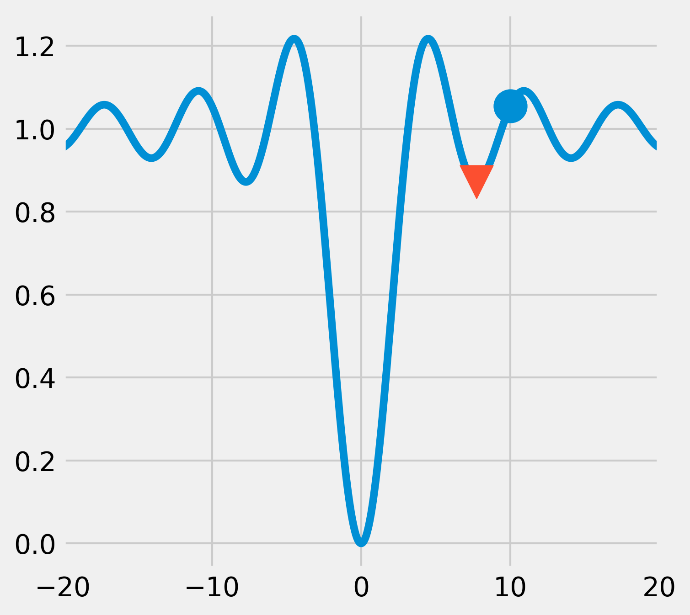
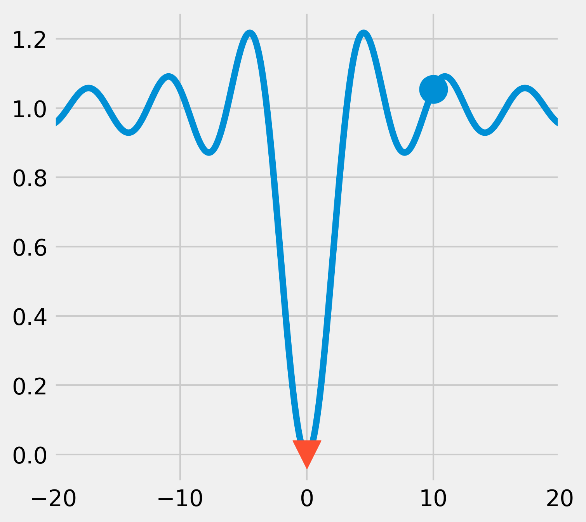
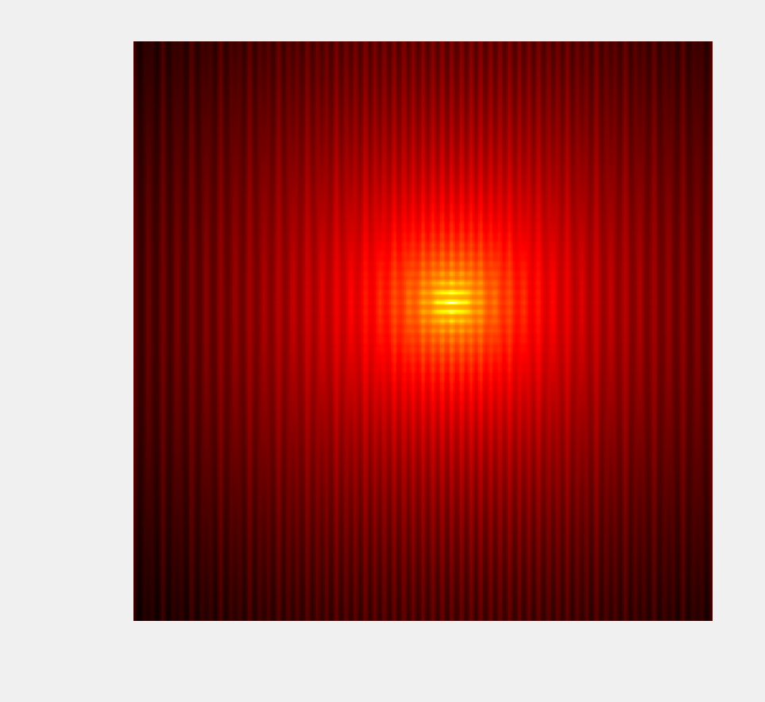

<a href="https://github.com/ipython-books/cookbook-2nd"></a> *This is one of the 100+ free recipes of the [IPython Cookbook, Second Edition](https://github.com/ipython-books/cookbook-2nd), by [Cyrille Rossant](http://cyrille.rossant.net), a guide to numerical computing and data science in the Jupyter Notebook. The ebook and printed book are available for purchase at [Packt Publishing](https://www.packtpub.com/big-data-and-business-intelligence/ipython-interactive-computing-and-visualization-cookbook-second-e).*

▶ *[Text on GitHub](https://github.com/ipython-books/cookbook-2nd) with a [CC-BY-NC-ND license](https://creativecommons.org/licenses/by-nc-nd/3.0/us/legalcode)*  
▶ *[Code on GitHub](https://github.com/ipython-books/cookbook-2nd-code) with a [MIT license](https://opensource.org/licenses/MIT)*

[*Chapter 9 : Numerical Optimization*](./)

# 9.2. Minimizing a mathematical function

Mathematical optimization deals mainly with the problem of finding a minimum or a maximum of a mathematical function. Frequently, a real-world numerical problem can be expressed as a function minimization problem. Such examples can be found in statistical inference, machine learning, graph theory, and other areas.

Although there are many function minimization algorithms, a generic and universal method does not exist. Therefore, it is important to understand the differences between existing classes of algorithms, their specificities, and their respective use cases. We should also have a good understanding of our problem and our objective function; is it continuous, differentiable, convex, multidimensional, regular, or noisy? Is our problem constrained or unconstrained? Are we seeking local or global minima?

In this recipe, we will demonstrate a few usage examples of the function minimization algorithms implemented in SciPy.

## How to do it...

1. We import the libraries:

```python
import numpy as np
import scipy as sp
import scipy.optimize as opt
import matplotlib.pyplot as plt
%matplotlib inline
```

2. First, let's define a simple mathematical function (the opposite of the **cardinal sine**). This function has many local minima but a single global minimum (https://en.wikipedia.org/wiki/Sinc_function):

```python
def f(x):
    return 1 - np.sin(x) / x
```

3. Let's plot this function on the interval $[-20, 20]$ (with 1000 samples):

```python
x = np.linspace(-20., 20., 1000)
y = f(x)
```

```python
fig, ax = plt.subplots(1, 1, figsize=(5, 5))
ax.plot(x, y)
```



4. The `scipy.optimize` module comes with many function minimization routines. The `minimize()` function offers a unified interface to many algorithms. The **Broyden-Fletcher-Goldfarb-Shanno (BFGS) algorithm** (the default algorithm in `minimize()`) gives good results in general. The `minimize()` function requires an initial point as argument. For scalar univariate functions, we can also use `minimize_scalar()`:

```python
x0 = 3
xmin = opt.minimize(f, x0).x
```

Starting from $x_0=3$, the algorithm was able to find the actual global minimum, as shown in the following figure:

```python
fig, ax = plt.subplots(1, 1, figsize=(5, 5))
ax.plot(x, y)
ax.scatter(x0, f(x0), marker='o', s=300)
ax.scatter(xmin, f(xmin), marker='v', s=300,
           zorder=20)
ax.set_xlim(-20, 20)
```



5. Now, if we start from an initial point that is further away from the actual global minimum, the algorithm converges towards a *local* minimum only:

```python
x0 = 10
xmin = opt.minimize(f, x0).x
```

```python
fig, ax = plt.subplots(1, 1, figsize=(5, 5))
ax.plot(x, y)
ax.scatter(x0, f(x0), marker='o', s=300)
ax.scatter(xmin, f(xmin), marker='v', s=300,
           zorder=20)
ax.set_xlim(-20, 20)
```



6. Like most function minimization algorithms, the BFGS algorithm is efficient at finding *local* minima, but not necessarily *global* minima, especially on complicated or noisy objective functions. A general strategy to overcome this problem is to combine such algorithms with an exploratory grid search on the initial points. Another option is to use a different class of algorithms based on heuristics and stochastic methods. An example is the **basin-hopping algorithm**:

```python
# We use 1000 iterations.
xmin = opt.basinhopping(f, x0, 1000).x
```

```python
fig, ax = plt.subplots(1, 1, figsize=(5, 5))
ax.plot(x, y)
ax.scatter(x0, f(x0), marker='o', s=300)
ax.scatter(xmin, f(xmin), marker='v', s=300,
           zorder=20)
ax.set_xlim(-20, 20)
```



This time, the algorithm was able to find the global minimum.

7. Now, let's define a new function, in two dimensions this time, called the **Lévi function**:

$$f(x,y) = \sin^{2}\left(3\pi x\right)+\left(x-1\right)^{2}\left(1+\sin^{2}\left(3\pi y\right)\right)+\left(y-1\right)^{2}\left(1+\sin^{2}\left(2\pi y\right)\right)$$

This function is very irregular and may be difficult to minimize in general. The expected global minimum is $(1, 1)$. The Lévi function is one of the many **test functions for optimization** that researchers have developed to study and benchmark optimization algorithms (https://en.wikipedia.org/wiki/Test_functions_for_optimization):

```python
def g(X):
    # X is a 2*N matrix, each column contains
    # x and y coordinates.
    x, y = X
    return (np.sin(3*np.pi*x)**2 +
            (x-1)**2 * (1 + np.sin(3*np.pi*y)**2) +
            (y-1)**2 * (1 + np.sin(2*np.pi*y)**2))
```

8. Let's display this function with `imshow()`, on the square $[-10,10]^2$:

```python
n = 500
k = 10
X, Y = np.mgrid[-k:k:n * 1j,
                -k:k:n * 1j]
```

```python
Z = g(np.vstack((X.ravel(), Y.ravel()))).reshape(n, n)
```

```python
fig, ax = plt.subplots(1, 1, figsize=(3, 3))
# We use a logarithmic scale for the color here.
ax.imshow(np.log(Z), cmap=plt.cm.hot_r,
          extent=(-k, k, -k, k), origin=0)
ax.set_axis_off()
```



9. The `minimize()` function also works in multiple dimensions:

```python
# We use the Powell method.
x0, y0 = opt.minimize(g, (8, 3),
                      method='Powell').x
x0, y0
```

```{output:result}
(1.000, 1.000)
```

```python
fig, ax = plt.subplots(1, 1, figsize=(3, 3))
ax.imshow(np.log(Z), cmap=plt.cm.hot_r,
          extent=(-k, k, -k, k), origin=0)
ax.scatter(x0, y0, s=100)
ax.set_axis_off()
```


## How it works...

Many function minimization algorithms are based on the fundamental idea of **gradient descent**. If a function $f$ is differentiable, then at every point, the opposite of its gradient points to the direction of the greatest decrease rate of the function. By following this direction, we can expect to find a local minimum.

This operation is generally done iteratively, by following the direction of the gradient with a small step. The way this step is computed depends on the optimization method.

Newton's method can also be used in this context of function minimization. The idea is to find a root of $f'$ with Newton's method, thereby making use of the second derivative $f''$. In other words, we approximate $f$ with a quadratic function instead of a linear function. In multiple dimensions, this is done by computing the **Hessian** (second derivatives) of $f$. By performing this operation iteratively, we can expect the algorithm to converge towards a local minimum.

When the computation of the Hessian is too costly, we can compute an approximation of the Hessian. Such methods are called **Quasi-Newton methods**. The BFGS algorithm belongs to this class of algorithms.

These algorithms make use of the objective function's gradient. If we can compute an analytical expression of the gradient, we should provide it to the minimization routine. Otherwise, the algorithm will compute an approximation of the gradient that may not be reliable.

The **basin-hopping algorithm** is a stochastic algorithm that seeks a global minimum by combining random perturbation of the positions and local minimization.

There are many stochastic global optimization methods based on **metaheuristics**. They are generally less well-theoretically grounded than the deterministic optimization algorithms previously described, and convergence is not always guaranteed. However, they may be useful in situations where the objective function is very irregular and noisy, with many local minima. The **Covariance Matrix Adaptation Evolution Strategy (CMA-ES) algorithm** is a metaheuristic that performs well in many situations. It is currently not implemented in SciPy, but there's a Python implementation in one of the references given later.

SciPy's `minimize()` function accepts a method keyword argument to specify the minimization algorithm to use. This function returns an object containing the results of the optimization. The `x` attribute is the point reaching the minimum.

## There's more...

Here are a few further references:

* The `scipy.optimize` reference documentation available at http://docs.scipy.org/doc/scipy/reference/optimize.html
* Documentation of the basin-hopping algorithm available at http://scipy.github.io/devdocs/generated/scipy.optimize.basinhopping.html
* A lecture on mathematical optimization with SciPy available at http://scipy-lectures.github.io/advanced/mathematical_optimization/
* Definition of the gradient on Wikipedia, available at https://en.wikipedia.org/wiki/Gradient
* Newton's method on Wikipedia, available at https://en.wikipedia.org/wiki/Newton%27s_method_in_optimization
* Quasi-Newton methods on Wikipedia, available at https://en.wikipedia.org/wiki/Quasi-Newton_method
* Metaheuristics for function minimization on Wikipedia, available at https://en.wikipedia.org/wiki/Metaheuristic
* The CMA-ES algorithm described at https://en.wikipedia.org/wiki/CMA-ES
* A Python implementation of CMA-ES available at http://www.lri.fr/~hansen/cmaes_inmatlab.html#python

## See also

* Finding the root of a mathematical function
