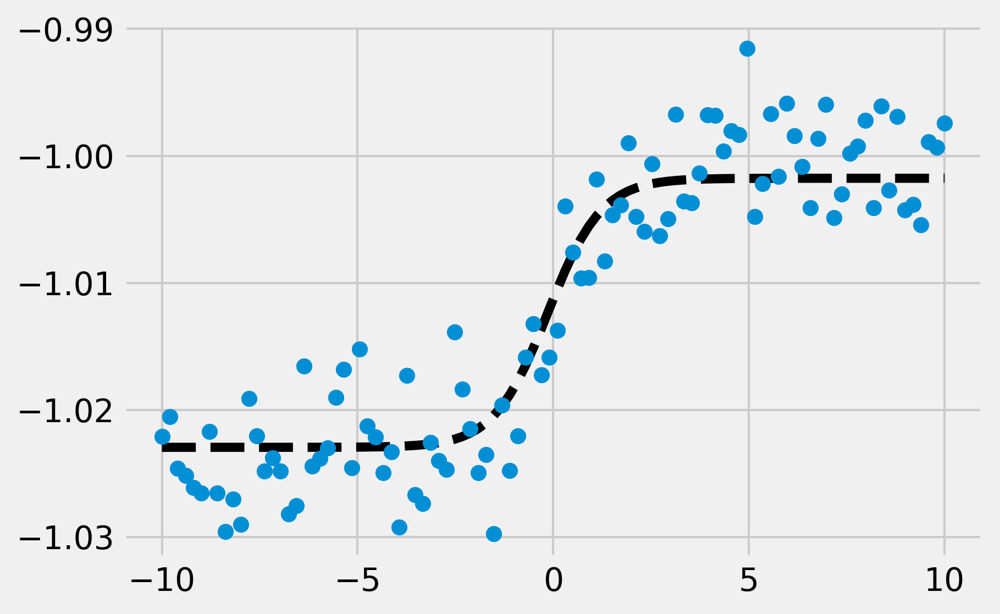
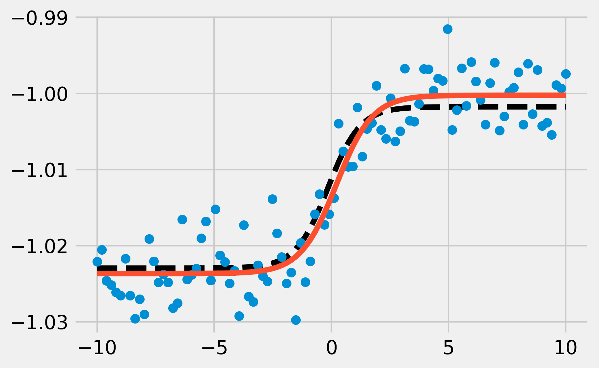

<a href="https://github.com/ipython-books/cookbook-2nd"></a> *This is one of the 100+ free recipes of the [IPython Cookbook, Second Edition](https://github.com/ipython-books/cookbook-2nd), by [Cyrille Rossant](http://cyrille.rossant.net), a guide to numerical computing and data science in the Jupyter Notebook. The ebook and printed book are available for purchase at [Packt Publishing](https://www.packtpub.com/big-data-and-business-intelligence/ipython-interactive-computing-and-visualization-cookbook-second-e).*

▶ *[Text on GitHub](https://github.com/ipython-books/cookbook-2nd) with a [CC-BY-NC-ND license](https://creativecommons.org/licenses/by-nc-nd/3.0/us/legalcode)*  
▶ *[Code on GitHub](https://github.com/ipython-books/cookbook-2nd-code) with a [MIT license](https://opensource.org/licenses/MIT)*

[*Chapter 9 : Numerical Optimization*](./)

# 9.3. Fitting a function to data with nonlinear least squares

In this recipe, we will show an application of numerical optimization to **nonlinear least squares curve fitting**. The goal is to fit a function, depending on several parameters, to data points. In contrast to the linear least squares method, this function does not have to be linear in those parameters.

We will illustrate this method on artificial data.

## How to do it...

1. Let's import the usual libraries:

```python
import numpy as np
import scipy.optimize as opt
import matplotlib.pyplot as plt
%matplotlib inline
```

2. We define a logistic function with four parameters:

$$f_{a,b,c,d}(x) = \frac{a}{1 + \exp\left(-c (x-d)\right)} + b$$

```python
def f(x, a, b, c, d):
    return a / (1. + np.exp(-c * (x - d))) + b
```

3. Let's define four random parameters:

```python
a, c = np.random.exponential(size=2)
b, d = np.random.randn(2)
```

4. Now, we generate random data points by using the sigmoid function and adding a bit of noise:

```python
n = 100
x = np.linspace(-10., 10., n)
y_model = f(x, a, b, c, d)
y = y_model + a * .2 * np.random.randn(n)
```

5. Here is a plot of the data points, with the particular sigmoid used for their generation (in dashed black):

```python
fig, ax = plt.subplots(1, 1, figsize=(6, 4))
ax.plot(x, y_model, '--k')
ax.plot(x, y, 'o')
```



6. We now assume that we only have access to the data points and not the underlying generative function. These points could have been obtained during an experiment. By looking at the data, the points appear to approximately follow a sigmoid, so we may want to try to fit such a curve to the points. That's what **curve fitting** is about. SciPy's `curve_fit()` function allows us to fit a curve defined by an arbitrary Python function to the data:

```python
(a_, b_, c_, d_), _ = opt.curve_fit(f, x, y)
```

7. Now, let's take a look at the fitted sigmoid curve:

```python
y_fit = f(x, a_, b_, c_, d_)
```

```python
fig, ax = plt.subplots(1, 1, figsize=(6, 4))
ax.plot(x, y_model, '--k')
ax.plot(x, y, 'o')
ax.plot(x, y_fit, '-')
```



The fitted sigmoid appears to be reasonably close to the original sigmoid used for data generation.

## How it works...

In SciPy, nonlinear least squares curve fitting works by minimizing the following cost function:

$$S(\beta) = \sum_{i=1}^n (y_i - f_{\beta}(x_i))^2$$

Here, $\beta$ is the vector of parameters (in our example, $\beta =(a,b,c,d)$).

Nonlinear least squares is really similar to linear least squares for linear regression. Whereas the function $f$ is *linear* in the parameters with the linear least squares method, it is *not linear* here. Therefore, the minimization of $S(\beta)$ cannot be done analytically by solving the derivative of $S$ with respect to $\beta$. SciPy implements an iterative method called the **Levenberg-Marquardt algorithm** (an extension of the Gauss-Newton algorithm).

## There's more...

Here are further references:

* Reference documentation of curvefit available at http://docs.scipy.org/doc/scipy/reference/generated/scipy.optimize.curve_fit.html
* Nonlinear least squares on Wikipedia, available at https://en.wikipedia.org/wiki/Non-linear_least_squares
* Levenberg-Marquardt algorithm on Wikipedia, available at https://en.wikipedia.org/wiki/Levenberg%E2%80%93Marquardt_algorithm

## See also

* Minimizing a mathematical function
