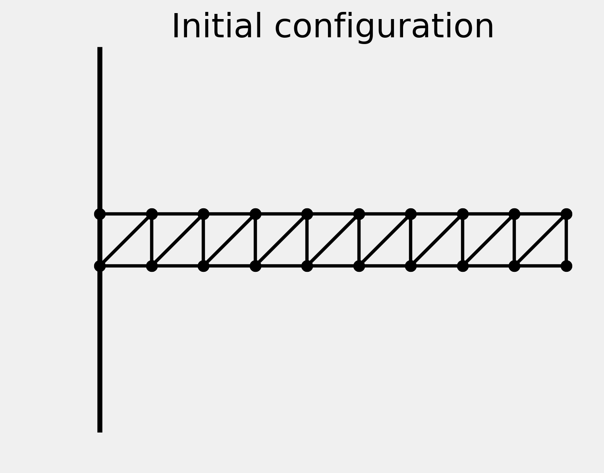
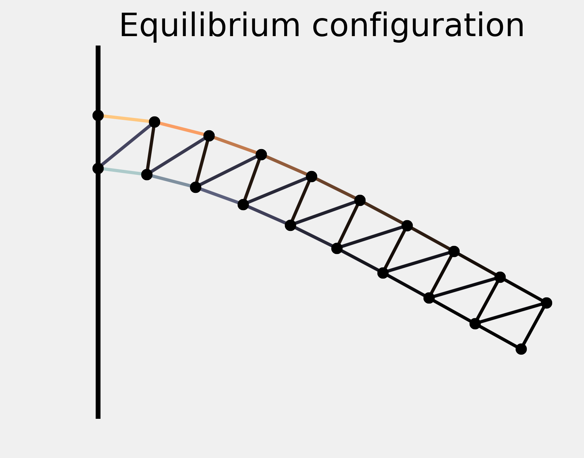

<a href="https://github.com/ipython-books/cookbook-2nd"></a> *This is one of the 100+ free recipes of the [IPython Cookbook, Second Edition](https://github.com/ipython-books/cookbook-2nd), by [Cyrille Rossant](http://cyrille.rossant.net), a guide to numerical computing and data science in the Jupyter Notebook. The ebook and printed book are available for purchase at [Packt Publishing](https://www.packtpub.com/big-data-and-business-intelligence/ipython-interactive-computing-and-visualization-cookbook-second-e).*

▶ *[Text on GitHub](https://github.com/ipython-books/cookbook-2nd) with a [CC-BY-NC-ND license](https://creativecommons.org/licenses/by-nc-nd/3.0/us/legalcode)*  
▶ *[Code on GitHub](https://github.com/ipython-books/cookbook-2nd-code) with a [MIT license](https://opensource.org/licenses/MIT)*

[*Chapter 9 : Numerical Optimization*](./)

# 9.4. Finding the equilibrium state of a physical system by minimizing its potential energy

In this recipe, we will give an application example of the function minimization algorithms described earlier. We will try to numerically find the equilibrium state of a physical system by minimizing its potential energy.

More specifically, we'll consider a structure made of masses and springs, attached to a vertical wall and subject to gravity. Starting from an initial position, we'll search for the equilibrium configuration where the gravity and elastic forces compensate.

## How to do it...

1. Let's import NumPy, SciPy, and matplotlib:

```python
import numpy as np
import scipy.optimize as opt
import matplotlib.pyplot as plt
%matplotlib inline
```

2. We define a few constants in the International System of Units:

```python
g = 9.81  # gravity of Earth
m = .1  # mass, in kg
n = 20  # number of masses
e = .1  # initial distance between the masses
l = e  # relaxed length of the springs
k = 10000  # spring stiffness
```

3. We define the initial positions of the masses. They are arranged on a two-dimensional grid with two lines and $n/2$ columns:

```python
P0 = np.zeros((n, 2))
P0[:, 0] = np.repeat(e * np.arange(n // 2), 2)
P0[:, 1] = np.tile((0, -e), n // 2)
```

4. Now, let's define the connectivity matrix between the masses. Coefficient $(i,j)$ is 1 if masses $i$ and $j$ are connected by a spring, 0 otherwise:

```python
A = np.eye(n, n, 1) + np.eye(n, n, 2)
# We display a graphic representation of
# the matrix.
f, ax = plt.subplots(1, 1)
ax.imshow(A)
ax.set_axis_off()
```


5. We also specify the spring stiffness of each spring. It is $l$, except for *diagonal* springs where it is $l \sqrt{2}$ :

```python
L = l * (np.eye(n, n, 1) + np.eye(n, n, 2))
for i in range(n // 2 - 1):
    L[2 * i + 1, 2 * i + 2] *= np.sqrt(2)
```

6. We get the indices of the spring connections:

```python
I, J = np.nonzero(A)
```

7. This `dist()` function computes the distance matrix (distance between any pair of masses):

```python
def dist(P):
    return np.sqrt((P[:,0]-P[:,0][:,np.newaxis])**2 +
                   (P[:,1]-P[:,1][:,np.newaxis])**2)
```

8. We define a function that displays the system. The springs are colored according to their tension:

```python
def show_bar(P):
    fig, ax = plt.subplots(1, 1, figsize=(5, 4))

    # Wall.
    ax.axvline(0, color='k', lw=3)

    # Distance matrix.
    D = dist(P)

    # Get normalized elongation in [-1, 1].
    elong = np.array([D[i, j] - L[i, j]
                      for i, j in zip(I, J)])
    elong_max = np.abs(elong).max()

    # The color depends on the spring tension, which
    # is proportional to the spring elongation.
    colors = np.zeros((len(elong), 4))
    colors[:, -1] = 1  # alpha channel is 1

    # Use two different sequentials colormaps for
    # positive and negative elongations, to show
    # compression and extension in different colors.
    if elong_max > 1e-10:
        # We don't use colors if all elongations are
        # zero.
        elong /= elong_max
        pos, neg = elong > 0, elong < 0
        colors[pos] = plt.cm.copper(elong[pos])
        colors[neg] = plt.cm.bone(-elong[neg])

    # We plot the springs.
    for i, j, c in zip(I, J, colors):
        ax.plot(P[[i, j], 0],
                P[[i, j], 1],
                lw=2,
                color=c,
                )

    # We plot the masses.
    ax.plot(P[[I, J], 0], P[[I, J], 1], 'ok',)

    # We configure the axes.
    ax.axis('equal')
    ax.set_xlim(P[:, 0].min() - e / 2,
                P[:, 0].max() + e / 2)
    ax.set_ylim(P[:, 1].min() - e / 2,
                P[:, 1].max() + e / 2)
    ax.set_axis_off()

    return ax
```

9. Here is the system in its initial configuration:

```python
ax = show_bar(P0)
ax.set_title("Initial configuration")
```



10. To find the equilibrium state, we need to minimize the total potential energy of the system. The following function computes the energy of the system given the positions of the masses. This function is explained in the *How it works...* section:

```python
def energy(P):
    # The argument P is a vector (flattened matrix).
    # We convert it to a matrix here.
    P = P.reshape((-1, 2))
    # We compute the distance matrix.
    D = dist(P)
    # The potential energy is the sum of the
    # gravitational and elastic potential energies.
    return (g * m * P[:, 1].sum() +
            .5 * (k * A * (D - L)**2).sum())
```

11. Let's compute the potential energy of the initial configuration:

```python
energy(P0.ravel())
```

```{output:result}
-0.981
```

12. Now, let's minimize the potential energy with a function minimization method. We need a **constrained optimization algorithm**, because we make the assumption that the first two masses are fixed to the wall. Therefore, their positions cannot change. The **L-BFGS-B algorithm**, a variant of the BFGS algorithm, accepts bound constraints. Here, we force the first two points to stay at their initial positions, whereas there are no constraints on the other points. The `minimize()` function accepts a `bounds` list containing, for each dimension, a pair of `[min, max]` values:

```python
bounds = np.c_[P0[:2, :].ravel(),
               P0[:2, :].ravel()].tolist() + \
    [[None, None]] * (2 * (n - 2))
```

```python
P1 = opt.minimize(energy, P0.ravel(),
                  method='L-BFGS-B',
                  bounds=bounds).x.reshape((-1, 2))
```

13. Let's display the stable configuration:

```python
ax = show_bar(P1)
ax.set_title("Equilibrium configuration")
```



The springs near the wall are maximally extended (top) or compressed (bottom).

## How it works...

This example is conceptually simple. The state of the system is only described by the positions of the masses. If we can write a Python function that returns the total energy of the system, finding the equilibrium is just a matter of minimizing this function. This is the **principle of minimum total potential energy**, due to the second law of thermodynamics.

Here, we give an expression of the total energy of the system. Since we are only interested in the *equilibrium*, we omit any kinetic aspect and we only consider potential energy due to gravity (**gravitational force**) and spring forces (**elastic potential energy**).

Letting $U$ be the total potential energy of the system, $U$ can be expressed as the sum of the gravitational potential energies of the masses and the elastic potential energies of the springs. Therefore:

$$U = \sum_{i=1}^n mgy_i + \frac{1}{2} \sum_{i,j=1}^n k a_{ij} \left( ||\mathbf{p}_i - \mathbf{p}_j|| - l_{ij} \right)^2$$

Here:

* $m$ is the mass
* $g$ is the gravity of Earth
* $k$ is the stiffness of the springs
* $p_i = (x_i, y_i)$ is the position of mass $i$,
* $a_{ij}$ is 1 if masses $i$ and $j$ are attached by a spring, $0$ otherwise,
* $l_{ij}$ is the relaxed length of spring $(i,j)$, or $0$ if masses $i$ and $j$ are not attached.

The `energy()` function implements this formula using vectorized computations on NumPy arrays.

## There's more...

The following references contain details about the physics behind this formula:

* Potential energy on Wikipedia, available at https://en.wikipedia.org/wiki/Potential_energy
* Elastic potential energy on Wikipedia, available at https://en.wikipedia.org/wiki/Elastic_potential_energy
* Hooke's law, which is the linear approximation of the springs' response, described at https://en.wikipedia.org/wiki/Hooke%27s_law
* Principle of minimum energy on Wikipedia, available at https://en.wikipedia.org/wiki/Minimum_total_potential_energy_principle

Here is a reference about the optimization algorithm:

* L-BFGS-B algorithm on Wikipedia, available at https://en.wikipedia.org/wiki/Limited-memory_BFGS#L-BFGS-B

## See also

* Minimizing a mathematical function
