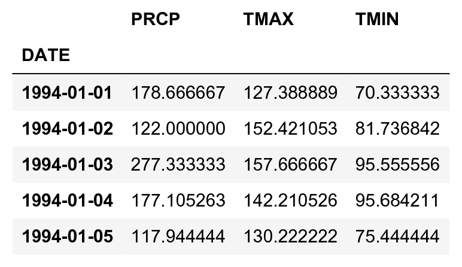
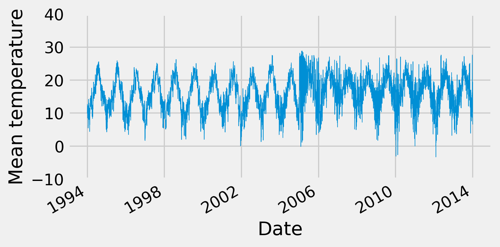
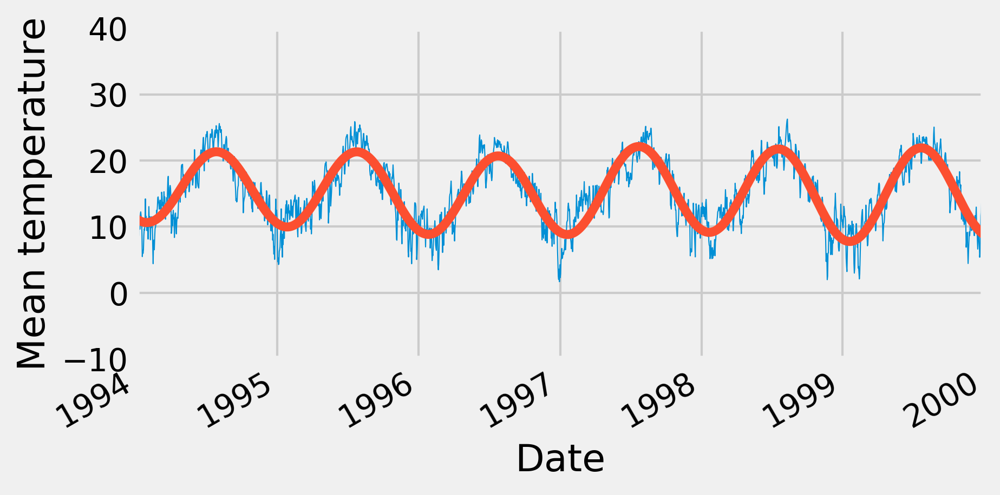
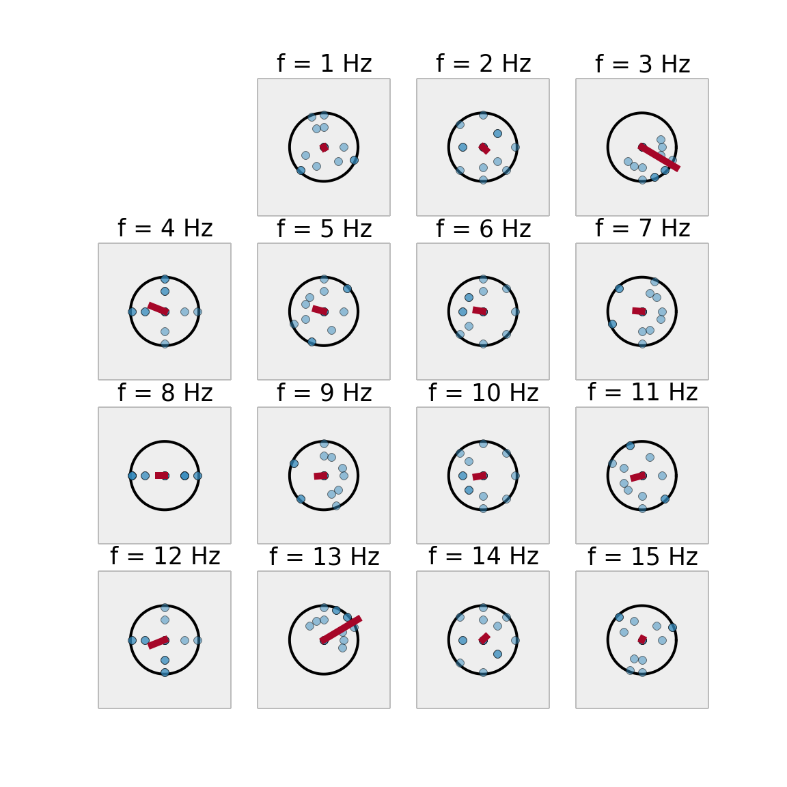
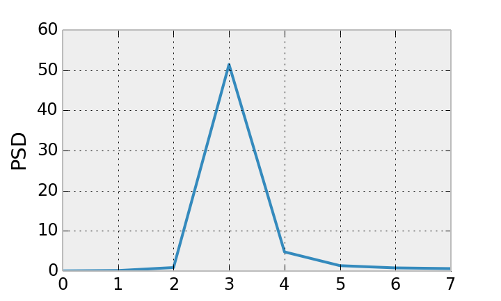

<a href="https://github.com/ipython-books/cookbook-2nd"></a> *This is one of the 100+ free recipes of the [IPython Cookbook, Second Edition](https://github.com/ipython-books/cookbook-2nd), by [Cyrille Rossant](http://cyrille.rossant.net), a guide to numerical computing and data science in the Jupyter Notebook. The ebook and printed book are available for purchase at [Packt Publishing](https://www.packtpub.com/big-data-and-business-intelligence/ipython-interactive-computing-and-visualization-cookbook-second-e).*

▶ *[Text on GitHub](https://github.com/ipython-books/cookbook-2nd) with a [CC-BY-NC-ND license](https://creativecommons.org/licenses/by-nc-nd/3.0/us/legalcode)*  
▶ *[Code on GitHub](https://github.com/ipython-books/cookbook-2nd-code) with a [MIT license](https://opensource.org/licenses/MIT)*

[*Chapter 10 : Signal Processing*](./)

# 10.1. Analyzing the frequency components of a signal with a Fast Fourier Transform

In this recipe, we will show how to use a **Fast Fourier Transform (FFT)** to compute the spectral density of a signal. The spectrum represents the energy associated to frequencies (encoding periodic fluctuations in a signal). It is obtained with a Fourier transform, which is a frequency representation of a time-dependent signal. A signal can be transformed back and forth from one representation to the other with no information loss.

In this recipe, we will illustrate several aspects of the Fourier Transform. We will apply this tool to weather data spanning 20 years in France obtained from the US National Climatic Data Center.

## How to do it...

1. Let's import the packages, including `scipy.fftpack`, which includes many FFT- related routines:

```python
import datetime
import numpy as np
import scipy as sp
import scipy.fftpack
import pandas as pd
import matplotlib.pyplot as plt
%matplotlib inline
```

2. We import the data from the CSV file (it has been obtained at http://www.ncdc.noaa.gov/cdo-web/datasets#GHCND). The number -9999 is used for N/A values. pandas can easily handle this. In addition, we tell pandas to parse dates contained in the `DATE` column:

```python
df0 = pd.read_csv('https://github.com/ipython-books/'
                  'cookbook-2nd-data/blob/master/'
                  'weather.csv?raw=true',
                  na_values=(-9999),
                  parse_dates=['DATE'])
```

```python
df = df0[df0['DATE'] >= '19940101']
```

```python
df.head()
```


3. Each row contains the precipitation and extreme temperatures recorded each day by one weather station in France. For every date in the calendar, we want to get a single average temperature for the whole country. The `groupby()` method provided by pandas lets us do this easily. We also remove any N/A value with `dropna()`:

```python
df_avg = df.dropna().groupby('DATE').mean()
```

```python
df_avg.head()
```



4. Now, we get the list of dates and the list of corresponding temperatures. The unit is in tenths of a degree, and we get the average value between the minimal and maximal temperature, which explains why we divide by 20.

```python
date = df_avg.index.to_datetime()
temp = (df_avg['TMAX'] + df_avg['TMIN']) / 20.
N = len(temp)
```

5. Let's take a look at the evolution of the temperature:

```python
fig, ax = plt.subplots(1, 1, figsize=(6, 3))
temp.plot(ax=ax, lw=.5)
ax.set_ylim(-10, 40)
ax.set_xlabel('Date')
ax.set_ylabel('Mean temperature')
```



6. We now compute the Fourier transform and the spectral density of the signal. The first step is to compute the FFT of the signal using the `fft()` function:

```python
temp_fft = sp.fftpack.fft(temp)
```

7. Once the FFT has been obtained, we need to take the square of its absolute value in order to get the **power spectral density (PSD)**:

```python
temp_psd = np.abs(temp_fft) ** 2
```

8. The next step is to get the frequencies corresponding to the values of the PSD. The `fftfreq()` utility function does just that. It takes the length of the PSD vector as input as well as the frequency unit. Here, we choose an annual unit: a frequency of 1 corresponds to 1 year (365 days). We provide `1/365` because the original unit is in days:

```python
fftfreq = sp.fftpack.fftfreq(len(temp_psd), 1. / 365)
```

9. The `fftfreq()` function returns positive and negative frequencies. We are only interested in positive frequencies here, as we have a real signal:

```python
i = fftfreq > 0
```

10. We now plot the power spectral density of our signal, as a function of the frequency (in unit of `1/year`). We choose a logarithmic scale for the y axis (**decibels**):

```python
fig, ax = plt.subplots(1, 1, figsize=(8, 4))
ax.plot(fftfreq[i], 10 * np.log10(temp_psd[i]))
ax.set_xlim(0, 5)
ax.set_xlabel('Frequency (1/year)')
ax.set_ylabel('PSD (dB)')
```


Because the fundamental frequency of the signal is the yearly variation of the temperature, we observe a peak for `f=1`.

11. Now, we cut out frequencies higher than the fundamental frequency:

```python
temp_fft_bis = temp_fft.copy()
temp_fft_bis[np.abs(fftfreq) > 1.1] = 0
```

12. Next, we perform an **inverse FFT** to convert the modified Fourier transform back to the temporal domain. This way, we recover a signal that mainly contains the fundamental frequency, as shown in the following figure:

```python
temp_slow = np.real(sp.fftpack.ifft(temp_fft_bis))
```

```python
fig, ax = plt.subplots(1, 1, figsize=(6, 3))
temp.plot(ax=ax, lw=.5)
ax.plot_date(date, temp_slow, '-')
ax.set_xlim(datetime.date(1994, 1, 1),
            datetime.date(2000, 1, 1))
ax.set_ylim(-10, 40)
ax.set_xlabel('Date')
ax.set_ylabel('Mean temperature')
```



We get a smoothed version of the signal, because the fast variations have been lost when we have removed the high frequencies in the Fourier transform.

## How it works...

Broadly speaking, the Fourier transform is an alternative representation of a signal as a superposition of periodic components. It is an important mathematical result that any well-behaved function can be represented under this form. Whereas a time-varying signal is most naturally considered as a function of time, the Fourier transform represents it as a function of the frequency. A magnitude and a phase, which are both encoded in a single complex number, are associated to each frequency.

### The Discrete Fourier Transform

Let's consider a digital signal $x$ represented by a vector $(x_0, ..., x_{N-1})$. We assume that this signal is regularly sampled. The **Discrete Fourier Transform (DFT)** of $x$ is $X = (X_0, ..., X_{N-1})$ defined as:

$$\forall k \in \{0, \ldots, N-1\}, \quad X_k = \sum_{n=0}^{N-1} x_n e^{-2i\pi kn/N}.$$

The DFT can be computed efficiently with the Fast Fourier Transform (FFT), an algorithm that exploits symmetries and redundancies in this definition to considerably speed up the computation. The complexity of the FFT is $O(N \log N)$ instead of $O(N^2)$ for the naive DFT. The FFT is one of the most important algorithms of the digital universe.

Here is an intuitive explanation of what the DFT describes. Instead of representing our signal on a real line, let's represent it on a circle. We can play the whole signal by making 1, 2, or any number $k$ of laps on the circle. Therefore, when $k$ is fixed, we represent each value $x_n$ of the signal with an angle $2\pi kn / N$ and a distance from the original equal to $x_n$.

In the following figure, the signal is a sine wave at the frequency $f=3 Hz$. The points of this signal are in blue, positioned at an angle $2\pi kn / N$. Their algebraic sum in the complex plane is in red. These vectors represent the different coefficients of the signal's DFT.



The next figure represents the previous signal's power spectral density (PSD):



### Inverse Fourier Transform

By considering all possible frequencies, we have an exact representation of our digital signal in the frequency domain. We can recover the initial signal with an **Inverse Fast Fourier Transform** that computes an **Inverse Discrete Fourier Transform**. The formula is very similar to the DFT:

$$\forall k \in \{0, \ldots, N-1\}, \quad x_k = \frac{1}{N} \sum_{n=0}^{N-1} X_n e^{2i\pi kn/N}.$$

The DFT is useful when periodic patterns are to be found. However, generally speaking, the Fourier transform cannot detect *transient* changes at specific frequencies. Local spectral methods are required, such as the **wavelet transform**.

## There's more...

The following links contain more details about Fourier transforms:

* Introduction to the FFT with SciPy, available at http://scipy-lectures.github.io/intro/scipy.html#fast-fourier-transforms-scipy-fftpack
* Reference documentation for the fftpack in SciPy, available at http://docs.scipy.org/doc/scipy/reference/fftpack.html
* Fourier Transform on Wikipedia, available at https://en.wikipedia.org/wiki/Fourier_transform
* Discrete Fourier Transform on Wikipedia, available at https://en.wikipedia.org/wiki/Discrete_Fourier_transform
* Fast Fourier Transform on Wikipedia, available at https://en.wikipedia.org/wiki/Fast_Fourier_transform
* Decibel on Wikipedia, available at https://en.wikipedia.org/wiki/Decibel

## See also

* Applying a linear filter to a digital signal
* Computing the autocorrelation of a time series
